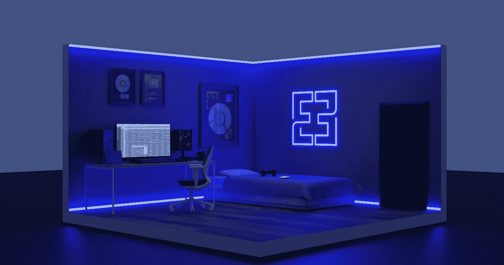
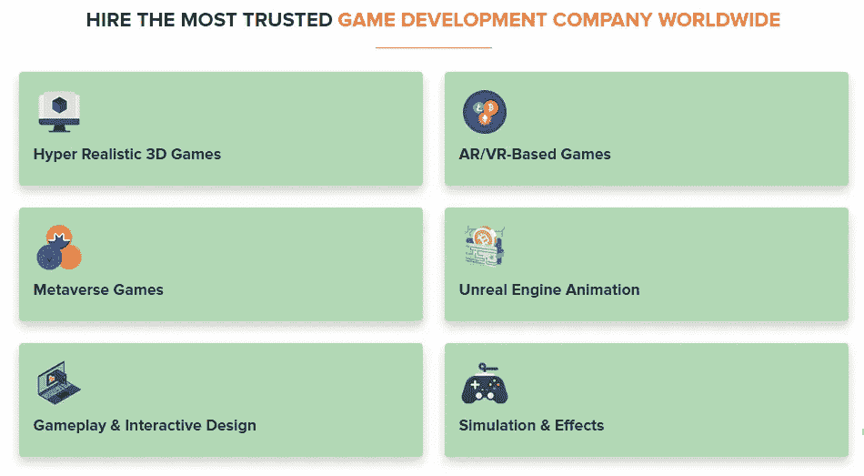
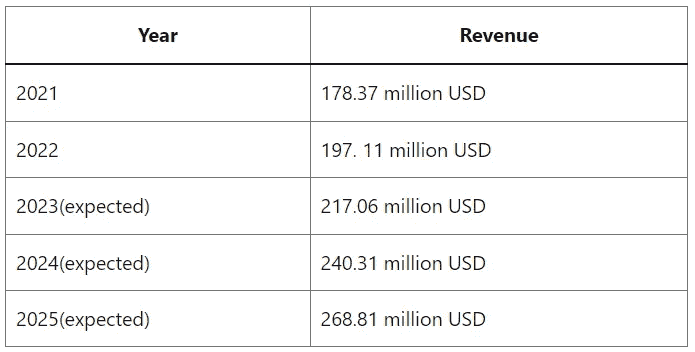

# Unity VS .虚幻游戏引擎

> 原文：<https://medium.com/codex/unity-vs-unreal-game-engine-b5b00a6a1aab?source=collection_archive---------6----------------------->

## 选择游戏开发的完美引擎

在 [Unsplash](https://unsplash.com?utm_source=medium&utm_medium=referral) 上由 [Siednji Leon](https://unsplash.com/@siednji?utm_source=medium&utm_medium=referral) 拍摄的照片

电子游戏是那些不断刺激人们的事物之一，不管他们的年龄有多大；因此，创办一家游戏公司总是明智之举。要创建游戏应用程序，您必须在游戏搜索引擎上开发应用程序。

虚幻游戏引擎是最受欢迎和要求最高的搜索引擎。虚幻游戏引擎的开发成本明显低于其他任何游戏引擎。

[聘请全球最值得信赖的游戏开发公司](https://risingmax.com/unreal-engine-game-development)

# 让我们开始:

游戏开发者使用游戏引擎为控制台、PC 和移动设备创建游戏，因为这些可重用的组件构成了游戏的结构。

程序员可以使用任何正常的游戏引擎添加标准功能，如碰撞检测人工智能、物理、输入、图形、脚本等，而不必编写任何代码。

虽然有很多不同的游戏引擎可供选择，但我们将对 Unity 和[虚幻引擎](https://en.wikipedia.org/wiki/Unreal_Engine)这两个行业巨头进行分析比较。

# **2020-2025 年全球游戏市值**

# Unity 引擎背景

Unity 由 Unity Technologies 开发，是一款跨平台游戏引擎，于 2005 年在苹果公司的 WDC 上推出并公开。游戏引擎支持超过 25 个平台，包括 Windows、macOS、游戏控制台和虚拟现实系统，如 PlayStation VR、Xbox One、Oculus Rift、Daydream 等。

许多用户已经接受了 Unity 游戏引擎，因为它使他们能够制作游戏，并在 2D，3D 和虚拟现实中玩游戏。除了游戏业务之外，它还被电影、汽车、建筑、工程和建筑行业所利用。

# 虚幻游戏引擎背景

最初的虚幻引擎是由 Epic Games 的创作者蒂姆·塞弗尼(Tim Seveeny)创建的，并在 1998 年的第一人称射击游戏《虚幻》中首次亮相。虚幻游戏引擎支持多种平台，具有高度的移动性。游戏引擎已经成为行业标准，赢得了主要游戏出版物的多项赞誉。它为开发下一代物理和视觉效果提供了一个极好的基础。

# 虚幻&统一编程语言

## Unity 编程语言

最平易近人的游戏开发平台是 Unity 3，它采用了 [C#编程语言](https://www.w3schools.com/cs/index.php)。

因为它更容易学习和使用，Unity 经常是游戏创作者在职业生涯早期的首选工具。

此外，架构简单，界面高度用户友好。Unity 在每个版本中都变得更容易使用。例如，截至 2020 年 7 月，Unity 已经使用 Bolt 可视化脚本工具实现了所有计划的可访问性，使用户能够尽可能避免编码。

## 虚幻游戏引擎语言

由于 C++是新手比较难学的语言，所以虚幻引擎就是在它上面开发的。然而，Unreal 包括一个名为 Blueprints 的可视化编程系统，它不需要游戏创作者是编码专家，这是它的一个关键优势。

驱动引擎的蓝图可视化编程框架使它成为一个用于创建和迭代的奇妙工具。在 Blueprint 中，节点在被连线和添加逻辑之前被拖放。有了这个基于节点的界面，具有最少编程背景的设计师可以探索他们的想法。

# 游戏开发选择虚幻游戏引擎的理由

## 高效开发选项

我们才华横溢的开发人员擅长使用虚幻引擎的强大功能集和 C++编程语言来创建漂亮的游戏。我们也知道如何在必要时改变引擎的源代码，以满足开发虚幻引擎 5 游戏的特定要求。

## 优质资产

高细节层次和多边形数量的资产，包括角色和物体，都是由我们的团队制作的。RisingMax 的开发人员使用[虚幻引擎 5](https://risingmax.com/blog/unreal-engine-5-game-development-company/) 的 Nanite 功能来轻松集成这些电影质量的资产，并配置它们进行实时渲染，而不会遇到性能断断续续的情况。

## 翻译

**瑞星麦克斯公司**的开发团队。与灯光和渲染专家密切合作，提供各种比例的游戏场景，光线充足，细节生动。我们使用虚幻引擎 5 的系统为游戏场景提供动态照明，以提高视觉真实性。

# 选择 Unity 游戏引擎进行游戏开发的原因

## 开源平台

即使游戏制作的预算很大，你仍然可以有效地处理事情。

其中一个可能是选择游戏引擎。免费的 Unity 游戏引擎产生出色的结果。正因为如此，Unity 游戏创作变得相当知名。

Unity 是一个免费的开源游戏引擎。不过，你也可以在免费版和高级版之间进行选择。

这款游戏引擎最令人印象深刻的一点是，它的开源、免费在线形式非常强大和出色。无论是经验丰富的游戏开发人员还是相对新手，使用 Unity 游戏引擎的免费版本仍然可以获得出色的效果。

## 支持跨平台游戏

游戏被开发成可以在各种平台上玩，包括 iOS、PC 和 Android。因此，游戏开发企业必须提供各种版本，以便玩家可以在任何设备上享受这些版本，而不会出现任何错误。Unity 3D 游戏引擎有助于快速推广游戏，并使游戏开发者能够为不同平台制作许多版本。

凭借跨平台能力，Unity 可以减少游戏开发人员创建可以同时针对 iOS 和 Android 平台的移动游戏应用程序所需的工作。

## 伟大的社区参与

任何应用程序开发人员或游戏开发人员经常会陷入某些困境，需要更有经验的开发人员的帮助来克服这种情况。在这里，选择 Unity 游戏引擎可能会创造奇迹。

Unity 游戏引擎是最大的开发者社区之一，它可以为你的游戏开发项目提供无穷无尽的知识来源。游戏开发者社区可以在任何领域为您提供帮助，从调试游戏测试功能到提供可能改善游戏体验的建议。

# 具有游戏开发的巨大潜力

当谈到利用增强现实和虚拟现实时，毫无疑问，可以期待显著的成果。应用这项尖端技术可以为游戏玩家提供身临其境的游戏体验。

这些技术也逐渐发展成为虚拟 3D 游戏的基础。幸运的是，像 2D 这样的大型游戏项目——3D 游戏、元宇宙游戏和其他游戏可能会使用 Unity3D 游戏开发来采用这些尖端技术。最真实最全面的视觉游戏体验，还是 Unity VR 或者 AR 游戏提供的。

# 游戏开发的范围

据专家称，全球视频游戏市场的价值为 1060.1 亿美元。

2019 年记录了该金额。因此，现在它肯定涨得更多了。

此外，预计市场将在 2020 年至 2027 年间以 12.9%的惊人速度增长。由于新冠肺炎疫情，许多行业今年不得不停止运营。尽管如此，视频游戏行业继续创新，并为智能手机和其他平台发布视频游戏。

最受欢迎的娱乐方式之一，或者说打发时间的方式，被认为是玩电子游戏。

它不仅受到孩子们的喜爱，也受到老年人的喜爱。除了经典的赛车和动作游戏类型之外，这也为广泛的其他游戏类型的流行打开了大门。

# 程序

一家虚拟游戏开发公司使用的整个工作流程对他们制作的内容质量有着重大影响。领先的企业和游戏开发团队使用标准化的程序来维护开发团队和客户的无缝生产流程。

# 投资组合

我们公司的投资组合是其专业知识的证明。要更多地了解该公司的人才和它在过去产生的梦幻般的项目，看看我们的投资组合。专家团队一直致力于按时、零误差地交付项目。

## 团队力量

大型游戏开发团队通常比小型团队表现更好。游戏开发的[unity 3D vs . unreal](https://risingmax.com/blog/unity-3d-vs-unreal/)流程整合了许多不同部门的技能，包括编程、美术、测试、动画等。团队生产虚幻引擎游戏的能力随着团队规模的增加而增加。

## 客户

专门创作虚幻游戏并拥有与知名客户合作经验的公司通常值得信赖，能够完成最具挑战性的任务。

在阅读了将两个平台区分开来的所有要素之后，你现在一定有兴趣看看这两个平台中哪一个是创建高质量视频游戏的“最佳”平台。

让我们进入正题:如果我们选择其中一个作为最伟大的，我们将对市场上的其他游戏引擎造成伤害。在为你的项目选择最好的游戏引擎之前，一个经验丰富的游戏制作公司会考虑几个变量。

游戏概念、目标平台、时间表、团队规模和预算将影响哪个游戏引擎适合您的需求。

这些游戏引擎的开发者也在努力修复每个缺陷。

假设你仍然不知道使用哪个游戏引擎。在这种情况下，我们建议您雇用 unity 游戏开发人员，他们在游戏开发过程中表现出色，并且具有为各种平台开发高端视频游戏的长期历史。

虚幻和统一游戏开发公司的经验在确定适合你的项目开发的游戏引擎方面也起着至关重要的作用。如果你雇佣缺乏经验的游戏开发者，你的选择会很有限，开发者很可能会选择 Unity 5。

# 最后的想法

对游戏引擎知之甚少甚至没有技术知识的人可以理解的每一个方面都包含在这一页中。虽然市面上也有其他游戏引擎，但大部分游戏制作商家更青睐虚幻引擎和 Unity 引擎。

假设你想实现为手机、桌面或游戏机发布优质游戏的雄心。在这种情况下，我们建议雇佣像 RisingMax Inc .这样的游戏开发者，他们是使用尖端游戏制作技术的专家。