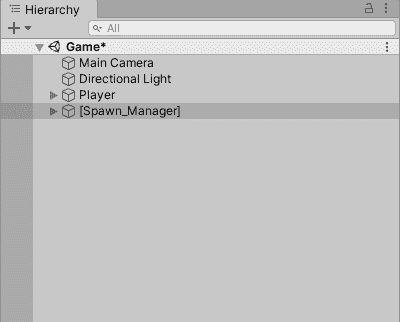
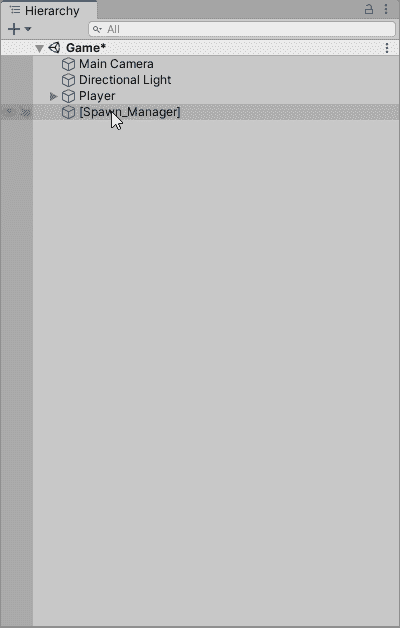
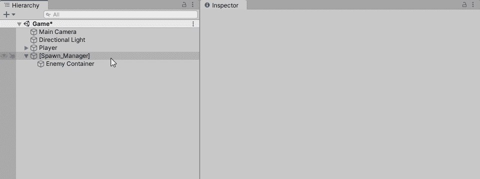
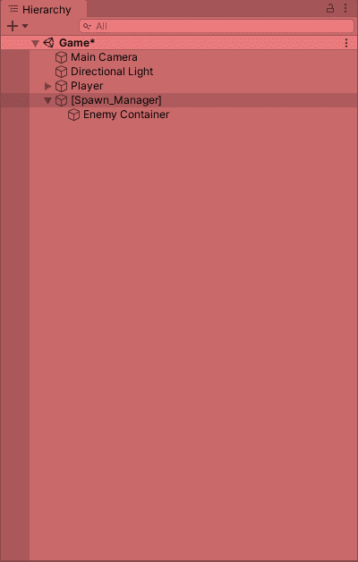

# Unity3D:在实例化许多对象时消除混乱

> 原文：<https://medium.com/codex/unity3d-eliminating-clutter-when-instantiating-many-objects-db79c31a0305?source=collection_archive---------14----------------------->

有时我们需要在查看层次面板时消除混乱并保持简单。这样，我们可以在游戏模式下保持环境整洁。



让敌人在未被消灭时繁殖和回收会造成混乱。

目标是在容器中繁殖敌人，并作为父对象的子对象。

让我们在 Spawn Manager 游戏对象下创建一个新的子对象。



在 Spawn Manager 中创建一个子对象，其中已定义对象的所有实例都将实例化为。

Spawn Manager 附带了一个脚本，该脚本具有实例化敌人的逻辑。

我们需要存储这个子游戏对象(敌人容器)所在位置的引用。所以我们必须初始化并声明一个类型为`GameObject`的对象。

`private GameObject _enemyContainer = null;`

让我们添加一个[SerializeField]属性，以便我们可以在检查器面板中看到它。

`[SerializeField] private GameObject _enemyContainer = null;`

让我们将敌人容器对象拖放到检查器中的敌人容器字段中，当选择 Spawn Manager 游戏对象时可以看到该字段。



然后，我们需要缓存实例化敌人对象的位置。所谓缓存，我的意思是将它存储到一个变量中，以便我们可以在其他地方使用它。在我的例子中，我的实例化逻辑在一个名为“SpawnRoutine”的协程中

```
 private IEnumerator SpawnRoutine()
 {
   while (!_stopSpawning)
   {
     float randomX = Random.Range(-11, 11);
     Vector3 randomXposition = new Vector3(randomX, 8, 0); **Instantiate(_enemyPrefab, randomXposition,Quaternion.identity);** yield return new WaitForSeconds(_waitTime);
   }
 }
```

为了缓存正在被实例化的敌人的实例，我们需要分配一个名为`enemyInstance`的`GameObject`数据类型。

```
GameObject enemyInstance = Instantiate(_enemyPrefab, randomXposition, Quaternion.identity);
```

现在我们已经将实例化的敌人存储在了`enemyInstance`变量中。我们将在下一行代码中使用它。

我们希望将我们的敌人实例实例化为敌人容器游戏对象的子对象。我们有一个名为 _enemyContainer 的敌方容器的引用，我们在前面将游戏对象附加到了检查器中的字段。

因此，我们需要获取`enemyInstance` 及其转换父对象，并将其分配给`_enemyContainer`的转换。

`enemyInstance.transform.parent = _enemyContainer.transform;`

我们在这行代码中所说的是:

> 嘿，`enemyInstance`，我要你移动到`_enemyContainer`的变形位置。

**记住，每个游戏对象都有一个变换组件，每个变换组件都是一个游戏对象。**通过抓取`_enemyContainer`的变形，我们暗示我们希望`enemyInstance`重新定位到`_enemyContainer`游戏对象中。

当我们在游戏模式下，我们现在可以看到我们的层次窗口整洁干净！



整洁干净。层级更快乐，作为程序员的你也更快乐！

今天到此为止！谢谢你的时间。:)