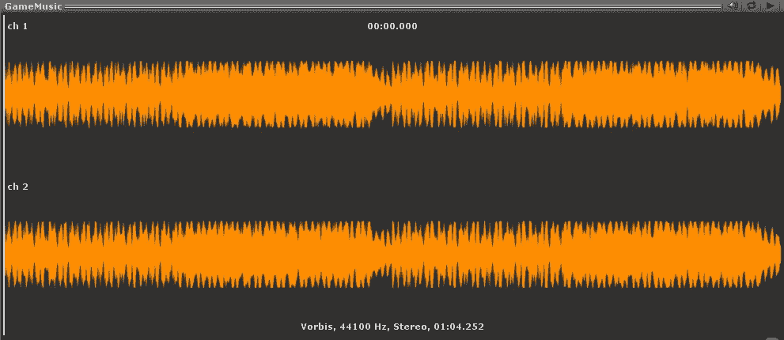
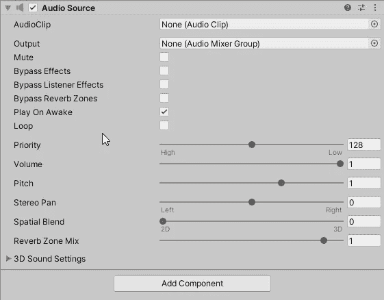

# Unity3D:声音 FX 怎么玩！

> 原文：<https://medium.com/codex/unity3d-how-to-play-sound-fx-54e840e385e9?source=collection_archive---------9----------------------->

## 你想知道如何在 Unity 中为你的游戏播放音效吗？你来对地方了！



目标是创建一个模块化的声音系统来调用特定的声音片段到它们在代码中各自的位置。如果你了解软件工程的基本原理，那么你应该记住 SOLID 中的 S。

> **单一责任原则。**

我们想创建一个负责游戏音频的对象。然后我们可以用它作为其他脚本交流的参考。

# 创建游戏对象

首先，让我们创建一个空的游戏对象，并将其命名为“Audio_Manager”

这将保存我们所有声音剪辑的数据。

我们还想附加“音频源”组件。我们稍后将引用它来播放任何被调用的声音。



# 创建脚本

我们需要创建一个脚本，并将其命名为“ **AudioManager** ”将其附加到“**Audio _ Manager**”*游戏对象*。

打开脚本，这样我们就可以开始编程了。

# 添加代码

去掉启动和更新功能。我们不会使用它们。你现在应该有一个漂亮干净的界面(类布局)。

```
using UnityEngine;public class AudioManager : MonoBehaviour
{

}
```

我们需要一个连接到“Audio_Manager”游戏对象的音频源的引用。

`[SerializeField] private AudioSource _audioSource = null;`

保存脚本，返回 Unity，并将音频源组件附加到检查器中的新栏。

我们还想创建“AudioClip”类型的变量来存储我们的声音剪辑。

```
[SerializeField] private AudioClip _laser = null;
[SerializeField] private AudioClip _explosion = null;
[SerializeField] private AudioClip _powerup = null;
```

现在我们有了音频源和音频剪辑，我们可以为每个声音剪辑创建特定的公共方法。它将允许其他脚本调用它们，这就是我们想要做的。

```
public void PlayExplosionSound()
{
   _audioSource.PlayOneShot(_explosion);
}public void PlayLaserSound()
{
   _audioSource.PlayOneShot(_laser);
}public void PlayPowerupSound()
{
   _audioSource.clip = _powerup;
   _audioSource.Play();
}
```

我们需要获取我们的`_audioSource`组件来访问`PlayOneShot(audio clip here)`函数。然后，我们需要将特定的音频片段传入函数的参数中。

什么是`PlayOneShot()`？它不会取消正在播放的剪辑。因此，如果我们同时有多个爆炸，前面的声音剪辑不会被切断。它会阻止它。

这部分做完了！我只调用了三个方法，它们引用了播放各自的音频剪辑。背景音乐将拥有自己的游戏对象，作为“音频管理器”的子对象一会儿告诉你为什么！

# 调用方法

然后，我们需要将函数调用到它们在代码中的正确位置。我举个例子。

我有一个开机脚本。它会检查玩家是否与它发生碰撞，激活该类型的能力，然后破坏加电游戏对象。

我们想在声音被破坏之前播放它。

首先，让我们参考一下我们的 AudioManager 脚本:

`private AudioManager _audioManager = null;`

我们希望 PowerUp 脚本查找“Audio_Manager”游戏对象，并获取附加的“AudioManager”脚本。所以让我们找到它:

```
private void Awake()
{
   _audioManager =  GameObject.Find(“Audio_Manager”).GetComponent<AudioManager>();
}
```

现在我们已经在`_audioManager`中缓存了“AudioManager ”,我们可以调用该函数来播放加电声音剪辑。我们将在逻辑所在的 OnTriggerEnter2D()中调用它。

```
private void OnTriggerEnter2D(Collider2D other)
{
   if (other.CompareTag(“Player”))
   {
      var player = other.transform.GetComponent<Player>(); if(player != null)
      {
         switch (_powerupType)
         {
            case PowerupType.TripleShot:
               player.TripleShotActive();
               break;
            case PowerupType.Speed:
               player.SpeedBoostActive();
               break;
            case PowerupType.Shield:
               player.ShieldActive();
               break;
            default:
               _powerupType = PowerupType.None;
               break;
          }
      } **_audioManager.PlayPowerupSound();** Destroy(gameObject);
   }
}
```

用粗体表示，我们调用位于 AudioManager 脚本中的函数，在开机声音被破坏之前播放它。有道理。我们不想在游戏对象被破坏后调用它。不会叫的。

这是在游戏中使用音效的一种方式。有许多方法可以解决这个问题。没有错误的做事方式。关键在于哪种方式更优？

# 背景音乐


由[萨奥·图萨尔](https://unsplash.com/@sasotusar?utm_source=medium&utm_medium=referral)在 [Unsplash](https://unsplash.com?utm_source=medium&utm_medium=referral) 上拍摄的照片

对于背景音乐，我们希望它不间断地播放。因此，我们需要将音频源与 AudioManager 引用的音频源分开，并为背景音乐创建一个新的音频源。

在“Audio_Manager”游戏对象中创建新的空游戏对象。我们希望它是一个子对象。命名为“BG_Music。”附加一个“音频源”组件。将背景音乐音频剪辑拖到“音频剪辑”栏中，确保选中“循环”和“唤醒时播放”。你完了！

我们现在有了一个简单的模块化音效系统。恭喜你。今天到此为止！感谢您的阅读。