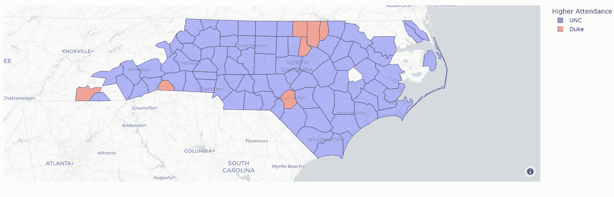

# 北卡罗来纳大学主场迎战杜克足球队

> 原文：<https://medium.com/codex/university-of-north-carolina-vs-duke-football-attendance-3f6d8ae0823f?source=collection_archive---------9----------------------->

## 对大学体育运动中最大竞争之一的分析

照片由[德鲁·佩拉斯](https://unsplash.com/@drewpera?utm_source=medium&utm_medium=referral)在 [Unsplash](https://unsplash.com?utm_source=medium&utm_medium=referral)

足球(也就是美式足球)是美国南部的一个巨大现象，尤其是在大学球队中。北卡罗莱纳州有许多大学队，但最著名的两个队是北卡罗莱纳大学焦油脚跟队和杜克大学蓝魔队。

在我们的分析中，我们将使用 [Safegraph](http://safegraph.com/) 混合 POI 模式数据以及北卡罗莱纳州的数据。SafeGraph 是一家数据提供商，为数千家企业和类别提供兴趣点和客流量数据。它免费提供数据，只要你注册成为[学术](https://www.safegraph.com/academics)。模式数据的模式可以在[这里](https://docs.safegraph.com/docs/monthly-patterns)找到。

我们关注北卡罗来纳州的一个重要原因是:

*   它是美国人口高度密集的城市州。
*   作为南部的一个州，有大量与大学足球上座率相关的数据。

有关 Colab 笔记本的链接，请点击这里，然后转到北卡罗来纳部分:[链接](https://colab.research.google.com/drive/18QiJ5Wqb9Wex5G48jkM0bhDkLpke6mjc?authuser=1#scrollTo=Q9hHsAjW62N9)

# 设置

导入包和读取数据的过程都在上面。有关该主题的信息，请参考那里的注释和描述。

以下是 Safegraph 使用的 UNC 出勤数据的数据示例:

和杜克的出勤数据差不多。

列描述:

*   placekey:唯一的 Safegraph Placekey，表示体育场所在的特定位置……每行代表一个月。
*   safe graph _ place _ id:place key 中位置的唯一键。
*   location_name:位置的名称。
*   按小时计算的受欢迎程度:该地点在一个月内每小时的平均出席率。
*   poi_cbg:地点的人口普查区块组。
*   visitor_home_cbgs:体育场的参观者来自的人口普查区块组的字典。

# 分析

模式数据有移除列，所有与凯南(北卡大学的球场)和华莱士·韦德(杜克的球场)无关的数据都被过滤掉。

然后提取 FIPS 国家代码，然后使用该列与所有县代码的列表合并，以创建游戏参与者可以称自己为家的所有县的列表，至少根据 Safegraph 的定义是这样的。

在那里，我们按县比较两个出席人数，并显示哪些县出席人数更多。这将显示哪些县有更多的参与者，而不是比较两张地图的颜色。

在全州范围内，北卡罗来纳大学绝对领先于杜克大学。

你不会想到地区模式会如此不同，因为这两所大学在同一个县，至少部分在同一个县:教堂山，北卡罗来纳大学的所在地，横跨奥兰治和达勒姆，杜克大学只在达勒姆。

杜克大学有出席优势的唯一县是达勒姆县(其家乡县)，它的邻居 Person，Granville 和 Vance 县(但不是 Orange 或 Wake 县，北卡罗来纳大学占主导地位)，以及 Hoke，Polk 和 Cherokee 县的偏远小县。

就数据集内全州的绝对上座率而言，北卡罗来纳大学遥遥领先:北卡罗来纳大学一年内有 12262 名游客，而杜克大学只有 3147 名。

这种普遍趋势可能与教育和经济分裂有关，因为北卡罗来纳大学是整个州的公立大学，而杜克大学是一所私立大学，吸引当地和世界各地的学生，来自北卡罗来纳州以外的任何人都不包括在这个数据集中。

(注:格林、北安普顿、赫特福德、盖茨、乔万、佩尔基曼斯、华盛顿、泰瑞尔或海德县的任何一所学校都没有出席者)。

这些结论是有道理的，因为某些学校有更广泛但不太密集的出席。公立的、不太出名的大学(有更多的广度)相对于私立大学(或更出名的公立大学)将会有更多的分散支持，相对于那些在各州有更多出席的大学。然而，这个项目可以使用更多学校的模式。这个项目最终会扩展到其他学校、州和体育。

# 结论

有关正在使用的数据的更多信息，请访问[安全图](https://www.safegraph.com)。任何人都可以自由使用上述数据来扩展或验证这些结论。

# **有问题吗？**

我邀请你在 [SafeGraph 社区](https://www.safegraph.com/community)的 **#safegraphdata** 频道问他们，这是一个面向数据爱好者的免费 Slack 社区。获得支持、共享您的工作或与 GIS 社区中的其他人联系。通过 SafeGraph 社区，学者们可以免费访问美国、英国和加拿大 700 多万家企业的数据。