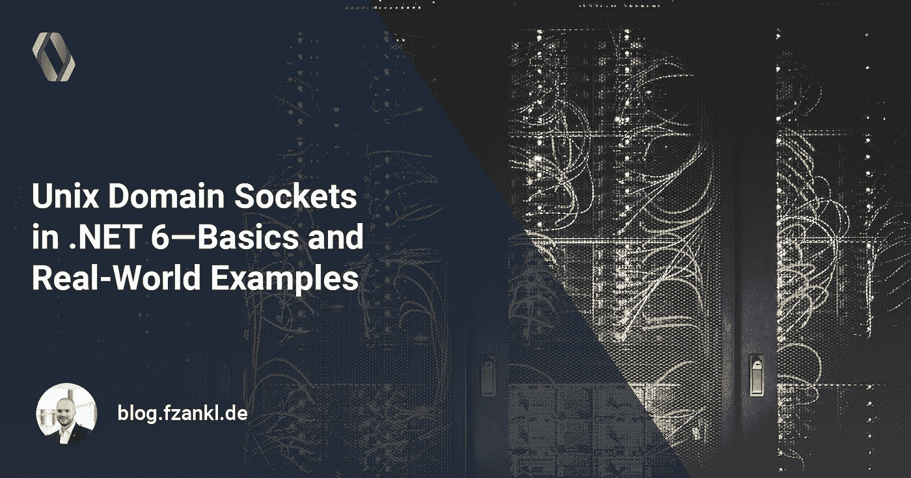
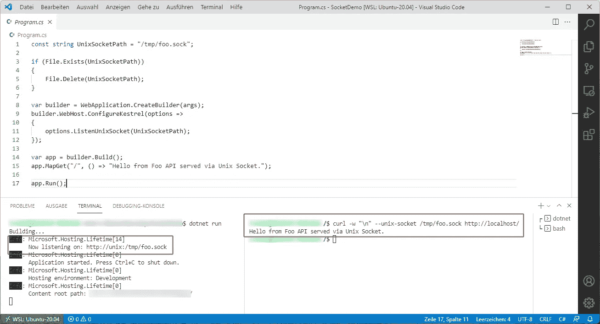
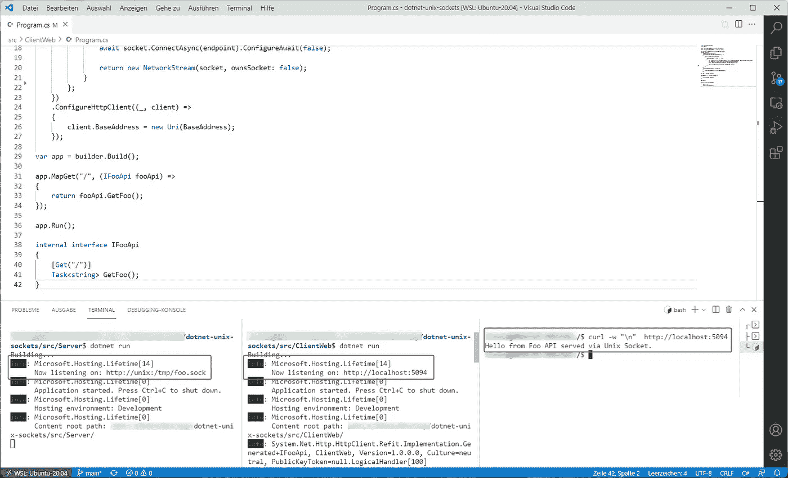
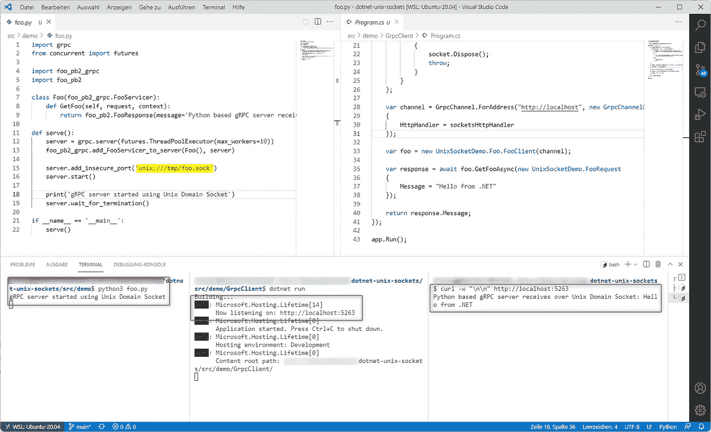

# Unix 域套接字。NET 6 —基础知识和现实世界的例子

> 原文：<https://medium.com/codex/unix-domain-sockets-in-net-6-basics-and-real-world-examples-8982898ab293?source=collection_archive---------1----------------------->

## 在中使用 Unix 域套接字。NET 6 服务器和客户端应用程序



使用创建支持跨平台的 API。NET 变得更加容易。NET 6。基于 ASP.NET 构建的 API 通常使用特定的接口和端口，通过 TCP/IP 为应用程序提供服务。这是有意义的，因为 API 会定期通过网络进行交互。你已经想过改变这种行为了吗？

在某些情况下，存在更高性能的解决方案，尤其是当应用程序需要交换数据并在同一台机器上运行时。如果您面临这种类型的场景，Unix 域套接字可能是默认行为的合适替代方式。本文展示了如何使用？NET 应用程序来服务和消费基于 Unix 域套接字的 API。文末的用例基于实际例子阐明用法。

# 什么是 Unix 域套接字？

在深入研究代码示例之前，让我们先简要了解一下 Unix 域套接字(或 Unix 套接字)以及它们与 TCP/IP 套接字的区别。

Unix 域套接字是一种进程间通信机制，允许多个应用程序之间进行双向数据交换。像基于 Unix 的操作系统上的几乎所有东西一样，Unix 套接字是基于文件的。因此，可以通过文件系统权限来控制访问，并且通信仅限于在同一台机器上运行的应用程序。

> 当应用程序在同一台基于 Unix 的主机上运行时，应该首选 Unix 域套接字，因为它们比 TCP/IP 套接字更轻量级、更快。

相反，TCP/IP 套接字允许应用程序之间通过网络进行通信。通过使用环回接口，通信也可以在同一台机器上进行。由于机器间通信的目的，TCP/IP 套接字必须考虑路由等操作。这就是为什么它们没有 Unix 域套接字那么快和轻量级。

# 通过 Unix 套接字提供. NET 最小 API

基于 ASP.NET 的应用程序通过名为 Kestrel 的内置跨平台 web 服务器提供服务。默认情况下，Kestrel 基于 TCP/IP 套接字使用不同环境变量中指定的参数进行设置，例如使用 *ASPNETCORE_URLS* 进行接口和端口绑定。这很有意义，因为 API 通常是为应用程序之间通过网络进行通信而创建的。

但这只是默认。通过精心设计的界面调整配置非常容易。通过几行代码，您可以构建并运行一个使用 Unix 域套接字而不是基于 ASP.NET 的 TCP/IP 套接字的 API。我们将在本文的后面查看一些实际的用例。

但是现在，我们将浏览服务器和客户机应用程序代码，演示如何使用 Unix 套接字。为了开始我们的第一个服务器应用程序，我们使用 dotnet CLI 创建了一个新的最小 API:

```
dotnet new webapi -minimal -o SocketDemo
```

然后，我们使用下一个代码片段替换 *Program.cs* 文件的全部内容。在这段代码摘录中，常量 *UnixSocketPath* 定义了用于在文件系统上创建套接字的路径。经过一些完整性检查后，建议 Kestrel 通过 *ListenUnixSocket* 使用已定义的套接字文件。通过这一行简单的代码，所有 TCP/IP 堆栈相关设置的预定义注册都被替换。使用创建最小 API 时，代码片段的其余部分遵循通用语法。网

为了在基于 Windows 的系统上运行这个例子，我推荐 WSL 2。Visual Studio 和 Visual Studio 代码具有出色的远程集成，因此您可以直接从开发环境中运行代码。

[](/codex/using-wsl-2-in-enterprises-d9cef1f60c73) [## 在企业中使用 WSL 2

### 在企业环境中安装、配置和分发 WSL 2

medium.com](/codex/using-wsl-2-in-enterprises-d9cef1f60c73) 

下面的屏幕截图显示了之前在 Visual Studio 代码 WSL 2 远程会话中执行的示例。左侧终端窗口显示了通过`dotnet run`执行的运行中的 ASP.NET 应用程序，确认我们正在使用定义的 Unix 套接字提供 API。



运行。使用 WSL2 远程会话直接从 Visual Studio 代码中调用

右边的终端窗口显示了一个使用 curl 命令`curl -w "\n" --unix-socket /tmp/foo.sock [http://localhost/](http://localhost/)`的客户端请求。输出代表了我们的服务器应用程序的预期响应。

# 使用 Unix 域套接字消费 API

使用命令行工具 *curl* 我们刚刚看到了从我们的服务器应用程序请求数据的许多可能性之一。在本节中，您将学习如何构建。NET 客户端可以从我们基于 Unix 套接字的后端消费数据。我们将讨论几种导致相同结果的方法。

## 使用基于. NET 6 的控制台应用程序

在我们的第一个例子中，我们从一个简单的控制台应用程序开始，它代表了从后端请求数据的“硬方法”。它使用框架中包含的[套接字](https://docs.microsoft.com/en-us/dotnet/api/system.net.sockets.socket?view=net-6.0)类。

下面的代码块显示了我称之为“硬方法”的原因。在使用[UnixDomainSocketEndpoint](https://docs.microsoft.com/en-us/dotnet/api/system.net.sockets.unixdomainsocketendpoint?view=net-6.0)类创建端点之后，我们必须从头开始构建所需的请求消息，然后使用之前实例化的套接字发送它。

但是。NET framework 确实提供了更多基于套接字请求数据的可能性。第二个控制台应用程序使用 [SocketsHttpHandler](https://docs.microsoft.com/en-us/dotnet/api/system.net.http.socketshttphandler?view=net-6.0) 类来表示“优雅的方式”。

通过这种方法，我们使用了更高层次的抽象。首先，我们必须创建一个[*SocketsHttpHandler*](https://docs.microsoft.com/en-us/dotnet/api/system.net.http.socketshttphandler?view=net-6.0)*的实例。通过 *ConnectCallback* 属性，可以建立到我们的 Unix 域套接字的连接。为此，使用[UnixDomainSocketEndpoint](https://docs.microsoft.com/en-us/dotnet/api/system.net.sockets.unixdomainsocketendpoint?view=net-6.0)类创建一个 *NetworkStream* 。*

*通过使用[*SocketsHttpHandler*](https://docs.microsoft.com/en-us/dotnet/api/system.net.http.socketshttphandler?view=net-6.0)，使用 HTTP 消息传递管道处理请求。管道中的每个消息处理程序接收一个 HTTP 请求并返回一个 HTTP 响应。管道通常包含多个链接在一起的处理程序。HTTP 消息处理程序提供了从 [HttpClient](https://docs.microsoft.com/en-us/dotnet/api/system.net.http.httpclient?view=net-6.0) 接口的优势中获益的可能性。因此，在发送请求之前，不需要手动构建消息。如上面的代码片段所示，通过使用 HttpClient 的`GetAsync`方法，我们可以很容易地从后端请求数据。*

## *使用带有 Refit 的 ASP.NET 应用程序*

*在用 ASP.NET 开发 web 应用程序的情况下，我们可以从嵌入式依赖注入和改装中受益。这种组合允许集中配置我们的端点，因此在 Unix 套接字上使用外部 API 时不需要特定于 API 的知识。*

> *Refit 是一个自动类型安全的 REST 库。NET Core、Xamarin 和。NET 将你的 REST API 变成一个动态接口。([https://github.com/reactiveui/refit](https://github.com/reactiveui/refit))*

*在下一个代码片段中，我们将通过 ASP.NET 和 Refit 来看看基于 Unix 套接字的 API 的配置和使用。该代码片段包含以下步骤:*

1.  *创建一个代表 API 的接口
    API 是由一个接口描述的。方法表示通过附加属性配置的单个端点。在我们的例子中，`IFooApi`接口代表了我们最小的 API 后端。使用属性`[Get("/")]`将 API 的特定端点映射到接口方法。*
2.  *通过调用扩展方法`AddRefitClient`注册改装客户端嵌入式依赖注入(DI)容器
    ，所有需要的依赖都在 DI 容器中注册。为此对 NuGet 包[进行改装。HttpClientFactory](https://www.nuget.org/packages/Refit.HttpClientFactory/) 必须预先安装。*
3.  *配置主 HTTP 消息处理程序
    下一步，建议 Refit 使用[*SocketsHttpHandler*](https://docs.microsoft.com/en-us/dotnet/api/system.net.http.socketshttphandler?view=net-6.0)*类作为主 HTTP 消息处理程序，这与我们之前的控制台应用程序示例中的实现相同。因此，所有使用注册接口的 API 调用都使用 HTTP 消息传递管道进行处理。**
4.  **配置 HTTP 客户端
    最后，应该进行 HTTP 客户端的设置。在下面的例子中，配置被简化为我们后端的基地址。因为我们关注的是 Unix 域套接字，当然，这是 localhost。**

**有了这个基本配置，就可以通过接口`IFooApi`调用 API。可以使用 ASP.NET 机制注入接口，这意味着在每个由 DI 创建的实例中，例如，控制器。**

****

**使用 ASP.NET 在 Unix 域套接字上使用 API，并在 WSL2 远程会话中进行改装**

# **实际使用案例**

**在上面几节中，您已经看到了一些在。基于. NET 的应用程序。所以现在是时候看一些真实世界的例子了，在这些例子中这是非常有用的。**

## **用例# 1——在之间交换数据。NET 和 Python**

****挑战**
想一个应用来预测一些惊人的事情。一般前端和后端部分在 ASP.NET 实现。一些预测算法是基于 Python 的。因此，基本上这两个组件可以彼此分开使用，或者像在这个用例中一样，在一个基于 Linux 的 Docker 映像中一起使用。**

****可能的解决方案** 应用程序之间交换数据的方式多种多样。使用命名管道、套接字、文件或。净语境[Python.NET](https://github.com/pythonnet/pythonnet)。另一种方法基于 gRPC。这项技术允许使用设计良好的契约在两个应用程序部分之间进行交换。gRPC 可以轻松实现各种通信方式，如一元呼叫、客户端流、服务器流或两种双向流的组合。**

**[](/codex/distributed-services-using-grpc-100743363c6b) [## 使用 gRPC 的分布式服务

### gRPC 实用指南及其使用方法。NET 和 Python

medium.com](/codex/distributed-services-using-grpc-100743363c6b) 

由于整个应用程序都在同一个 Docker 映像中，Unix 域套接字是启动运行中的应用程序的轻量级和最快的选项。

**实现** 构建和使用 gRPC 的基础知识。NET 和 Python 可以在我上面链接的文章中找到。对于这个特定的用例，我想说明的是，gRPC 除了 TCP/IP 套接字之外，还可以与 Unix 域套接字一起使用。以下示例显示了一个使用 Unix 套接字的基于 Python 的 gRPC 服务器。在基于. NET 的 gRPC 客户端中，执行一元调用。当然，角色也可以互换。

如带有改装样本的 ASP.NET 所示，gRPC 客户端也依赖于[*SocketsHttpHandler*](https://docs.microsoft.com/en-us/dotnet/api/system.net.http.socketshttphandler?view=net-6.0)。使用这个处理程序，可以创建 gRPC 通信通道。在最后一步中，对 Python 中托管的 gRPC 服务器执行一元调用。在这个示例中，代码被包装在一个. NET Minimal API 中，因此可以很容易地被触发(这只是为了演示，不要为单个请求重新创建整个通信栈)。

当在 Visual Studio 代码 WSL 2 远程会话中运行示例的所有提到的部分时，我们可以使用 *curl* 查询 API。结果显示在下图中。



## 用例 2—从 ctrlX 核心超紧凑控件请求数据

**挑战** [ctrlX CORE](https://apps.boschrexroth.com/microsites/ctrlx-automation/en/portfolio/ctrlx-core/) 是博世力士乐提供的一款超紧凑型自动化控制系统。其中一个特性是可以开发第三方应用程序，并通过 ctrlX 商店分发它们。这些应用程序可以使用各种编程语言开发，并使用 Snap 技术打包。该平台提供了各种 REST 接口，用于与用户管理或许可系统等无缝集成。为了从平台特性中获益，必须使用这些 API。

**可能的解决方案** 当然，其余的接口可以使用常规的 HTTP 调用来寻址。在 ctrlX 核心的情况下，所有端点都实施 HTTPS，并需要一个承载令牌来防止未经允许的访问。对于非交互式场景，例如，应用程序需要请求许可证数据，此令牌不可用。但是如何在这些场景下实现集成呢？解决方案几乎是显而易见的。

卡扣式容器可以通过插槽和插头相互连接。ctrlX CORE 上的许可服务提供了这样一个插件:

```
plugs:
  licensing-service:
    interface: content
    content: licensing-service
    target: $SNAP_DATA/licensing-service
```

因此，第三方应用程序可以通过 Unix 域套接字`$SNAP_DATA/licensing-service/licensing-service.sock`从许可系统 API 请求数据。这个套接字只能由运行在同一系统上的应用程序访问。因此，请求不需要使用 HTTPS，并且不再需要承载令牌。

**实现** 让我们来看看实现用例的一些细节。我们不会讨论为 ctrlX CORE 创建. NET 应用程序所需的所有方面。也许我会在以后的文章中写这个。-)

快照由名为 *snapcraft.yaml* 的文件描述。这个文件是 Snapcraft 的主要入口点(更多细节请参见[官方文档](https://snapcraft.io/docs/snapcraft-format))。要访问另一个快照提供的 Unix 套接字，必须扩展该文件。对于 ctrlX 核心，可能如下所示:

将插头添加到我们的 *snapcraft.yaml* 文件中的已知插头列表后，我们现在可以访问特定的 Unix 域插座。因为我们仍然在我们的技术堆栈中，所以上面提到的方法也可以用在这种情况下。接下来的代码摘录展示了这个栈在所描述的用例中的应用。它主要包括

*   *Startup*
    一个负责把所有应用程序部件放在一起的类。这包括例如依赖注入容器中组件的注册和配置。与套接字相关的接口和类的过程遵循我们以前学过的模式。
*   这个接口描述了许可 Api。每个方法都用一个特定于 Refit 的属性来修饰。在样本代码中，仅示例性地示出了获取许可的方法。
*   CtrlXLicenseValidator
    一个负责与许可证管理相关的应用程序特定逻辑的类。它使用 *ICtrlXLicenseApi* 接口，通过 *Startup* 类提供的配置来访问驻留在 ctrlX 内核上的 Api。** 

# **包扎**

**在本文中，介绍了在。NET 的应用程序进行了解释。实际例子进一步说明了这种用法。我们可以说，像 HTTP 消息处理程序这样的集成机制使得为运行在同一台机器上的服务建立轻量级的快速通信变得非常简单。与其他库(如 Refit)结合使用，大多数与通信相关的初始化都可以从生产代码中分离出来。**

**在 GitHub 上，有一个完整的工作示例应用程序。它涵盖了使用 Unix 域套接字进行通信的客户机和服务器应用程序。此外，还提供了 gRPC 示例的代码。([示例如何使用？网 6](https://github.com/fzankl/dotnet-unix-sockets)**

# **参考资料和更多链接**

**[](https://docs.microsoft.com/de-de/dotnet/api/system.net.http.socketshttphandler?view=net-6.0) [## SocketsHttpHandler Klasse(系统。Net.Http)

### 在 http 客户端的标准中。NET Core 2.1 和 her verwendet wird。公共引用…

docs.microsoft.com](https://docs.microsoft.com/de-de/dotnet/api/system.net.http.socketshttphandler?view=net-6.0) [](https://github.com/reactiveui/refit) [## GitHub - reactiveui/refit:的自动类型安全 REST 库。NET Core、Xamarin 和。网络…

### 的自动类型安全 REST 库。NET Core、Xamarin 和. NET。深受 Square 的改造库的启发…

github.com](https://github.com/reactiveui/refit)  [## ctrlX AUTOMATION SDK -软件开发工具包

### ctrlX 自动化软件开发工具包

boschrexroth.github.io](https://boschrexroth.github.io/ctrlx-automation-sdk/index.html)**