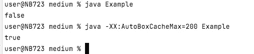

# 不可预知的周末 Java

> 原文：<https://medium.com/codex/unpredictable-weekend-java-8d184bdb828a?source=collection_archive---------16----------------------->

想象一下，你有一个没有任何参数、自变量和随机性的 Java 程序。你既没有循环也没有条件。你敢打赌不改变任何东西就改变一个程序的行为是不可能的吗？

乔恩·泰森在 [Unsplash](https://unsplash.com?utm_source=medium&utm_medium=referral) 上的照片

# 问题介绍

Java 是一个很好的工具，它有很多优化。通常，你并不关心他们。但有时这些优化可能会奇怪地影响您的代码。看一看下面的代码，并尝试回答您将在控制台日志中看到的内容。会是`true`还是`false`？请在下面的评论中写下你的观点，它会帮助我抓住一些统计数据。

首先，我使用了一个`Integer`对象，而不是原语`int`。其次，`==`运营商收购会参照比较对象。不要忘记[按值比较和按引用比较](https://www.javatpoint.com/how-to-compare-two-objects-in-java)差异。简单地说，在堆中可能有两个不同的`Integer`类型的对象，它们的值是相同的。通过`==`比较它们将返回`false`。这种比较不考虑对象的值，而只考虑它的引用。任何对象实例都有其唯一的引用。

# 简单的答案

根据我上面所说的，你可能会猜测代码会输出`false`作为结果。您甚至可以在本地运行代码，并且很可能得到`false`。但重点是有效的简单答案是 ***看情况*** *。*🙂

照片由[里斯·肯特什](https://unsplash.com/@rhyskentish?utm_source=medium&utm_medium=referral)在 [Unsplash](https://unsplash.com?utm_source=medium&utm_medium=referral) 上拍摄

# 没有这么简单的答案

正如你已经知道的，Java 有很多不同的优化。整数缓存就是其中之一。实际上，每当 JVM 需要实例化一个`Integer`对象时，它都会在缓存范围内查找。如果所需的数字在缓存中，那么 JVM 使用缓存中的一个整数来优化内存使用。

默认情况下，Java 初始化`Integer`对象的范围从-128 到 127，包括 127。因此，如果您从上面运行一个 Java 片段而没有任何额外的选项，您将在控制台输出中看到`false`。唯一的纯程序执行命令`java Example`。这是因为数字 130 超过了默认的缓存大小。JVM 必须为变量`a`创建第一个对象实例，为`b++`的输出创建第二个对象实例。

但是您也可以扩展缓存大小。一旦你通过 JVM 参数扩展它，你可以强迫你的 Java 应用程序在日志中输入`true`。运行`java -XX:AutoBoxCacheMax=200 Example`就可以了。参数`-XX:AutoBoxCacheMax=200`将缓存扩展到[-128；200]的范围，所以数字 130 现在命中缓存。而且 JVM 不需要为了`b++`的结果实例化新的`Integer`对象。它只需要在缓存中找到所需的对象并使用它。这意味着变量`a`和变量`b`将引用堆中的同一个对象。这就是为什么通过`==`比较它们会返回`true`。

你可以看看下面我的终端截图。您可以通过[此链接](https://gist.github.com/DzianisH/04fc641f5c3193486bd95bf29cee0647#file-example-java)下载源代码，并验证您在本地 PC 上是否有相同的行为。

输出的示例

# 摘要

非常有趣的是，由于 Java 中大量复杂的优化，您可能会面临一种意想不到的行为。在 JVM 的某个地方更改某个属性可能会影响您的代码流。看起来有时候你可能需要知道很多关于 Java 如何工作的细节，以确保你的代码像预期的那样工作。

希望你喜欢这篇文章。关注我，阅读更多关于 Java 和软件工程的内容。把你的想法贴在评论里。祝你愉快！