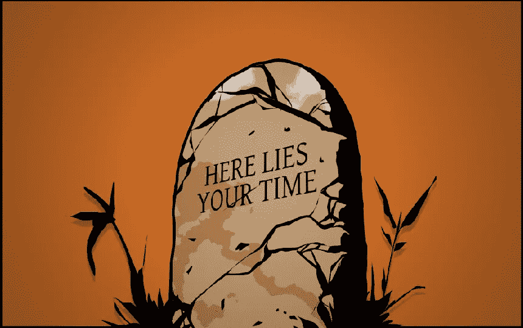

# Visual Studio 中未保存的更改:无声时代黑仔

> 原文：<https://medium.com/codex/unsaved-changes-in-visual-studio-the-silent-time-killer-732af68927fb?source=collection_archive---------10----------------------->

在这篇简短的指南中，我将向您介绍 Visual Studio 的一个有用的扩展，它一定会节省您的时间并减少您的麻烦。

## 自动保存

这种情况在你身上可能发生过一两次，或者像我的一样，发生太多次了——你在 Visual Studio 中修改了几个脚本，然后去 Unity，点击 play 来测试你的修改……