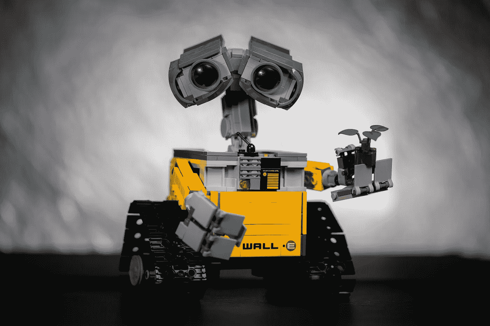

# 使用机器人更新依赖关系🤖

> 原文：<https://medium.com/codex/update-dependencies-using-bots-3bb1c99ffcca?source=collection_archive---------7----------------------->

[梁杰森](https://unsplash.com/@ninjason?utm_source=unsplash&utm_medium=referral&utm_content=creditCopyText)在 [Unsplash](https://unsplash.com/s/photos/robots?utm_source=unsplash&utm_medium=referral&utm_content=creditCopyText) 上的照片

项目通常需要升级依赖关系。尽管我们倾向于手动更新它们，但这是一个令人厌倦且耗时的过程。如果你遇到过这种情况，是时候把这个任务委托给一个叫 renewal 的机器人了。

[renew](https://docs.renovatebot.com/)是一个自动更新依赖关系的机器人，它支持多平台和多语言。它解析包管理文件，如 **pyproject.toml** …