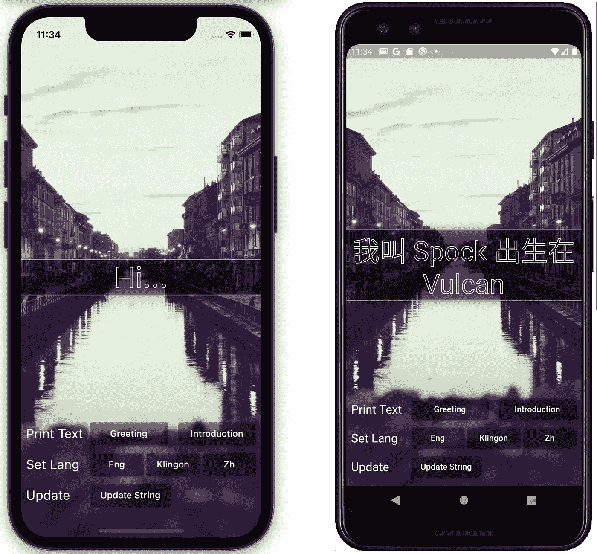
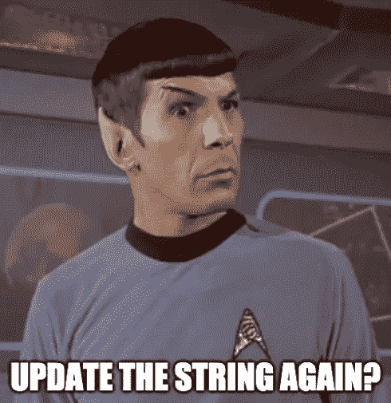
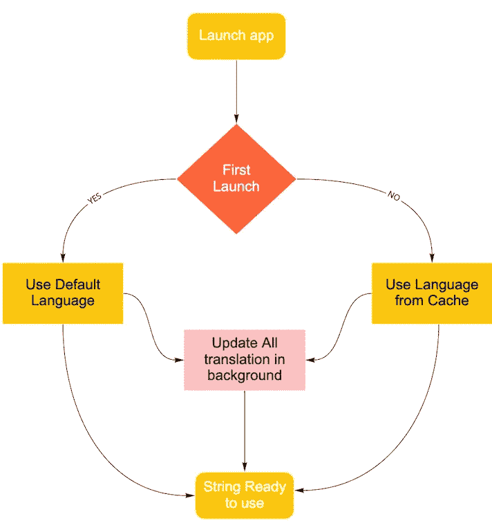

# 免费更新 Flutter 中的无线字符串

> 原文：<https://medium.com/codex/update-string-over-the-air-in-flutter-for-free-8a652062c109?source=collection_archive---------8----------------------->



是的，你没看错，免费的。你可以随时更新你的文本或字符串，并且会立即反映在你的 Flutter 应用程序上，而不需要提交应用程序。

# 为什么，谁，何时，何地&什么



当另一个团队经常想要改变我们应用程序中的翻译时，故事就开始了。有一天，他们决定使用经典的“ [Lorem Ipsum](https://en.wikipedia.org/wiki/Lorem_ipsum) ”，第二天，另一个人出现了，他们想要“ [Khaled Ipsum](http://khaledipsum.com) ”一切都很好，后来，在发布前一天，他们再次将其改为“ [Obama Ipsum](https://obamaipsum.com) ”。它还没有停止，在应用程序运行之后，团队终于可以松一口气，放松一下了。然后，你瞧，就在第二天，他们认为“[海森堡 Ipsum](https://heisenbergipsum.com) ”会很好。

好吧，改变翻译字符串是小菜一碟，它可以在仅仅几秒或几分钟内完成，但这是一个乏味的过程。这取决于您的项目有多大，以及您如何设置 CI/CD 管道。对我来说，在我们的 CI/CD 管道中编译应用程序至少需要一个小时，直到它可供另一个团队在 TestFlight 或 Playstore 的内部测试器上测试。如果应用程序正在生产，那么你需要再次提交应用程序，等待一天或一周，直到苹果审查人员和 Playstore 审查人员审查你的更新，并希望苹果团队没有改变或更新他们审查指南上的新项目。

# 怎么

有一种软件即服务可以让你维护一个可扩展的软件本地化平台，比如本地化的或[短语](https://help.phrase.com/help/phrase-over-the-air-introduction)，它们给你一个无线更新，集成快捷方便，文档也很好。如果你有预算，那么没有必要进一步阅读。但是，如果您没有预算，那么您可以继续阅读，看看这个解决方案是否适合您的使用案例。

# 限制


在我们开始之前，我需要告诉你在实现 OtaString 0 . 0 . 1 的初始版本时的一些限制。

1.  **你的字符串是公共的，没有控制台或翻译编辑器**
    要在发布版本上更新你的字符串，你需要将你的翻译 JSON 文件托管在你的服务器或 S3 桶中的某个地方。此外，您需要手动管理您的 JSON 文件没有花哨的编辑器来帮助非技术人员更新翻译，如短语或本地化。
2.  **不支持 Dart** [**区域设置**](https://api.flutter.dev/flutter/dart-ui/Locale-class.html)
    这意味着如果你的应用需要遵循设备语言，那么这个包不适合你。如果你的应用仅支持一种语言，你可以使用此包；如果你的应用有多种语言可供用户在应用中选择，用户可以设置他们的首选语言。
3.  **使用之前需要初始化 Hive。**
    这个初始版本依赖于 [Hive](https://docs.hivedb.dev/#/) 包，所以你需要先使用或初始化 [Hive](https://docs.hivedb.dev/#/) 。
4.  你不能嘲笑它，但你可以假装它。
    如果你想使用 [Mockito](https://pub.dev/packages/mockito) 进行测试并试图模仿，那么它将会失败，但是当然，如果需要在单元测试中测试它，你可以模仿它。
5.  **默认语言只有一种语言**
    如果您的 JSON 中缺少一种翻译，它将获得您定义的默认值。当应用程序第一次启动时，将使用默认语言，这意味着你的用户只能看到一种语言，直到你完成更新翻译。

所有这些限制都是在初始版本 0.0.1 上。希望有一天在下一个版本中所有的限制都消失了。

# 概观



如果首次启动应用程序，将使用默认语言，之后，如果您触发更新翻译功能，它将获取您的翻译文件并将其放入 Hive Db，下一次应用程序启动将从缓存中获取数据。

# 如何

**1。安装依赖项**

```
dependencies:
  ota_string: ^0.0.1

dev_dependencies:
  build_runner: any
  ota_generator: ^0.0.1
```

**2。为你的字符串创建一个新类**

您需要用“@OtaStringClass”注释您的类，并导入 hive 和 ota_string。翻译服务器是你的公共翻译 JSON 翻译文件，语言键是你的 app 有多少种语言。你翻译的 JSON 文件的结构现在需要遵循这个[例子](https://aldychris.github.io/JsonMocks/OtaJson/BasicSample.json)

**3。运行 build_runner**

```
flutter packages pub run build_runner build
```

如果成功，就会生成 app_localize.g.dart，您就可以使用它了。

**4。初始化、加载、更新语言**

```
await Hive.initFlutter();
**OtaAppLocalize**.*load*('en');
**OtaAppLocalize**.*current*.updateData();
```

当您加载语言时，它需要与您放在语言键上的语言相匹配。要更新翻译，您可以调用 updateData()函数。

**5。显示&替换字符串**

要显示字符串，只需调用生成的文件，就大功告成了。

```
**var helloString = OtaAppLocalize**.*current*.hello;
```

在 JSON 中你可以有动态值，要放动态值你只需要在{}中放任何字符。

```
My Name is {name}, Im from {location}
```

名称和位置将被您的应用程序中的字符串替换，替换您可以调用的函数的字符串。replaceOtaStringWith

```
var res = **OtaAppLocalize**.*current*.name_location
    .replaceOtaStringWith(['Spock', 'Vulcan']);
```

**6。分期与生产**

您需要在 OtaStringClass 中传递另一个 JSON 文件，用于 Stagging 和生产字符串翻译

```
@OtaStringClass(
    translationServerStg: 'https://aldychris.github.io/JsonMocks/OtaJson/BasicSample.json',
    translationServer: 'https://aldychris.github.io/JsonMocks/OtaJson/BasicSampleProduction.json',
    languageKey: ['en', 'zh', 'tlh'])
```

然后在运行项目时，您需要将变量 otaStringProdEnv 定义为 true 或 false。

```
--dart-define=otaStringProdEnv=false
```

# 例子

# 下一步是什么

看看这个包，我希望这篇短文能帮助你理解这些包的思想。

[](https://pub.dev/packages/ota_string) [## ota_string | Dart 包

### 一个新的颤振项目。

公共开发](https://pub.dev/packages/ota_string) [](https://pub.dev/packages/ota_generator) [## ota_generator | Dart 包

### 源代码生成器，帮助创建多语言字符串翻译，通过无线方式免费更新…

公共开发](https://pub.dev/packages/ota_generator) 

希望，如果我有时间，然后将保持这个项目更新，并做这个改进:

*   支持 Flutter 语言环境，日期格式和复数
*   支持基于应用版本的更新字符串
*   支持多个默认翻译
*   有控制台和用户界面来添加或修改翻译

**最后但同样重要的一点是，点击“鼓掌”按钮👏支持我或按住鼓掌按钮，留下更多的掌声。**