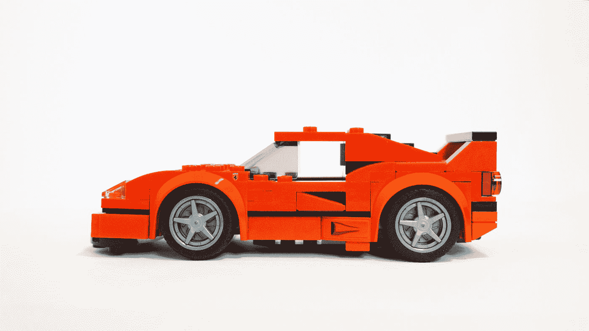

# 更新传统应用程序—为什么成本会超出您的预期

> 原文：<https://medium.com/codex/updating-a-legacy-app-why-itll-cost-more-than-you-expect-f1b279f246e8?source=collection_archive---------17----------------------->

谷歌[宣布](https://techcrunch.com/2021/07/03/this-week-in-apps-ios-15-public-beta-arrives-android-app-bundles-to-replace-apks-app-consumer-spend-hits-new-record/)从 8 月份开始，他们将只接受他们首选的安卓应用捆绑(AAB)格式的应用提交到 Play Store。[谷歌从 APKs 转向新的 Android 应用捆绑包有一些很好的理由。](https://tdcolvin.medium.com/stop-whining-about-android-app-bundles-theyre-great-ac28b520199d)然而，这个消息让应用程序世界嗡嗡作响，因为它是新的。与众不同。没有人喜欢改变！

它强调的是，谷歌(和苹果)有时会改变他们对应用程序出现在他们商店的要求。或者对他们的计费 API 之类的功能进行更改。或者鼓励开发者支持新的操作系统更新。为什么？因为这些变化最终将使最终客户受益并保护他们。

对于任何开发过应用程序的人来说，不利的一面是，这些变化通常需要新的开发。这对于拥有庞大开发团队的大型消费品公司来说不是什么大问题。或者甚至 midlist 应用和游戏，他们将拥有自己的内部开发团队或应用代理来支持他们的应用。

这种变化真正影响的是小的利基应用程序，特别是那些已经构建和维护了很长时间的 B2B 应用程序，几乎不需要添加功能或进行重大升级。这些微小的应用程序有助于推动一个更大的生态系统，当发生变化时，往往会对这些 B2B 产品产生巨大的影响。

因为构建它的开发人员通常已经离开了这个行业。或者建造它的机构已经合并到另一家公司，完全忘记了你。或者管理团队根本不记得多年前是谁开发了这个应用。

这时我们的电话开始响了。人们寻求帮助。

我们已经建立了一点声誉，因为我们能够从垃圾堆中扑入并拯救应用程序，或者扭转注定失败的应用程序项目。因为我们时刻关注着地面，所以我们通常知道未来的变化，并准备好采取行动，做出必要的改变。嗯……[反正大部分时间都是](https://9to5mac.com/2020/09/16/developers-frustrated-at-just-one-days-notice-of-ios-ipados-and-watchos-rollout/)。

不幸的是，更新一个遗留应用并不总是像你想象的那样简单。这意味着有时这个过程会很昂贵。

# 更新传统应用程序就像修理或重建汽车一样

这是我不时在[和](https://thom-gibbons.medium.com/how-much-does-it-cost-to-build-an-app-it-depends-on-how-much-your-house-cost-4fede54c9f7)使用的类比类型。当客户问我们更新他们的应用程序要花多少钱时，我会把它比作重建一辆汽车。这可能是一场快速、廉价的胜利。或者它可能很昂贵，需要一大笔投资。有时候买辆新车实际上会更便宜。原因如下…

## 这取决于汽车

在 [Unsplash](https://unsplash.com?utm_source=medium&utm_medium=referral) 上[Peri stojn](https://unsplash.com/@whoisperi?utm_source=medium&utm_medium=referral)的照片

如果你想重建一辆 1990 年的福特嘉年华，那么你很幸运。便宜的零件就在那里——你可以在易趣上淘来淘去，或者在最糟糕的情况下，你可以买几辆二手车，然后直接拆下来换零件。或者，可能会有非规格零件。他们不会花费你一只胳膊和一条腿去检修，也不会花太多时间去做。就应用程序而言，这通常是一项非常简单的工作。没什么特别的。这是一个简单的应用程序，具有编写良好、相对最新的代码。理想情况下，你可以让我们与最初的开发者取得联系，或者至少可以访问他们所有的原始文档。您有自己的签名密钥。你不打算重新设计用户界面或添加功能。它仍然会花费你时间和金钱，但是我们能做它。

Stephan Louis 在 [Unsplash](https://unsplash.com?utm_source=medium&utm_medium=referral) 上拍摄的照片

如果你想重建一辆 [2015 款大众高尔夫](https://www.carlogbook.co.uk/2000s-cars.aspx)，那么你将同样幸运地拥有容易获得的零件、备件或者至少是方便拆卸的二手车。但这是成本/价值主张开始抬头的地方。这是一辆你可以在二手市场上很容易买到的汽车。为什么你需要重建这辆车？除非它有真正的情感价值，比如……我不知道……你的第一个儿子名叫维杜布·高尔夫·琼斯，那么你最好出去买一个二手的来代替。或者一辆全新的高尔夫。

我们经常在 app 开发圈看到这种情况。这通常是当开发商或开发机构让客户陷入困境的时候。有时候，开发团队是垃圾，或者是构建了糟糕产品的离岸开发中心的灾难性混合体。这些都是昂贵的工作。有时候是可以解决的。但是，你的新应用代理公司需要清理大量旧代码，这需要时间。我们都知道时间等于什么。在这种情况下，大约 70%的情况下，扔掉旧应用程序并重新开始要便宜得多。

照片由[埃里克&尼克拉斯](https://unsplash.com/@penguinphotography?utm_source=medium&utm_medium=referral)在 [Unsplash](https://unsplash.com?utm_source=medium&utm_medium=referral) 拍摄

如果你想重新打造一辆法拉利 250 TR，事情就会变得非常复杂。当其中一个坏小子出价 1600 万英镑时，你就知道任何重建工作都将是昂贵的。这些是最终的收藏家物品。它们比我们看过的其他车辆都要古老和稀有。这意味着从徽章到方向盘、仪表板到刹车踏板的所有东西都是可收集的。又名昂贵。找到施工手册也更难了，而且你要自己加工零件。这是可能的。但这实际上是不可能的。

很难将它定义为一个应用程序，因为就像交通工具一样，它们很少见。这就像被要求同时重建脸书、Whatsapp、Instagram 和其他品牌一样。没有任何原始代码。或者文档。只有一个计算器在工作。和一匹小马。这几乎不可能。当我们看到这种情况时，通常是因为企业级产品具有多样化的功能集，这些功能集多年来一直在增长和膨胀。通常情况下，客户甚至不知道他们最重要的功能是什么，所以他们不能优先考虑工作，或者需要在一个大爆炸中启动所有功能。我的商业会计师希望我们接手。在接下来的 18 个月里，我的开发人员会恨我，或者直到他们厌倦了离开。

## 这取决于问题

在 [Unsplash](https://unsplash.com?utm_source=medium&utm_medium=referral) 上由 [Tachina Lee](https://unsplash.com/@chne_?utm_source=medium&utm_medium=referral) 拍摄

对于汽车改造或维修，有时大部分车辆是健全的…所有需要的是一点点的 TLC 和一些小的维修。

修理坏掉的前灯是一项快速的工作。修理排气管或悬挂线圈需要时间和金钱…当然。更换整个引擎或变速箱…嗯，那真的会花掉你很多钱。

应用程序也是如此。

如果这个应用程序真的很旧了，它将需要一些重大的重构来保证它的安全。它需要努力处理新的操作系统要求，或者提升它所能承载的负载。然后你要安装新的排气管，换轮胎。这将是昂贵的，但它会让你的车运行。

如果应用程序是一个臃肿、过时的烂摊子，用户界面陈旧，需要彻底检查，权限过时，存在巨大的安全漏洞，那么你就回到了那个棘手的问题，更换整个引擎块(以及所需的时间)回避了这个问题——“我们应该从头再来吗？”

## 这取决于司机

Amir Hosseini 在 [Unsplash](https://unsplash.com?utm_source=medium&utm_medium=referral) 上拍摄的照片

我在这篇文章和我以前在[的一些思考中提到过这个问题几次。有时检修汽车的费用取决于司机。](https://thom-gibbons.medium.com/six-things-to-look-for-in-a-client-when-you-run-an-agency-fad95a206b69)

你对车好吗？把它放在像样的地方？定期维护吗？有维修记录吗？设法与之前维护车辆的团队保持联系？或者你只是来找我们要一个报价，以降低你通常的车库报价？拖欠商品或服务的付款？惹恼了你以前的机械师？

这些都会对价格产生影响。

如果我们怀疑客户与他们以前的开发人员发生了严重的争吵，我们就会非常紧张。有时这是开发人员的错。我们听说过这样的故事，应用程序开发机构绝对冲洗更新一个应用程序的价格，因为他们有他们的客户在桶上。在最初的合同中没有签署维护成本或日费率，所以这个流氓机构打算榨干客户的血汗。

在这种情况下，我们会尽力帮忙，降低成本，但有时会很棘手。然而，当我们认为客户是问题所在时，我们就开始建立防御。你知道，开发人员之间是会交流的。我们做作业。如果结果证明你是一个噩梦般的客户，或者更糟糕的是一个迟付(或从不付款)的客户，那就等着我们提高收费吧。并要求提前付款。

因此，无论你的应用是一辆破旧的老爷车，还是一辆已经跑了十几英里的新款跑车，修复或更新它都需要花钱。多少取决于应用程序、客户端和所需的工作量。就像修车一样。

Thom Gibbons 是 Apptaura 的首席执行官。他上周可能出了点小车祸，这就是为什么他现在纠结于修车的费用。如果你有一个想要更新的应用程序，[为什么不跟他聊上 30 分钟呢](http://www.calendly.com/thom-gibbons-apptaura)，他可能会帮你解决问题。