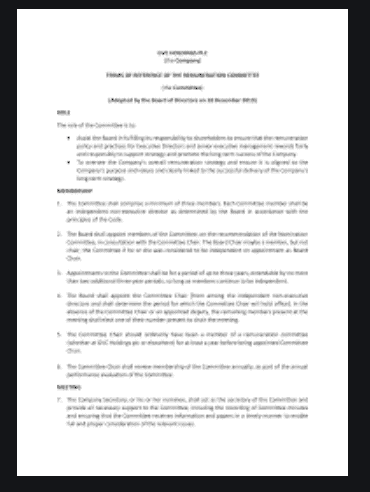
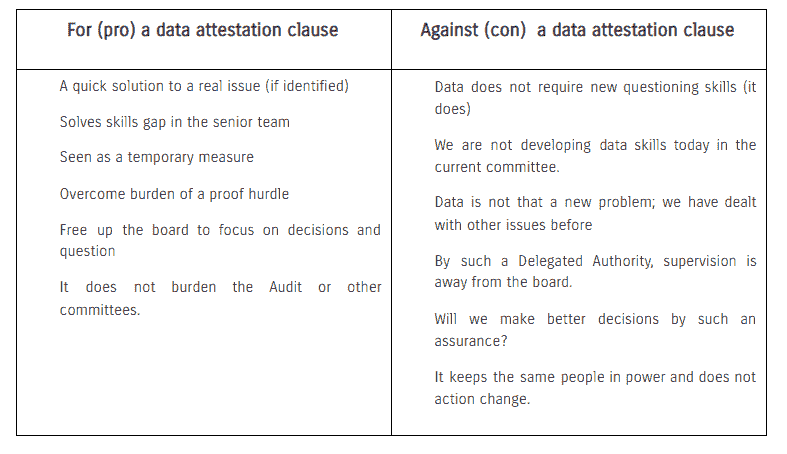
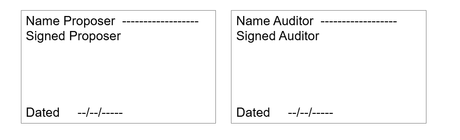

# 更新“数据证明”部分的董事会文件

> 原文：<https://medium.com/codex/updating-board-papers-for-a-data-attestation-section-1f7e405f02ca?source=collection_archive---------14----------------------->

## [法典](http://medium.com/codex)

## 当“数据”支持董事会文件中的建议时，董事如何获得对“数据”及其用途的保证？

在过去的 25 年里，我阅读、撰写和提交了相当一部分董事会和投资委员会的文件。作为董事，我们集体对我们做出的决策负责。我现在可以观察到关于“数据”的技能差距，许多董事会成员假设并信任构成他们被要求批准的基础的数据。有良好的流程、方法和程序来确保提交的任何董事会文件都是真实的。然而，使用大数据及其相关分析工具(包括推动自动化的 ML 和 AI)的决策是新的，需要更高细节水平的不同专业知识。挑战数据不同于发现很难详细询问任何高管的具体专业知识，更一般地说，总法律顾问、首席财务官和首席技术官。CDO/首席信息官轴心跨越了成本和收入这两条价值线。随着“数据”成为业务驱动力，在不了解对我们未来决策能力的影响的情况下质疑成本表面上仍然更容易，而揭示不道德收入则更难。

一份经典的“董事会文件”可能会有以下标题:*简介、背景、基本原理、结构/运营、说明性财务&情景、竞争、风险和法律。*视情况而定，总会有细微的调整。最后，某种形式的推荐会邀请董事会**记录**关键事实并**批准**行动。我认为，现在是时候让董事长或首席执行官在其高级数据主管(#CDO)的支持下，要求每份董事会文件都有一个名为“**数据证明”的新章节标题了。**“关于数据证明的部分将是一项声明，表明有可追踪的证据和数据证明，以及演示者作为证人证明数据的行为。一些团队倾向于将此作为主要流程的补充，一些团队倾向于将其作为法律流程的新部分，另一些团队倾向于将其作为附录，还有一些团队会声称它已经是流程中固有的一部分。与其意图相比，如何和在哪里并不重要。

> 关于数据证明的部分将声明有可追踪的证据和数据证明，以及演示者作为证人证明数据的行为。

这样一个部分可以提供一个解决方案，直到我们可以在董事会上获得足够的技能并正确地测试数据。是的，任何提交董事会文件的人都有高度的注意义务(已经是固有的)。然而，大多数高层的数据专业知识和技能也远低于我们的需求，因为所有的政治、偏见和复杂性都在杂草中，很容易不知道和隐藏。董事会成员不得不继续质疑绩效指标(KPI 和 BSC)以确定任何决策的动机，但不得不相信“数据集”,这是一种不同于我们在审计、财务、法律和合规方面的标准。如果没有别的，一份“数据证明声明”将为那些陈述者设置一个障碍，以优先考虑他们的提案中使用的数据的偏见、道德和后果。

> 信任数据与我们在审计、财务、法律和法规遵从性方面的标准不同。

# 赞成和反对的论点

**关键假设**

*   数据对我们的未来至关重要，是未来决策的基础。
*   如今，数据越来越复杂，而且复杂性还在不断增加。
*   高管和领导团队都是各自领域的专家，在关键领域拥有深厚的专业知识，但在数据技能方面存在差距。
*   董事会认识到，数据偏差、缺乏可闻性、出处和数据谱系会导致有缺陷/糟糕的决策。

基于这些工作假设，我不认为增加一个“数据证明”部分是一个长期的解决方案。在遵守《公司法》第 172 条的同时，这是满足我们提升的信托责任的绝对要求。但数据不像营销、技术、运营、财务或人力资源——数据是新的，绝大多数董事会和高级领导团队在大数据、数据分析或编码方面几乎没有经验。教育和技能发展是一个更好的解决方案，这是一个共识，但在今天和技能到来之间的差距中，我们应该做些什么？至关重要的是，我会支持引入一个数据证明部分，并设定一个日期。

提供 D&O 保单的保险公司正在考虑与董事根据数据做出决策的能力相关的新条款，以及他们了解数据“符合目的”以做出决策的能力，这一点非常重要。保险公司需要保护他们的索赔业务，可能会觉得技能提升可能需要很长时间。

为什么这可能行得通？你会登上飞机并要求驾驶它吗？去医院是用正确的谷歌答案还是问有资质的医生？我们需要形成自己的观点，有人检查过飞行员和医生是否合格。今天，因为同样的问题，我们将审计外包给一个委员会；这很复杂。但数据不是财务，数据也不是审计委员会的问题。数据是不同的技能组合。

每个董事会都必须做出自己的选择。最简单的方法是向自己证明我们现有的流程足够好，并且我们遵循“最佳实践”，即合规性思维。鉴于唐纳德·布里登爵士在审计审查中提出的 76 项建议，假设我们现有的流程足够好是很难证明的。如果我们想利用数据做出更好的决策，我们需要确保我们能够做到。

# 建议

一个强烈的建议是制定一个“证明条款”，一个截止日期，一个针对高级领导团队和董事/董事会成员的两年强制性数据培训计划，以及一个优先考虑新的高级和董事会(NXD 公司)角色的数据技能的继任计划。

# 建议

“数据证明”部分旨在让理事会从提议人和独立数据专家处收到一份*签名*声明，表明提议人:

*   董事会文件中使用的数据的证明文件，
*   经证明的数据使用权
*   第三方数据的哪些差异/差异产生了建议/结果
*   尽最大努力确保数据或分析中没有偏见或选择
*   明确规定任何自动化或即将自动化的决策
*   如果相关，在分析之前创建假设
*   使用不同的数据和工具运行场景
*   不要错过使用数据的机会
*   强调了他们的 BSC/KPI 和批准排序之间的利益冲突

独立审计师不应是公司的财务审计师或数据湖提供商；这应该是独立的法医数据专家。审计建议抽样；这不是取样的问题。这不是要制造更多的障碍或将权力交给外部机构；这是关于第三方验证和确认。作为一家公司，你要建立一份专家名单，并定期对他们进行审核。审计员不需要查看董事会文件、分析结果或建议，他们在那里从头到尾检查证明和有效性。关键是证明他们的专业知识和保险证书。

虽然这不是你将使用的最终措辞，但它的意图是重要的；这并不否定或替代风险部分中的数据风险。

**数据证明部分的示例**

> 我们通过签名证明，我们，提议人和审计员，可以向我们的公司(PLC)董事会证明，我们对本文陈述中使用的所有数据拥有可证明的[证明和权利](https://tonyfish.medium.com/does-data-have-a-purpose-57249c7c8e1e)。我们在本文中介绍了所选数据、模型和工具的敏感性，并提供了不同数据和分析工具选择同样有利于推荐的证据。我们已经测试并可以验证我们的数据、分析、见解和知识是可追踪和合理的。我们声明，此次批准不存在利益冲突，也不会导致决策自动化。

