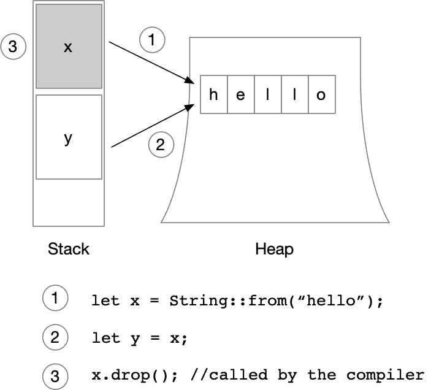

# 安全更新我们的数据线程

> 原文：<https://medium.com/codex/updating-our-data-thread-safely-870f8585709?source=collection_archive---------4----------------------->

## 文章

## *出自* [*锈网开发*](https://www.manning.com/books/rust-web-development?utm_source=medium&utm_medium=organic&utm_campaign=book_gruber_rust_5_21_21) *出自巴斯蒂安·格鲁伯*

*本文讨论如何在 Rust 中安全地更新我们的数据线程。*

通过在[manning.com](https://www.manning.com/?utm_source=medium&utm_medium=organic&utm_campaign=book_gruber_rust_5_21_21)的结账处将 **fccgruber** 输入折扣代码框，享受 35%的折扣[*Rust Web Development*](https://www.manning.com/books/rust-web-development?utm_source=medium&utm_medium=organic&utm_campaign=book_gruber_rust_5_21_21)。

当操作一个异步 web 服务器时，我们必须意识到在同一时刻可能会有数以千计(或更多)的请求进来，并且每个请求都想要写入或读取数据。我们有一个单一的数据结构为我们提供应用程序中的状态，但是当两个或更多的请求想要写入同一个结构或从中读取时会发生什么呢？

我们必须让每个请求分别访问我们的存储，并通知另一个进程或请求等待，直到前面的读或写在`Store`上完成。在这种情况下，两个(或更多)进程想要更新同一个数据结构。我们需要将其他进程放在等待列表中，一次处理一个进程来修改我们的数据。

此外，Rust 对所有权有独特的看法。一个实例或进程可以拥有特定变量或对象的所有权。这是为了防止竞态条件和空指针，其中引用了不再存在的数据。似乎我们必须等待一个请求完成，以便它能够将`Store`的所有权返回给下一个请求。这与异步思维完全背道而驰。

我们面临两个问题:

*   我们希望防止两个或多个进程同时修改数据。
*   如果需要改变数据存储，我们希望赋予每个路由处理程序对数据存储的所有权。

在我们甚至可以考虑在我们的存储上设置更改数据的等待列表之前，我们首先需要确保 Rust 可以共享一个状态的所有权。让我们先解决第二个问题。Rust 在代码中传递变量时会转移所有权。图 1 展示了当向另一个变量传递一个复杂值(比如一个字符串)时，如何丢弃第一个变量，以确保堆栈上只有一个指针拥有堆上这个结构的所有权，它控制着对它的所有修改。



图 1:将字符串这样的复杂数据类型重新分配给另一个变量是内部将所有权转移给新变量并放弃旧变量。

这个概念现在对我们来说是个问题。Rusts 的安全措施阻止我们在不同的函数和线程之间共享数据，因为每当我们传递一个值给一个新的函数时，我们就转移了这个值的所有权，并且必须等待直到我们取回它。我想到了两个选择:

*   为每个路由处理程序创建一个我们的存储副本
*   等到一个路由处理程序完成后，将存储的所有权交还给下一个处理程序

两者都没有以适当的方式解决根本问题。第一个选项污染了我们的内存，我们仍然不能改变存储中的数据，第二个选项与我们的异步方法背道而驰。

幸运的是，Rust 配备了处理这些问题的设备。具体来说:

*   `Rc<T>`
*   `Arc<T>`

`Rc`或`Arc`类型将底层数据结构`T`放在堆上，并在堆栈上创建一个指针。现在，您可以复制引用相同数据指针。这两者的区别在于`Rc`只在单线程系统上运行，而`Arc`在多线程系统上运行，因此它允许你在不同的线程之间共享数据。


图 2:Rust 没有减少 x 值，而是增加了 Arc 计数。每当 x 或 y 超出范围时。它递减计数，直到计数为零，然后调用。要从堆中移除的 drop()。

弧类型是“原子引用计数”。它就像一个容器，将其中包装的数据移动到堆上，并在堆栈上创建一个指向它的指针。当克隆一个 Arc 时，克隆指向堆上相同数据结构的指针，并且在内部，Arc 增加它的计数。当内部计数达到零时(当指向变量的所有变量都超出范围时)，Arc 会丢弃该值。这使得在不同变量之间共享堆上的复杂数据变得安全。

我们运行在 tokio 之上，这意味着我们需要使用`Arc<T>`并将我们的数据存储包装在其中，但这只是解决方案的一部分。读取相同的存储是好的，但我们也希望有机会改变它。一个线程上的 HTTP POST 请求可能会增加问题，而另一个线程上的 HTTP PUT 请求可能会试图改变现有的问题。因此，我们需要寻找解决办法。Rust 也将我们包含在这个场景中。我们可以使用这两种类型中的任何一种:

*   `Mutex`
*   `RwLock`

它们都确保读者或作者对底层数据的访问是唯一的。一旦一个写者或读者想要访问数据，它们就锁定数据，并在前一个读者或写者完成时为下一个读者或写者解锁数据。区别在于:一个`Mutex`对于一个写者或者一个读者来说都是阻塞的，而一个`RwLock`同时允许许多读者，但是一次只允许一个写者。

我们必须小心:这两种类型都在`std::sync`模块的后面，这表明它们在像我们这样的异步环境中不是最好的。我们的项目中添加了一些用于异步环境的`RwLock`类型的实现。

我们选择了库`parking_lot`，它在大公司的生产环境中被大量使用，因此目前得到了我们的信任。我们将库添加到我们的`Cargo.toml`文件中:

**清单 1:将 parking_lot 添加到我们的项目中**

```
…
 [dependencies]
 warp = "0.3"
 **parking_lot = "0.10.0"**
 serde = { version = "1.0", features = ["derive"] }
 serde_json = "1.0"
 tokio = { version = "1.1.1", features = ["full"] }
```

现在一切就绪，我们可以开始相应地更新我们的代码库了。首先，我们将问题封装在一个`Arc`中，将数据放入堆中，并获得指向它的多个指针。此外，我们将我们的问题结构包装在一个`RwLock`中，以防止同时进行多次写入。

**清单 2:让我们的 HashMap 线程安全**

```
…

 **use std::sync::Arc;**
 **use parking_lot::RwLock;**

 …

 #[derive(Clone)]
 struct Store {
     questions: **Arc<RwLock<**HashMap<QuestionId, Question>**>>**,
 }
 …
```

我们还必须更新从`get_questions`函数中的`Store`读取问题的方式:

**清单 3:调整我们阅读商店的方式**

```
…
 async fn get_questions(store: Store) -> Result<impl warp::Reply, warp::Rejection> {
     let res: Vec<Question> = store.questions**.read()**.values().cloned().collect();

     Ok(warp::reply::json(&res))
 }
 …
```

在`questions`上的一个简单的`.read()`足以请求从`RwLock`读取。考虑到商店结构的更新包装，我们创建了两个新功能:更新和插入问题。

## **添加问题**

我们以线程安全的方式解决了处理状态的问题，现在我们可以继续实现剩下的 API 路由，并探索如何从 HTTP 请求解析主体和从 URL 读取参数。我们添加的第一个路由是接受对/questions 路径的 HTTP POST 请求。


图 3:我们期望在/questions 路径上的 HTTP POST 请求的主体中有新的问题。

清单 4 展示了我们的`add_question`路由处理程序。我们期望存储被传递给我们的函数，和一个问题。然后我们可以利用我们在商店上实现的`RwLock`，并使用方法`.write()`请求对它的写访问。无论何时我们得到它，我们都可以访问底层的`HashMap`，并带着我们的问题调用`.insert`。

**清单 4:添加路由处理程序，用于将问题添加到存储中**

```
…

 async fn add_question(store: Store, question: Question) -> Result<impl warp::Reply, warp::Rejection> {
     store.questions.write().insert(question.clone().id, question);

     Ok(warp::reply::with_status(
         "Question added",
         StatusCode::OK,
     ))
 }

 …
```

insert 方法有两个参数:HashMap 的索引和我们希望存储在它旁边的值。我们还可以在这里发现 Rusts 所有权原则:我们在第一个参数中访问问题的 id，因此将问题的所有权传递给`HashMap`的`.insert`方法。如果我们不再在其他任何地方使用这个问题，这就很好了，但是第二个参数接受这个问题并将其存储在`HashMap`中。

因此我们在第一个参数中`.clone`问题创建一个副本，然后把初始问题的所有权从函数参数交给`the .insert`方法。

**清单 5:为/questions 添加发布路线**

```
…

 #[tokio::main]
 async fn main() {
     …

     let get_questions = warp::get()
         .and(warp::path("questions"))
         .and(warp::path::end())
         .and(store_filter.clone())
         .and_then(get_questions);
         .and_then(update_question);

 **    let add_question = warp::post() #A**
 **        .and(warp::path("questions")) #B**
 **        .and(warp::path::end()) #C**
 **        .and(store_filter.clone()) #E**
 **        .and(warp::body::json()) #F**
 **        .and_then(add_question); #G**

     let routes = get_questions.**or(add_question).**with(cors)**.recover(return_error);**         warp::serve(routes)          .run(([127, 0, 0, 1], 3030))          .await;  }
```

**#A 我们创建一个新变量，这次使用 warp::post()来过滤 HTTP POST 请求**

**#B 我们仍然监听相同的根路径，/questions**

**#C 我们关闭路径定义**

**#E 我们将我们的商店添加到该路线，以便稍后将其传递给路线处理程序**

**#F 我们提取 JSON 体，它也被添加到参数中**

**#G 我们用 store 和 json 体作为参数调用 add _ question**

我们添加了两条新路线，并将它们添加到我们的 route 变量中。请注意，我们在`get_questions`过滤器的末尾移除了单个的`.recover`，并将其添加到路由的末尾，因为现在我们在恢复未找到的路径之前尝试不同的路由。

目前就这些。在曼宁的 liveBook 平台[这里](https://livebook.manning.com/book/rust-web-development?origin=product-look-inside&utm_source=medium&utm_medium=organic&utm_campaign=book_gruber_rust_5_21_21)了解更多关于这本书的信息。