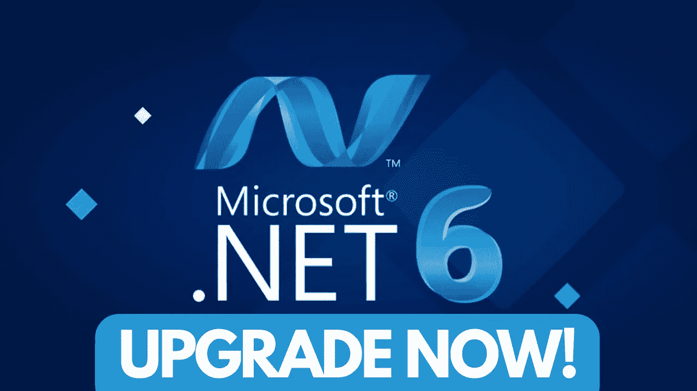
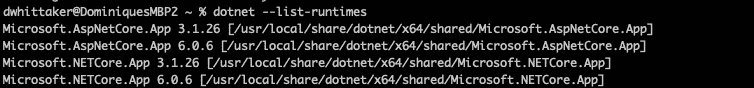
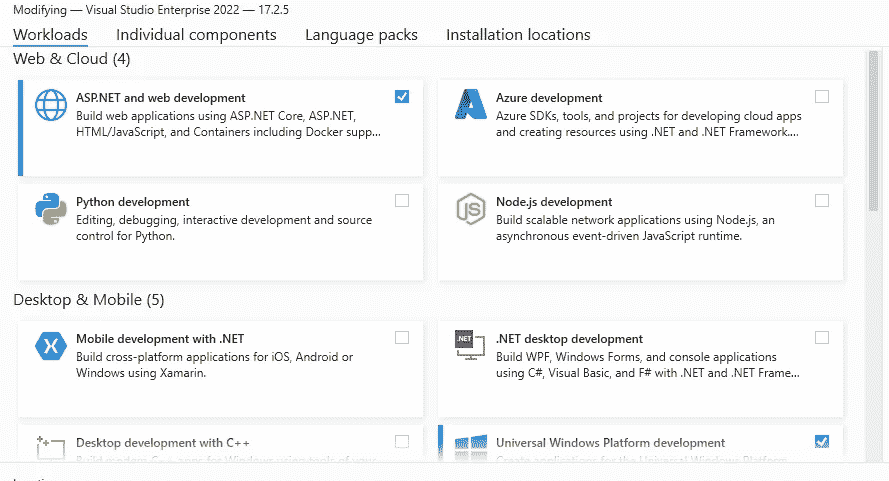
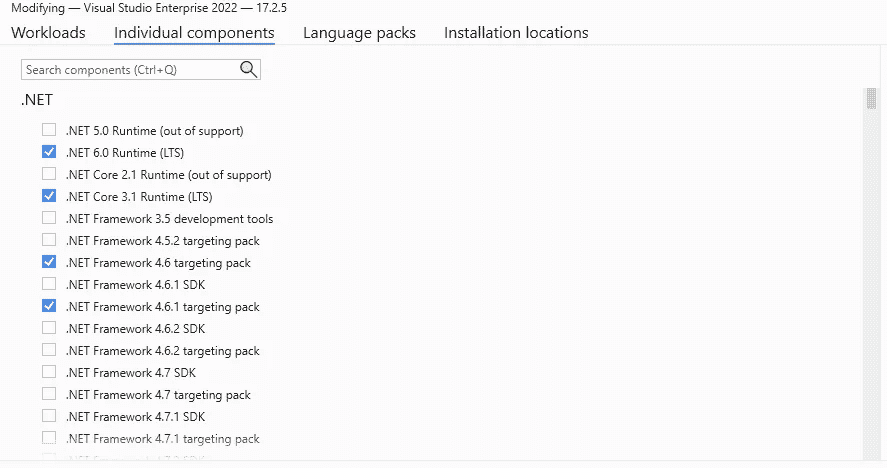

# 升级。NET Core 3.1 应用程序。网芯 6！赶快——dot net core 3.1 即将停产！

> 原文：<https://medium.com/codex/upgrade-net-core-3-1-apps-to-net-core-6-hurry-dotnet-core-3-1-eol-soon-1b44d460999?source=collection_archive---------0----------------------->

今天，我们将深入探讨如何从升级。NET 3.1 到。NET CORE 6，两者的区别，以及为什么要考虑升级。

。NET Core 3.1 将于 2022 年 12 月 13 日结束支持。在该日期之后，Microsoft 将不再为提供服务更新或技术支持。网芯 3.1。我们建议转移到。NET 6 越快越好。如果你还在用。NET Core 3.1 支持日期结束后，您需要将应用更新到。NET 6 或。NET 7 保持支持并继续接收。网络更新。( [*原文贴在这里*](https://devblogs.microsoft.com/dotnet/net-core-3-1-will-reach-end-of-support-on-december-13-2022/) )

。支持终止后，NET Core 3.1 应用程序将继续运行。他们的一切都不会改变。然而，每一个[安全补丁。NET 6](https://github.com/dotnet/core/blob/main/release-notes/6.0/cve.md) 在支持日期结束后，可能会出现一个已记录在案且未打补丁的安全漏洞。NET Core 3.1 应用程序。

您可以了解更多关于。净发布政策:

*   [。净释放量](https://github.com/dotnet/core/blob/main/releases.md)
*   [。网络发布政策](https://github.com/dotnet/core/blob/main/release-policies.md)

# 更新您的应用

如果您的应用程序使用 NET Core 3.1，我们强烈建议您将应用程序迁移到。NET 6 —支持的 LTS 版本。可以下载。从[网 6。NET 网站](https://dotnet.microsoft.com/download/dotnet/6.0)。

如果您是最终用户，我们建议联系管理您的软件的供应商，以确认是否需要软件的更新版本以及是否可用。这篇文章的其余部分适用于软件供应商和开发人员。

# 正在升级到。网络 6

*   打开项目文件(*)。csproj，*。vbproj 或*。fsproj 文件)。
*   将`<TargetFramework>netcoreapp3.1</TargetFramework>`改为`<TargetFramework>net6.0</TargetFramework>`。

您可能还想回顾一下[。NET 6 兼容性指南](https://docs.microsoft.com/dotnet/core/compatibility/6.0)。

# 更新您的开发环境

除了您交付给客户的软件之外，您用于开发的计算机可能还有。已安装 NET Core 3.1 独立安装或由 Visual Studio 安装。

您可以检查的独立安装。NET Core 3.1 从命令行。在 Windows 计算机上，打开命令提示符并转到%ProgramFiles%dotnet 文件夹。在 macOS 或 Linux 上，打开一个终端窗口。

然后键入以下命令:dot net–list-runtimes

如果您使用 Visual Studio 2019 16.11 或 17.0 或 Visual Studio 2022 17.2，则根据安装的工作负载，您可能还需要。NET Core 3.1 作为 Visual Studio 的必需组件安装，您需要了解即将到来的一些相关变化。

从 2022 年 12 月 Visual Studio 2019 16.11、Visual Studio 2019 17.0 和 Visual Studio 2022 17.2 的维护更新开始，Visual Studio 中的 NET Core 3.1 组件将更改为不支持和可选。这意味着 Visual Studio 中的工作负载可以在不安装的情况下安装。网芯 3.1。*注意*现有安装不会受到影响，任何先前安装的工作负载和组件将保持安装状态，直到在 Visual Studio 设置中取消选择该组件或工作负载。虽然您可以在 Visual Studio 中重新选择这个可选组件并重新安装它，但我们强烈建议您使用。NET 6 和 Visual Studio 2022 来构建在支持的。NET 运行时。

*注意:*如果你要将一个应用程序迁移到。NET 6，一些突破性的变化可能会影响你。我们建议您通过[兼容性检查](https://docs.microsoft.com/dotnet/core/compatibility/6.0)。

# 有用的链接

*   [。网络下载](https://dotnet.microsoft.com/download/dotnet)
*   [。网络兼容性](https://docs.microsoft.com/dotnet/core/compatibility/)
*   [。净部署](https://docs.microsoft.com/dotnet/core/deploying/)
*   [。净支持政策](https://dotnet.microsoft.com/platform/support/policy/dotnet-core)

StartupHakk 可以帮助您的公司。有了解你的业务并想成为开发人员的员工吗？嗯——在 12 周内，StartupHakk 可以帮助这些员工成为全栈开发人员。该计划还将包括额外的 4 周时间，在此期间，您的员工可以在我们的一名讲师的帮助下开始构建生产级应用程序。在 1 个季度内，他们将编写真正的代码来解决您业务中的实际问题。

# 你的下一步:

今天就注册为自己或员工创业吧！最好的开始时间就是现在！[https://www.startuphakk.com/curriculum/](https://www.startuphakk.com/curriculum/)