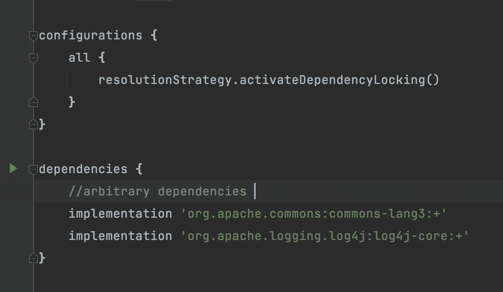
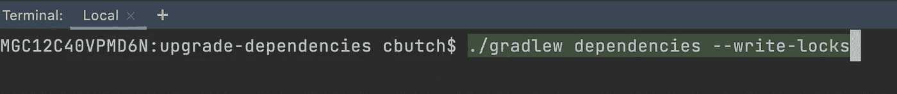
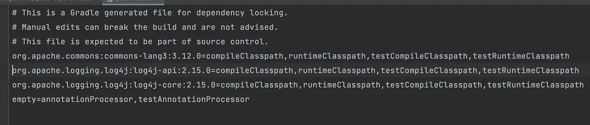
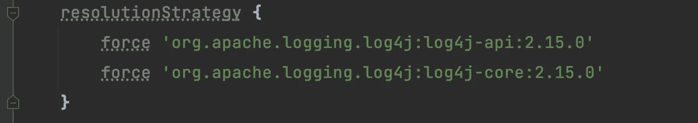

# 升级依赖关系不一定很糟糕

> 原文：<https://medium.com/codex/upgrading-dependencies-doesnt-have-to-suck-8d5b2b767d58?source=collection_archive---------2----------------------->

一个轻松、自动化的依赖性升级过程


[链接](https://www.istockphoto.com/vector/concept-of-computer-hacking-binary-code-floating-digits-and-skull-with-bones-on-gm1043114224-279236907)

针对最近的 [log4j 安全漏洞](https://www.google.com/amp/s/www.bleepingcomputer.com/news/security/new-zero-day-exploit-for-log4j-java-library-is-an-enterprise-nightmare/amp/)；我认为谈论保持依赖关系最新的过程是特别恰当的。除了(明显的)安全隐患之外，让库接近最新发布的版本还有其他好处，例如:

*   允许您利用内部优化来提高性能
*   允许您使用新功能
*   确保您有 bug 修复，以便您的软件按预期工作


有人真的喜欢让依赖关系保持最新吗？([链接](https://www.amazon.com/Sketch-Journal-Composition-Notebook-Children/dp/1719577366))

但是说实话，**保持依赖关系最新是一件痛苦的事情**。因此，我的第一个建议是通过使用托管服务(如 lambda)来减少应用程序的攻击面，并尽量减少项目中包含的库的数量。然而，无论你的应用程序设计多么简约，几乎每个组件都至少有一个包含库(你的服务必须做些什么，对吗？).因此，使这些保持最新的过程成为一个关键的(但不可否认是枯燥的)任务。本文的其余部分总结了用 Java(用 gradle)实现这一点的简单方法，并且这些概念也可以推广到其他语言。

# 履行

将此块添加到 build.gradle 的根目录，以指定您希望激活依赖项锁定

```
dependencyLocking **{** lockAllConfigurations()
**}**
```

*如果您选择*，您可以只为一个配置(如实施)指定此选项

更改您声明依赖项版本的方式，使用动态[版本控制](https://docs.gradle.org/current/userguide/dynamic_versions.html)(使用通配符)而不是在 build.gradle 中硬编码版本



就这样，你完了！

# 运行升级过程

若要重新计算(并锁定)要包含在此版本中的版本，请运行以下命令。**这将锁定每个后续构建的版本，直到该命令再次运行**

> 。/gradlew 依赖项—写锁



这创建了一个 **gradle.lockfile** (类似于 npm 中的 package-lock.json)，它“锁定”依赖项的版本。**这些版本将被使用，直到命令再次运行**，这确保您有一个确定性的构建。



生成的 gradle.lockfile 的示例

# 过程

虽然这个技术设置很酷，**但除非定期执行，否则毫无价值**。以下是我们为确保依赖性升级不会半途而废而实施的流程:

*   设置一个每夜批处理作业来升级依赖项并从中创建一个 pr(脚本包含在下面)
*   我们团队中的“轮换”成员每天早上都来检查是否有包含升级的 pr
*   如果有一个 pr 但是合并检查失败了(通常是由于编译错误),我们会在本周或下周添加一个故事来解决编译问题
*   如果 pr 通过了合并检查，那么轮换人员将依赖升级合并到主线，我们的管道将变更一直部署到*生产

```
git clone <repoNameHere>
./gradlew dependencies --write-locks
if [[ $(git status --porcelain) ]]; then
  git checkout -b "upgrade-dev-dependencies-$(date)"
  git add .
  git commit -m "auto upgrade dependencies"
  git push -u origin HEAD
  gh pr create --title "upgrade dependencies" --body "upgrade dependencies"
else
  echo dependencies are at newest version so no need for upgrades
fi
```

我们有强大的测试、监控、警报、金丝雀部署和自动回滚级别，所以我们可以将代码合并到主线中，并假设它可以工作，除非我们收到一条 slack 消息告诉我们它没有工作。

# 额外想法

## 传递依赖性

上述过程负责升级直接依赖关系，但**不负责** [**传递依赖关系**](https://docs.gradle.org/current/userguide/dependency_constraints.html) 。假设您引入了 apache commons，但是 apache commons 还没有使用 log4j 的最新版本发布。旧的(易受攻击的)log4j 依赖项仍将包含在您的应用程序中。为了强制升级可传递的依赖项，我建议在你的 build.gradle (在配置块中)中添加下面的**行**



这将强制 log4j 的所有可传递依赖项迁移到 2.15.0(补丁版本)

将这段代码合并到主线中，但是**确保有适当的功能测试、canary 部署、警报、回滚和恢复机制(如 dlqs)，**因为有可能这会导致 **NoClassDefFoundError** (如果其中一个可传递依赖项使用与 2.15.0 不兼容的 log4j 版本)。我认为让这个触发器发出警报并知道错误正在发生要比无声无息地失败好得多，因为继续使用易受攻击的版本会让您的应用程序暴露于危险之中。在这种情况下，您可以删除依赖性，要求库的维护者削减一个新的版本(升级您的代码将会很容易，因为您已经有了一个要升级的过程)，或者作为最后的手段(如果您不能删除库并且更新不立即可用)，您可以尝试使用 [WAF 规则](https://docs.aws.amazon.com/waf/latest/developerguide/waf-rules.html)来过滤传入的流量。

## 多模块构建

与大多数任务不同，跑步。/gradlew dependencies —来自父项目**的写锁不会在子项目**中运行同名的任务。为此，您可以将它包含在您的顶级 build.gradle 中

```
subprojects **{** dependencyLocking **{** lockAllConfigurations()
    **}
}** task upgradeDependencies(type: Exec) **{** List<Object> commandPartsList = new ArrayList<>()
    commandPartsList.add("./gradlew")
    getRootProject().getSubprojects().stream()
                                .map(Project::getName)
                                .forEach(projectName -> {
                                        commandPartsList.add(String.*format*("%s:dependencies", projectName))
                                        commandPartsList.add("--write-locks")
                                })
    Object[] commandParts = commandPartsList.toArray(new Object[commandPartsList.size()])
    commandLine commandParts
**}**
```

然后，您可以从项目的根目录运行该命令，以更新所有子项目中的依赖项(确保将 pr 脚本也更改为运行该命令)。使用这种方法，**子模块中不需要任何改变就可以自动升级依赖关系**。

```
./gradlew upgradeDependencies
```

# 结论

这篇文章向我们展示了，虽然升级库很无聊，但并不一定很痛苦。它详细介绍了一种自动化这一过程的简单方法(只需要在 build.gradle 中添加三行代码，并安排一个 gradle 任务运行)，这确保了强大的安全性，同时允许您的开发人员专注于增加业务价值。我们还增加了一个关于可传递依赖管理的额外部分，展示了当您等待其他团队削减您包含在项目中的库的发布时，如何减轻这些风险。最后，我们展示了如何通过注册一个定制任务来最小化代码重复，以便在所有子项目中运行这个任务。