# 设计 URL 缩写

> 原文：<https://medium.com/codex/url-shorteners-f38e87ab821f?source=collection_archive---------3----------------------->

## 让我们设计一个类似 TinyURL 的 URL 缩短服务。该服务将提供重定向到长 URL 的短别名。

类似服务: *bit.ly* 、 *goo.gl* 、 *2020.fm* 等。


# 为什么我们需要缩短网址？

URL 缩短用于为长 URL 创建较短的别名。当用户点击这些别名时，会被重定向到原始 URL。任何 URL 的较短版本在我们使用它时都会节省很多空间，例如，在打印或发布推文时，因为推文有字符限制。

例如，如果我们通过 TinyURL 缩短此页面:

[https://twitter.com/crack_faang/status/1402494889682632716](https://twitter.com/crack_faang/status/1402494889682632716)

我们会得到:

[https://tinyurl.com/mjker4pf](https://tinyurl.com/mjker4pf)

缩短后的网址几乎是实际网址的 1/3。

URL 缩短用于优化跨设备的链接，跟踪单个链接以分析受众和活动表现，隐藏相关的原始 URL 等。

# 系统的要求和目标

我们的网址缩写系统应满足以下要求:

## 功能要求:

1.给定一个 URL，我们的服务应该为它生成一个更短且唯一的别名。

2.当用户访问一个较短的 URL 时，我们的服务应该将他们重定向到原始链接。

3.用户应该可以选择为他们的 URL 选择一个自定义别名。

4.链接将在特定的时间跨度后自动过期；用户还应该能够指定到期时间。

## 非功能性需求:

1.系统应该是高度可用的。这是必需的，因为如果我们的服务关闭，所有的 URL 重定向将开始失败。

2.URL 重定向应该以最小的延迟实时发生。

3.缩短的链接不应该是可猜测的(不可预测)。

## 扩展要求:

1.分析，例如，重定向发生了多少次？

2.其他服务也应该可以通过 REST APIs 访问我们的服务。

# 容量估计和限制

我们的系统会被大量读取；与新的 URL 缩短相比，会有很多重定向请求。因此，让我们假设读写比为 100:1。

## 交通量估计

如果我们假设每月有 **1B 新网址缩短**，我们可以预期在同一时间内会有 100 倍以上的重定向。因此，我们每月将有**100 亿次重定向**。

我们系统的每秒查询数(QPS)是多少？

**每秒新的网址缩写** = `1B / (30 days * 24 hours * 3600 seconds) ~ 400 URLs/s`

**每秒 URL 重定向或 QPS** = `100 * URL shortening = 40K/s`

## 存储估计

因为我们希望 1B 每个月都有新的 URL，并保留这些对象五年，

**存储的对象总数** = `1B * 5 years * 12 months = 60B`

让我们假设我们存储的每个对象可以是 1 KB(只是一个大概，我们稍后会深入研究)；

**我们需要的总存储量** = `60B * 1KB = 60 TB`

## 带宽估计

对于写请求，由于每秒钟我们预计会有 400 个新的 URL，所以我们的服务的**总传入数据将会是=每秒 400 KB。**

对于读取请求，由于每秒钟我们期望大约 40K 的 URL 重定向，我们的**服务的总传出数据** = `40K * 1KB = 40 MB/s`

## 内存估计

如果我们想缓存一些经常被访问的热门网址，我们需要多少内存来存储它们？如果我们遵循 80–20 规则，也就是说 20%的 URL 产生 80%的流量，我们会缓存这 20%的热门 URL。我们会每天缓存 URL。

我们每天收到的阅读查询数量= `40K * 24 hours * 3600 seconds ~= 4 Billion`

为了缓存 20%的请求，我们需要的内存= `0.2 * 4 B * 1 KB ~= 800 GB`

# 高水平的估计

假设每月有 5 亿个新 URL，读写比率为 100:1，下面是我们服务的高级评估摘要:请随意使用这个 [Excel 文件](https://docs.google.com/spreadsheets/d/1MQ780cyE5UdK3w78tDa44064AkY3vS8cP-VbqrZkl7I/edit?usp=sharing)来获得特定于您系统的评估。

```
New URLs: 400/sURL redirections: 40 K/sIncoming data: 400 KB/sOutgoing data: 4 MB/sStorage for 5 years: 60 TBMemory for cache: 800 GB
```

# 系统 API

我们可以使用 SOAP 或 REST APIs 来公开服务的功能。以下可能是用于创建和删除 URL 的 API 的定义:

## URL 创建

```
createURL(api_dev_key, original_url, custom_alias = None, user_name = None, expire_date = None)
```

## 因素

**api_dev_key (string):** 注册账户的 api 开发者密钥。这将用于根据分配给用户的配额限制用户。

**original_url (string):** 要缩短的原始 url。

**custom _ alias(string):**URL 的可选自定义键。

**用户名(字符串):**编码中使用的可选用户名。

**expire_date (string):** 简称 URL 的可选截止日期。

## 返回(字符串)

成功插入会返回缩短的 URL。否则，它会返回一个错误代码。

## URL 删除

`deleteURL(api_dev_key, url_key)`

其中“url_key”是表示要检索的缩短 url 的字符串，成功的删除将返回“URL Removed”。

## 我们如何发现和防止虐待？​

例如，任何服务都可能通过消耗当前设计中的所有密钥而使我们破产。因此，为了防止误用，我们可以通过用户的 api_dev_key 来限制他们在特定时间可以创建或访问多少 URL。

# 数据库设计

关于我们将要存储的数据的性质的一些观察:

1.我们需要存储数十亿条记录。

2.我们要存储的每个对象都很小(1K 左右)。

3.记录之间没有关系，除非我们想保留哪个用户创建了哪个 URL。

4.我们的服务阅读量很大。

## 数据库模式

我们需要两个表，一个用于存储关于 URL 映射的信息，另一个用于存储用户数据。

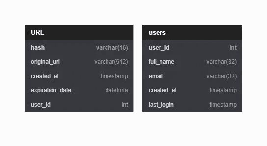

我们应该使用什么样的数据库？

因为我们预期存储数十亿行，并且我们不需要使用对象之间的关系——像 DynamoDB、Cassandra 或 Riak 这样的 NoSQL 商店是更好的选择。NoSQL 的选择也更容易扩展。

# 散列算法

我们在这里解决的问题是为给定的 URL 生成一个简短且唯一的密钥。在上面提到的例子中，我们得到的缩短后的 URL 是:“【https://tinyurl.com/mjker4pf】T2，这个 URL 的最后六个字符就是我们要生成的短键。我们将在此探讨两种解决方案:

# 1.编码实际 URL

我们可以计算一个唯一的散列(例如，MD5 或 SHA256 等。)的链接。然后可以对散列进行编码以供显示。这种编码可以是 base36 ([az，0–9])或 base62 ([az，AZ，0–9])，如果我们加上'+'和'/，'就可以使用 base64 编码。

短键的长度应该是多少？6、8 或 10 个字符？

*   使用 base64 编码，一个六个字母长的密钥将产生 64⁶~ = 687 亿个可能的字符串。
*   使用 base64 编码，一个八个字母长的密钥将产生 64⁸ ~= 281 万亿个可能的字符串。

我们需要在 5 年内生成的唯一 URL 哈希总数将是 1B * 12 个月* 5 年= 60 B。对于 687 亿个唯一哈希，让我们假设对于我们的系统，**六个字母的密钥就足够了**。

## 我们的解决方案有哪些不同的问题？​

首先，我们的编码方案存在以下几个问题:

1.如果多个用户输入同一个网址，可以得到相同的缩短网址，这是不可接受的。

2.如果 URL 的一部分是 URL 编码的呢？

例如[https://twitter.com/crackfang/status/1402494889682632716](https://twitter.com/crackfang/status/1402494889682632716)和[https://Twitter . com/crack Fang % 2f status % 2f 1402494889682632716](https://twitter.com/crackfang/status/1402494889682632716)除了网址编码完全相同。

## 这些问题的解决方法

1.  如果通过编码 URL 生成散列由于重复而失败，我们可以将用户 id(应该是惟一的)附加到输入 URL，使其惟一并生成散列。但是，如果用户没有登录，我们可以要求用户选择一个唯一的密钥。即使在这之后，如果我们有冲突，我们必须继续生成一个密钥，直到我们得到一个唯一的。
2.  我们可以在生成哈希之前对所有 URL 进行 URL 解码，因为 URL 解码是一个[等幂操作](https://en.wikipedia.org/wiki/Idempotence)。

# 缩短 URL 的请求流

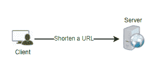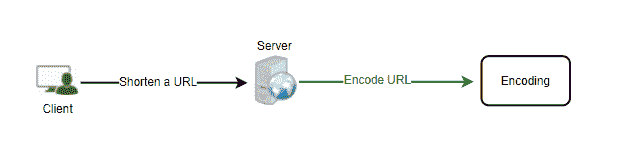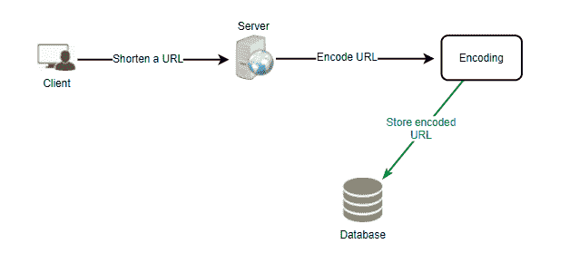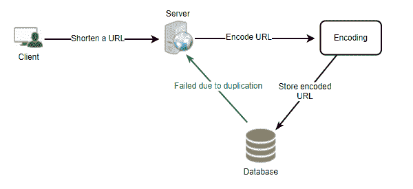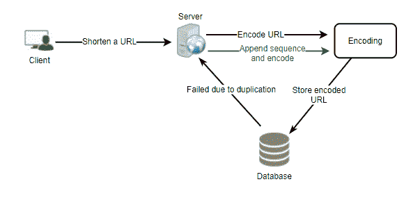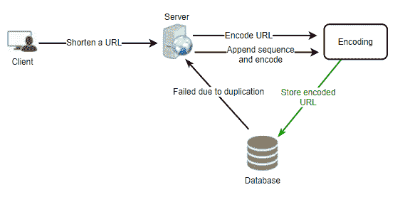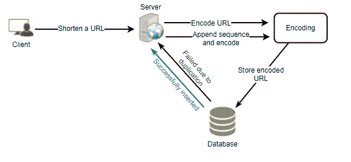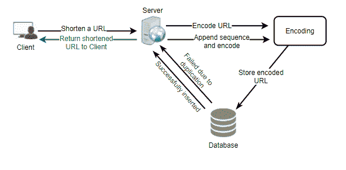

# 2.离线生成密钥

我们可以有一个独立的**密钥生成服务(KGS)** ，它预先生成随机的六个字母的字符串，并将它们存储在一个数据库中(姑且称之为 key-DB)。然后，每当我们想要缩短一个 URL，我们将只取一个已经生成的键并使用它。这种方法将使事情变得非常简单和快速，因为我们将不会编码的网址或担心重复或冲突。此外，KGS 将确保 key-DB 中插入的所有密钥都是唯一的。

## 并发会导致问题吗？​

密钥一旦被使用，就应该在数据库中进行标记，并且永远不要再次使用。但是，如果多个服务器同时读取密钥，我们可能会遇到两个或更多服务器试图从数据库中读取同一个密钥的情况。如何解决这个并发问题？

kg 可以使用两个表来存储密钥，一个表存储尚未使用的密钥，另一个表存储所有已使用的密钥。因此，只要 KGS 将密钥提供给其中一个服务器，它就可以将它们移动到 used keys 表中。

KGS 总是可以在内存中保存一些密钥，这样每当服务器需要它们时，它就可以快速地提供它们。为了简单起见，只要 KGS 在内存中加载一些键，它就可以将它们移动到 used keys 表中。这样，我们可以确保每台服务器都获得唯一的密钥。

如果 KGS 在将所有加载的密钥分配给某个服务器之前就死了，我们将会浪费这些密钥，我们可以忽略这些，因为我们有相当多的密钥。

KGS 还必须确保不向多个服务器提供相同的密钥。为此，在从数据结构中取出密钥并将其交给服务器之前，它必须同步保存密钥的数据结构(或获得一个锁)。

## 关键数据库的大小是多少？​

使用 base64 编码，我们可以生成 68.7B 唯一的六个字母的密钥。因此，如果我们需要一个字节来存储一个字母数字字符，我们可以在 6(每个键的字符数)* 60B(唯一键)=> 360 GB 中存储所有这些键。

## KGS 不是单点故障吗？​

是的，它是。为了解决这个问题，我们可以有一个 KGS 的备用副本，只要主服务器死亡，它就可以接管生成和提供密钥。

## 每个应用服务器可以缓存 key-DB 中的一些密钥吗？​

是的，这肯定能加快速度。

虽然在这种情况下，如果应用服务器在使用完所有密钥之前就死掉了，我们最终会丢失这些密钥。这是可以接受的，因为我们有 68B 个独特的六字母键。

## 我们如何执行键查找？​

我们可以在我们的数据库中查找关键字来获得完整的 URL。

如果存在，向浏览器返回一个“HTTP 302 Redirect”状态，将存储的 URL 传递到请求的“Location”字段中。

如果我们系统中不存在该密钥，则发出“HTTP 404 Not Found”状态，或者将用户重定向回主页。

## 我们应该限制自定义别名的大小吗？​

由于我们的服务支持自定义别名，用户可以选择他们喜欢的任何“密钥”，但提供自定义别名不是强制性的。

但是，对自定义别名施加大小限制以获得一致的 URL 数据库是合理的(通常也是可取的)。例如，假设用户可以指定最多 16 个字符长的客户密钥(如上面的数据库模式所示)。

# URL 缩短的高级系统设计

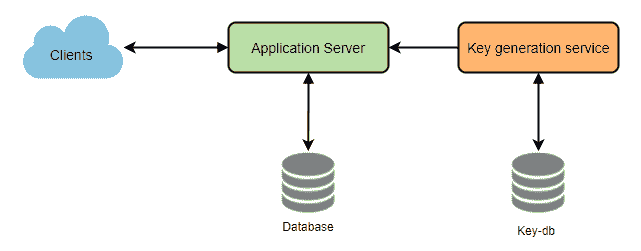

# 数据划分

为了扩展我们的数据库，我们需要对它进行分区，以存储数十亿个 URL 的信息。因此，我们需要开发一个分区方案，将我们的数据划分并存储到不同的数据库服务器上。

## 基于范围的划分

我们可以根据 URL 的首字母或散列键将 URL 存储在单独的分区中。因此，我们将所有以字母“A”开头的 URL 保存在一个分区中，将那些以字母“B”开头的 URL 保存在另一个分区中，依此类推。这种方法称为基于范围的分区。我们甚至可以将特定的不经常出现的字母组合到一个数据库分区中。我们应该静态地提出这种分区方案，以便总是可预测地存储/查找文件。

这种方法的主要问题是，例如，它会导致服务器不平衡；如果我们决定将所有以字母“E”开头的 URL 放入一个 DB 分区，但后来我们意识到我们有太多以字母“E”开头的 URL，我们无法将它们放入一个 DB 分区。

## 基于散列的分区

在这个方案中，我们获取存储对象的散列，并基于这个散列，我们计算出这个对象应该去的 DB 分区。在我们的例子中，我们可以使用“键”的散列或实际的 URL 来确定存储文件的分区。我们的哈希函数会将 URL 随机分配到不同的分区，例如，我们的哈希函数总是可以将任何键映射到[1…256]之间的数字。这个数字代表存储对象的分区。

这种方法仍然会导致分区过载，这可以使用一致哈希来解决。

# 隐藏物

我们可以缓存经常访问的 URL。我们可以使用一些现成的解决方案，如 Memcache，它可以存储完整的 URL 及其各自的哈希。在访问后端存储之前，应用服务器可以快速检查缓存是否有所需的 URL。

## 我们应该有多少个缓存？​

我们可以从 20%的日流量开始，并且我们可以根据客户的使用模式来调整我们需要多少缓存服务器。根据上面的估计，我们需要 600GB 的内存来缓存 20%的日常流量。由于现代服务器可以有 256GB 的内存，我们可以很容易地将所有的缓存放入三台机器中，或者使用一些较小的服务器来存储所有这些热门 URL。

## 哪种缓存回收策略最符合我们的需求？​

当缓存满了，我们想用一个更新/更热的 URL 替换一个链接，我们该如何选择？**最近最少使用(LRU)** 可以是我们系统的合理策略。根据此策略，我们首先丢弃最近最少使用的 URL。然后，我们可以使用一个[链接的散列图](https://docs.oracle.com/javase/7/docs/api/java/util/LinkedHashMap.html)或类似的数据结构来存储我们的 URL 和散列，跟踪最近访问了哪些 URL。

为了进一步提高效率，我们可以复制我们的缓存服务器，以便在它们之间分配负载。

## 如何更新每个缓存副本？​

无论何时出现缓存缺失，我们的服务器都会命中后端数据库。相反，每当发生这种情况时，我们可以更新缓存并将新条目传递给所有缓存副本。每个副本可以通过添加新条目来更新其缓存。如果副本已经有了那个条目，它可以简单地忽略它。

# 访问缩短的 URL 的请求流

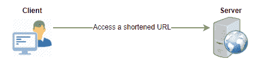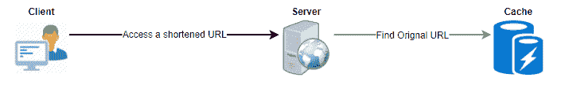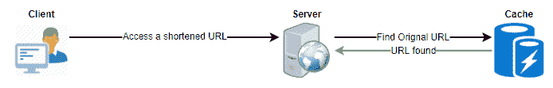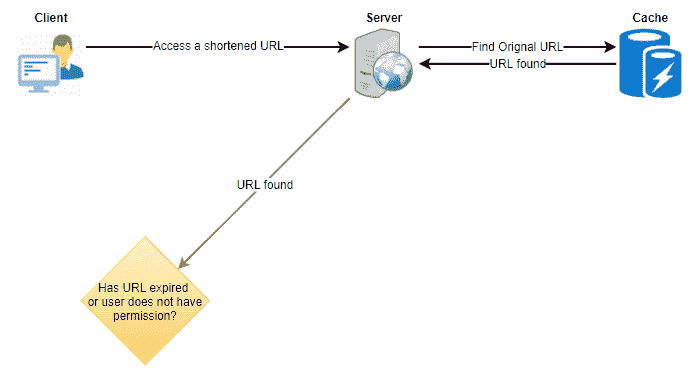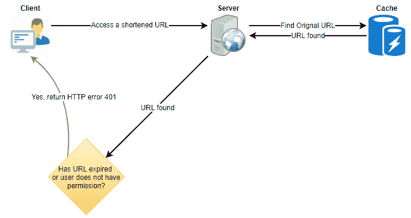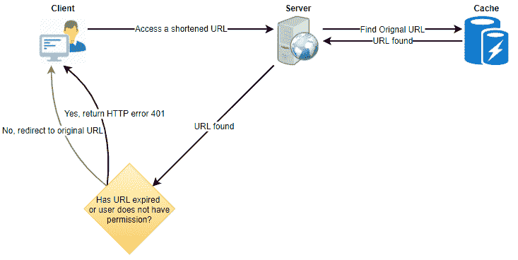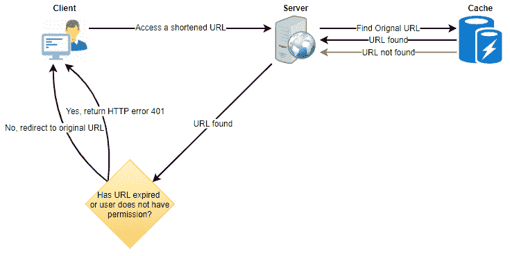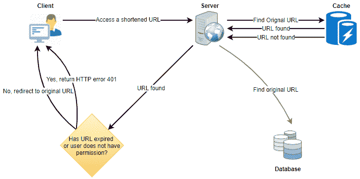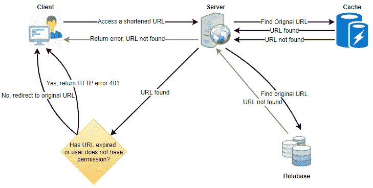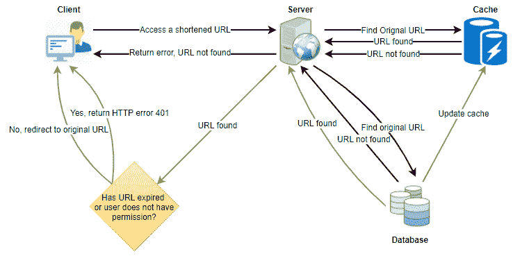

# 负载平衡器(磅)

我们可以在系统的三个位置添加负载平衡层:

1.客户端和应用服务器之间

2.在应用服务器和数据库服务器之间

3.在应用服务器和缓存服务器之间

最初，可以采用简单的循环法；它将传入的请求平均分配给后端服务器。这种 LB 实现起来很简单，不会引入任何开销。这种方法的另一个好处是，如果一个服务器死了，LB 将把它从轮换中去掉，并停止发送任何流量。循环 LB 的一个问题是，它不考虑服务器负载。如果一个服务器过载或运行缓慢，LB 不会停止向该服务器发送新的请求。为了处理这个问题，可以放置一个更智能的 LB 解决方案，定期查询后端服务器的负载，并根据负载调整流量。

# 清除或数据库清理

条目应该永远保留，还是应该被清除？如果达到用户指定的过期时间，链接会发生什么情况？

如果我们选择不断搜索过期链接来删除它们，这将给我们的数据库带来很大压力。

相反，我们可以慢慢地删除过期的链接，做一个懒惰的清理。我们的服务将确保只有过期的链接将被删除，虽然一些过期的链接可以生存更长时间，但永远不会返回给用户。

*   每当用户试图访问过期的链接时，我们可以删除该链接并向用户返回一个错误。
*   单独的清理服务可以定期运行，从我们的存储和缓存中删除过期的链接。该服务应该是非常轻量级的，并且被安排为仅在预期用户流量较少时运行。
*   我们可以为每个链接设置一个默认的到期时间(例如，两年)。
*   删除过期的链接后，我们可以将密钥放回 key-DB 中以供重用。

# URL 缩短的组件设计

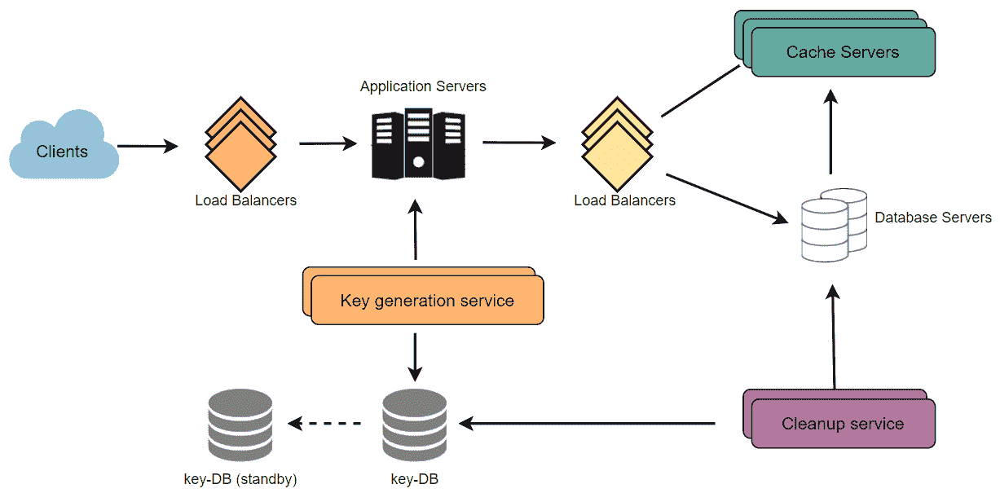

# 遥感勘测

短网址用了多少次？什么是用户位置，等等。？我们可以统计访问者的国家、访问的日期和时间、涉及点击的网页、浏览器或访问网页的平台等等。我们如何存储这些统计数据？如果它是在每个视图中更新的 DB 行的一部分，那么当一个流行的 URL 被许多并发请求包围时会发生什么呢？

# 安全性和权限

用户可以创建私有 URL 或允许特定的一组用户访问 URL 吗？我们可以在数据库中存储每个 URL 的权限级别(公共/私有)。我们还可以创建一个单独的表来存储有权查看特定 URL 的用户 id。假设我们将数据存储在像 Cassandra 这样的 NoSQL 宽列数据库中，存储权限的表的键将是“Hash”(或 KGS 生成的“key”)，列将存储那些有权查看 URL 的用户的 UserIDs。如果用户没有权限并试图访问一个 URL，我们可以发回一个错误(HTTP 401)。