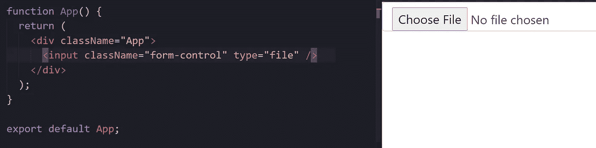
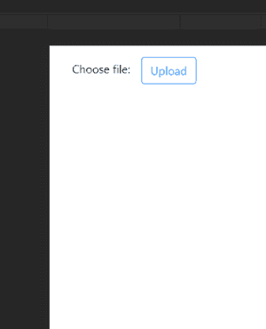
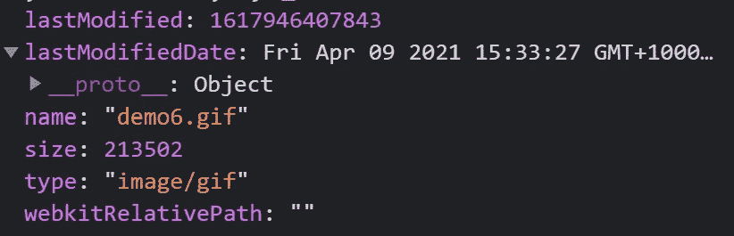

# 使用一个按钮在 React 应用程序上上传文件(带引导程序)

> 原文：<https://medium.com/codex/use-a-button-to-upload-files-on-your-react-app-with-bootstrap-ef963cbe8280?source=collection_archive---------2----------------------->


图片由 [IO-Images](https://pixabay.com/users/io-images-1096650/?utm_source=link-attribution&utm_medium=referral&utm_campaign=image&utm_content=1118929) 来自 [Pixabay](https://pixabay.com/?utm_source=link-attribution&utm_medium=referral&utm_campaign=image&utm_content=1118929)

如果您在这里，您可能在定制 input[type=file]标签以匹配您的设计时遇到了问题。如果是按钮就简单多了。

在本教程中，我们将只关注这一点。特别是这个，是使用 bootstrap 完成的，所以在本教程的其余部分，我将假设您已经安装了 bootstrap。



这就是你现在可能所处的位置，任何定制输入标签的尝试都会改变标签，但不会改变“选择文件”按钮。此外，按钮的显示取决于你在什么浏览器中打开它，这是很麻烦的，如果你想要一个一致的设计。

先说显示器。我们可以隐藏输入字段并添加一个按钮。使用 bootstrap，我们可以将“d-none”添加到输入标签的类名中。

> N 注意这也将删除上传后显示文件名的标签。在本教程的最后，我将向您展示如何显示文件名。

运行这段代码应该会给出我们所追求的外观和感觉。


我还添加了一个标签，让这个按钮的用途更加明显。现在我们已经用按钮替换了输入字段，让我们把功能也转移过来。你可以用两种方法做到这一点，我将在下面展示，你可以选择你喜欢的方法。

1.使用 ref
使用 useRef 钩子创建一个 ref，inputRef，并将其插入输入字段的 ref 属性。然后，我们可以在用户点击按钮时触发输入字段的点击功能。

2.使用 id 属性
我们首先将 id 属性添加到输入字段，然后在组件呈现时调用 document.getElementbyId 来访问输入字段。然后，当我们使用按钮的 onClick 方法单击按钮时，我们可以调用输入字段的 click 方法。

使用 ref 是更简单的方法，但是有时您可能更喜欢使用 id 属性。无论您现在决定使用哪种方法，您都应该能够将文件上传到 React 应用程序中。


我们现在唯一的问题是，我们没有从应用程序反馈文件已上传。以前，我们有一个显示文件名的标签，但我们删除了它。

修复这个问题很容易，因为与我们刚刚上传的文件相关的所有信息现在都位于我们之前创建的 ref 对象(inputRef/inputFile)中。这让我们可以让上传按钮更加定制化。

> 假设用户上传文件后，客户端希望按钮变成绿色，并在按钮内显示一条成功消息(或者更好，显示文件名)。

为了实现这个功能，我们将创建一个状态变量 uploadedFileName，它最初被设置为 null。使用输入字段的 onChange 属性，我们可以在每次上传时将状态设置为文件名。然后，我们可以从 inputRef.current 中的 files 数组(files[0],因为我们上传的是单个文件)访问文件名。最后，我们可以在按钮的 className 属性中应用相同的语法，在用户上传文件后将其颜色改为绿色。

如果您以前实现了 id 方法，唯一的区别是您如何访问 files 数组，您可以直接从 inputFile 中获得该数组，因此您的 handleDisplayFileName 函数将如下所示:

```
// UploadButtonByID.tsx
const handleDisplayFileDetails = () => { inputFile?.files && setUploadedFileName(inputFile.files[0].name);};
```

如果你遵循一切，我们有一个完美的工作可定制的上传文件按钮。你可以在 GitHub 链接这里找到所有代码= >[https://GitHub . com/shrestha price/reactdemuploadfilebtn . git](https://github.com/shresthaprince/reactdemouploadfilebtn.git)。



最终产品🎉

除了“名称”之外，files 数组还保存文件的其他信息，这对其他用例很有用。例如，如果我们想要设置用户可以上传的文件大小的限制，我们可以使用 size 属性。根据用户上传的文件类型，我们可以使用 type 属性在按钮旁边显示图标。

# 📷image.png//🗎文档. docx



文件属性