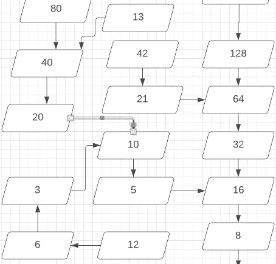

# Java 内部类的用例

> 原文：<https://medium.com/codex/use-cases-for-inner-classes-in-java-18d4e25e2e0e?source=collection_archive---------5----------------------->

卢多维克·沙雷特在 [Unsplash](https://unsplash.com?utm_source=medium&utm_medium=referral) 上的照片

在链表中，每个节点与列表中的其他节点都有明显且可预测的关系。链表的节点可以实现为嵌套在链表类中的私有类的实例。

正如我们在[我的关于嵌套静态类的文章](https://alonso-delarte.medium.com/a-couple-of-use-cases-for-nested-static-classes-in-java-8a115dbcaacf)中看到的，链表的节点不需要知道任何封闭链表类的知识，所以它们可以被声明为静态的。

现在让我们考虑一个更复杂的数据结构，比如部分计算的树或图，它需要访问封闭类。每个节点都有到其他节点的连接，但是程序并不试图一次识别所有的节点连接。

比方说，你正在做一个家谱程序。您希望您的程序能够找到系谱树之间的联系，如果联系得到确认，就将它们合并成一棵单独的树。

一种可以实现的方法是，将分离的家族树作为它们自己的分离结构，但也保留出现在任何家族树中的每个人的地图。

那么 person 节点的内部类需要能够查询封闭类的实例所知道的所有 person 的映射。

然而，对于本文的目的来说，家谱示例有点太复杂了。所以我将选择更简单的东西:一棵 Collatz 树，来帮助我们理解一个著名的未解决的数学问题，Collatz 猜想，或 3 *x* + 1 问题。

柯拉茨猜想很容易描述，但很难证明或反驳。这个猜想与 Collatz 函数有关。挑选一个整数 *n* ，任何整数。如果 *n* 是偶数，则减半；如果 *n* 是奇数，则乘以 3 加 1。重复结果。

比如 *n* = 20。一半是 10，一半是 5。由于 5 是奇数，我们将它乘以 3 得到 15，加上 1 得到 16，这导致了几个连续的减半步骤。然后，序列是 20，10，5，16，8，4，2，1，4，2，1，4，2，1，4，2，1，其中“4，2，1”部分无休止地重复。

Collatz 猜想说，如果 *n* 为正，那么迭代 Collatz 函数最终总会得到 1。这个猜想要么是真的，要么是假的，但是没有人能够以这样或那样的方式证明它。

如果该猜想为真，这将意味着所有正整数在一个 Collatz 树或图中彼此相连(我不确定这两个术语在技术上是否正确，但你明白我的意思)。

我希望能够以某种方式将它形象化。所以我用 LucidChart 做了一个图表。

Collatz 函数的一些迭代图。图表制作于 LucidChart。

LucidChart 非常容易使用，但是用这种方式制作一个 Collatz 树仍然是一个非常耗时的过程。如果我们想使用不同的函数来连接整数，比如 5 *n* + 1 而不是 3 *n* + 1，该怎么办？

我想一个程序，采取这样的功能，并生成相应的树或图形。实际上，我用 Scala 写了一个类。它可以用 Java 来完成，只是和 Scala 相比有点笨重。

这是封闭类的草图，带有内部类的占位符:

所以`IntegerGraph`构造函数接收的在 Scala 中只是一个`Int`到`Int`的函数。

这个想法是，每个`IntegerNode`实例将跟踪到目前为止已经发现的它的前兆。当查询一个号码的后继者时，该节点将确保连接到该后继者的节点，无论该后继者节点已经存在还是必须重新创建。

为了建立这种联系，`IntegerNode`实例需要知道关于封闭`IntegerGraph`实例的两件事:提供给封闭类构造函数的整数到整数函数是什么，以及后续节点对于封闭实例是否已知。

考虑到这些需求，将下面的类嵌套到`IntegerGraph`中靠近末尾的 To Do 注释所指示的地方。

因为显然需要比较节点，所以我们需要提供一个`equals()`覆盖。当我们覆盖`equals()`时，我们也应该覆盖`hashCode()`，以便满足这两个函数如何相互关联的期望(或“契约”)。

其工作方式应该是，调用者将调用`scan()`来发现由特定整数范围指定的图的一部分，并且在迭代上会有一些限制(这对于 Collatz 函数来说通常是不必要的)。

例如，考虑经典的 Collatz 函数“扫描”1 到 10。程序是这样发现循环 1，4，2 的:为 1 做一个节点，然后 *f* (1) = 4 使程序从 1 的节点连接出一个 4 的节点，由于 *f* (4) = 2，从 4 的节点连接出一个 2 的节点。并且 *f* (2) = 1，但是 1 的节点已经存在，所以程序可以继续扫描下一个数字。

下一个数字是 2，但它已经有了一个节点，所以程序转到 3，这导致了按顺序 3，10，5，16，8 创建节点，最后一个连接到 4 的现有节点。

然后，在扫描之后，类似于`path(3, 1)`的查询将导致遍历节点，传递包装在`Optional`中的列表 3，10，5，16，8，4，2，1。

这里的主要收获是，一旦我们编写了测试，并且从失败到通过每个测试，我们将有一个节点的内部类，它与封闭类一起检查是否存在要连接的节点。

我认为如果你感兴趣的话，你可以想出如何将它应用到家谱用例中。