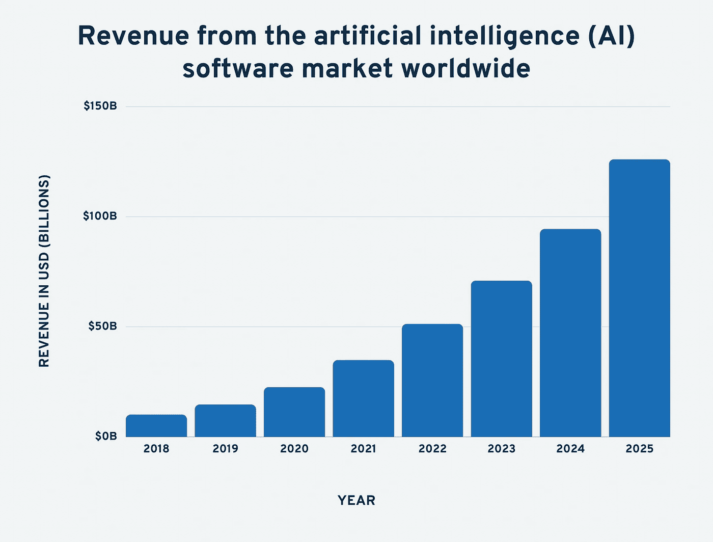
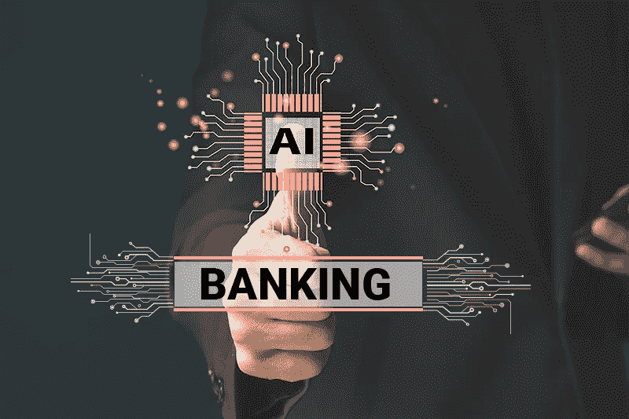
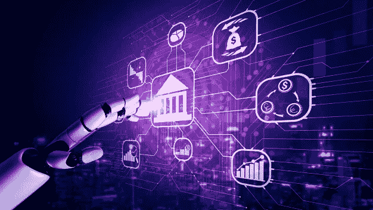

# 银行业中人工智能(AI)的使用案例:市场统计和优势

> 原文：<https://medium.com/codex/use-cases-of-artificial-intelligence-ai-in-banking-market-stats-and-benefits-8454d8474544?source=collection_archive---------14----------------------->

尽管新冠肺炎经济受到负面影响，银行业仍是增长的行业之一。与以前相比，银行业正在通过实施尖端技术，特别是人工智能的使用，来适应世界的新现实。

众所周知，人工智能是 21 世纪最令人兴奋(也最具争议)的技术趋势之一。

# 顶级人工智能统计(编辑推荐)

1.  截至 2022 年，全球人工智能市场价值超过**1360 亿美元**。
2.  人工智能产业价值预计将在未来 8 年内增长**13 倍**。
3.  预计到 2026 年，美国人工智能市场将达到 299.64 亿美元。
4.  从 2022 年到 2030 年，人工智能市场将以 38.1%的 CAGR 增长。
5.  到 2025 年，多达 9700 万人将在人工智能领域工作。
6.  人工智能市场规模预计将同比增长至少 **120%** 。
7.  83%的公司声称人工智能是他们商业计划的重中之重。
8.  网飞每年从自动个性化推荐中赚取 10 亿美元。

来源-开发主题

> **亦读-热门趋势** [**人工智能在金融行业的用例**](https://www.quytech.com/blog/artificial-intelligence-in-finance-industry/)

人工智能有潜力克服许多传统银行业的困难。但是怎么做呢？

让我们来了解一下！

在这篇博客中，我们将讨论你需要知道的关于银行业人工智能的一切。我们还将讨论 AI 在银行业的优势和使用案例！

所以，不占用你太多时间，让我们快速开始，

**主要市场数据！**

1.  根据麦肯锡的研究，人工智能技术可能会使全球银行业的价值每年增加 1 万亿美元。通过定制服务和降低成本来提高内部运营效率，银行和金融的定制人工智能解决方案也可以帮助增加收入。

2.根据《福布斯》的数据，每三名金融服务工作者中就有一人预计人工智能将使他们公司的年收入至少增加 20%。

正如你所看到的，关键的市场统计表明了人工智能应用程序开发服务对于银行和金融行业的潜力。

现在，让我们继续讨论这个博客的主要组成部分，

# AI 在银行业的顶级好处！

为银行业使用定制人工智能解决方案的主要优势是:-

# #1.工作量较小

通过全天候可用，人工智能助理和聊天机器人可以减轻银行及其员工的人工工作量。客户可以使用聊天机器人来帮助他们完成基本的银行任务，包括开立或关闭账户、转账和投资开户等。

# #2.加强数据安全性

在银行和金融行业使用智能人工智能解决方案可以减少欺诈，同时提高准确性和安全性，并在潜在的欺诈活动发生之前发现它们。特别是对于远程操作，银行可以利用人工智能和人工智能来验证客户的身份，并提高识别过程的准确性。随着在线活动数量的增加，银行业必须依靠技术来确保数据的准确性并降低欺诈的风险。

# #3.更好的客户体验

通过利用大数据和人工智能，银行和金融服务企业将能够更好地理解他们的消费者。这使他们能够从以客户为中心的方法转变为以产品为中心的方法，通过量身定制的服务改进他们的产品。提供由人工智能驱动的按需、自动协助、聊天机器人和虚拟助理也可以改善客户体验。此外，过去需要几周时间处理的贷款申请，现在只需几天就可以完成。人工智能能够根据各种信用因素进行公正的分析。

# #4.风险管理

通过精确的报告，这些技术降低了客户和银行的风险。向客户提供信贷后，可以使用交易历史来生成预测。银行员工对信用风险分析有更多的了解。早期错误识别和对潜在未来风险的了解有助于银行部门提前规划的能力。

# #5.提高运营效率

通过处理大量数据并提高数学计算的精度和速度，人工智能算法可以帮助银行简化运营。例如，通过检查历史数据，银行可以快速识别最佳交易以降低初始保证金。他们确实可以利用获得的知识来测试评估风险模型的模型，并改善资本优化。

你已经看到了人工智能在银行业的好处，现在让我们来看看，

> **亦读-** [**如何创建一个类似 Replika**](https://www.quytech.com/blog/create-ai-based-chatbot-app-like-replika/) **的基于 AI 的聊天机器人 App？**

# 人工智能在银行业的主要使用案例

人工智能在银行业的主要使用案例包括:

# #1.Robi 顾问

机器人顾问不仅是传统金融顾问的廉价替代品，而且还可以帮助大量消费者接受金融咨询，做出更好的金融决策。此外，数据驱动的人工智能机器人顾问可以为投资者提供关于遗产规划、退休和其他主题的建议，这可以使开户过程更具吸引力。

# #2.评估信用报告

为了评估客户的完整财务状况，人工智能被用于审查投资、现金和信用账户。由于人工智能根据任何新的客户数据生成量身定制的建议，它可以帮助银行跟上实时变化。

银行机构现在可以处理比过去多得多的客户信息。为了确定客户是否有资格获得他们所要求的商品或服务，需要对这些数据进行审查和评估。

# #3.人工智能聊天机器人

聊天机器人和数字个人助理改变了客户服务和沟通的方式。为了给客户提供高度定制的体验，聊天机器人已经被开发出来。人工智能在银行业的使用有可能彻底改变客户访问银行产品和服务的方式。

随着 AI 的提升，银行业的**聊天机器人越来越精准实用。被称为聊天机器人的人工智能软件应用程序通过文本和语音与用户交流。随着机器学习、深度学习和自然语言处理的使用，聊天机器人的操作能力得到了提高。以人工智能集成为基础，聊天机器人可以利用上下文感知来提供适当的建议，并对客户的询问做出明智的回应。**

# **#4.基于人工智能的移动银行应用**

**人工智能技术主要被银行用来改善和定制客户体验。**

**z 世代经常使用移动银行。这表明由人工智能支持的银行应用程序可以提供上下文相关、量身定制和预测性的服务，以满足年轻人的客户期望。基于人工智能的移动银行应用程序可以监控用户活动，并提供关于支付和金融事务的个性化建议和见解。**

# **#5.欺诈防范**

**欺诈一直是银行业的一个问题。然而，信用卡发行商正在使用人工智能将预测分析纳入其反欺诈工作流程，从而大幅降低误报结果。**

****

**由人工智能支持的分析解决方案通过观察和学习用户行为模式来收集和分析数据。然后进行这项工作，以确定欺诈企图和事件的罕见性和任何迹象。**

# **#6.量化交易**

**使用大数据集来识别可用于进行战略交易的模式被称为量化交易。通过使用人工智能解决方案，银行机构可以更快、更有效地评估任何数量的复杂数据集。通过自动化交易，这种算法交易方法可以帮助服务提供商节省宝贵的时间和资源。**

> ****亦读-** [**人工智能驱动的 CRM 系统如何帮助企业增加销售额**](https://www.quytech.com/blog/ai-solution-in-crm-why-businesses-need-it/) ？**

# **结论**

**随着我们进入一个全新的数字时代， [**人工智能在银行业的潜力**](https://www.quytech.com/blog/ai-and-machine-learning-in-fintech/) 仍在不断发展。基于人工智能的创新给了银行业巨大的杠杆作用。因此，银行和其他金融机构越来越多地为客户提供优质的金融服务。**

**为了利用人工智能为银行业和许多其他部门创建门户网站、移动应用程序和 web 应用程序，请联系一家顶级的 [**人工智能开发公司**](https://www.quytech.com/ai-development-company.php) 。**