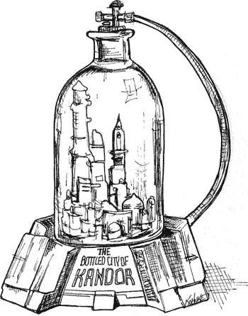
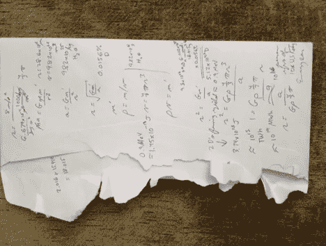
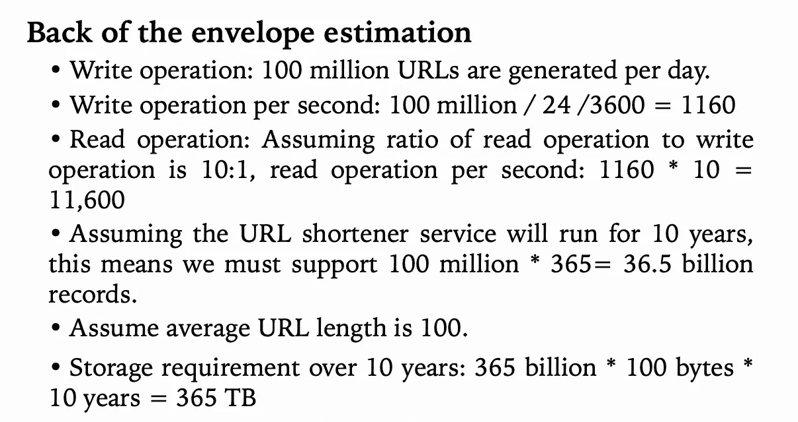
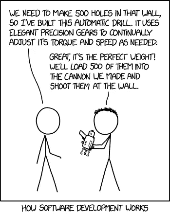
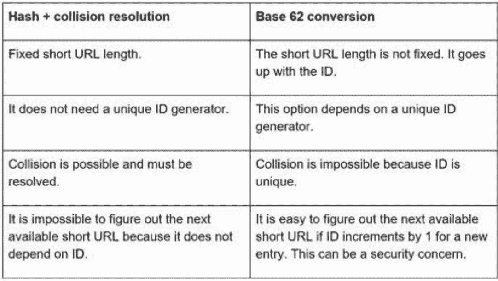
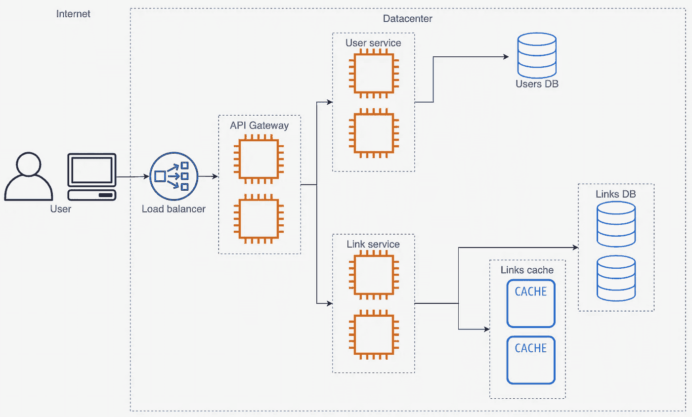

# 使用干净的代码通过你的系统设计面试

> 原文：<https://medium.com/codex/use-clean-code-to-pass-your-system-design-interview-65c57b9bdc94?source=collection_archive---------9----------------------->

对于本周关于*干净代码*的博客，我将做一些稍微不同的事情。虽然到目前为止，我们已经讨论了保持程序代码整洁的方法，但是我们应该花一些时间来思考如何将我们的程序扩展为可伸缩的系统。就像我们的程序一样，我们的系统需要遵循一套标准来促进我们快速有效地编写软件的能力。虽然我们提出的问题和我们发现的解决方案在这个更高层次的[抽象](https://www.springboottutorial.com/software-design-what-is-abstraction)上略有不同，但是我们可以遵循一套指导方针来逐步构建更复杂的软件工件。

虽然这一章*干净代码*充满了关于设计干净系统的有用信息，但为了这篇博客的目的，我不会对以下主题进行过多的详细描述:主分离(关注点分离的子集)[工厂](https://www.oodesign.com/factory-pattern.html)、[依赖注入](https://www.freecodecamp.org/news/a-quick-intro-to-dependency-injection-what-it-is-and-when-to-use-it-7578c84fa88f/)、[领域特定语言](https://martinfowler.com/books/dsl.html)以及 [Christopher Alexander](http://www.patternlanguage.com/ca/ca.html) 的惊人工作(真诚地说，如果你对系统设计很认真，我会强烈推荐你这是我读过的关于如何设计和构建内聚系统的最好的书之一。尽管如此，你还是应该花些时间来学习更多关于这些主题的知识。对于系统设计面试和保持代码整洁的一般知识来说，这些都是非常重要的。

在这篇博客中，我将会大量引用 Alex Xu 的实用书籍*。在这篇文章中，徐介绍了解决系统设计问题的一般方法以及常见的系统设计面试问题。虽然关于系统的*干净代码*一章邀请我们设计一个城市，但为了这篇博文的目的，我们将设计一个 URL 缩写器，如 [Bitly](https://bitly.com/) 或 [tinyurl](https://tinyurl.com/app) 。*

**

*无论何时我们设计一个系统，我们都希望遵循一个通用的指导方针来保持我们的答案集中*和*灵活。重要的是要记住，系统设计面试没有*正确答案*。面试官不想知道你是否已经记住了如何设计谷歌软件架构的教科书答案。相反，他们希望看到你根据系统的需求进行推理，提出明智的问题，处理不明确的地方，等等。与面试官合作也很重要，倾听他们关于系统应该能够控制什么的提示，并接受他们的建议。把它想象成一个微型的结对编程练习。这些系统设计的一般步骤应该有助于我们走上正确的道路:*

1.  *了解问题并确定设计范围*
2.  *提出概要设计*
3.  *设计深度潜水*
4.  *包裹*

*既然知道了系统设计面试的流程，那就开始吧！*

## *了解问题并确定设计范围*

*有许多不同的方法来设计一个网址缩写。通过询问相关的、自以为是的问题，我们确定了我们希望我们的系统如何运行，作为被采访者，这最终取决于你。对于网址缩写者，一些好的开场白问题可能如下:*

*   *服务的流量是多少？*
*   *缩短后的网址有多长？*
*   *缩短的 URL 中可以包含哪些字符？*
*   *可以删除或更新缩短的网址吗？*

*出于本练习的目的，让我们假设我们的 URL shortener 服务接受一个长 URL，并创建一个短得多的别名，将用户重定向到长 URL 地址。我们还假设每天创建 1 亿个 URL，它们只包含字母数字字符(0–9、a-z 和 A-Z)，并且生成的 URL 既不能更新也不能删除。考虑到这些因素，我们希望这个系统具有高可用性、可伸缩性和容错性。*

**

*信封背面计算示例*

*一旦你对想要的参数有了基本的了解，你就可以做一些快速的[粗略计算](https://en.wikipedia.org/wiki/Back-of-the-envelope_calculation)来更好地理解系统*应该如何表现*。记住，面试官不会根据你的正确性给你打分。相反，她或他正在检查你的思维过程。通过对可能发生的事情做一些假设，你表明你理解系统正常运行需要什么。虽然这看起来令人望而生畏，但假设您的写操作需要每秒处理 1160 个 URL(以 1 亿个 URL/天计算)，读操作需要每秒处理 11，600 个 URL(假设读写比为 10:1)，并且如果您想将 365 亿个缩短的 URL 保持十年，您需要管理它们的存储(见下面徐对这个问题的示例计算)。虽然这些只是假设，但是你现在已经有了一个详细的模板，可以在这个模板上构建你的网址缩写器。*

**

## *提出概要设计*

*可以肯定的是，任何 URL 缩短器都需要解决诸如 **API 端点**、 **URL 重定向**和 **URL 缩短**等问题，这是你在面试中充实这些细节的机会。然而，比你的概要设计的细节更重要的是，避免预先做一个 [**大设计的诱惑**](https://www.freecodecamp.org/news/the-pros-and-cons-of-big-design-up-front-and-what-i-do-instead-375f00542dec/) ( **BDUF** )。正如 Kevin Wampler 博士在 *Clean Code* 中所写的，进行 BDUF“抑制了对变化的适应。”与实体建筑不同，软件短暂的本质允许我们根据自己的需要对设计进行彻底的改变。通过一个“非常简单”(但仍然详细)的设计，我们能够构建我们的软件，但仍然足够灵活，能够根据我们不断发展的环境进行更改。*

**

*xkcd.com 海运公司*

## *设计深度潜水*

*任何 URL 缩短器的一个关键组成部分是你如何实现一个 [**散列函数**](https://dev.to/antemarin_53/yet-another-url-shortener-4fe3) 。有许多不同的技术可以做到这一点，但是人们最常用的是[散列+冲突解决](http://www.cs.cmu.edu/~ab/15-121N11/lectures/lecture16.pdf)和 [Base 62 转换](https://dev.to/antemarin_53/yet-another-url-shortener-4fe3)。虽然这两种策略的细节超出了本博客的范围，但徐对这两种方法之间的差异进行了非常有用的分析:*

**

*深入设计的其他策略可能包括在数据库中存储具有唯一 ID 的 shortURL 的方法，以及缓存散列值以提高速度的方法(假设您的系统被设计为处理读操作比处理写操作更快)。*

*然而，比这些具体的策略更重要的是，如果我们记住 *Clean Code* 反复重申的话:“增长(在软件中)不是没有痛苦的。”第一次就把一个系统做好是不可能的，在你构建越来越复杂、越来越繁忙的系统的过程中，会有很多小问题。你的面试官很清楚这一点，与其试图解释系统中每一个可能的错误，我们不如写干净的代码，测试并重构这些代码，然后慢慢地，勤奋地扩展我们系统的视野。*

*或者，正如 Wampler 更优雅地告诉我们的:*

> **“与物理系统相比，软件系统是独一无二的。他们的架构可以增量增长，* ***如果*** *我们保持关注点的适当分离**

*图表显示，我们完成的网址缩写可能是这样的:*

**

*h/t kuczma.dev*

## *包裹*

*如果你的面试还有时间，你可以继续讨论 URL 缩短程序的更高级的方面。深入研究诸如[速率限制器](https://cloud.google.com/architecture/rate-limiting-strategies-techniques)、 [Web 服务器伸缩](https://aws.amazon.com/blogs/architecture/scale-your-web-application-one-step-at-a-time/)、[数据库伸缩](https://www.freecodecamp.org/news/understanding-database-scaling-patterns/)，以及如何基于你的缩短的 URL 获得[分析](https://geniuslink.com/blog/url-shortener-analytics/)这样的主题，表明你已经彻底理解了手头的问题。恭喜你！你通过了系统设计面试！*

*正如 Wampler 在*清洁代码*中告诉我们的，“系统也必须是清洁的。”当你作为一名软件工程师获得更多的技能和经验时，你会被稳定地依赖来构建你的系统架构。虽然这给了你一个深入新的有趣主题的机会，但是从*干净代码*中学到的经验可以支持你建立更健壮的软件生态系统。*

*如果有一个从 *Clean Code* 和徐那里得到的主要收获的话，我会说记住系统是一步一步建立起来的是很重要的。像亚马逊或谷歌这样庞大而复杂的公司经历了成百上千次的迭代，才能够处理他们今天的流量。即使是一个实体建筑，从设计阶段到最终安装灯泡，都会经历调整和修改。同样的，你的系统需要时间来构建，你最好记住试错是系统的特征而不是错误。我非常喜欢《干净的代码》中 Wampler 那一章的临别赠言，我认为这是结束这篇文章的一个好方法:*

> **“无论你是在设计系统还是单个模块，永远不要忘记*使用可能有效的最简单的东西*。”**