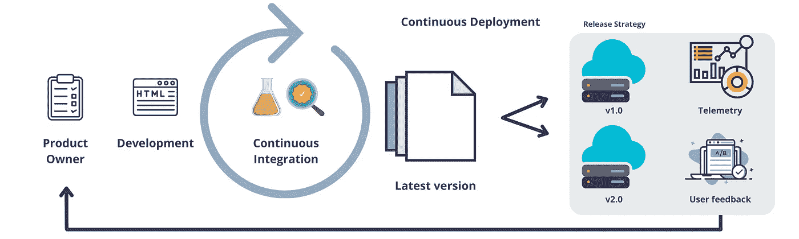
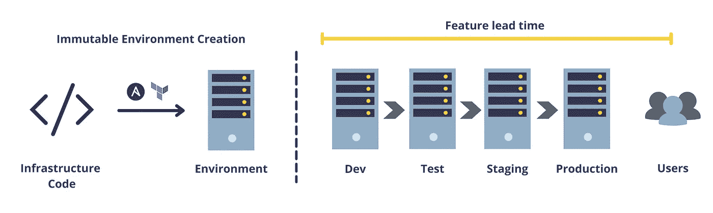
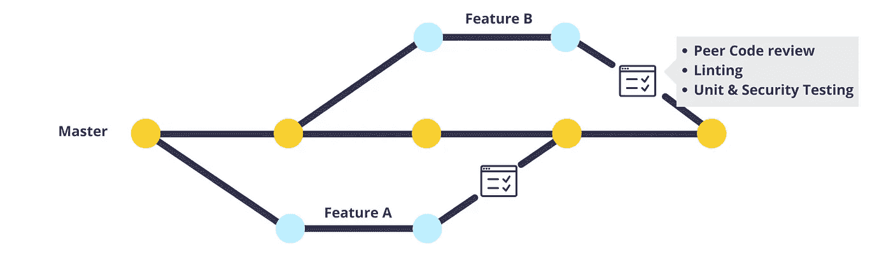
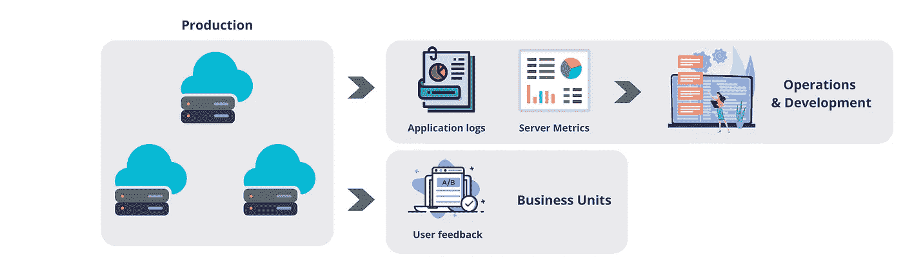

# 使用 DevOps 技术提高生产率

> 原文：<https://medium.com/codex/use-devops-techniques-to-improve-productivity-3909136d1282?source=collection_archive---------9----------------------->

## 这些方法有助于消除繁重的工作，并增加团队的生产力。

DevOps 是什么？

# 为什么是 DevOps？

*   它旨在使尽可能多的任务自动化，减少复杂系统开发和操作中的辛劳。
*   它促进一个安全可靠的系统工作和发展。
*   作为利用多个部门人才的交叉学科，它可以极大地促进整个公司的组织学习和协调。

## 技术价值流

软件产品的开发是技术价值流的结果。技术价值流从业务部门开始，经过各种技术团队，最终到达客户。很像汽车制造计划中的装配线，而在这里，最终产品是一个无形的实体。

技术价值流的一部分

## DevOps 在哪里发挥作用？

上图显示了与技术团队相关的价值流的一部分。DevOps 原则有助于简化价值流，使我们能够尽快向客户交付价值。因此，它允许我们:

*   识别瓶颈
*   改善对上游单位的反馈
*   自动化，自动化，自动化…

# 你能做些什么呢？

作为价值流的一部分，您可以采用多种工具和方法来实现价值流的快速流动。

## 创造。环境。按需提供。

如果没有快速的、脚本化的、不可变的环境创建，您可能会遇到那句老话——“嘿，但是它在我的笔记本电脑上工作！”。它也是 CI/CD 流程的前身，为开发人员提供反馈并简化部署。

按需创建环境

您可以使用不同的配置管理工具(如 Ansible、Chef 和 Terraform)来按需创建环境。通过将其与版本控制系统(VCS)如 g it 集成，我们可以有效地跟踪和测试变更。总之，您应该像对待软件源代码一样对待基础设施配置。

## 实现持续集成(CI)

基于主干的开发

*   合并**小**和合并**大**。
*   鼓励开发人员之间的测试文化。
*   当合并变更时，创建好的[同行代码评审](https://github.com/features/code-review)过程。
*   允许自动化单元、集成和安全测试策略。

所有上述实践使开发人员能够快速获得他们工作的反馈，并降低让 bug 进入生产的风险。

## 支持持续交付和部署

*   在连续交付中，变更被连续地集成到主分支中。而连续部署则更进一步，实现了生产环境中的自动化部署。
*   发布小批量产品可以减少部署焦虑，缩短交付时间。它培养了一种测试和实验的文化。
*   现代 DevOps 服务如 [Gitlab CICD](https://docs.gitlab.com/ee/ci/) 、 [Github Actions](https://github.com/features/actions) 、 [Azure DevOps](https://azure.microsoft.com/en-us/services/devops/) 可以用来实现 CI/CD。

## 改进生产遥测技术

生产遥测

*   发布新功能只是产品开发过程的一部分。另一个关键步骤是监控生产环境和提供给客户的服务。
*   遥测技术允许收集使用和参与度指标。这些帮助我们判断新特性的性能。
*   描述应用健康状况的遥测技术允许操作人员快速发现和诊断问题。

## 资源

这篇文章是基于 Gene Kim、Patrick Debois、Jez Humble 和 John Willis 所著的《[devo PS 手册](https://itrevolution.com/the-devops-handbook/)》一书中描述的观点。

## 想要连接吗？

感谢您阅读我的文章。你也可以在 [LinkedIn](https://www.linkedin.com/in/mukkundsunjii/) 和 [Github](https://github.com/mukkund1996) 上找到我和我的作品。