# 使用 Django 和 Dev.to API 来显示帖子

> 原文：<https://medium.com/codex/use-django-and-the-dev-to-api-to-display-posts-c269f8172e1a?source=collection_archive---------13----------------------->


作为一名开发者，你可能想知道你是否需要一个博客。老实说，我写博客已经有一段时间了，我能告诉你的是，在你的网站上写博客有巨大的好处。这么说吧，你有一个网站，你有一个投资组合，你卖产品或服务。你如何为你的网站带来更多的流量，让潜在的招聘者或客户发现你的产品或服务？

增加网站流量的最好方法是拥有一个包含有用内容的博客。一个包含有用内容的博客向你的读者和客户展示你是一个值得信赖的信息来源。

然而，要在你的网站上有一个博客，你需要一个内容管理系统，缩写为 CMS。CMS 是一个软件解决方案，它帮助人们创建、管理和修改网站上的内容，而不需要专门的技术知识。

大多数 CMS 是付费的，如果你想节省一些钱，付费的 CMS 是你最不想要的。在这篇文章中，我将向你展示如何在你的网站上添加一个博客，而不用花一分钱。我将使用 Django、Dev.to API、PostgreSQL 和 Arctype SQL 客户端。

# 什么是开发。去，姜戈，还有波斯格里斯？

[Dev.to](https://dev.to/) 是一个博客平台，开发者可以在这里发布主题文章，帮助其他开发者解决问题或学习新事物。Dev.to 是一个软件开发人员的社区，他们聚在一起互相帮助。Django 是一个基于 Python 的免费开源 web 框架，遵循模型-模板-视图架构模式。Django 鼓励快速开发和干净、实用的设计。

PostgreSQL，也称为 Postgres，是一个强调 SQL 合规性的免费开源关系数据库管理系统。

# 先决条件

首先，为了能够完成本教程，您需要在您的机器上安装一个文本编辑器。在这种情况下，我将使用 [Visual Studio 代码](https://code.visualstudio.com/)编辑器，但是您也可以使用您选择的代码编辑器。另外，确保您的机器上安装了 [Python](https://www.python.org/downloads/) 和 [PostgreSQL](https://www.postgresql.org/download/) 。

# 项目设置

要开始学习本教程，请在您的机器上创建一个名为 *Blog* 的文件夹。右击文件夹，用 Visual Studio 代码文本编辑器或您选择的文本编辑器打开它。使用 Visual Studio 代码时，点击顶部的终端选项，选择*新建终端*，如下图所示。

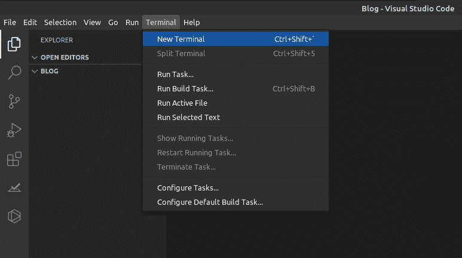

现在让我们将 *Django* 安装到我们的博客 Django 项目中。为了安装 Django，我们将使用一个名为 *Pipenv* 的 python 打包工具。Pipenv 用于管理 Django 项目中的虚拟环境。您可以使用本指南[将 Pipenv 安装到您的机器上](https://pipenv-fork.readthedocs.io/en/latest/install.html)。现在运行下面的命令将 Django 安装到您的项目中:

```
pipenv install django
```

然后通过运行下面显示的命令在项目中创建一个虚拟环境。

```
pipenv shell
```

现在，您应该在命令行上看到 Blog 的括号，如下所示。

```
((Blog))
```

Blog 周围的括号表示虚拟环境已经被激活。

现在让我们通过运行下面显示的命令来创建一个名为 Articles 的新 Django 项目。别忘了句号(。)在最后。

```
django-admin startproject Articles .
```

现在运行下面显示的命令，然后访问 [http://127.0.0.1:8000:](http://127.0.0.1:8000:)

```
python manage.py runserver
```

您应该会看到如下所示的 Django 欢迎页面。

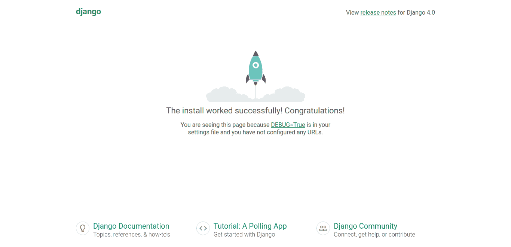

现在让我们在 Django 项目中创建一个名为 *posts* 的应用程序。在命令行中，用 *control+c.* 退出服务器，然后运行如下所示的命令。

```
python manage.py startapp posts
```

在 Visual Studio 代码编辑器窗口中，单击 *Articles* 文件夹并打开 *settings.py* 文件，如下所示。

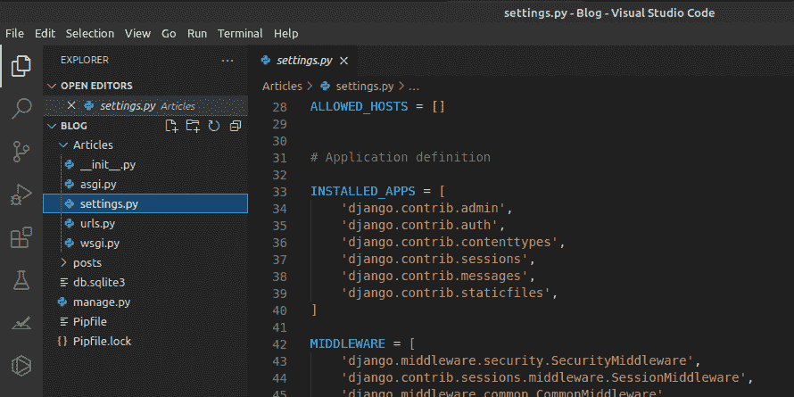

在 settings.py 文件中，向下滚动到`INSTALLED_APPS`部分，您会看到已经有六个内置的 Django 应用程序。如下所示，在底部添加我们的新帖子应用程序。

```
INSTALLED_APPS = [
   'django.contrib.admin',
   'django.contrib.auth',
   'django.contrib.contenttypes',
   'django.contrib.sessions',
   'django.contrib.messages',
   'django.contrib.staticfiles',
   'posts',  # new
]
```

# 设置 Postgres

在您的机器上安装 Postgres 之后，运行下面的命令来确认安装。

```
psql --version
```

您应该能够看到安装在您系统中的 Postgres 版本。现在运行下面显示的命令来打开 Postgres 提示符。

```
sudo -u postgres psql postgres
```

PostgreSQL 在命令行上打开后，运行下面的命令为其设置密码。

```
\password postgres
```

要退出 PostgreSQL 提示符，请运行如下所示的命令。

```
\q
```

要再次打开 postgres 提示符，请运行下面显示的命令，并输入您为 Postgres 设置的密码。

```
psql -U postgres -W
```

现在让我们在 Postgres 中创建一个数据库，通过运行下面的命令来存储我们的博客项目的帖子。

```
CREATE DATABASE posts;
```

然后运行下面显示的命令，查看您创建的数据库是否在 Postgres 的数据库列表中。

```
\l
```

从下面的截图可以看出，post 数据库是在 PostgreSQL 中创建的。

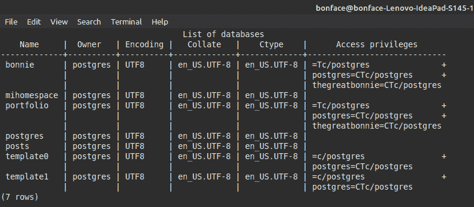

# 集成 Postgres 和 Django

让我们安装 psycopg2 包，它将允许我们使用通过运行下面的命令创建的 Postgres 数据库。

```
pipenv install psycopg2
```

打开 Articles 文件夹中的 settings.py 文件，向下滚动到 DATABASES 部分，如下所示。

```
DATABASES = {
   'default': {
       'ENGINE': 'django.db.backends.sqlite3',
       'NAME': BASE_DIR / 'db.sqlite3',
   }
}
```

该项目被配置为使用 SQLite 作为数据库。您需要做的是更改这一点，以便项目可以使用我们创建的 Postgres 数据库。

更改引擎，使其使用 Postgres 适配器而不是 sqlite3 适配器。对于名称，使用数据库的名称，在本例中是 *posts。*您还需要为您的数据库添加登录凭证。

用户应该是 postgres，密码应该是您为 postgres 设置的密码。settings.py 文件的 DATABASES 部分现在应该如下所示。

```
DATABASES = {
   'default': {
       'ENGINE': 'django.db.backends.postgresql',
       'NAME': 'posts',
       'USER': 'postgres',
       'PASSWORD': 'password',
       'HOST': 'localhost',
       'PORT': '',
   }
}
```

# Django 模型

现在让我们创建一个 Django 模型，它定义了我们希望存储在 Postgres 数据库中的数据字段。要创建模型，导航到 posts 文件夹中的 *models.py* 文件，如下所示。

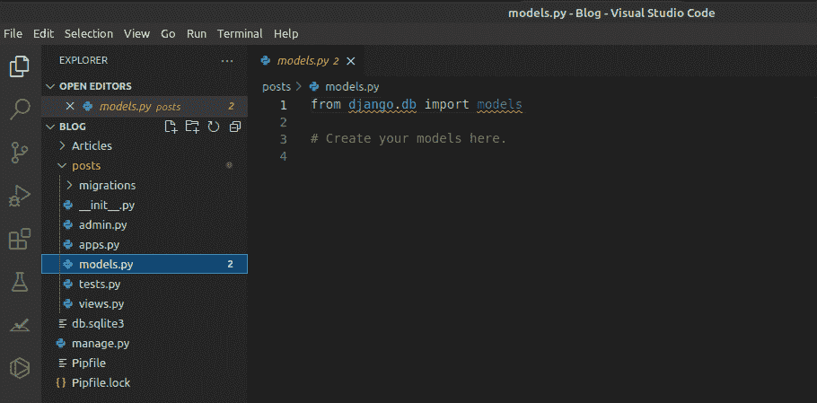

您的 models.py 文件现在应该如下所示。

```
from django.db import models
import datetime

class Article(models.Model):
   title = models.TextField(blank=True)
   description = models.TextField(blank=True)
   cover_image = models.TextField(blank=True)
   article_body = models.TextField(blank=True)
   published_at = models.DateTimeField(
       default=datetime.date.today, blank=True, null=True)

   def __str__(self):
       return self.title
```

让我们通过运行下面的命令来创建迁移并将其应用到数据库中。

```
python manage.py makemigrationspython manage.py migrate
```

现在让我们通过打开 posts 文件夹中的 *admin.py* 文件来注册这个模型。admin.py 文件现在应该如下所示。

```
from django.contrib import admin
from django.contrib.auth.admin import UserAdmin

from .models import Article

class ArticleAdmin(admin.ModelAdmin):
   list_display = ('id', 'title')

admin.site.register(Article, ArticleAdmin)
```

下一步是通过运行下面的命令创建一个管理员帐户。您将被要求选择用户名，提供电子邮件地址，选择并确认帐户密码。

```
python manage.py createsuperuser
```

# Django 观点

现在访问 [Dev.to API 文档](https://developers.forem.com/api/)来学习如何获得 API 密匙和各种 API 端点。在网页左侧，选择*认证*部分，了解如何获取 API 密钥。

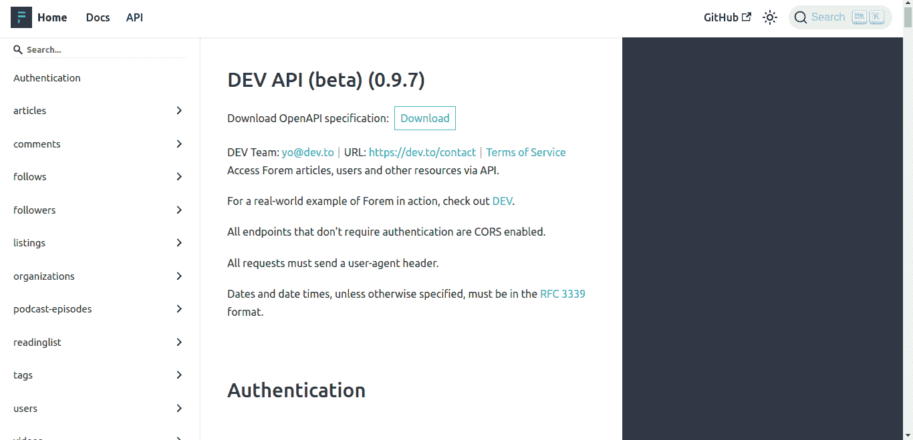

然后在身份验证部分下面，选择文章部分。向下滚动下拉菜单至用户发表的文章。这是允许客户端代表经过身份验证的用户检索已发布文章列表的端点。

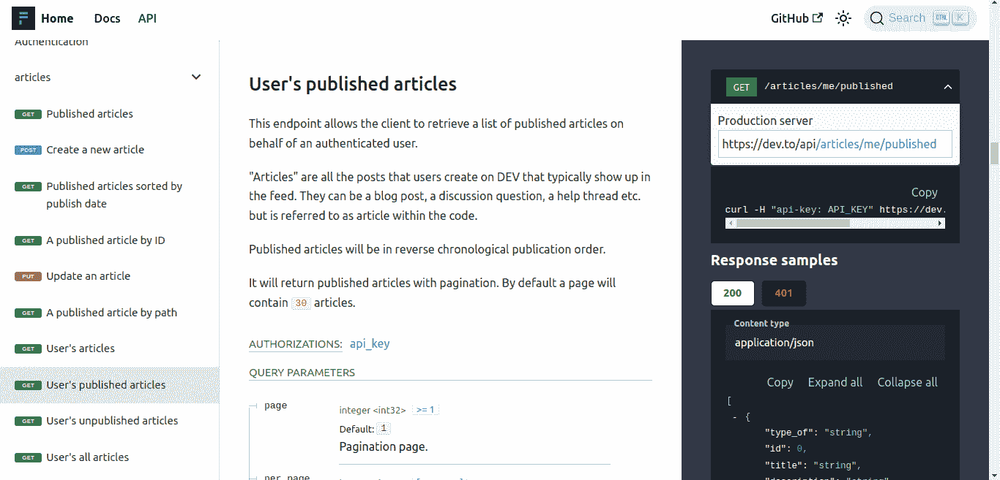

在页面的右侧，您可以看到可以向 Dev.to API 发出的请求示例。

现在让我们在 views.py 文件上创建一个 python 视图函数，它向 Dev.to API 发出 http 请求，如下所示。

```
from django.shortcuts import render
import requests
from .models import Article

def get_articles(request):
   all_articles = {}

   API_KEY = 'Your_API_KEY'

   url = 'https://dev.to/api/articles/me/published'

   headers = {'api-key': API_KEY}

   response = requests.get(url, headers=headers)

   data = response.json()

   for i, item in enumerate(data):
       article_data = Article(
           title=data[i]['title'],
           description=data[i]['description'],
           cover_image=data[i]['cover_image'],
           article_body=data[i]['body_markdown'],
           published_at=data[i]['published_at']
       )

       article_data.save()

       all_articles = Article.objects.all().order_by(
           '-published_at').distinct('published_at')

       return render(request, "blog.html", {"all_articles": all_articles})
```

为了显示文章的正文，我们需要创建另一个视图函数，通过 id 查询文章。

```
def blogBody(request, id):
   article = Article.objects.get(id=id)

   return render(request, "blogBody.html", {"article": article})
```

您的 views.py 文件现在应该如下所示。

```
from django.shortcuts import render
import requests
from .models import Article

def get_articles(request):
   all_articles = {}

   API_KEY = 'Your_API_KEY'

   url = 'https://dev.to/api/articles/me/published'

   headers = {'api-key': API_KEY}

   response = requests.get(url, headers=headers)

   data = response.json()

   for i, item in enumerate(data):
       article_data = Article(
           title=data[i]['title'],
           description=data[i]['description'],
           cover_image=data[i]['cover_image'],
           article_body=data[i]['body_markdown'],
           published_at=data[i]['published_at']
       )

       article_data.save()

       all_articles = Article.objects.all().order_by(
           '-published_at').distinct('published_at')

       return render(request, "blog.html", {"all_articles": all_articles})

def blogBody(request, id):
   article = Article.objects.get(id=id)

   return render(request, "blogBody.html", {"article": article})
```

# Django URLs

现在我们需要通过在 posts 文件夹中创建一个新的 urls.py 文件来配置项目的 URL。urls.py 文件现在应该如下所示。

```
from django.urls import path
from .views import blogBody

urlpatterns = [
   path("blog", blog, name="blog"),
   path("article/<int:id>", blogBody, name="article"),
]
```

最后一步是更新 Articles/urls.py 文件—该文件应该如下所示。

```
from django.contrib import admin
from django.urls import path, include

urlpatterns = [
   path('admin/', admin.site.urls),
   path("", include("posts.urls"))
]
```

# Django 模板

创建一个名为*模板*的目录，然后像这样创建两个名为*blog.html*和*blogBody.html*的 HTML 文件。

```
mkdir templatestouch templates/blog.htmltouch templates/blogBody.html
```

现在让我们更新 Articles/settings.py 文件，告诉 Django 新模板目录的位置。这是对模板部分下的设置“DIRS”的一行更改，如下所示。

```
TEMPLATES = [
   {
       'BACKEND': 'django.template.backends.django.DjangoTemplates',
       'DIRS': [os.path.join(BASE_DIR, 'templates')], #new
       'APP_DIRS': True,
       'OPTIONS': {
           'context_processors': [
               'django.template.context_processors.debug',
               'django.template.context_processors.request',
               'django.contrib.auth.context_processors.auth',
               'django.contrib.messages.context_processors.messages',
           ],
       },
   },
]
```

不要忘记在 *settings.py* 文件的顶部指定*导入操作系统*，否则会出现操作系统未定义的错误。您的 templates/blog.html 文件现在应该如下所示。

```


<h4></h4>
<p></p>
<a href="">Read More...</a>

```

导航到 [127.0.01:800/blog](http://127.0.0.1:8000/blog) ，你应该会看到从 Dev 到的文章，如下所示。

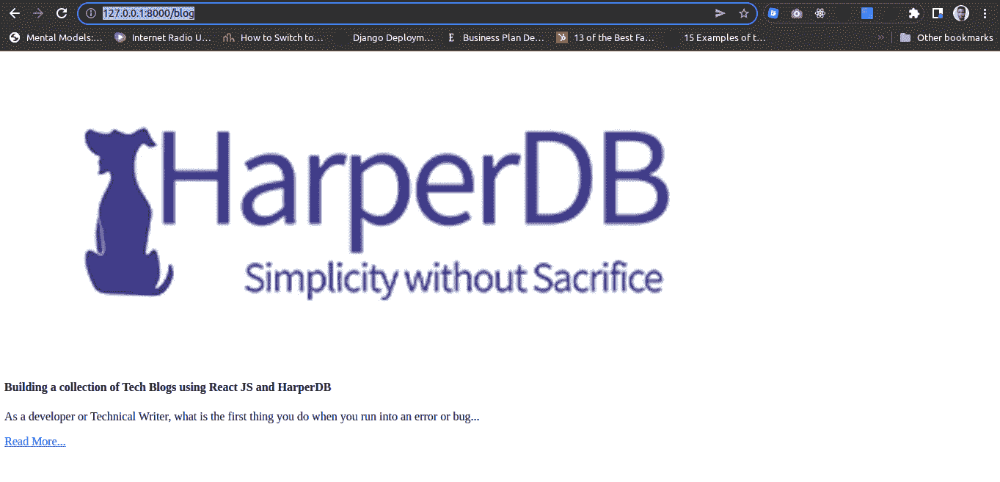

# 文章正文

当我们进行 API 调用时，文章主体被提取为`article markdown`。减价是从 API 作为字符串接收的。这意味着它将看起来像你在 DEV 上输入的原始内容，而不是预览/发布的版本(即，带有所有的 markdown 语法，如#表示标题)。要将它显示在您的网站上，就像它出现在 DEV To 上一样，您需要添加一个额外的步骤来将字符串 markdown 转换为 HTML。有很多 markdown 解析库可以帮你做到这一点，但是在这个项目中，我们将为 Django 使用一个名为`Markdown`的 markdown 解析库。

要使用`Markdown`,我们需要使用下面的命令将其安装到我们的项目中:

```
pipenv install markdown
```

让我们创建一个使用`Markdown`的定制模板过滤器。在我们的帖子应用程序中创建一个`templatetags`目录，然后创建一个`markdown_extras.py`文件，如下所示。

```
mkdir posts/templatetagstouch posts/templatetags/markdown_extras.py
```

文件本身将导入 markdown 包并使用 fenced 代码块扩展。

```
# posts/templatetags/markdown_extras.py
from django import template
from django.template.defaultfilters import stringfilter

import markdown as md

register = template.Library()

@register.filter()
@stringfilter
def markdown(value):
   return md.markdown(value, extensions=['markdown.extensions.fenced_code'])
```

现在让我们将自定义过滤器加载到模板中，这样用 Markdown 编写的内容将输出为 HTML。我们的`blogBody.html`文件现在应该是这样的:

```


<h4></h4>

<span>{{article.published_at }}</span>
<p></p>
```

导航至 [127.0.01:800/blog](http://127.0.0.1:8000/blog) 并点击底部的阅读更多按钮。您应该被重定向到文章正文，如下所示。

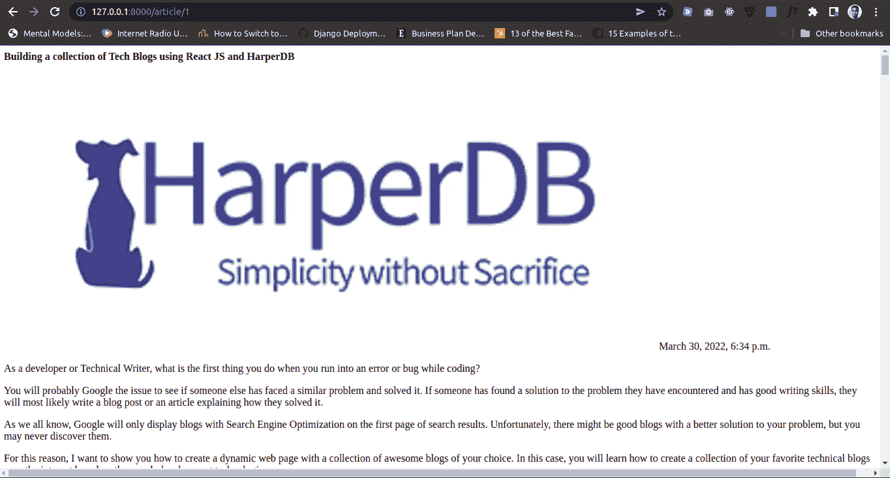

# 使用 Arctype SQL 客户端查询 Postgres 数据

要查看 PostgreSQL 中存储的博客数据或与之交互，您可以使用 SQL 客户端和数据库管理工具，如 [Arctype](https://arctype.com) 。要使用 Arctype，请导航到 Arctype 主页并将 Arctype 应用程序下载到您的计算机上。目前，Arctype 支持 Linux、Windows 和 MacOS:

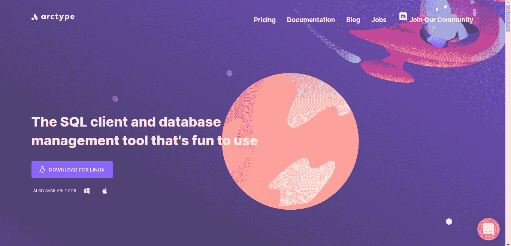

安装好应用程序后，打开它，系统会提示您创建一个帐户，如下所示。

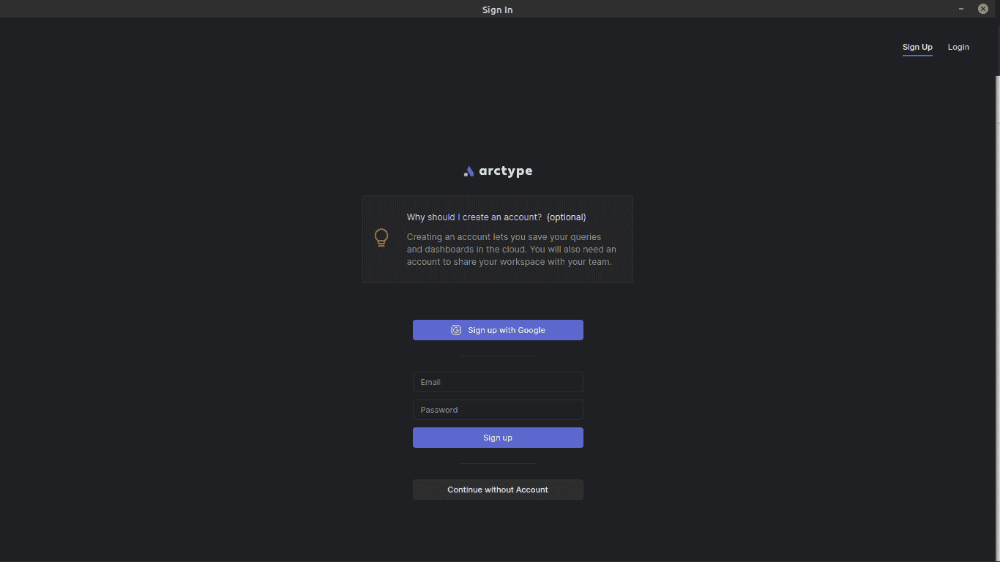

创建帐户后，系统会提示您选择数据库。在这种情况下，选择 Postgres。

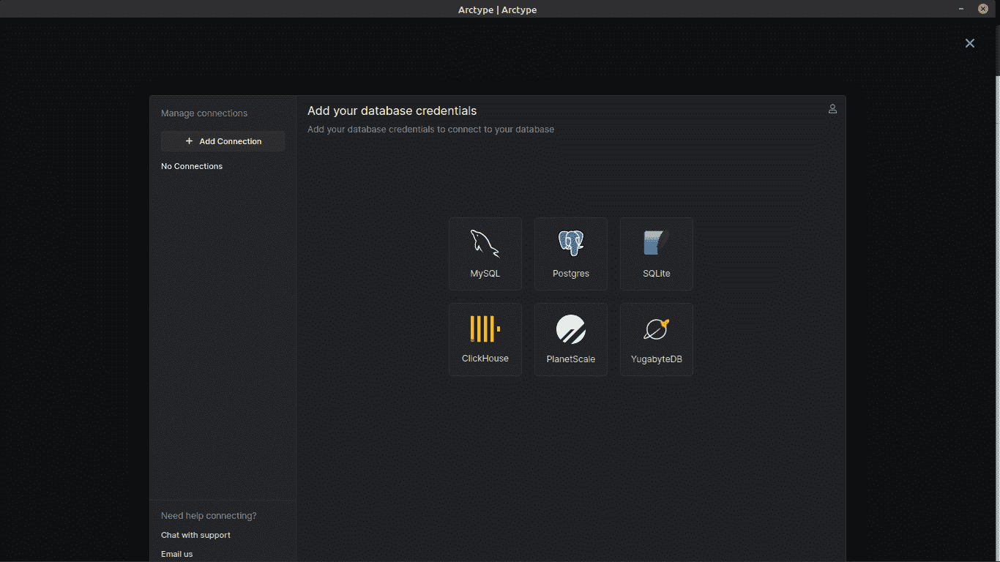

Arctype 中可用的数据库

下一步是添加 Postgres 凭据以将 Arctype 连接到 Postgres 数据库。使用在 Postgres 提示符下创建数据库时创建的凭据。

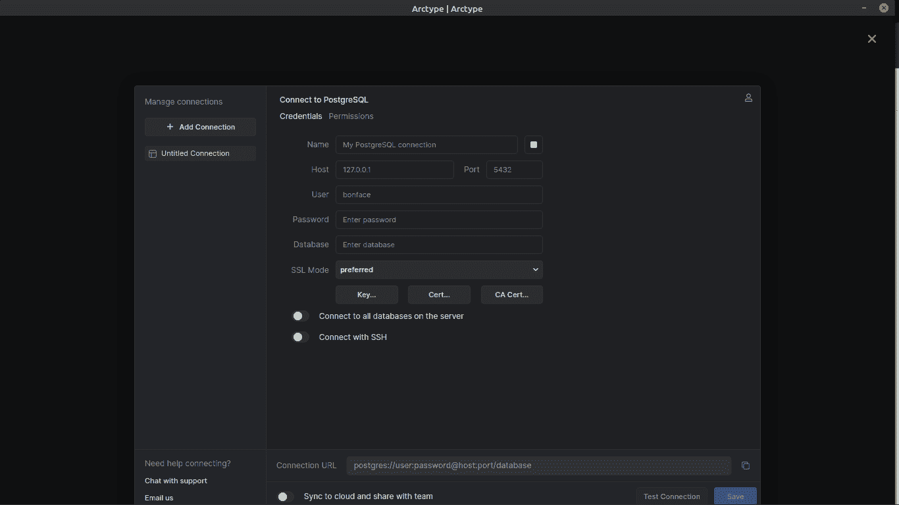

一旦数据库连接成功，您应该能够访问 Postgres 中的 posts 数据库中的表，如下所示。

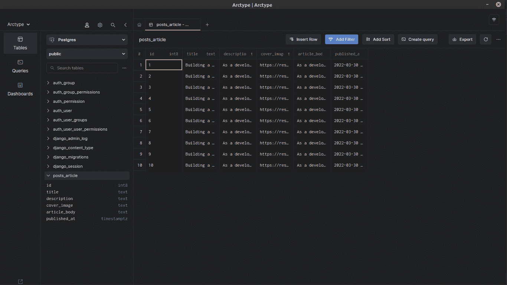

如果您想了解如何在 Arctype 中创建和运行查询，[请查看本指南](https://docs.arctype.com/getting-started/making-a-query)。

# 结论

在本文中，您了解了如何在自己的网站上创建博客，而不必使用付费内容管理系统或从头开始创建。我已经向您展示了使用 Django 和 Dev.to API 在您的博客上成功显示 Dev.to 帖子的步骤。在这个博客[中提供的所有代码都可以在 GitHub](https://github.com/TheGreatBonnie/Blog) 上获得，如果你喜欢这篇文章，请确保在 Arctype 博客上逗留[以获得更多内容，直到下次。](https://arctype.com/blog/)