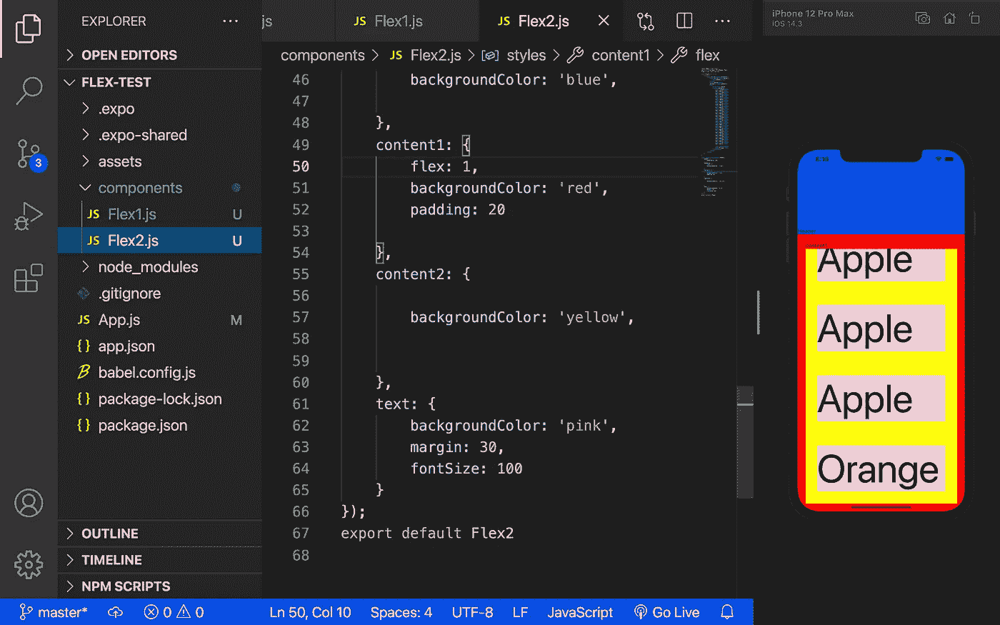

# 在 Expo React Native 中使用 flexBox

> 原文：<https://medium.com/codex/use-flexbox-in-expo-react-native-78017a81f99d?source=collection_archive---------2----------------------->

## [法典](http://medium.com/codex)

## 测试 React Native 中的 justifyContent、alignItem 和 flexDirection。

在本文中，我们将讨论 flexbox。我们主要关注

1.  调整内容
2.  alignItems
3.  弯曲方向
4.  修正了不能显示最后一个的问题…