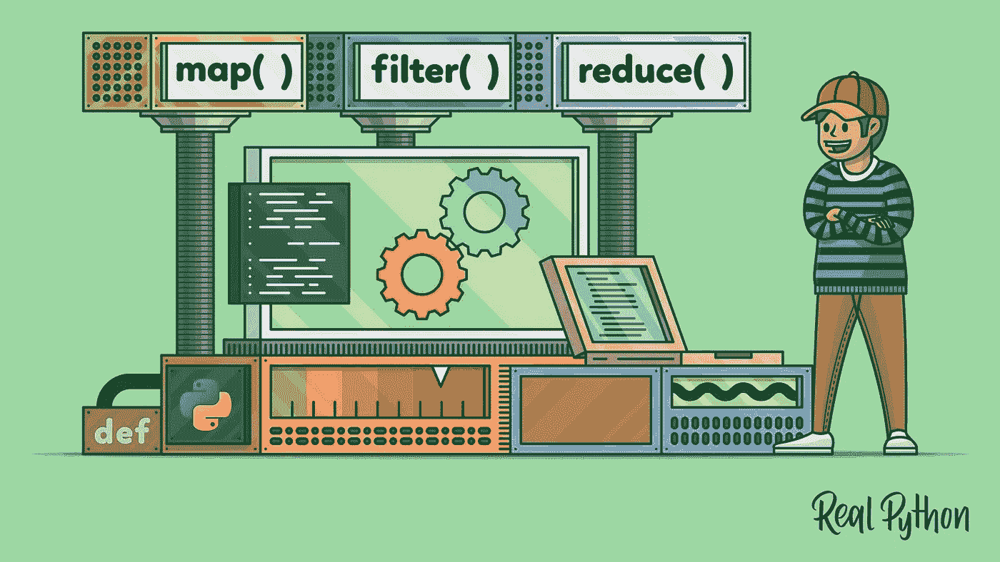

# 在 React 组件中等待数据时，使用函数，而不是条件

> 原文：<https://medium.com/codex/use-functions-not-conditionals-while-awaiting-data-in-a-react-component-20dcdced8120?source=collection_archive---------3----------------------->


Aphinya Dechalert 的“机器人想要功能机器的口香糖”

如果您已经找到了这篇文章的方法，那么您可能正在努力避免 React 组件中的所有东西被破坏，因为它正在等待对`fetch`请求的响应。

假设你正在开发一个简单的博客应用程序。您设置了一个名为`PostsContainer`的组件，它带有一个从后端获取帖子的`useEffect`。在几毫秒的提取运行时间内，`PostsContainer`将开始渲染，它调用的任何子组件也是如此。怎么不让它破？

好吧，如果你是一个训练营的学生或者像我一样的刚毕业的学生，你的老师可能已经教过你在你的回报中设置一个条件。像这样:

```
export default function PostsContainer() {
  const [posts, setPosts] = useState([])
  useEffect(() => {
   * // fetch posts and set state*
  }
  *// other stuff*
  return (
    {posts.length === 0 ? <h1>Loading...</h1> :
      *// what you actually want on the DOM*
```

太好了。那会有用的。但是`*// other stuff*`呢？如果您需要遍历这些帖子并在渲染之前对它们做任何事情，该怎么办？你*做*需要做的事！



我们讨论的是 JavaScript，不是 Python，但是概念是一样的

嗯，根据你所学的，你可以为你需要做的每件事设定相同的条件:

```
let filteredPosts = []
if (posts.length > 0) {
  filteredPosts = posts.filter(post => {
    *// whatever you want to filter by*
```

这可能完成了工作，但是很混乱，容易出现意想不到的错误。也不是很*干*。你将一行接一行地编写`if (thing)`或`let thing = {}`的版本。最糟糕的是，它仍然可能破坏您的代码。如果您正在测试一个深度嵌套数组的长度，而这个数组在您的获取操作返回一个响应并且您的状态更新之前根本不存在，那该怎么办呢？你需要多么精心地设计你的空变量来防止一切在等待的几毫秒内崩溃？

**所以这里有一个更好的办法。不要把这些写成条件句。把它们写成函数:**

```
const filteredPosts = () => posts.filter(post => *// etc.*
```

然后，在你的返回中调用这些函数。

在第一个例子中你应该写`<div>{filteredPosts}</div>`，现在用神奇的香蕉写`<div>{filteredPosts()}</div>`来调用它。这样，函数内部的逻辑只有在你点击 return 语句中的那一行时才会运行，只有在`posts.length > 0`的情况下才会运行。


([来源](http://texturetaddka.com/ripe-yellow-banana-textures))

万岁！