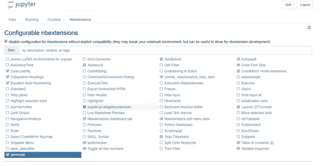

# 用 Jupyter 笔记本振作起来

> 原文：<https://medium.com/codex/use-jupyter-notebooks-efficiently-c02b36fdcd7f?source=collection_archive---------10----------------------->

如果我让您从 1 到 10 对 Jupyter 笔记本的可用性和性能的满意度进行评分，您的答案会是什么？

如果你的答案在 5 以下，那就该通读这篇文章了。

让我们先研究一下朱庇特笔记本。

Jupyter Notebook 是一个 web 应用程序，它扩展了基于控制台的交互式代码编辑方法。它主要由数据科学家用于数据清理和转换、数值模拟、统计建模、数据可视化和各种其他机器学习任务。

Jupyter 笔记本作为数据探索和 T2 原型制作的工具很受欢迎。

*   它非常适合在一个地方展示代码和输出。
*   我们可以对代码段使用单独的单元，并分别执行它们。
*   它有助于内联文档。

然而，如果你还停留在 Jupyter 笔记本的石器时代，就很难超越原型制作，也很难与笔记本进行协作。

如果你认为笔记本很可怕，你可能会使用普通的 Jupyter 笔记本(笔记本就像它是如何安装的)，或者你可能不知道我将在最后讨论的提高效率的技巧。

加油！让我们一起走出困境。

# **普通 Jupyter 笔记本的常见问题**

# **不支持版本控制**

GitHub 等版本控制系统不支持 Jupyter 笔记本，因为 GitHub 的内置源代码工具不是为 Jupyter 笔记本设计的。下面列出了在 GitHub 中使用笔记本的一些困难。

*   **区分与复习** — Jupyter 笔记本在 GitHub 中存储为大 JSON 文件。因此，阅读代码差异(变更前后源代码的差异，通常称为差异)是非常困难的。因此，在 GitHub 上进行代码审查变得非常困难。
*   **合并** —由于 JSON 格式，无法合并两个笔记本。
*   **协作** —没有方便的方式来分享反馈和保持对开发工作的讨论。如果你需要与你的团队合作，在你的项目中使用 Jupyter 笔记本可能是最糟糕的主意。
*   **编辑** —编辑 an。ipyb 文件直接放在 GitHub 上是不可能的。最好也是唯一的方法是在本地克隆笔记本并编辑它。

# **没有代码质量增强特性**

维护高质量的代码是每个数据科学家和软件开发人员的梦想。

为了提高 python 代码的质量，我们通常使用**样式指南**，例如 **PEP 约定**，并且我们使用 **linters** 来执行指南并检测我们代码中的缺陷和其他问题。大多数代码编辑器和 ide 现在可以在后台并行运行 linters。这有助于捕捉代码缺陷，比如输入错误的变量名、丢失的括号、不正确的跳转以及传递给函数的参数数量错误。

不幸的是，普通的 Jupyter 笔记本不方便棉绒。然而，我们可以使用一些笔记本扩展来提高代码质量，我们将在本文后面讨论它们。

# **难考**

Jupyter 笔记本是用来做原型的。虽然强烈推荐代码实验和探索，但是如果你是测试驱动开发的粉丝，Jupyter Notebook 不是你的地方！

测试驱动环境的重要性在于能够在执行整个程序之前，创建单元测试和集成测试来测试每个代码段。

然而，在 Jupyter Notebook 中开发测试场景是非常困难的。

由于编写测试场景的难度，许多开发人员使用 *print()* 语句来测试输出。然而，打印不能作为专业或标准的测试方法。另外就是效率不高。Jupyter 笔记本的用户知道这种方法浪费了多少时间。有时我们会在代码的最后发现错误，为了捕捉它，我们会等到整个代码执行完毕。

# **使用 Jupyter 笔记本的技巧**

让我们看看如何最大限度地利用 Jupyter 笔记本电脑的优势，同时缓解上述问题。

首先，我们将看看哪些**支持应用程序和工具**可以与 Jupyter Notebook 配合使用。

# **1。笔记本扩展**

您可以使用笔记本扩展来提高笔记本的性能。一个流行的扩展集是**jupyter _ contrib _ nb extensions**，它可以从 GitHub 安装。

下面列出了 jupyter_contrib_nbextensions 中一些有用且流行的扩展。

*   **目录—** 收集所有标题，并提供笔记本各部分的参考。这有助于轻松浏览笔记本。
*   **Autopep8** —根据 pep8 指南自动格式化代码。

注意:Autopep8 克服了上面讨论的问题之一；Jupyyter 笔记本没有代码质量增强功能。

*   **Snippets** —提供样本代码以加载公共库并创建样本图。
*   **腹地** —提供代码自动完成建议。
*   **Scratchpad —** 创建一个临时单元格以进行快速计算，而无需在工作簿中创建新的单元格。
*   **代码折叠—** 有助于在我们不需要读取代码块时隐藏它们。

# **2。代码审查工具**

如前所述，在 GitHub 中对 Jupyter 笔记本进行复查、diff(识别一个变更前后的源代码差异)和合并并不是一件容易的事情。

振作起来，有一些工具和 app 可以拯救你！

1.  **ndbime**

ndbime 提供了区分和合并 Jupyter 笔记本的工具。

*   以终端友好的方式比较笔记本电脑。
*   *nbmerge* 三方合并笔记本，自动解决冲突
*   *nbdiff-web* 提供丰富的笔记本渲染差异。
*   *nbmerge-web* 为笔记本提供了一个基于 web 的三路合并工具。
*   *nbshow* 以终端友好的方式呈现单个笔记本。

为了计算代码差异，我们需要克隆存储库，下载并安装 nbdime。但是，ndbime 没有与 GitHub pull 请求集成。

**2。朱皮迪**

Jupydiff 是 GitHub 的一个动作，便于比较 GitHub 存储库中对 Jupyter 笔记本所做的更改。Jupydiff 是基于官方 Python Docker 镜像的。

与 ndbime 不同，这个**与常规的提交和拉请求**交互。对于每个推送的提交或打开的 PR，它都在存储库上运行。它将所做的更改与最近一次提交/提交进行比较，并对这些差异进行注释。Jupydiff 支持私有和公共 GitHub 库。

不再 JSON 乱七八糟！

**3。回顾 NB**

ReviewNB 是 GitHub marketplace 上提供的 GitHub 应用程序。它与 GitHub APIs 通信，以获取在 commits 或 PRs 中所做的笔记本更改。

ReviewNB 中一个值得注意的特性是，它为笔记本创造了**视觉差异**。它以并排差异格式显示笔记本中的代码差异。这个可视化的 diff 比混乱的 JSON diff 可读性强得多。

视觉差异

此外，您可以在 GitHub commits 或 PRs 上发表评论，为您的队友的工作提供反馈或寻求更多的澄清。通知会发送给队友，并附上您的评论。

ReviewNB 解决了大多数关于区分、审阅和维护协作的问题。

# **3。JupyterLab**

与 Jupyter 笔记本相比，JupyterLab 是 Jupyter 开发的一款更新的产品。它是一个基于 web 的交互式开发环境，支持 Jupyter 笔记本、各种文件类型、测试编辑器和终端。简而言之，JupyterLab 将 Jupyter Notebook 合并到一个集成的开发类型编辑器中，您可以在浏览器中运行该编辑器。

我们可以把 JupyterLab 看作是 Jupyter 笔记本的高级版本。你可以在 JupyterLab 获得一个编辑器和一个笔记本结合的美妙体验。

现在让我们来看我们建议的第二部分。这些是我们在使用 Jupyter 笔记本时必须知道的特别提示。

# **1。新变量**

我们可以创建变量，给它们赋值，并在代码中的任何地方重新赋值。然而，不要在同一个变量上重写，在可能的情况下使用新的变量有时会使你的工作更容易。

例如，假设您加载了一个巨大的。xlsx 文件或. csv 文件，并将其存储在一个变量中。然后，您需要从中过滤出一些列，并在几个步骤中进行一些修改。您可以将修改后的文件存储在与此相同的变量中。

但是，假设您的修改出错了，并且最终没有得到预期的结果。要调试代码，您必须多次运行笔记本。那么每次你运行它的时候，等待它加载你的大文件就是一个危机。

作为一种解决方案，您可以维护两个变量，一个用于存储加载的文件，另一个用于存储过滤的文件。您可以将加载部分放入一个单元格中，将修改部分放入另一个单元格中，这样在调试时只需要执行第二个单元格。

虽然第一种方法提供了一种**更高效的内存使用方式**，但每次你需要重置数据时，你都必须加载原始文件。因此，尽可能尝试第二种方法。

# **2。键盘快捷键**

我们知道，在任何平台上，键盘快捷键通常在提高工作效率方面发挥着重要作用。你知道的捷径越多，你完成工作的速度就越快。

在`Help -> Keyboard Shortcuts`菜单中可以看到 Jupyter 笔记本的键盘快捷键列表。

您可以从`Help -> Edit Keyboard Shortcuts`菜单中编辑快捷方式。

# **3。以不同格式导出笔记本**

笔记本通常是数据科学家的乐园。然而，有时他们不得不把笔记本寄给其他领域的人，尤其是非技术领域的人。

如果接收者无意运行代码并进行测试，那么发送笔记本中的代码对他来说不会是额外的负担，因为接收者将不得不安装 Jupyter Notebook，仅仅是为了读取代码。

Jupyter 有一个了不起的功能，可以将笔记本转换成不同的格式。根据接收者的需要，我们可以决定发送代码的格式。

我们可以使用 nbconvert 来转换和导出笔记本。

下面列出了可用的格式。

*   可执行脚本(。py)
*   便携文档格式
*   超文本标记语言
*   乳液
*   RevealJS
*   降价
*   重组后的文本

Jupyter 笔记本是一个很好的工具，可以用来测试一个新的软件，来验证它是否适合你的需要，是否值得使用。如果你对 Jupyter 笔记本感到失望，我邀请你用你学到的这些新技巧再试一次！