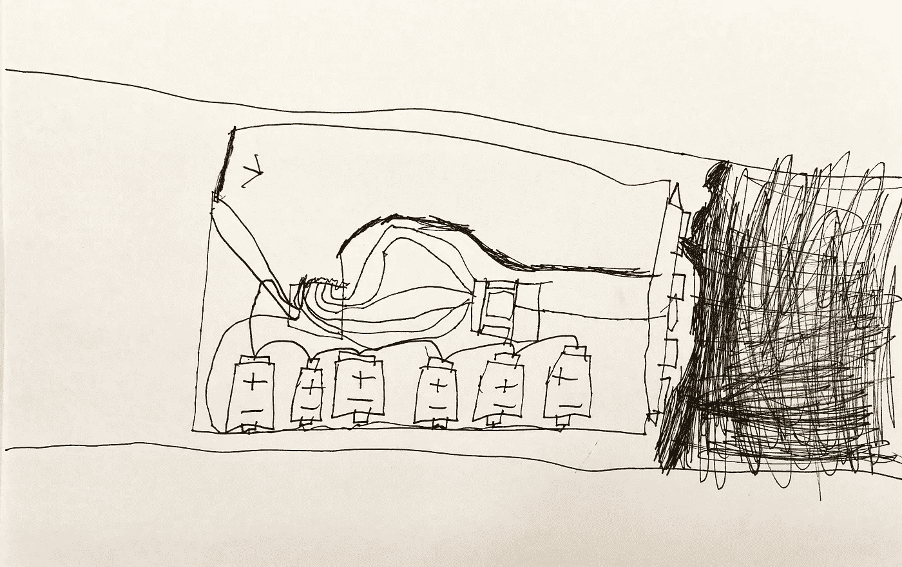

# 使用具有多通道的 Linux 虚拟机

> 原文：<https://medium.com/codex/use-linux-virtual-machines-with-multipass-4e2b620cc6?source=collection_archive---------1----------------------->

## 一种在 Linux、Windows 和 macOS 中创建和管理虚拟机的简单方法，在 pure terminal 中使用相同的命令

我 6 岁的儿子查尔斯·朱的虚拟镗床

WSL/WSL2 是 Windows 中一个非凡的工具，它让 Windows 用户能够使用 Linux，有时我觉得 Windows 是运行 Linux 的最佳桌面。但是 Linux/Ubuntu 和 macOS 呢，有没有类似的…