# 使用 MySQL 窗口函数从数据中获取更多信息

> 原文：<https://medium.com/codex/use-mysql-window-functions-to-get-more-out-of-your-data-3a5ed5fe28a1?source=collection_archive---------7----------------------->

MySQL 在其 8.0 版中引入了窗口函数。定位行组而不折叠它们。在本文中，我们将探索 MySQL 提供的最通用的窗口函数的示例实现。


# MySQL 中的窗口函数

窗口函数是 MySQL 提供的一个高级特性，用于提高查询的执行性能。这些函数作用于与目标行相关的一组行，称为窗口框架。与 GROUP BY 子句不同，窗口函数不会将行折叠成一行，而是保留每一行的详细信息。这种新的数据查询方法在数据分析和商业智能中具有不可估量的价值。

## 窗口函数与聚合函数

[聚合函数](https://www.google.com/url?q=https://dev.mysql.com/doc/refman/8.0/en/aggregate-functions.html&sa=D&source=editors&ust=1623869458162000&usg=AOvVaw3cHLTrgN1uakADEA4Yq_5U)用于从一组行中返回一个标量值。MySQL 中一些著名的聚合函数有 SUM、MIN、MAX、AVG 和 COUNT。我们可以将这些函数与 GROUP BY 子句结合使用来获得一个聚合值。

相反，[窗口函数](https://www.google.com/url?q=https://dev.mysql.com/doc/refman/8.0/en/window-function-descriptions.html&sa=D&source=editors&ust=1623869458163000&usg=AOvVaw0C0BeSMOFscGODl42LAljl)为每个目标行返回一个相应的值。这些目标行或窗口函数在其上操作的一组行被称为窗口框架。窗口函数使用 OVER 子句定义窗口框架。通过使用 OVER 子句而不是 GROUP BY，窗口函数可以将聚合函数作为其 SQL 语句的一部分。

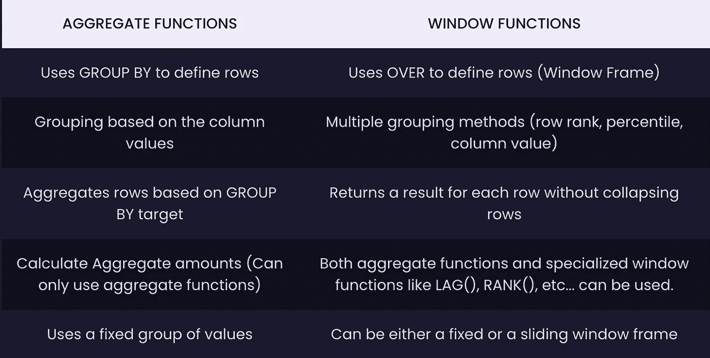

## 最流行的 MySQL 窗口函数有哪些？

以下是 MySQL 提供的专用窗口函数:

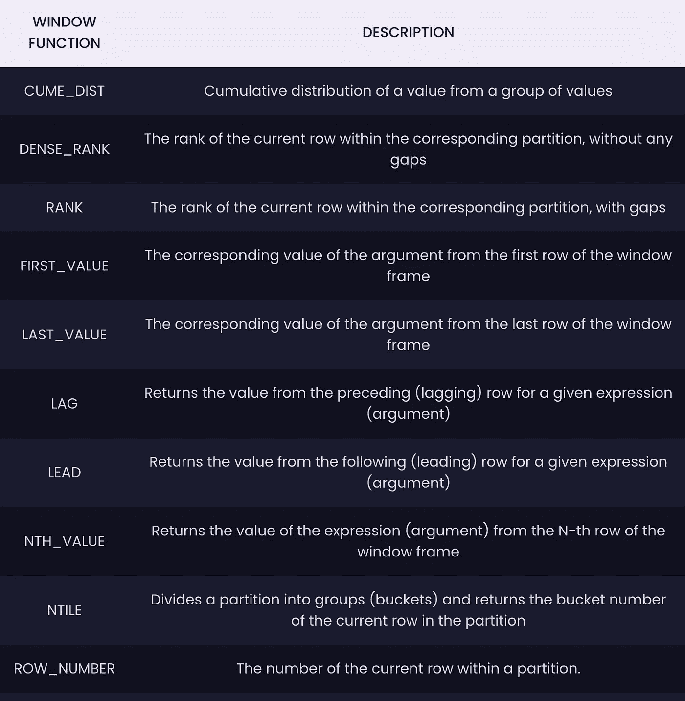

请参考官方 MySQL [文档](https://www.google.com/url?q=https://dev.mysql.com/doc/refman/8.0/en/window-function-descriptions.html%23function_ntile&sa=D&source=editors&ust=1623869458180000&usg=AOvVaw0gABErYYi-TYJXmbYkpMrX)以获得关于上述每个功能的深入信息。

## MySQL 中的窗口函数用例示例

现在让我们来看看如何利用上面提到的一些窗口函数。

## 创建示例 MySQL 数据库表

我将使用最新的 MySQL 服务器实例和 Arctype 作为 SQL 客户端。下面是我们的示例数据库的结构:

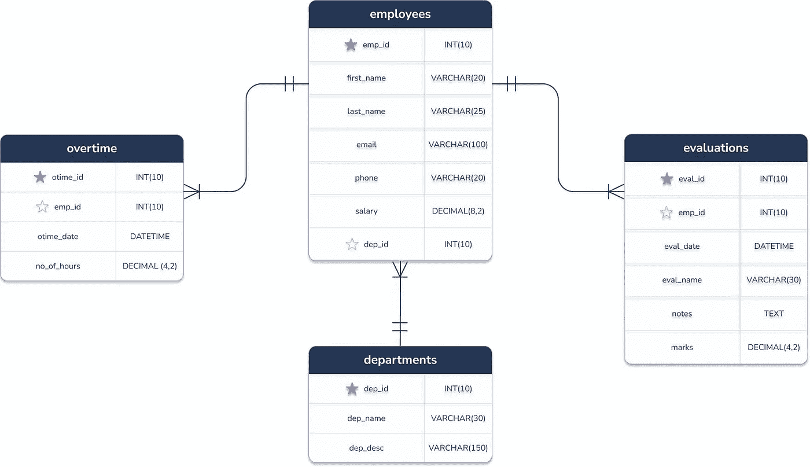

我们可以使用以下 SQL 脚本通过 Arctype 客户端创建表结构:

```
CREATE TABLE departments (
	dep_id INT (10) AUTO_INCREMENT PRIMARY KEY,
	dep_name VARCHAR (30) NOT NULL,
	dep_desc VARCHAR (150) NULL
);

CREATE TABLE employees (
	emp_id INT (10) AUTO_INCREMENT PRIMARY KEY,
	first_name VARCHAR (20) NOT NULL,
	last_name VARCHAR (25) NOT NULL,
	email VARCHAR (100) NOT NULL,
	phone VARCHAR (20) DEFAULT NULL,
	salary DECIMAL (8, 2) NOT NULL,
	dep_id INT (10) NOT NULL,
	FOREIGN KEY (dep_id) REFERENCES 
		departments (dep_id) 
			ON DELETE CASCADE
			ON UPDATE CASCADE
);

CREATE TABLE evaluations (
    eval_id INT (10) AUTO_INCREMENT PRIMARY KEY,
    emp_id INT (10) NOT NULL,
    eval_date DATETIME NOT NULL,
    eval_name VARCHAR (30) NOT NULL,
    notes TEXT DEFAULT NULL,
    marks DECIMAL (4,2) NOT NULL,
    FOREIGN KEY (emp_id) REFERENCES employees (emp_id)
);

CREATE TABLE overtime (
    otime_id INT (10) AUTO_INCREMENT PRIMARY KEY,
    emp_id INT (10) NOT NULL,
    otime_date DATETIME NOT NULL,
    no_of_hours DECIMAL (4,2) NOT NULL,
    FOREIGN KEY (emp_id) REFERENCES employees (emp_id)
);
```

创建表之后，我们可以使用适当的关系将一些示例数据插入到每个表中。现在，让我们回到窗口函数。

## 用 ROW_NUMBER()对结果进行排序和分页

在我们的示例数据库中，employee 表是根据 emp_id 排列的。但是，如果我们需要为每一行分配一个单独的序列号，那么我们可以使用 ROW_NUMBER()窗口函数。

在下面的示例中，我们使用 ROW_NUMBER()函数，同时根据薪金金额对每一行进行排序。

如果只使用 GROUP BY 子句进行查询，我们将得到以下结果。

```
SELECT * FROM employees ORDER BY salary DESC;
```

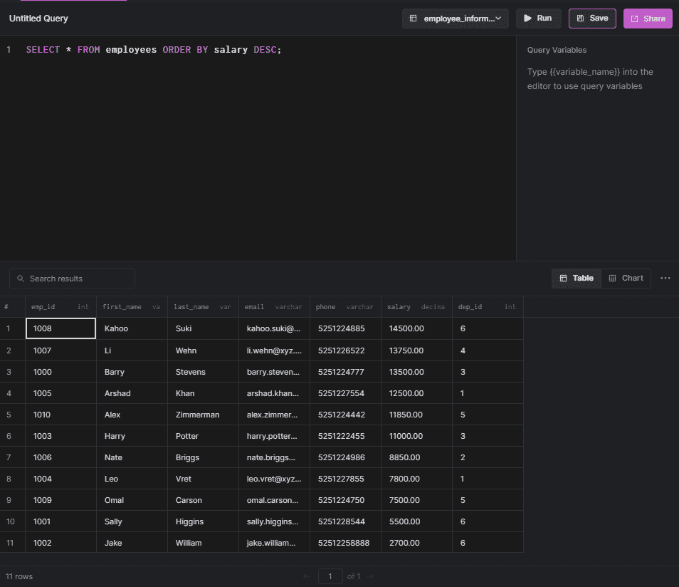

我们可以看到，在使用 ROW_NUMBER()函数关联单个行号之后，已经为每一行分配了一个序列号:

```
SELECT 
  ROW_NUMBER() OVER( ORDER BY salary DESC) `row_num`,
  first_name,
  last_name,
  salary
FROM
  employees;
```

**结果:**

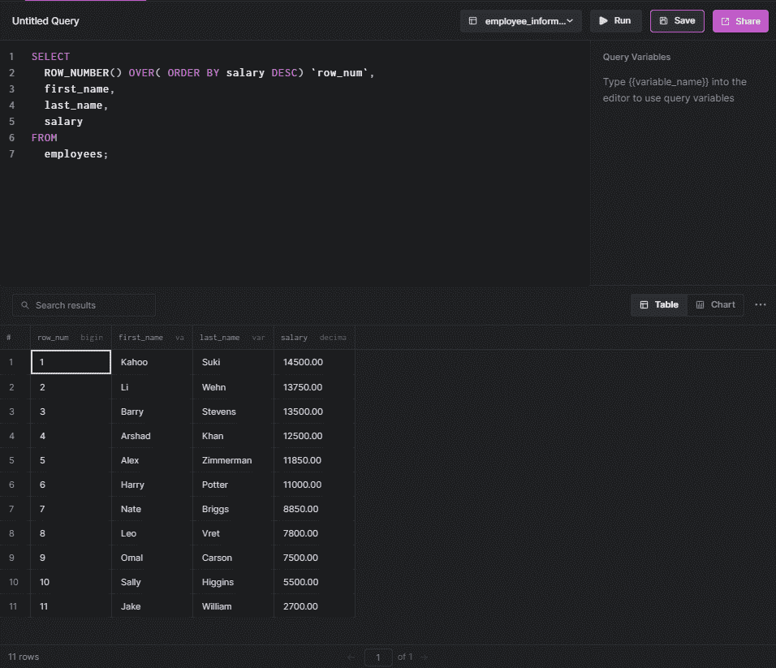

ROW_NUMBER 函数的另一个用途是分页。例如，假设我们需要以分页格式显示雇员的详细信息，每页只包含五条记录。这可以通过 ROW_NUMBER 函数和 WHERE 子句指向所需的记录集来实现:

```
WITH page_result AS (
	SELECT
		ROW_NUMBER() OVER( 
			ORDER BY salary DESC
		) `row_num`,
		first_name,
		last_name,
		salary
	FROM
		employees
)
SELECT * FROM page_result WHERE `row_num` BETWEEN 6 AND 10
```

**结果:**

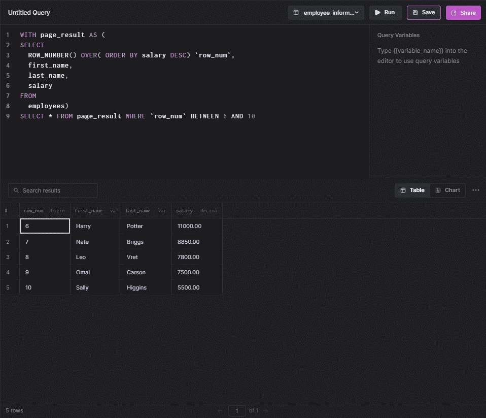

## 在 MySQL 窗口函数中使用 PARTITION BY

使用 PARTITION BY 子句使我们能够根据部门对雇员进行划分。以下查询可用于获取按部门划分的员工的工资等级。

```
SELECT
	dep_name,
	ROW_NUMBER() OVER (
		PARTITION BY dep_name 
        ORDER BY salary DESC
	) `row_num`,
	first_name,
	last_name,
	salary,
	email
FROM 
	employees AS emp
	INNER JOIN departments AS dep
		ON dep.dep_id = emp.dep_id
```

**结果:**

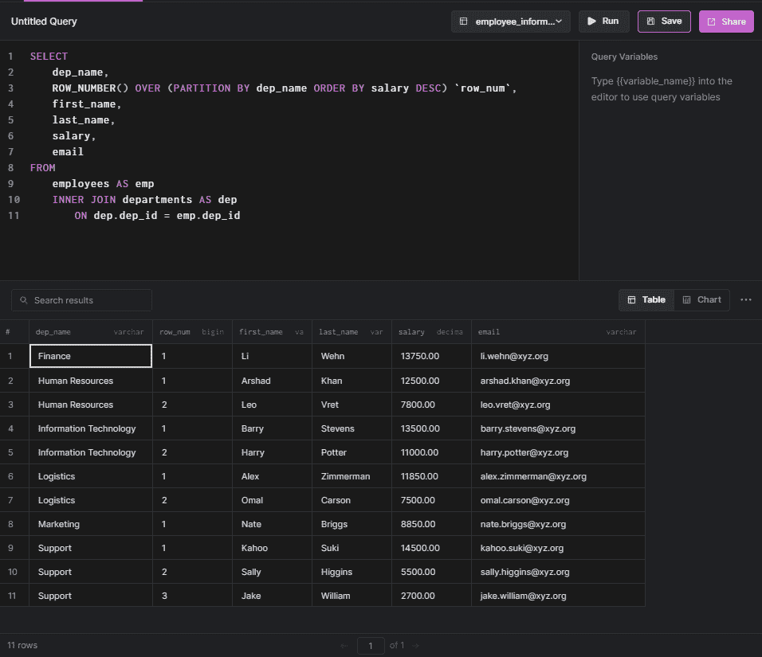

我们可以进一步扩展这个查询，通过提取 row_num 等于 1 的行来获得每个部门中工资最高的雇员。(因为我们已经按每个部门对员工进行了分区，所以 ROW_NUMBER 为每个分区开始一个新的序列)

```
SELECT
	ROW_NUMBER() OVER (
		ORDER BY dep_name DESC
	) `row_num`, 
	dep_name, 
	first_name,
	last_name,
	salary,
	email
FROM
(
	SELECT
	dep_name,
	ROW_NUMBER() OVER (
		PARTITION BY dep_name 
        ORDER BY salary DESC
	) `row_num`,
	first_name,
	last_name,
	salary,
	email
	FROM 
		employees AS emp
		INNER JOIN departments AS dep
			ON dep.dep_id = emp.dep_id
) AS highest_paid
WHERE
	`row_num` = 1
```

**结果:**

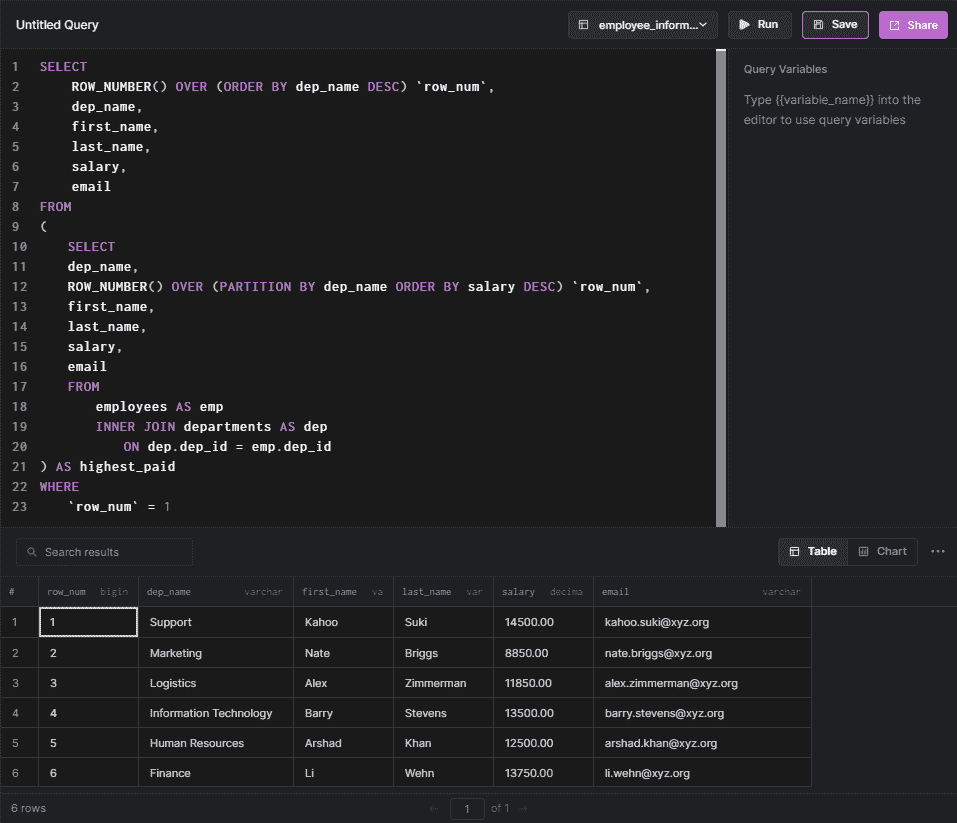

## 使用 LAG()比较行值

LAG 函数使用户能够使用指定的偏移量访问前面的行。当我们需要将前面行的值与当前行的值进行比较时，这种函数非常有用。在我们的数据集中，我们有一个名为 evaluations 的表，其中包括每年的员工评估。使用 LAG，我们可以识别每个员工的绩效，并确定他们是否有所改进。

首先，让我们针对“evaluations”表编写一个查询，以确定 LAG 函数的基本输出。在该查询中，我们将按 emp_id(雇员 id)对雇员进行分区，并按 eval_date(评估日期)对该分区进行排序。

```
SELECT 
	emp_id,
	DATE(eval_date) AS `date`,
	eval_name,
	marks,
	LAG(marks) OVER (
		PARTITION BY emp_id ORDER BY eval_date
	) AS previous
FROM
	evaluations;
```

**结果:**

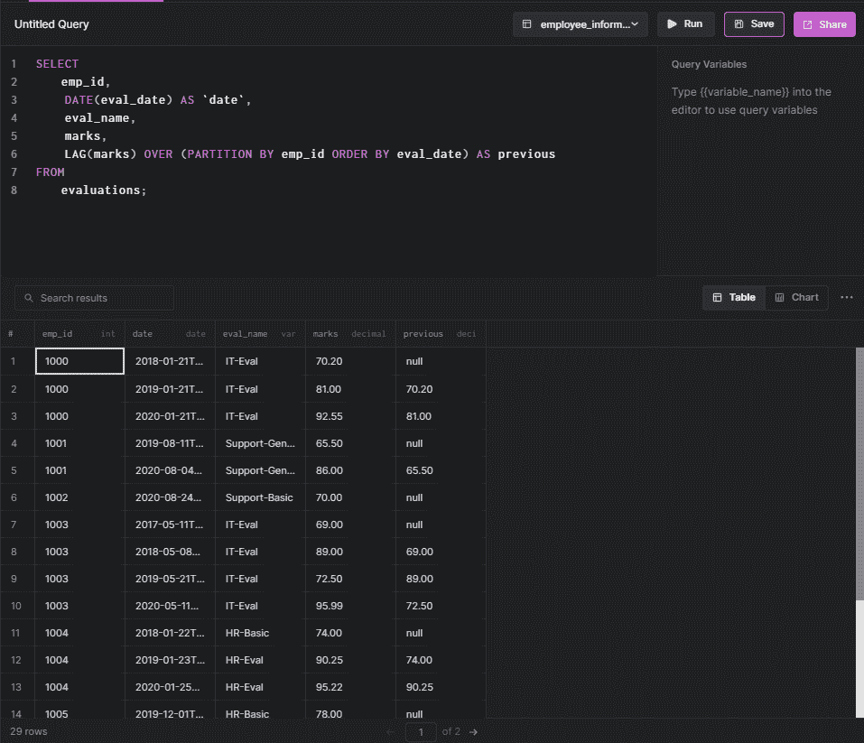

从上面的结果集中，我们可以看到 LAG 函数为“marks”列返回相应的前一个值。然后，我们需要进一步细化该数据集，以获得一个数字百分比来确定员工的年度绩效。

```
WITH emp_evaluations AS (
	SELECT 
		emp_id,
		YEAR(eval_date) AS `year`,
		eval_name,
		marks,
		LAG(marks,1,0) OVER (
        	PARTITION BY emp_id 
            ORDER BY eval_date
        ) AS previous
	FROM
		evaluations
)
SELECT
	emp_id,
	`year`,
	eval_name,
	marks,
	previous,
	IF (previous = 0, '0%',
		CONCAT(ROUND((marks - previous)*100/previous, 2), '%')
	) AS difference
FROM
	emp_evaluations;
```

在上面的查询中，我们定义了一个公共表表达式(CTE)来获取名为 emp_evaluations 的初始 LAG 查询的结果。与最初的查询有一些不同。

一个是这里我们只从 eval_date 日期时间字段中提取年份值，另一个是我们在 LAG 函数中定义了一个偏移量和一个默认值(1 为偏移量，0 为默认值)。当没有前面的行时，例如每个分区的开头，将填充该默认值。

然后，我们查询 emp_evaluations 结果集，计算每行的“marks”和“previous”列之间的差异。

在这里，我们定义了一个 IF 条件来识别空的先前值(previous = 0)，并将它们显示为无差异(0%)或计算差异。如果没有这个 IF 条件，每个分区的第一行将显示为空值。该查询将提供以下格式化的输出结果。

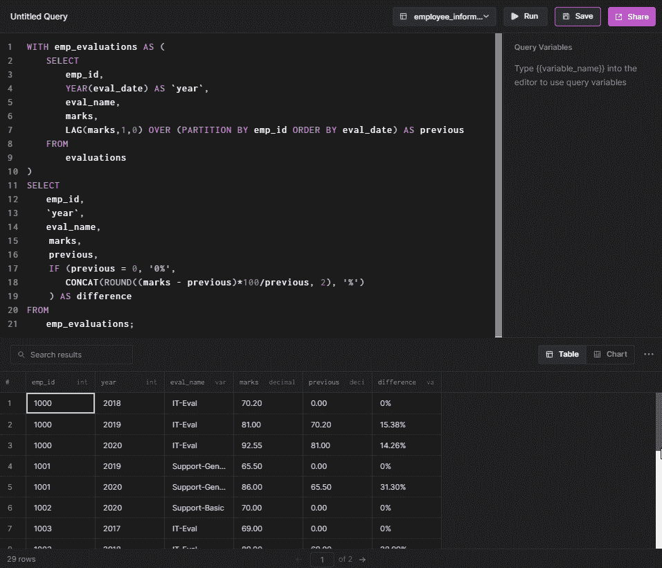

## 使用 DENSE_RANK()为行分配等级

DENSE_RANK 函数可用于为分区中的行分配等级，并且没有任何间隙。如果目标列在多行中具有相同的值，DENSE_RANK 将为这些行中的每一行分配相同的等级。

在上一节中，我们确定了员工的年度绩效。现在让我们假设我们正在向每个部门中进步最快的员工提供奖金。在这种情况下，我们可以使用 DENSE_RANK 为员工的绩效差异分配一个等级。

首先，让我们修改 LAG function 部分中的查询，从结果数据集创建一个视图。因为我们只需要在这里查询(选择)数据，所以 MySQL 视图将是一个理想的解决方案。我们修改了 emp_evaluations 中的 SELECT 语句，通过联接 evaluations、employees 和 departments 表来包含相关的部门、名字和姓氏。

```
CREATE VIEW emp_eval_view AS
	WITH emp_evaluations AS (
		SELECT 
			eval.emp_id AS `empid`,
			YEAR(eval.eval_date) AS `eval_year`,
			eval.eval_name AS `evaluation`,
			eval.marks AS `mark`,
			LAG(eval.marks,1,0) OVER (
				PARTITION BY eval.emp_id 
                ORDER BY eval.eval_date
			) AS `previous`,
			dep.dep_name AS `department`,
			emp.first_name AS `first_name`,
			emp.last_name AS `last_name`
		FROM
			evaluations AS eval
			INNER JOIN employees AS emp ON emp.emp_id = eval.emp_id
			INNER JOIN departments AS dep ON dep.dep_id = emp.dep_id
	)
	SELECT
		empid,
		first_name,
		last_name,
		department,
		`eval_year`,
		evaluation,
		mark,
		previous,
		IF (previous = 0, '0%',
			CONCAT(ROUND((mark - previous)*100/previous, 2), '%')
		) AS difference
	FROM
		emp_evaluations;
```

**结果:**

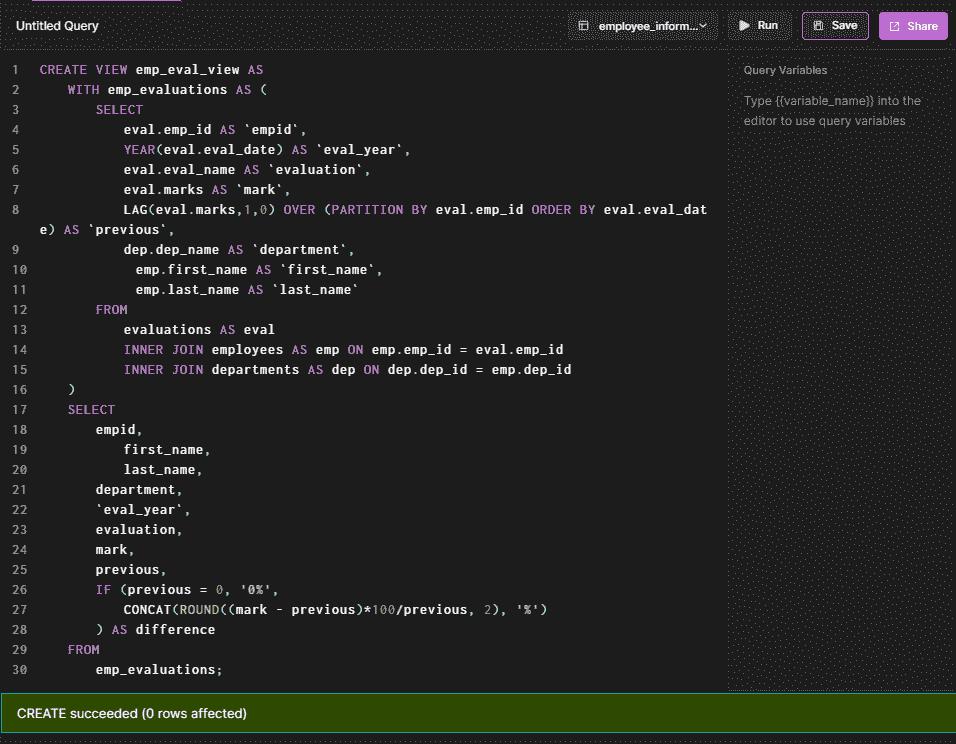

然后使用这个视图(emp_eval_view ),我们使用 DENSE_RANK 函数为按部门划分的每一行分配一个等级，并按差异降序排序。此外，我们只选择与指定年份相关的记录(` eval_year` = 2020)。

```
SELECT
	empid,
	first_name,
	last_name,
	department,
	`eval_year`,
	evaluation,
	difference AS 'improvement',
	DENSE_RANK() OVER (
		PARTITION BY Department
		ORDER BY Difference DESC
	) AS performance_rank
FROM 
	emp_eval_view 
WHERE 
	`eval_year` = 2020
```

**结果:**

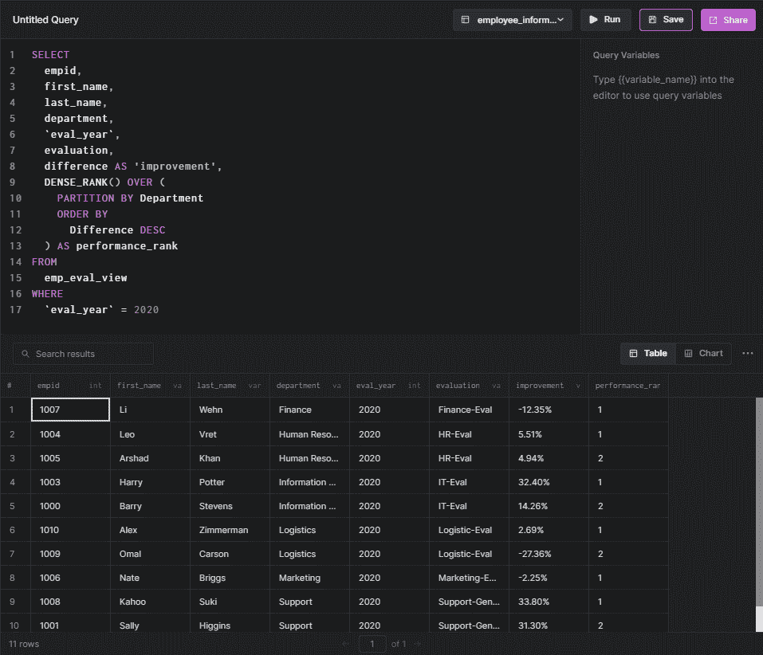

最后，我们可以过滤上面的结果集，通过使用 WHERE 子句获得第一个排名记录(performance_rank = 1)来确定每个部门中绩效最高的个人，如下所示。

```
SELECT *
FROM (
	SELECT
		empid,
		first_name,
		last_name,
		department,
		`eval_year`,
		evaluation,
		difference AS 'improvement',
		DENSE_RANK() OVER (
			PARTITION BY Department
			ORDER BY Difference DESC
		) AS performance_rank
	FROM 
		emp_eval_view 
	WHERE 
		`eval_year` = 2020
) AS yearly_performance_data
WHERE 
	performance_rank = 1
```

**结果:**

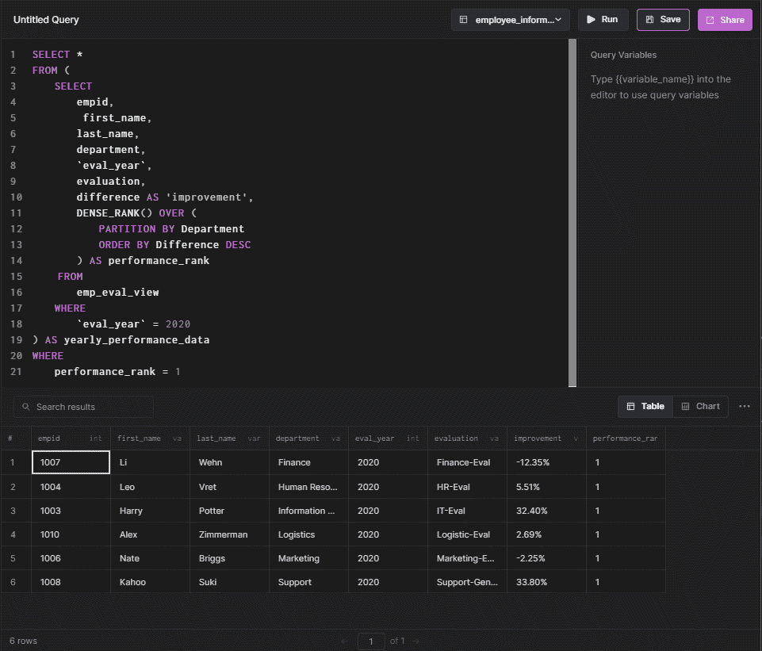

从上面的结果集中我们可以看到，企业可以使用这个 DENSE_RANK 函数来识别表现最佳或表现不佳的员工和部门。这些指标对于商业智能过程至关重要，所有的功劳都归于 MySQL Windows 函数。

## 使用 FIRST_VALUE 和 LAST_VALUE()从分区中获取第一个和最后一个值

FIRST_VALUE 函数使用户能够从有序分区中获得第一个值，而 LAST_VALUE 则获得相反的结果集的最后一个值。这些函数可用于我们的数据集，以确定每个部门中加班最少和最多的员工。

**FIRST_VALUE()**
我们可以使用 FIRST_VALUE 函数来获得各个部门中加班最少的员工。

在下面的 SQL 语句中，我们定义了一个公共表表达式，使用 SUM 聚合函数计算每个雇员每月的加班时间。然后使用 FIRST_VALUE 窗口函数，我们将获得特定部门中加班最少的员工的串联详细信息(名和姓以及加班值)。这种分区是通过 PARTITION BY 语句完成的。

```
WITH overtime_details AS (
	SELECT
		MONTHNAME(otime.otime_date) AS `month`,
		dep.dep_name AS `dep_name`,
		emp.emp_id AS `emp_id`,
		emp.first_name AS `first_name`,
		emp.last_name AS `last_name`,
		SUM(otime.no_of_hours) AS `overtime`
	FROM
		overtime AS otime
		INNER JOIN employees AS emp ON emp.emp_id = otime.emp_id
		INNER JOIN departments AS dep ON dep.dep_id = emp.dep_id
	GROUP BY `month`, emp.emp_id
	ORDER BY `month`, emp.emp_id ASC
)
SELECT
	dep_name,
	emp_id,
	first_name,
	last_name,
	`month`,
	overtime,
	FIRST_VALUE (CONCAT(first_name,' ',last_name,' - ',overtime)) OVER (
			PARTITION BY dep_name
			ORDER BY overtime
		) least_overtime
FROM 
	overtime_details;
```

这将提供如下所示的结果集，指出一段时间内做得最少的员工。

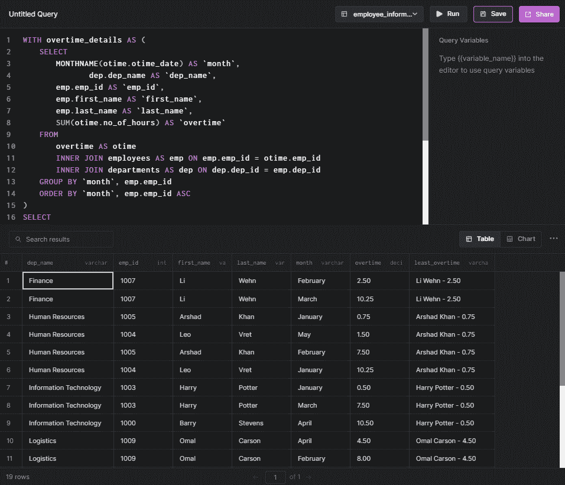

**LAST_VALUE()**
我们可以使用 LAST_VALUE 窗口函数来获取各部门中加班最多的员工。语法和逻辑与 FIRST_VALUE SQL 语句相同，但增加了一个“frame 子句”,用于定义需要应用 LAST_VALUE 函数的当前分区的子集。

我们使用的是:

```
RANGE BETWEEN 
	UNBOUNDED PRECEDING AND 
	UNBOUNDED FOLLOWING
```

作为框架子句。这实际上是通知数据库引擎，该帧从结果集的第一行开始，到最后一行结束。(在我们的查询中，这适用于每个分区)

```
WITH overtime_details AS (
	SELECT
		MONTHNAME(otime.otime_date) AS `month`,
		dep.dep_name AS `dep_name`,
		emp.emp_id AS `emp_id`,
		emp.first_name AS `first_name`,
		emp.last_name AS `last_name`,
		SUM(otime.no_of_hours) AS `overtime`
	FROM
		overtime AS otime
		INNER JOIN employees AS emp ON emp.emp_id = otime.emp_id
		INNER JOIN departments AS dep ON dep.dep_id = emp.dep_id
	GROUP BY `month`, emp.emp_id
	ORDER BY `month`, emp.emp_id ASC
)
SELECT
	dep_name,
	emp_id,
	first_name,
	last_name,
	`month`,
	overtime,
	LAST_VALUE (CONCAT(first_name,' ',last_name,' - ',overtime)) OVER (
			PARTITION BY dep_name
			ORDER BY overtime
			RANGE BETWEEN
				UNBOUNDED PRECEDING AND
				UNBOUNDED FOLLOWING
		) most_overtime
FROM 
	overtime_details;
```

这将为我们提供每个部门加班最多的员工的详细信息。

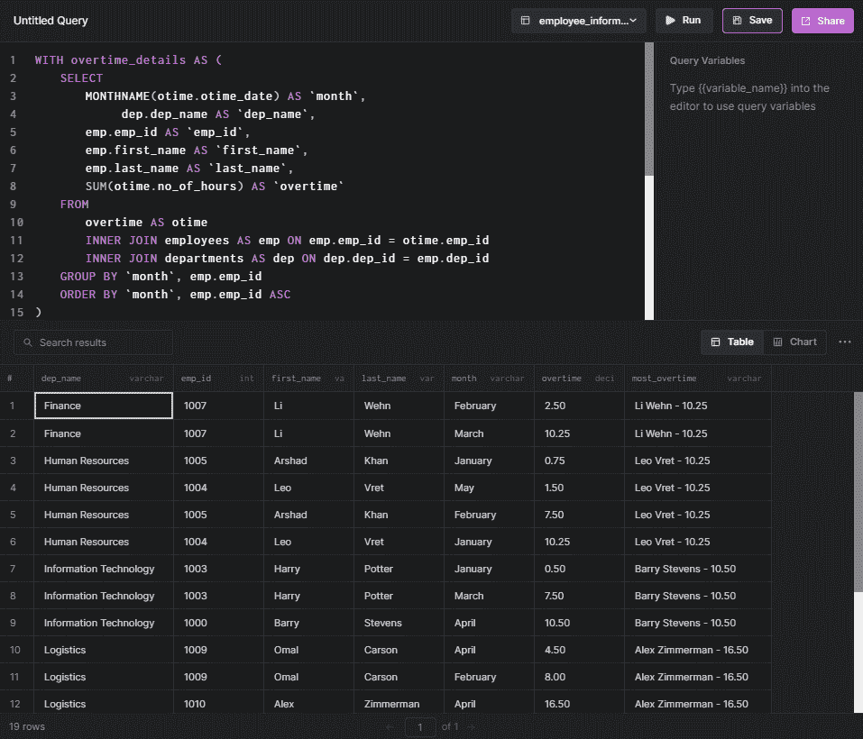

## 结论

MySQL 中的窗口函数是对已经非常优秀的数据库的一个很好的补充。在本文中，我们主要通过一些实际例子讲述了如何使用窗口函数。下一步是进一步挖掘 MySQL 窗口函数，并将它们与所有其他可用的 MySQL 功能相结合，以满足任何业务需求。