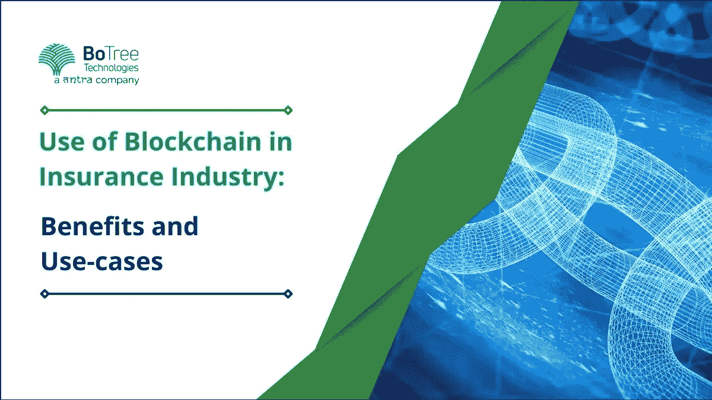

# 区块链在保险行业的应用:优势和用例

> 原文：<https://medium.com/codex/use-of-blockchain-in-insurance-industry-benefits-and-use-cases-916da848fee?source=collection_archive---------12----------------------->

保险客户日益增加的成本和技术创新只是保险公司 **面临的几大挑战之一。**因此，行业期待区块链等创新解决方案能够潜在地解决这些问题。

保险业从 2021 年的[53769.2 亿美元增长到 2022 年的 58384.3 亿美元，CAGR 8.6%。此外，在 CAGR 为 5.9%的情况下，预计 2026 年将进一步增长至 73，492.7 亿美元。](https://www.thebusinessresearchcompany.com/report/insurance-global-market-report#:~:text=This%20insurance%20research%20report%20delivers,(CAGR)%20of%208.6%25.)

随着行业的扩张，保险巨头之间的竞争也在加剧。因此，这些公司正通过与一家软件开发公司合作来采用尖端技术，以确保向潜在客户提供最佳的保险选择。

此外，还存在诸多问题，如效率低下、欺诈、人为错误，以及最令人苦恼的网络攻击。例如，2015 年，Anthem Insurance 证实了一次数据泄露事件，泄露了近 8000 万客户的个人数据。

保险行业的区块链有着海量的范围。它提供了通过公共分类账和强化的网络安全协议在不信任的生态系统中建立信任的能力。因此，它对保险业的未来发展有着巨大的积极意义。

> **阅读更多:**[**2022 年要知道的 7 大保险技术趋势**](https://www.botreetechnologies.com/blog/insurance-technology-trends/)

# 区块链给保险行业带来的好处

保险公司是少数几个争相确定[区块链](https://www.tntra.io/blog/role-of-blockchain-technology-in-new-economy/)或者已经在许多方面采用它的行业之一。主要目的是确保区块链有助于降低成本、管理风险、改善客户服务等。

一个值得信赖的[企业软件开发公司](https://www.botreetechnologies.com/enterprise-software-development-company) 可以在很多方面帮你实现区块链。以下四大优势凸显了区块链如何惠及保险行业——

*   **智能合约**
*   智能合约可以在不需要中间人的情况下，向区块链参与者转移任何有价值的东西。就像实物合同一样，智能合同规定了双方之间协议的条款和条件。
*   智能合同可以跟踪保险索赔，从而让双方承担责任。保险单可以写成分散的智能合同，约束所有签约方。保险公司有义务为个人或组织支付合同规定的任何费用。
*   区块链支持的智能合同根据保险单所有者的记录创建数据，这些数据可以自行接受或拒绝向公司提出的任何保险索赔。
*   **物联网和区块链一起架构数据**
*   据统计，大约有[131.5 亿台联网设备](https://explodingtopics.com/blog/iot-stats)。这些设备将产生大量数据。生成的数据将对保险公司开发精确的精算和基于使用的保险模型产生重大影响。
*   这些数据允许保险公司在点对点的基础上管理大型复杂的网络。然而，管理海量数据是一个巨大的挑战，区块链可以帮助解决这个问题。
*   [保险 app 开发公司](https://www.botreetechnologies.com/insurance-application-development)可以安装区块链解决方案，代替昂贵的数据中心。区块链解决方案提供了一个去中心化的平台来存储和处理数据。
*   **网络安全**
*   保险行业的数据安全存在巨大风险。网络安全收入预计将从 2020 年的 64 亿美元增长到 2025 年的 106 亿美元。
*   区块链可以保护个人消费者信息。区块链分类账是分散的，因此它们不能由单一机构操纵。此外，存储在区块链网络上的所有数据都有时间戳，以确保事件记录清晰。
*   区块链数据是加密的。因此，节点上的所有成员都可以查看每个真实身份保持隐藏的个人的操作。区块链的这种结构有助于快速检测和阻止任何异常行为。
*   **高级自动化**
*   一个单一的[保险公司](https://dzone.com/articles/why-do-you-need-a-web-app-for-your-insurance-compa) 由许多保险公司组成。因此，由于隐藏在数十亿张表格后面的低效率、人为错误、沟通不畅等等，很有可能感受到损失金钱的压力。
*   区块链技术支持的数字[保险应用程序](https://www.botreetechnologies.com/case-studies/insurance) 可以帮助快速自动化过时的流程，从而帮助节省花费在繁琐文书工作上的时间，并因此减少文书工作，因为所有数据都安全地存储在整个链条上。
*   各方之间的通信也通过分布式账本技术得到改善。例如，医生和保险公司可以安全地访问患者的健康记录，以确定正确的政策和程序。

# 保险业中的顶级区块链用例

许多公司正在向保险公司提供领先的区块链解决方案。这里有几个保险行业的区块链例子——

*   **国际商业机器公司(IBM)**
*   IBM 的区块链计划简化了保险行业的各个方面。该公司已协助[保险业](https://www.botreetechnologies.com/blog/5-ways-how-mobile-apps-are-transforming-insurance-industries/) 实现其承保和理赔流程的自动化。
*   该技术有助于减少完成时间和欺诈性索赔。此外，它还使保险公司能够提高客户的信任度，并提高交付效率。
*   全国范围内
*   全美互助保险公司是一家由美国大型保险和金融服务公司组成的集团。是为数不多的使用区块链的保险公司之一。
*   该公司加入了风险管理和保险行业的首个区块链财团 RiskBlock Alliance。它是首批采用该联盟区块链平台的少数几个国家之一。
*   [保险软件解决方案](https://www.botreetechnologies.com/blog/insurance-software-developers/)实现了更安全、更快速的保险证明，允许客户向执法部门核实其信息，并继续快速索赔流程。
*   铁里奥
*   公司创造技术和产品，降低建立信任的成本和复杂性。该公司为保险公司配备了 Chainpoint 和 Proof 产品，以帮助他们记录、跟踪和验证数据。
*   该公司的技术扩展到索赔处理领域，减少了每个索赔过程花费的时间和金钱，减少了虚假索赔，等等。

# 结论

区块链对[保险应用开发解决方案](https://www.botreetechnologies.com/blog/insurance-app-development-costs-tips/)产生了巨大的影响。它改变了保险公司的经营方式。

[区块链技术](https://www.botreetechnologies.com/blog/python-web-programming-for-blockchain-development/)有助于增加可信度。它有助于创建智能合同。由于区块链是一个不可变的账本，智能合同可以实现可信、及时和透明的交易。

保险公司在高度竞争的环境中工作，客户寻求他们的钱的最佳价值。在低成本智能合约交易的帮助下，保险公司可以以有竞争力的价格提供更好的产品。

您是否有兴趣为您的保险业务构建一个区块链应用程序，但需要学习如何在保险中实现区块链？然后，BoTree Technologies 可以提供保险应用程序开发服务，以构建一个未来的平台来满足您的所有需求。

立即联系 BoTree Technologies，获取定制的[保险应用开发服务](https://www.botreetechnologies.com/blog/web-app-for-your-insurance-company/) 。

**常见问题解答**

**什么是区块链？它对保险业务有何影响？**

区块链是一个分布式账本，由计算机网络节点的所有成员共享。它通过实现各方之间的自动支付、更快的索赔审批以及减少欺诈索赔和保险公司的成本来支持保险业。

**区块链如何提升保险行业的客户满意度？**

区块链可以通过四种主要方式提高保险行业的客户满意度

*   提高安全性
*   降低保险服务成本
*   提高索赔过程的效率
*   通过创建防篡改审计跟踪提高透明度

**区块链是否过于复杂难以理解？**
区块链很复杂，因此可能会让用户难以理解和使用。因此，建议雇佣一个能够致力于创建区块链解决方案的保险应用开发合作伙伴。BoTree Technologies 可以帮助您创建最好的[保险应用](https://www.botreetechnologies.com/blog/top-features-to-have-in-your-insurance-application/) ，确保客户完全满意。

*原载于 2022 年 12 月 8 日 https://www.botreetechnologies.com**[*。*](https://www.botreetechnologies.com/blog/use-of-blockchain-in-insurance-industry-benefits-and-use-cases/)*