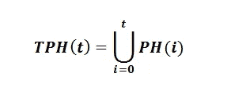
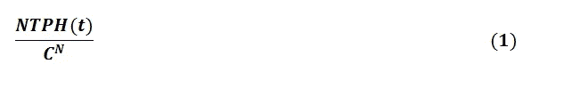
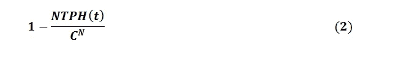

# 利用统计学的基本问题定义奥卡姆剃刀原理的有效性极限

> 原文：<https://medium.com/codex/use-of-the-fundamental-problem-of-statistics-to-define-the-validity-limit-of-occams-razor-5dbef24a1eb6?source=collection_archive---------17----------------------->

Gerd Altmann 在 [Pixabay](https://pixabay.com/it/?utm_source=link-attribution&utm_medium=referral&utm_campaign=image&utm_content=4550602) 上拍摄的照片

## 一种确定奥卡姆剃刀原理有效性极限的创新方法

摘要:在统计学中，为了评价一个结果的显著性，最常用的方法之一是统计假设检验。利用这个理论，统计学的基本问题可以表述为:“*一个统计数据并不代表有用的信息，只有当证明它不是随机获得的*”才成为有用的信息。因此，根据这一观点，在执行相同预测的假设中，我们必须选择随机产生的概率较低的结果。因此，这种方法的基本方面是正确计算这个概率值。这个问题通过重新定义假说的含义来解决。传统方法将假设视为积极参与预测的一组规则。相反，我们将所有假设的总和视为假设，也考虑所用假设之前的假设。因此，每次进行预测时，我们的假设的复杂性都会增加，从而增加其适应随机数据集的能力。这样，只有在已知所有先前尝试的情况下，才能精确地确定假设的复杂性。因此，奥卡姆剃刀原理不再具有普遍的价值，但它的应用取决于我们所拥有的关于被检验假设的信息。

## 介绍

奥卡姆剃刀[1]，[2]的逻辑原理建议在可用的假设中选择最简单的假设。在本文中，我们将利用统计假设检验理论来分析这一原理[3]，[4]。通过利用这一理论，我们将重新表述统计学的基本问题，从而使人们注意到统计数据和它随机产生的概率之间的联系。因此，根据这一观点，在执行相同预测的假设中，我们必须选择随机产生的概率较低的结果。因此，正确计算这个概率值变得至关重要。

这个问题通过重新定义假说的含义来解决。传统方法将假设视为积极参与预测的一组规则。相反，我们将所有假设的总和视为假设，也考虑所用假设之前的假设。因此，每次进行预测时，我们的假设的复杂性都会增加，从而增加其适应随机数据集的能力。这样，只有在已知所有先前尝试的情况下，才能精确地确定假设的复杂性。因此，奥卡姆剃刀原理不再具有普遍的价值，但它的应用取决于我们所拥有的关于被检验假设的信息。

最后，我们使用假设的这个新定义来理解不可重复结果的高百分比的原因，其中使用了假设检验。

## 统计学的基本问题

在统计学中，为了评估结果的显著性，最常用的方法之一是统计假设检验。利用这个理论，统计学的基本问题可以表述为:“*一个统计数据并不代表有用的信息，只有当证明它不是随机获得的*”才成为有用的信息。

> 这个定义特别重要，因为它强调了统计的两个基本方面，即统计的不确定性和不确定性的原因。

事实上，统计学的目的是通过利用与待研究现象相关的事件样本，研究不确定或非确定条件下的现象。知道了观察到的事件可以随机重现，而且其概率永远不会为零，我们就理解了统计学中不确定性的原因。这个概率值叫做泛概率[5]。

通过对统计学基本问题的这种定义，也可以形成下面的悖论[6]，它强调了统计结果的评估是如何依赖于对被分析数据执行的每个动作的。

## 奥卡姆剃刀原理的有效性极限

在这一段中，我们将看到关于假设发展的信息是如何成为定义奥卡姆剃刀原理有效性界限的基础的。

让我们首先给出一些有用的定义来使我们的理论形式化。

给定一个测量基数为 *C* 的离散变量 *X* 的 *N* 值的实验，我们称 *D* 为维数为𝐶^𝑁的集合，它包括所有可能观察到的长度为 *N* 的序列𝑋S。

现在，我们重新定义假设的概念，以便在被检验的假设中定义一个时间顺序。

我们称 *H(t)* 在时间 *t* 发展的假设。

我们称假设 *H(t)* 能够预测的序列集合为*ph(t)*𝑋*s*∈𝐷。

我们称 *NPH(t)* 集合的基数 *PH(t)* 。

我们称 *TH(t)* 为包含到时间 t 为止所有假设的集合。

**𝑇𝐻(𝑡)={𝐻(𝑖1),𝐻(𝑖2),……,𝐻(𝑖𝑡)}**

我们称 *TPH(t)* 与所有假设 *H(t)* ∈ *TH(t)* 相关的所有集合 *PH(t)* 的并集。

我们称 *NTPH(t)* 集合的基数 *TPH(t)* 。因此， *NTPH(T)* 定义了假设 *TH(t)* 能够预测的属于 *D* 的序列的数量。可能发生的情况是，不同的假设预测了 *X* 的值的相同序列，已经进行了集合 *PH(t)* 的并集，这些序列仅被计算一次。

如果我们只做了一个假设 *H(t)=TH(t)* 和 *NPH(t)=NTPH(t)* 。另一方面，如果测试了一个以上的假设 *H(t)≠TH(t)* 和 *NPH(t)≤NTPH(t)* 。

我们定义假设 *TH(t)* 预测独立同分布随机变量 *X* 的一系列 *N* 随机观测值的能力，具有离散均匀分布和基数 *C* ，比率:

> 这个比率也定义了假设 TH(t)能够以完全随机的方式预测实验结果的概率，其中 d 的基数等于 *𝐶^𝑁* 。

已知一个假设 *TH(t)* 只能在以下两种情况下预测实验结果:

1) *TH(t)* 为真。

2) *TH(t)* 为假，预测随机发生；这一事件的概率由等式(1)给出。

在这些条件下，假设 *TH(t)* 为真的概率是:

> 因此，这个等式定义了在 H(t)的评估中必须使用的参数。

所以，如果我们想比较两个假设 *H1(t)* 和 *H2(t)* ，我们有 4 个可能的结果:

**1) *NPH1(t) > NPH2(t)和 NTPH1(t) > NTPH2(t)***

**2) *NPH1(t) > NPH2(t)和 NTPH1(t) < NTPH2(t)***

**3) *NPH1(t) < NPH2(t)和 NTPH1(t) < NTPH2(t)***

**4) *NPH1(t) < NPH2(t)和 NTPH1(t) > NTPH2(t)***

> NPH(t)和 NTPH(t)定义了假设 H(t)和假设 TH(t)能够预测的序列数。因此，它们可以用来衡量它们的复杂性，事实上，一个假设越复杂，它能预测的结果就越多。

分析这四种可能的结果，我们注意到，即使假设 *H1(t)* 没有假设*H2(t)*(*NP h1(t)<NP H2(t)*)复杂，假设 *TH1(t)* 也可能比假设*TH2(t)*(*ntph 1(t)>ntph 2(t)*)复杂。因此，使用等式(2)作为评估方法，假设 *H1(t)* 应该被丢弃以支持假设 *H2(t)* 。例如，如果 *H1(t)* 是先前测试的一长串其他假设中的最后一个假设，就会发生这种情况。

如果没有关于待评估假设的信息，则必须假设这些假设是在相同的条件下提出的。因此，在这种情况下，无法计算 *TH(t)* ，建议选择更简单的假设 *H(t)* 。

> 最后，从等式(2)中，我们可以推导出以下结果:给定一个假设 H(t ),只有在所有先前测试的假设都是已知的情况下，才可以计算为真的概率。

因此，一个假设的复杂性不仅取决于做出预测的数学公式，还取决于之前所做的所有尝试。

> 因此，奥卡姆剃刀原理没有一个绝对值，但它的应用取决于关于假设的信息。

## 如何正确进行统计假设检验

有趣的是，上一段给出的假说的定义，可以被看作是非常明显或者非常创新的东西。事实上，考虑所有已经测试过的假设似乎是绝对平庸的，因为显而易见的原因是，通过运行大量的随机假设，迟早会有一些假设非常适合数据。另一方面，也考虑以前的假设代表了对一个假设的评估的革命。事实上，从这个角度来看，仅仅知道做出预测的假设并不能让我们定义其真正的复杂性。

因此，如果在统计假设检验中，用作拒绝零假设的阈值的 p 值[7]，[8]是在只考虑积极参与预测的假设的情况下计算的，这意味着我们低估了假设的复杂性。因此，这样计算出的 p 值是错误的，从而确定了对假设的错误评估。因此，人们认为，在假设检验的执行过程中，这种系统误差导致了大量不可重现的结果[9]，[10]。

利用这些考虑，可以理解，评估统计结果可能非常困难，因为一些信息可能被隐藏。例如，我们有义务报告做出预测的数学公式，但是，我们可能不会报告所有以前失败的尝试。不幸的是，这些信息对于评估假设是必不可少的，因为它们是假设不可或缺的一部分。事实上，如果我们测试 10 个假设，我们只需用这 10 个假设对数据进行插值，并选择通过所选评估测试的假设。

这个问题也依赖于越来越多地使用能够快速执行大量数学模型的统计软件。因此，存在通过执行大量分析来“玩”该软件的风险，这迟早会导致随机关联。

由于这些原因，对统计结果的评估是科学研究最重要的挑战之一。不幸的是，这是一个很难解决的问题，因为如前所述，在写文章时，有些信息总是可以隐藏的。采用的最简单的解决方案是使用更具选择性的评估参数，这在实践中意味着不可能通过开发随机假设来通过评估测试。然而，这种解决方案实际上存在不同的问题，这样，我们可以抛弃正确的假设，并且不能应用于所有的研究领域。例如，在金融领域，可以观察到的市场可能的无效率[11]很小，采用非常严格的估价方法意味着必须放弃几乎所有的假设。

## 结论

在本文中，我们用假设检验理论讨论了奥卡姆剃刀的逻辑原理。这使我们能够重新表述统计学的基本问题，从而使我们理解正确计算随机获得相同结果的概率的重要性。解决这个问题需要重新定义假说的概念。根据这一观点，我们所说的假设是指所有经过检验的假设的总和。因此，一个假设的复杂性不仅取决于做出预测的数学公式，还取决于先前被检验的假设。

因此，根据这种方法，如果一个人只把积极参与预测的一组规则视为假设，奥卡姆剃刀的逻辑原理就不再具有普遍价值。另一方面，如果假设被认为是所有被测试假设的总和，在这种情况下，奥卡姆剃刀原理返回到具有一般值。

最后，需要注意的是，不考虑所有被检验的假设会导致统计假设检验应用中的系统误差。因此，假设这种导致低估假设复杂性的错误是高比例的不可重复科学结果的原因。

## 参考

[1] Roger Ariew，“奥卡姆剃刀:对奥卡姆吝啬原则的历史和哲学分析”，1976 年。

[2]清醒，埃利奥特(2004)。“简单的问题是什么？”。在策尔纳，阿诺；雨果·库曾坎普；迈克尔·麦卡里尔(编辑。).简单、推理和建模:保持复杂的简单。英国剑桥:剑桥大学出版社。第 13-31 页。ISBN 978–0–521–80361–8。检索到 2012 年 8 月 4 日的 ibn 0–511–00748–5(电子书[Adobe Reader])pdf 格式论文。

[3]费希尔(1955 年)。《统计方法与科学归纳法》(PDF)。皇家统计学会杂志，b 辑 17(1):69–78。

[4]Connie m . bor ror(2009 年)。“统计决策”。注册质量工程师手册(第三版。).威斯康星州密尔沃基:ASQ 质量出版社。第 418-472 页。ISBN 978–0–873–89745–7。

[5]克里斯蒂安·s·卡吕德(2002 年)。《信息与随机性:算法视角》，第二版。斯普林格。国际标准书号 3–540–43466–6。

[6]贝尔东迪尼·安德里亚，《信息悖论》，(2019 年 7 月 8 日)。在 https://ssrn.com/abstract=3416559.的 SSRN 有售:

[7]罗纳德·l·瓦瑟斯坦；妮可·耶戈(2016 年 3 月 7 日)。《美国儿科学会关于 p 值的声明:背景、过程和目的》。美国统计学家。70 (2): 129–133.doi:10.1080/00031305.2016.1154108。

[8]洪；奥尼尔，R.T。鲍尔，p。k . kohne(1997 年)。“当替代假设为真时 p 值的行为”。生物识别(投稿)。53 (1): 11–22.

[9] Munafò，m .，Nosek，b .，Bishop，d .等人，“可再生科学宣言”。10021(2017 年)。https://doi.org/10.1038/s41562-016-0021.

[10]约安尼迪斯，J. P. A .“为什么大多数发表的研究结果是假的”。公共科学图书馆医学版。2、e124 (2005)。

[11] Black，F. (1971)“随机漫步和投资组合管理”，金融分析师杂志，27，16–22。