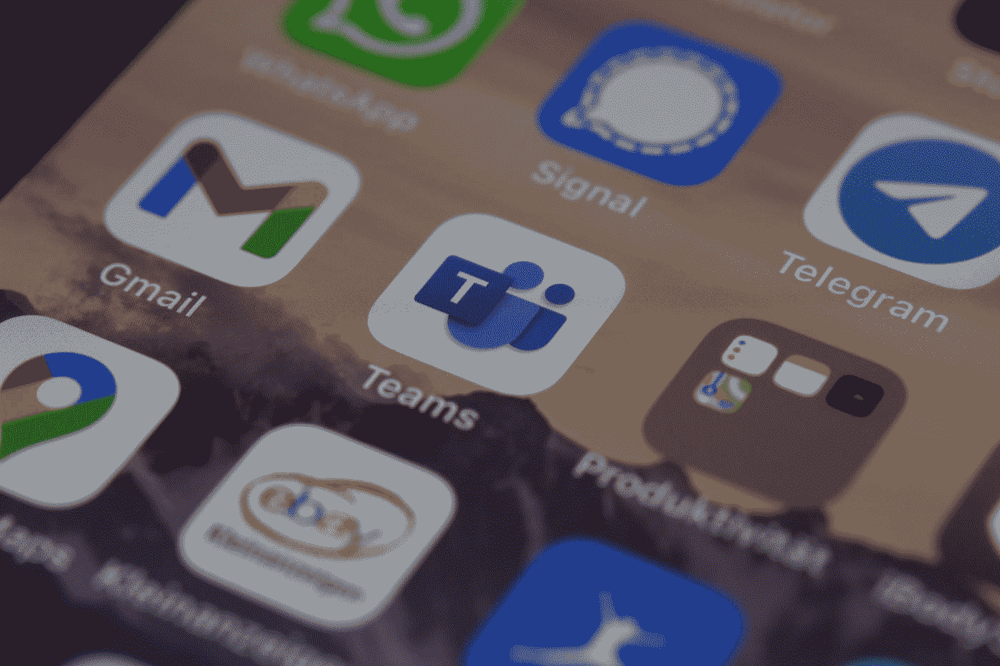
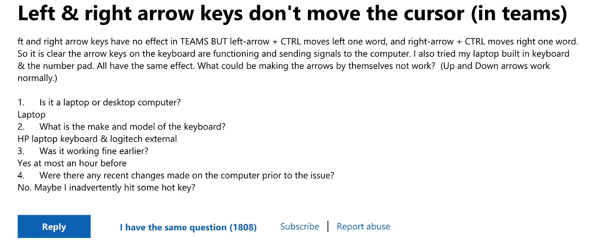

# 使用他们说的团队…

> 原文：<https://medium.com/codex/use-teams-they-said-f7b10cccc123?source=collection_archive---------12----------------------->

迪米特里·卡拉斯泰列夫在 [Unsplash](https://unsplash.com?utm_source=medium&utm_medium=referral) 上的照片

几个月后你会喜欢的，他们说…我不喜欢。尽管它已经存在了一段时间，但它有一些核心缺失的功能，有一些非常糟糕的包，可用性问题，这些都导致了整体较低的生产力，但更糟糕的是，它侵蚀了我们团队文化的许多方面。

*   [核心缺失功能](#d43b)
*   [bug](#8790)
*   [糟糕的用户界面](#f0b9)
*   [侵蚀团队文化](#1837)
*   [结论](#be9c)

# 核心缺失功能

这真的没有借口，来吧[微软设计](https://medium.com/u/d97749d23c4a?source=post_page-----f7b10cccc123--------------------------------)你可以做得更好。

1.  **您不能@没有和您聊天的人**

在团队中，你不能@某个不在当前对话中的人…微软，为什么你没有这个？一天之内，我会把人们介绍给其他人 10 到 30 次。如果没有“与人交流”的能力，那就要多花大约 3 分钟，这浪费了我每天大约一个小时的时间。在所有使用团队的公司中，由于这个缺失的特性，损失了数百个小时。

**1.2 您不能复制带有@的邮件(并使用@的作品)**

**2。私人频道会员资格不适用于分发列表**

私人频道的会员资格是通过直接邀请获得的，这意味着当有人新加入团队时，我们必须手动将他们添加到所有正确的私人频道。这是令人沮丧的团队知道我们的组织结构图，有标签，可以与安全组和分发列表连接，但实际上这些都不能用于设置私有通道的成员。

[Icons8 团队](https://unsplash.com/@icons8?utm_source=medium&utm_medium=referral)在 [Unsplash](https://unsplash.com?utm_source=medium&utm_medium=referral) 上的照片

**3。您不能将人添加到公共频道**

可发现性在团队中是一个巨大的问题。因为你不能将人们添加到公共频道，所以没有办法将人们的注意力引导到最重要的事情上。作为一名经理，这真的令人沮丧，我不得不不断地给人们发送频道链接，并让他们加入。很难找到我需要关注的频道。

# 疯狂的

在 [Unsplash](https://unsplash.com?utm_source=medium&utm_medium=referral) 上 [NeONBRAND](https://unsplash.com/@neonbrand?utm_source=medium&utm_medium=referral) 拍摄的照片

这么多 bug…但是有些觉得大到应该把羞耻铃也牵扯进来。

1.  **表演**

没有什么比团队更能把 mac book pro 变成直升机了。莫名其妙地，团队会议有时会把我的粉丝踢到 9 度。我试过关闭除了团队以外的一切。团队中的粉丝听起来像是愤怒的蟋蟀大军，这也于事无补。

**2。互联网连接**

有时候团队会破坏我的网络…我喜欢我的网络。通话将继续进行，但我无法浏览任何网站或从 Sharepoint 共享文件。我的连接在其他设备上正常，并且在我结束通话后会自动恢复。

**3。左右箭头键？**

你不会意识到你用了多少左右箭头键，直到它们不起作用。我以为我的键盘坏了，但没有箭头键在其他应用程序中工作。解决办法是 t̶h̶r̶o̶w̶ ̶T̶e̶a̶m̶s̶重启你的整个电脑。

你不能瞎编。超过 1800 人问了同样的问题，这个问题仍然没有解决。

 [## 左右箭头键不移动光标(在团队中)

### 大家好，我是 Sergio，和您一样是独立顾问和微软团队的客户，很高兴为您提供帮助。你…

answers.microsoft.com](https://answers.microsoft.com/en-us/msteams/forum/all/left-right-arrow-keys-dont-move-the-cursor-in/0005b99d-f034-4d65-89f2-c67bd7c53e67) 

**4。移动应用和桌面应用不同步**

如果您在移动应用程序中向人们发送消息，他们不会显示在团队中，除非您关闭并重新打开团队。

*摇头*

# 错误的用户界面

我感觉微软做了很多焦点小组和用户研究，然后忽略了他们收到的所有反馈。

1.  **团队中有两种完全不同的聊天方式。因为我们都希望有更多不同的交流方式。**

由 [Rahul Chakraborty](https://unsplash.com/@hckmstrrahul?utm_source=medium&utm_medium=referral) 在 [Unsplash](https://unsplash.com?utm_source=medium&utm_medium=referral) 上拍摄的照片

我是否向此人发送了聊天内容或在频道中发布了聊天内容？为什么是团队？为什么？这使得几乎所有关于团队的事情都变得加倍困难，看我需要回应什么变得加倍困难，找东西变得加倍困难…

**2。搜索或多或少不起作用**

**3。我可以继续，但第一件事太糟糕了，甚至不值得:(**

# 侵蚀团队文化

现在我们来到了最糟糕的部分。团队不鼓励娱乐和校准。

塞普·鲁兹在 [Unsplash](https://unsplash.com?utm_source=medium&utm_medium=referral) 上的照片

团队给你的表情符号和表达自己的选项很少，所以人们不会去打扰。谈话是全天候的工作。这让我内心哭泣，但我没有办法在团队中分享。

1.  **大家少说话**

切换到团队后，聊天量大大降低。现在，这可能会导致更少的分心，信息更少，更中肯。这是好事，对吧？只不过人们不再彼此建立关系。

2.**社交团队和渠道就是不行**

不管出于什么原因，所有让社交团体失败的尝试，都只会摩擦团队的结构。我曾经有一个谈论空间和分享艺术品的地方，还有笑声，我记得那里有笑声。:(

# 结论

如果没有人远程工作，我相信团队可能会没事。但是这么多人在家工作，我认为团队的成本会比你想象的要高。但我不知道，也许你想要一个沮丧的非生产性劳动力。

我越想团队，就越想知道是什么降低了工作效率，团队还是 Twitter？