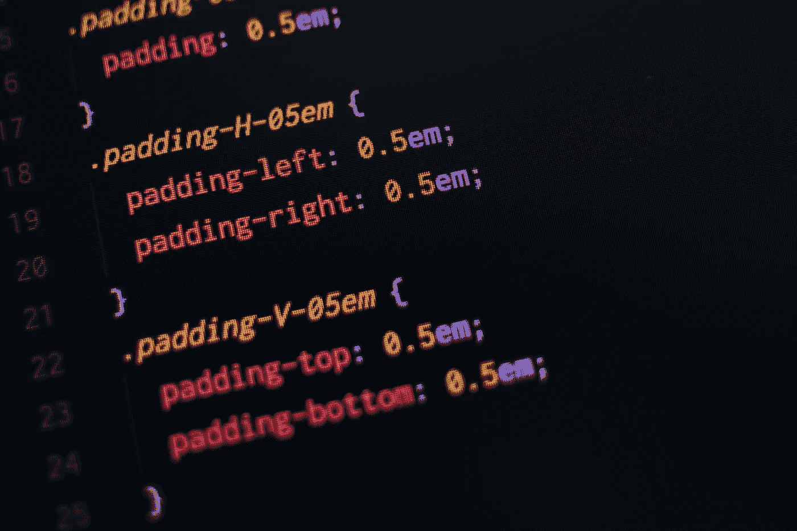

# 有用的 CSS 技巧——第 1 部分

> 原文：<https://medium.com/codex/useful-css-snippets-d6bb0b6db130?source=collection_archive---------3----------------------->

潘卡杰·帕特尔|[https://unsplash.com/photos/6JVlSdgMacE](https://unsplash.com/photos/6JVlSdgMacE)

在前端开发人员的日常工作中，会遇到为了设计特定元素的样式而使用相同样式的场景。在本文中，以下是我在日常工作中经常使用的前 5 个 CSS 技巧:

## 1.用省略号限制文本显示: