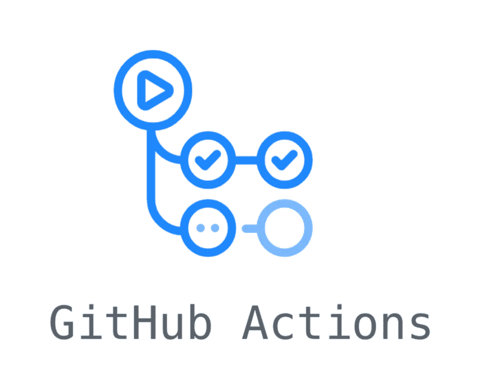

# 有效 CI/CD 流程的有用 Github 操作

> 原文：<https://medium.com/codex/useful-github-actions-for-effective-ci-cd-process-3d7ff1c7954c?source=collection_archive---------7----------------------->

> *[*在回购*](https://github.com/donvadicastro/github-actions) *中收集，但计划定期审核更新。**

**

*自动化日常工作是高效代码交付过程的关键因素。通过引入“ [actions](https://docs.github.com/en/actions/learn-github-actions/understanding-github-actions) ”，Github 允许免费为我们的项目配置 CI/CD 过程，因此没有理由不在日常代码交付例程中使用它。*

*在这篇文章中，我只是收集了有用的 Github 操作来组织高效的 CI/CD 作为我的个人备忘单。*

## *运行工作流的最常见事件类型*

*动作定义要求首先定义将要触发工作流的事件。有大量的事件可以使用，这里可以考察[和](https://docs.github.com/en/actions/learn-github-actions/events-that-trigger-workflows)，但是在日常活动中使用最广泛的有:*

*   ***预定事件***

*通常用于监控现有的打开拉取请求、陈旧分支等，定期清理工作区。*

```
*on:
  schedule:
    - cron:  '0 0 * * *' #every midnight*
```

*   ***创建或删除分支或标签***

*根据 CD 配置，可用于引导测试环境或清理不再需要的资源。*

```
*on:
  create:
  delete:*
```

*   ***创建部署***

*当有一个特定环境的部署活动时(Github 允许[将环境](https://docs.github.com/en/actions/deployment/targeting-different-environments/using-environments-for-deployment)配置为安全隔离的上下文)，管道也可以对此事件做出反应*

```
*on:
  deployment:*
```

*   ***创建/更新拉式请求内容***

*当特征分支将被合并到 master 中，并且创建了一个 pull 请求时，我们可以对此事件做出反应，并执行更复杂的特征验证*

```
*on:
  pull_request:
    types: [opened, synchronize, reopened, labeled, unlabeled]*
```

*   ***推送到特定或任何分支***

*可能是最广泛使用的事件——对交付的代码增量进行必要的验证(例如，单元测试、静态代码分析、lint 等)*

```
*on:
  push:
    branches:
      - main
      - 'releases/*'*
```

*   ***关于发布活动***

*在这种情况下，发布意味着产生一个新的发布标签，因此当有一个手动标签创建过程(例如，基于 QA 批准)时，该事件是有用的，然后自动化过程使用创建的发布标签构建和发布一个包*

```
*on:
  release:
    types: [create]*
```

# *有用的动作*

*可以根据目的跨项目重用的非常常见和广泛使用的操作列表:*

## *构建和测试*

*   ***B** [**构建项目并在每次提交时运行内部单元测试**](https://github.com/donvadicastro/github-actions/blob/main/.github/workflows/build.yml) **(包括 PR 合并)***

*可能是最常见的指令集和使用事件:每次提交都需要通过一个最简单的验证过程(代码被编译，测试通过)。*

```
*jobs:
  build:
    runs-on: ubuntu-latest
    steps:
      - uses: actions/checkout@v2
      - uses: actions/setup-node@v2
        with:
          node-version: 14
      - run: npm ci
      - **run: npm run build** test:
    runs-on: ubuntu-latest
    steps:
      - uses: actions/checkout@v2
      - run: npm ci
      - **run: npm test***
```

*   ***R***

*当特性准备就绪时，必须通过一个更复杂的验证过程:应该创建一个隔离的虚拟测试环境，向其部署特性，并通过端到端的自动化测试。*

```
*jobs:
  cypress-run:
    runs-on: ubuntu-latest
    environment: test
    steps:
      - name: Checkout
        uses: actions/checkout@v2
      - name: Cypress run
        **uses: cypress-io/github-action@v2**
        with:
          build: npm run build
          start: npm start
          **wait-on:** [**http://localhost:4200**](http://localhost:4200)
    env:
      CYPRESS_authLogin: ${{ secrets.AUTHLOGIN }}
      CYPRESS_authPass: ${{ secrets.AUTHPASS }}*
```

*   ***R** [**在 Docker 提供的基础设施上取消集成测试**](https://github.com/donvadicastro/github-actions/blob/main/.github/workflows/e2e-docker.yml)*

*对于更复杂的端到端测试场景，可能需要提供复杂的基础设施(例如用于异步通信的 Kafka、用于存储数据的 Postgres 等)。我们可以预先将所有依赖项配置为 Docker 容器，然后在集成场景中使用它们。*

```
*jobs:
  test:
    runs-on: ubuntu-latest
    steps:
      - uses: actions/checkout@v2 - name: Use Node.js
        uses: actions/setup-node@v1
        with:
          node-version: ${{ matrix.node-version }} - name: Start Redis
        run: **docker-compose up -d redis && sleep 10** - name: Start Kafka
        run: **docker-compose up -d zookeeper kafka && sleep 60**. . .*
```

*   ***R** [**un 扩展验证套件时标签分配**](https://github.com/donvadicastro/github-actions/blob/main/.github/workflows/e2e-conditional.yml)*

*通常，扩展的验证管道(包括长期运行的端到端测试、性能/安全性测试等)并不需要用于每个提交的变更，但是开发人员愿意决定何时运行。当这个决定仅仅通过分配一个特定的标签给拉式请求(例如“运行-扩展-e2e”)来控制时，非常方便*

```
*name: e2e-conditional
on:
  pull_request:
    types: [labeled]jobs:
  cypress-run:
    runs-on: ubuntu-latest
    environment: test
    if: **github.event.label.name == 'run e2e extended test suite'**
    steps:
      . . .*
```

*   ***C** [**在每次提交**时收集并上传测试覆盖率统计数据到覆盖率](https://github.com/moleculerjs/moleculer/blob/master/.github/workflows/ci.yml)*

# ***发布和版本处理***

*   *****P** [**发布工件到 NPM 注册表**](https://github.com/donvadicastro/github-actions/blob/main/.github/workflows/npm-publish.yml) **上创建新的发布标签*****

***显然，不是每个主提交都应该被认为是终端用户可用的新 NPM 模块。我们希望通过只选择发布候选项作为工作依赖项来控制模块发布过程，这样一旦管理员在项目中创建了“release tag ”,就可以配置工作流来构建工件并将其发布到 NPM 注册表。***

```
***name: publish-npm
on:
  **release:
    types: [created]**jobs:
  publish-npm:
    runs-on: ubuntu-latest
    steps:
      - uses: actions/checkout@v2
      - uses: actions/setup-node@v2
        with:
          node-version: 14
          registry-url: [https://registry.npmjs.org/](https://registry.npmjs.org/)
      - run: npm ci
      - run: npm run build
      - run: |
          git config --global user.name github-actions
          git config --global user.email github-actions@github.com
      - run: **npm publish --tag ${{github.event.release.target_commitish}}**
        env:
          NODE_AUTH_TOKEN: ${{secrets.npm_token}}***
```

*   *****B** [**ump 项目补丁版本**](https://github.com/donvadicastro/github-actions/blob/main/.github/workflows/bump.yml) **每次合并后代码为主控*****

***手动管理依赖版本确实具有挑战性。最好是自动增加每个主合并的补丁版本，这样每个主合并的 pr-merge 都有一个唯一的补丁版本***

```
***jobs:
  bump-version:
    name: 'Bump Version on master'
    runs-on: ubuntu-latest steps:
      - name: 'Checkout source code'
        uses: 'actions/checkout@v2'
        with:
          ref: ${{ github.ref }}
      - name: 'Automated Version Bump for project'
        uses: 'phips28/gh-action-bump-version@master'
        with:
          tag-prefix: 'v'
          commit-message: 'CI: bumps ROOT version to {{version}}'
        env:
          GITHUB_TOKEN: ${{ secrets.GITHUB_TOKEN }}***
```

*   *****A** [**主合并时自动将编译好的应用部署到 github.io**](https://github.com/donvadicastro/github-actions/blob/main/.github/workflows/gh-pages-publish.yml)***

*****Github 提供静态 web 资源的免费托管，因此发布过程可能包括将项目的轻量级测试版本部署到“github.io”中供内部使用(用于内部演示、更快的反馈等)。我们可以自动化这一过程，并在功能就绪时自动发布最小化的应用程序版本*****

```
*****jobs:
  build:
    name: Publish
    runs-on: ubuntu-latest

    steps:
      - uses: actions/checkout@v2
      - uses: actions/setup-node@v2
        with:
          node-version: "14"
          cache: "npm"

      - name: Install dependencies
        run: npm install

      - name: Build application
        run: npm run build

      - name: Stage build artifacts
        run: |
          git add -f client/dist/
          git status
      - name: Make commit message
        run: |
          **git config --global user.name "GitHub Actions"
          git commit -m "Deployed build artifacts (`date '+%F %T %Z'`)" || true
          git restore .**
      - name: Push build artifacts to gh-pages branch
        **run: git push origin HEAD:gh-pages --force*******
```

*   *******C*******

*****例如，如果交付阶段之一需要创建和发布 docker 图像，我们也可以将其自动化，并通过手动创建发布标签来控制此流程。*****

# *****项目质量*****

*   *******E*******

*****在不同版本之间保持 changelog 最新是非常重要的。它有助于清楚地了解特定版本升级带来的变化。但是手动控制它是一个很大的挑战，因为增加了人为错误的可能性——忘记更新所需的文件。因此，这种保护可以是自动的—如果在 pull 请求中没有检测到对 CHANGELOG.md 的更新，CI 可能会失败。*****

```
*****jobs:
  changelog:
    runs-on: ubuntu-latest

    steps:
      - uses: actions/checkout@v2
      - name: Check for CHANGELOG changes
        run: |
          if [[$(git diff --name-only FETCH_HEAD | grep CHANGELOG)]]
          then
            **echo "A CHANGELOG was modified. Looks good!"**
          else
            **echo "No CHANGELOG was modified."** echo "Please add a CHANGELOG entry" **false**
          fi*****
```

*   *****[**为每个现有待办事宜创建单独的问题**](https://github.com/donvadicastro/github-actions/blob/main/.github/workflows/todo.yml)*****
*   *****[](https://github.com/donvadicastro/github-actions/blob/main/.github/workflows/cron.yml)****【午夜】定期监控过时和陈旧的拉式请求*********
*   *****[**在代码中创建架构图参见**](https://github.com/donvadicastro/github-actions/blob/main/.github/workflows/codesee.yml) **关于主合并*******

*****对于复杂的项目，创建架构图降低了项目启动的复杂性，并增加了对总体高层次项目视图的理解。需要额外注册 codesee API 密钥作为存储库密码，以允许远程导入数据。*****

# *****通知配置项助手*****

*   *******得到** [**懈怠通知**](https://github.com/nrwl/nx/blob/master/.github/workflows/npm-audit.yml) **发布神器发布*******
*   *******得到** [**不和谐通知**](https://github.com/moleculerjs/moleculer/blob/master/.github/workflows/notification.yml) **发布神器*******

# *****贡献 CI 助手*****

*   *******在** [**拉式请求**](https://github.com/vegasbrianc/prometheus/blob/master/.github/workflows/greetings.yml) **或** [**问题**](https://github.com/debezium/debezium/blob/main/.github/workflows/contributor-check.yml) 上生成第一条评论——当需要描述投稿流程时，我们可以在创建拉式请求或问题后自动发布评论*****
*   *******确保提交注释包含** [**JIRA 票证**](https://github.com/debezium/debezium/blob/main/.github/workflows/sanity-check.yml) —如果链接到 JIRA 是公司的严格要求，那么我们可以通过检查每个提交注释来遵守此要求，如果命名不符合要求，则 CI 失败。*****
*   *****[**合并到 master** 后重新格式化代码](https://github.com/remix-run/remix/blob/main/.github/workflows/format.yml)**——为了保持所有开发人员和项目的代码风格一致，我们可以在提交时重新格式化代码，而不是同步开发人员环境。*******

*****B 责任:习惯于定期使用 Github 动作，并轻松地在本地重新检查配置——有一个优秀的开源实用程序 [ACT](https://github.com/nektos/act) 允许在发布到云之前，在本地运行每个定义好的动作在它自己的 docker 容器中。*****