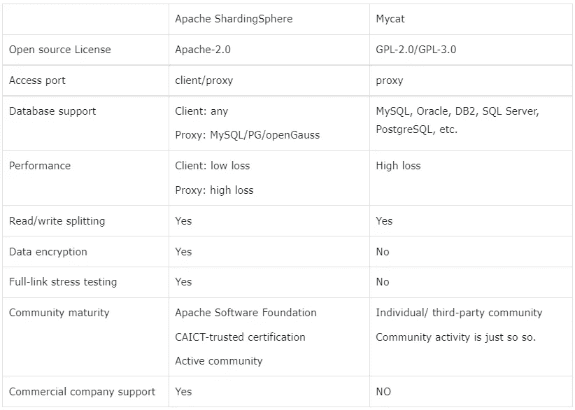
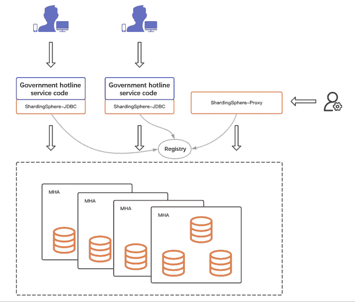

# 用户案例:中国联通数字技术-确保稳定、高效和可复制性

> 原文：<https://medium.com/codex/user-case-shardingsphere-x-china-unicom-digital-technology-fffd1980c443?source=collection_archive---------20----------------------->

中国联通数码科技是中国联通的子公司，中国联通是全球领先的电信运营商，截至 2021 年拥有超过 3.1 亿用户。

公司整合了中国联通的云计算、大数据、物联网、人工智能、区块链、安全等能力，涉及智慧城市、工业互联网、生态保护、文化旅游等领域。

联通数码科技积累了大量的行业标杆案例，成功地为客户提供了多样化、专业化的产品和服务。

## 背景

近年来，在联通数码科技的帮助下，数十个服务热线平台已经开通，旨在改善企业和政府服务。

服务热线的特点是高并发、大数据量。每次我们拨打热线，都会生成一个工作订单记录。疫情期间一条热线的业务量比以往翻了几番。

在政府或应急服务热线工单模块中，为满足海量数据和高稳定性的业务需求，联通数码科技采用[分片域](https://shardingsphere.apache.org)进行工单信息的分片和存储。

## 业务挑战

政府服务热线是政府与企业和公众互动的主要渠道。它通过一个电话号码为公众提供 24/7 的服务。

除了处理工单，还涉及话务、Wiki、语音聊天等服务。

在系统规划阶段，数据库层是业务系统的基石，因此技术选择过程至关重要。系统稳定性是硬指标，其次是性能，直接影响热线的服务能力。

同时，它应该允许容易的维护和管理，并促进系统升级和后端维护。

热线服务对数据库架构选择提出了以下要求:

*   成熟和稳定
*   高性能
*   易于维护
*   业务代码的低耦合

## 联通数码科技为什么选择 ShardingSphere？

技术团队从稳定性、特性、访问方式、产品性能等方面进行了多轮研究和测试，最终选择了“ShardingSphere + [、MySQL](https://www.mysql.com/) ”分布式数据库解决方案。

*   **高级概念**

越来越多的应用场景加剧了数据库碎片化。 [Database Plus](https://faun.pub/whats-the-database-plus-concepand-what-challenges-can-it-solve-715920ba65aa) 旨在碎片化的异构数据库之上构建一个生态系统，并为数据库提供增强功能。

此外，它可以防止数据库绑定，实现独立控制，向原始数据库添加更多功能，并提高数据基础架构的整体功能上限。

*   **成熟与稳定**

ShardingSphere 项目始于 2016 年。经过多年的 R&D 和迭代，该项目已经得到了完善，并在多个互联网场景中证明了其稳定性、成熟度和可靠性。

*   **综合特性**

除了分片功能，ShardingSphere 还支持数据加密和解密以及影子数据库，这些也是技术团队的评估指标。

安全和压力测试的场景需求可以通过一组技术栈来满足。ShardingSphere 的功能为热线系统的构建和架构扩展提供了更好的支持。

*   **高兼容性/易于访问**

ShardingSphere 与 MySQL 协议兼容，支持多种语法。在开发过程中，几乎不需要担心 SQL 的访问，因为它真的很方便。

*   **高性能**

热线占线时，数千名值班话务员在线。工单记录包括数千万条记录，这就产生了一定的性能需求。

ShardingSphere-JDBC 定位为轻量级 Java 框架，具有理想的压力测试结果和数据，能够满足政府系统服务能力的要求。

*   **简化操作&维护**

基于 JDBC 的高性能，ShardingSphere 还提供了一个对运营团队友好的代理，可以使用通用客户端直接访问。

除了上述五个关键考虑因素的权衡之外，还考虑了其他数据库中间件产品。下表显示了 ShardingSphere 和 [MyCat](http://mycat.sourceforge.net) 之间的比较。

## 解决方法

由于“ShardingSphere+MySQL”确保了稳定性、易用性和终极性能，该配置已被复制并用于联通数码科技的许多政府和企业服务热线项目中。

*   **部署模式**

[分片球-JDBC](https://shardingsphere.apache.org/document/current/en/overview/#shardingsphere-jdbc) 和[分片球-代理](https://shardingsphere.apache.org/document/current/en/quick-start/shardingsphere-proxy-quick-start/)的结合确保了系统的性能和可维护性。

*   **分片密钥/分片算法**

热线服务的工单表比较大，逻辑简单好用。因此，选择工单 ID 作为分片键，通过哈希算法分发数据。

*   **迁移**

新项目不涉及历史数据，不需要考虑数据迁移过程，上线就可以直接使用。

*   **实施流程**

由于技术方案的综合评估和多份方案，实施过程是顺利的。

*   **系统架构**

热线服务模块采用微服务架构

热线服务的业务模块采用微服务架构，节点从十个到几十个不等，视具体省市规模而定。在数据库层，物理机用于部署三节点 MHA。每个热线系统一般需要四套 MHA。

## 优势

> 商业

*   **支持客户端模式。**最大程度保证政府热线的性能要求。
*   **系统稳定性**为业务连续性提供强有力的支持。

> **R & D**

*   **兼容性极佳**。兼容主流数据库 SQL 语法，对接后即可使用。
*   **综合特征**。支持读写拆分、数据加密、全链路压力测试，系统扩展性强。

> **OPS**

*   支持代理模式，为 Ops 团队提供**易维护**。

> **技术选择**

*   它防止了数据库绑定，并为将来的升级提供了足够的灵活性。

# 结论

中国联通数码科技的热线服务案例验证了 ShardingSphere 支持政府服务场景的能力，进一步证明了 ShardingSphere 可以应用于任何行业。

# 项目链接:

[ShardingSphere Github](https://github.com/apache/shardingsphere/issues?page=1&q=is%3Aopen+is%3Aissue+label%3A%22project%3A+OpenForce+2022%22)

[ShardingSphere Twitter](https://twitter.com/ShardingSphere)

[切割球松弛度](https://join.slack.com/t/apacheshardingsphere/shared_invite/zt-sbdde7ie-SjDqo9~I4rYcR18bq0SYTg)

[投稿指南](https://shardingsphere.apache.org/community/cn/contribute/)