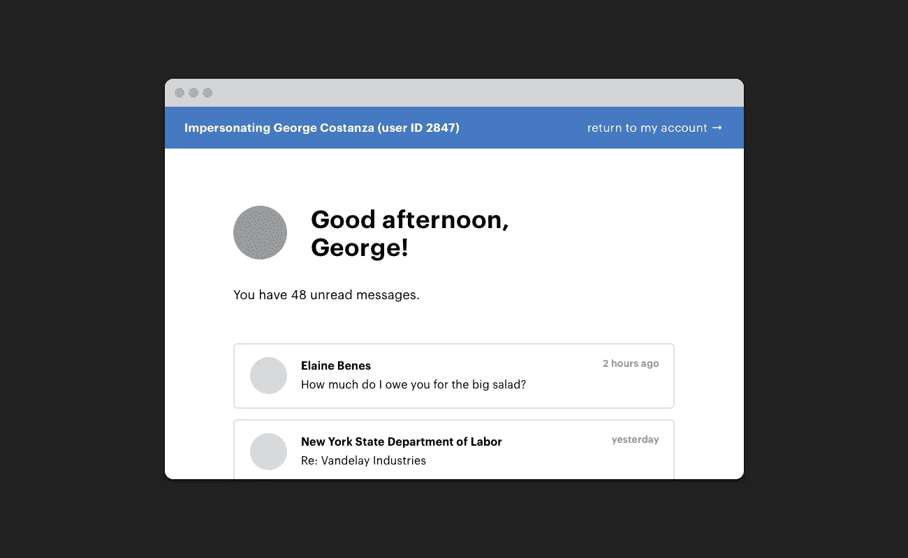

# AWS Cognito 中的用户模拟

> 原文：<https://medium.com/codex/user-impersonation-in-aws-cognito-dba39219f467?source=collection_archive---------0----------------------->

## [法典](http://medium.com/codex)

我已经在最近的几个项目中使用了 [AWS Cognito](https://aws.amazon.com/cognito/) 。当你在 AWS Lambda 上构建无服务器应用时，使用它是非常有意义的，因为它就在那里，是生态系统的一部分。

我也绝对不想再构建自己的认证系统了。去过那里，做过那件事，引入了安全问题，答应自己永远不要这样做…