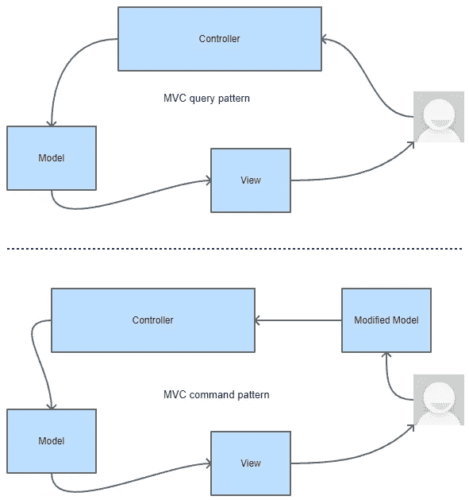
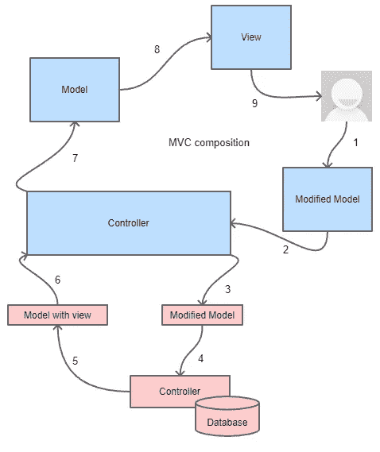
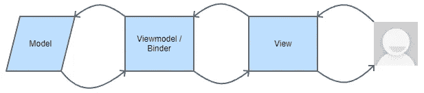
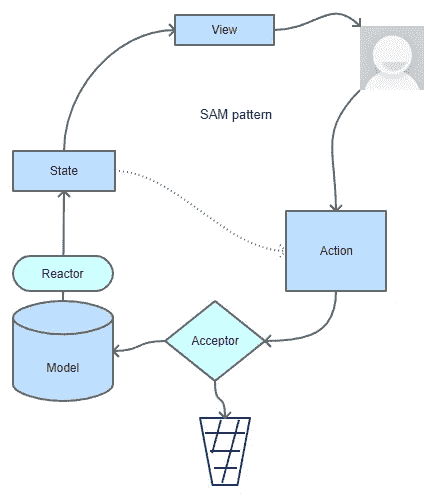
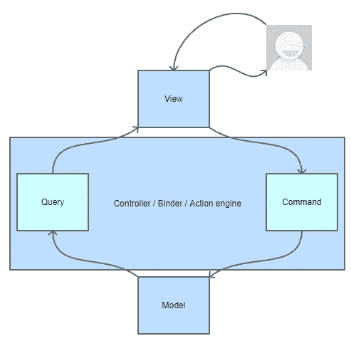
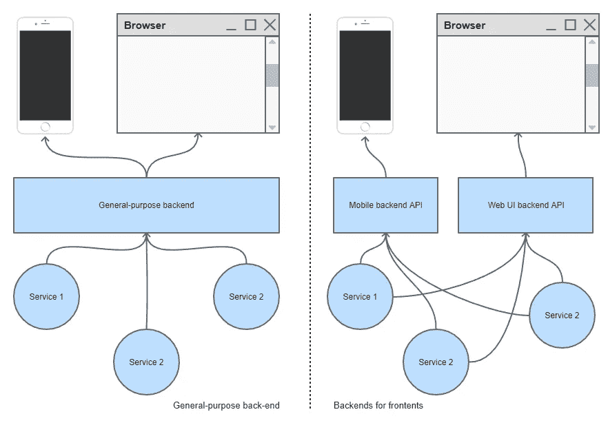

# 用户界面软件设计模式，重温

> 原文：<https://medium.com/codex/user-interfacing-software-design-patterns-revisited-2ac1dcfd445d?source=collection_archive---------5----------------------->

凯利·西克玛在 [Unsplash](https://unsplash.com?utm_source=medium&utm_medium=referral) 上的照片

当开发面向大众的软件时，最重要的是正确地与用户交互。如果对他们来说，浏览你的应用程序绝对是一场噩梦的话，没有人会在乎幕后有没有花哨的设计模式。

尽管如此，记住有两类人在使用你的软件也是很重要的:用户和开发者。一个软件的成功依赖于与用户的交互，而一个软件开发团队的成功依赖于它如何构建软件。在这个阶段，设计模式变得很重要。

接下来，让我们看看一直延伸到用户交互的设计模式。我们将研究 MVC(模型-视图-控制器)、MVVM(模型-视图-视图模型)、萨姆(状态-动作-模型)和 CQRS(命令-查询责任分离)，以及 BFF(后端对前端)“反”模式。

在这个故事中需要注意的一点是，这些模式是从 web 应用程序的角度来考察的，在应用于其他任何东西时，可能需要稍作调整。

# 手动音量调节

MVC 代表模型-视图-控制器，可能是列表中最古老的，是在 20 世纪 70 年代发明的。

MVC 模式:查询(顶部)和命令(底部)

用户的主要入口点是控制器，它公开操作。当用户决定与软件交互时，他们通过调用控制器上的动作来实现。然后，控制器做它应该做的事情，并创建一个模型，它本质上是一个结构化的数据包，并在其上应用一个视图，该视图将数据转换成可以发送回客户端的格式(在 web 应用程序的情况下是 HTML)。然后，客户端向用户显示数据，整个系统暂停，等待用户的进一步操作。

如果用户决定与呈现在他们面前的东西进行交互，他们可以对模型进行修改，并可以通过一个动作(可以是相同的，但不是必须的)将其提交回控制器。控制器将采用修改后的模型，并在验证(这取决于框架和业务逻辑，可以在多个地方以多种方式发生)后开始做动作应该做的事情。完成后，它生成另一个模型，并在其上应用一个视图，将其发送回用户。

一些关键的东西要拿出来:

*   MVC 仅仅是对用户的请求做出反应(不管是手动的还是自动的)，根据定义，离开用户什么都不做；某些动作可以由浏览器自动调用，但是对于控制器来说，它们将显示为用户调用的动作，因为它(原则上)无法判断是一段 JavaScript 代码在执行请求
*   这种模式是以控制器和动作为中心的——控制器和它们公开的动作是为了使这种模式工作而实际需要存在的唯一组件；控制器可能不创建或接受模型，或者可能根本不需要模型，并且实际上可能没有视图本身(除非您将原始数据输出为符合 HTTP 的格式视为某种默认视图)
*   就数据呈现给用户的方式而言，更改相对容易——包括对浏览器、各种视窗等的扩展支持。，不影响应用程序的业务逻辑；即使你确实引入了一个 bug，如果 MVC 做得正确，并且模型得到了很好的验证(这通常是一个困难的任务)，在大多数情况下发现和纠正它应该是相当容易的
*   有了好的基于 MVC 的设计，CQRS 和关注点分离都很容易实现
*   概念化测试相对容易，但实际编写测试相对困难，因为控制器内部存在严重的紧密耦合，尤其是与底层框架的紧密耦合(ASP.NET MVC 就是一个很好的例子，因为在大多数情况下，对底层框架的调用不能被抽象掉，而且这种调用对于许多功能来说是必要的)
*   许多开发人员假设模型与持久性模型(例如，数据库模型)有某种联系，但这是不正确的，因为 MVC 模式没有这样的要求，模型是否以任何方式匹配数据库完全由实现者决定，数据库模型可以服从组合或相关的 MVC 模式，如下所述:

MVC 中的组合

MVC 是一种易于理解、易于实现的模式，但是也容易被误解，并且非常容易被误用。使用这种模式的开发人员最大的缺点是:

*   没有意识到他们在不应该的时候使用了合成
*   看不到底层框架的所有链接，以及随之而来的紧密耦合
*   在业务逻辑中混合 UI 代码(尤其是在不鼓励紧密分离的框架中，比如 Blazor)
*   糟糕的模型/视图设计，导致业务数据、运营数据和 UI 数据之间的界限模糊
*   设计不良的中间件，在不应该的时候干扰正常操作，或者在应该的时候不干扰正常操作
*   由于糟糕的执行路径设计而导致脆弱的请求状态，特别是对于实际上要求异步操作的底层框架

MVC 是一种久经考验的设计模式，经受住了时间的考验，但正在成为过去，因为越来越多的开发人员设法将他们的头脑包裹在控制流、安全性、CQRS、可伸缩性、大规模并行性等高级概念上。

延伸阅读:

*   Martin Fowler 的 MVC 和其他 UI 架构的历史: [GUI 架构(martinfowler.com)](https://martinfowler.com/eaaDev/uiArchs.html)
*   ASP。NET MVC:【ASP.NET MVC 模式|。NET(microsoft.com)

# MVVM

MVVM 代表模型-视图-视图模型，从用户交互设计的角度来看，乍一看，它是 MVC 模式的对立面。

MVVM 模式

MVVM 的入口是视图，所有与用户的交互都是通过它完成的。视图规定了向用户呈现什么数据，以及如何呈现。视图有它自己的生命，并且在实践中，组成应用程序的视图集合中的任何视图可能有也可能没有任何其他组件，同时仍然正确地实现作为一个整体的模式。

MVVM 中的视图通常被认为是声明性的，这意味着它们应该是数据和一切如何绑定的声明，以及命令性的，这意味着用户可用的各种操作是通过绑定到命令来声明的(或者通过一个非常类似的可重写系统来声明默认操作或内部工作)。在这种情况下。NET 环境中，这是通过可扩展应用程序标记语言(XAML)实现的。

模型是域模型，或者，实际上，是我们希望操作的任何数据模型(它可能是也可能不是数据访问模型，或者数据库模型，或者 REST/SOAP 数据模型，等等)。)，限制不大。

视图模型基本上是一个对用户界面有用的模型抽象，用于将事物连接在一起，并保存模型和视图之间的所有中间状态。视图模型，作为一个抽象的概念，不需要以任何方式起作用，然而，在实践中，支持 UI 的逻辑，支持模型上的变化的逻辑，以及视图的内部状态，都保存在视图模型中。

如上图所述，附件是活页夹，其目的是将视图的各个部分与视图模型的各个部分联系起来，并且通常是 MVVM 绑定系统的核心，在任何框架中都会有不同的具体实现。

一些关键的东西要拿出来:

*   MVVM 是以视图为中心的，这意味着用户交互是其哲学的中心，并且清楚地分离了模型，这意味着唯一紧密耦合并且总是受非表面变化影响的组件是视图模型(注意:视图模型只是在概念上与视图紧密耦合——在实践中，由于它们依赖于完全不同的编写风格，大多数编译器和 ide 不会注意到许多可能的错误，特别是如果绑定不是类型安全的，这只会在运行时出现；一个特别烦人的实现是 WPF，它的绑定系统依赖于可视化树，这并不总是开发者所期望的)
*   MVVM 提供了模型和视图之间的分离，但是视图-模型与两者紧密耦合
*   除非有人把他们的设计搞得一团糟，否则支持 UI 的代码应该与模型完全分离
*   MVVM 的组合可以在任何层次上完成，每个视图都可以分解成子组件，子组件通过自己的视图模型、与父视图模型相同的模型、与父视图模型相同的模型，或者以上任意数量的组合来实现自己的 MVVM 模式(组件可以同时使用父视图模型和自己的视图模型，模型也是如此)
*   单元测试和模拟相当容易
*   相比之下，MVVM 模型的学习曲线很陡

延伸阅读:

*   杰瑞米·利克内斯(Jeremy Likness)MVVM 简介:[模型-视图-视图模型(MVVM)讲解|终身开发者(jeremylikness.com)](https://blog.jeremylikness.com/blog/model-view-viewmodel-mvvm-explained/)
*   SyncFusion 关于布拉佐尔的 MVVM 的文章，作者 Marco Dalla Libera: [布拉佐尔的 MVVM 国家管理模式——完全指南| Syncfusion 博客](https://www.syncfusion.com/blogs/post/mvvm-pattern-in-blazor-for-state-management.aspx)

# 地对空导弹

SAM 代表 State-Action-Model，与之前描述的体系结构不同，它明确区分了域驱动模型和应用程序状态，并为域驱动模型提供了明确的选项，使其能够根据自己的规则更新自己。

SAM 模式

向用户呈现一个视图，它是应用程序状态的纯函数。该视图的工作方式与人们期望的 MVC 视图非常相似。

然后用户有机会执行一个动作。事实上，一个动作是一个以某种方式改变模型的提议，这个提议通过它自己的一组验证器(在实践中，这些验证器验证提议的改变在形式上是否有效)，移动到模型。

模型通过接受者(考虑到模型的当前状态，根据业务规则验证提议的变更是否有效)，选择是接受提议的变更，还是丢弃它。

如果模型接受提议的改变，它将合并该改变，并使它自己的内部状态根据该改变有效，然后或者对其作出反应，更新应用程序状态(通过反应器)，或者通过使状态了解突变(通过学习器)，作为回报，该状态可以根据它自己的规则，提议新的动作，和/或更新呈现给它的用户的视图。

要拿出来的关键东西:

*   SAM 模式赋予模型自己的生命，强调关于它的领域规则，同时将它与视图完全分离
*   该模式将模型的突变作为状态变化的来源
*   该视图在数学上可以描述为在任何时刻状态的纯函数，并且应该随着状态的变化而重新计算
*   SAM 回避了管理事件订阅的想法，而是依赖于用户的交互来推送状态突变的建议
*   SAM 源于 TLA+，这是一种软件建模语言，由 Leslie Lamport 教授创建，是微软研究院的一部分

延伸阅读:

*   SAM 模式: [SAM —状态|操作|模型](http://sam.js.org/)
*   【lamport.azurewebsites.net】【TLA+】首页
*   Jean-Jacques Dubray 的 InfoQ 文章公开反对 MVC 并介绍了 SAM:【infoq.com，为什么我不再使用 MVC 框架

# CQRS

CQRS 主张命令-查询责任分离，他建议任何命令/动作/事件处理程序都应该是单向的，也就是说，它要么查询数据，要么改变数据。它不是对以前模式的替代，而是对它们的补充。

CQRS 模式

查询部分表示单向的数据选择、转换和排列，目的是以特定的和期望的格式(或者是视图，或者是导出，或者是报告)向用户提供数据。

命令部分代表单向数据突变。

然而，实际上，很多时候，该命令也有一个查询部分，用于检索它已经变异的实体，以便向用户显示它的新状态。这通常由只关注一个实体的小页面使用，这通常与域实体有几乎一对一的映射。

虽然这种实际情况没有实现最严格定义的 CQRS，但它通常被认为是一种可接受的实践，因为一个实体不太可能以只影响其书写方式而不影响其阅读方式的方式发生变化。

在 MVC 中实现 CQRS 是相当容易的，因为控制器中的动作可以被专门设计为查询或变异。例如，在 ASP.NET MVC 和其他大多数涉及 HTTP 的框架中，人们可能会认为其目的是从一开始就支持这种模式的专门实现。

对于 MVVM，事情没有那么简单，因为突变和数据绑定的简单效果之间不一定有明确的区别。由于(通常是不正确的，或者至少是过于急切的)绑定逻辑会使底层模型发生超出 UI 逻辑所要求的变化，因此 CQRS 最好严格地在视图模型内部实现，也就是说，即使视图模型由于数据绑定而使其内部状态发生变化，这些变化也不会影响底层模型，除非一个命令(比如一个概念性的“save”)触发了这种变化。

山姆并不太关心 CQRS，因为突变仅仅是模型的意愿(因此从 CQRS 的角度来看“命令”的概念并不特别相关)，而视图(作为一个概念上的查询)基本上是国家的功能。从接受者和反应者/学习者的角度来看，CQRS 在定义上是实现的。

几样东西要拿出来:

*   CQRS 的目标是让数据单向流动，以简化应用程序
*   通过将查询从命令中分离出来，CQRS 旨在通过减少易变来源的数量来隔离应用程序中的变化；如果一个实体改变了它的结构，但不是以影响某些查询的方式，则这些查询不需要被触及；类似地，如果某个查询因某种业务需求而改变，那么就不需要修改命令，即使该查询被扩展以包括新的实体
*   复杂的域从 CQRS 中受益最多，尤其是在应用程序设计中结合单点更改策略时，尽管在实践中，这并不总是可能的
*   对于资源访问同步需要特别小心，因为一个遵循严格 CQRS 的实现不佳的多线程应用程序几乎肯定会出现许多不一致的问题和竞争情况

延伸阅读:

*   马丁·福勒的 CQRS 文章:[(martinfowler.com)CQRS](https://www.martinfowler.com/bliki/CQRS.html)
*   微软的 Azure 架构中心文章: [CQRS 模式— Azure 架构中心|微软文档](https://docs.microsoft.com/en-us/azure/architecture/patterns/cqrs)

# 最好的朋友

Sam Newman 的 BFF 被许多人认为是一种反模式或滑稽的最后手段模式，它代表后端对前端，可以被认为是对通用后端 API 架构的有力批评，也可以被认为是在没有理由拥有通用后端 API 架构时的一种有用模式。

通用后端(左)和 BFF 模式(右)

这种模式背后的思想是，独特的前端(或前端类别)有独特的需求，因此，也应该有独特的后端(或者至少是面向公众的 API 集)。

这个想法已经被广泛使用，因为基于 AJAX 的 web 应用程序的需求不同于 iOS 应用程序的需求，例如，在会话管理、安全性、信任、可访问性、数据流等方面。因此，我们的想法是，没有理由用有限的 API 来增加应用程序拥有更好的 API 功能的负担。

类似地，可以通过多种方式进行通信(最简单的例子是使用 web sockets 技术的 web 程序集，而不是传统的基于 AJAX 的应用程序)，这意味着一些 API 工具可以极大地提高性能、速度和特性，而这对于通用后端来说是非常困难的。

一些关键的东西要拿出来:

*   BFF 基于不同类型的前端和/或客户端之间的框架、硬件和底层系统设施的不平等
*   被许多纯粹主义者认为是一种反模式，BFF 背后的思想实际上在特定的环境中非常有用
*   BFF 并不一定意味着不能实现其他模式——事实上，每个后端都可以正确、完整地实现其他模式
*   当实现 BFF 时，总是存在代码重复的风险——在这种情况下，要么使后端具有一个公共根，要么，根据重复代码的性质，可以为该公共部分实现一个新的服务
*   BFF 也可以面向外部服务消费者实现，这意味着在同一组服务上，不同的下游服务(联合、流等。)将连接到不同的“前端”
*   BFF 是一种跨团队并行开发的方式，同时提供了自治
*   BFF 的一个关键问题是保持功能的同步，这意味着产品所有者将更难管理这样的架构选择

延伸阅读:

*   萨姆·纽曼的介绍和理由:[萨姆·纽曼——前端的后端](https://samnewman.io/patterns/architectural/bff/)
*   Lukasz Plotnicki 关于 SoundCloud 的 BFF:[BFF @ SoundCloud | ThoughtWorks](https://www.thoughtworks.com/insights/blog/bff-soundcloud)
*   微软简介:[前端模式的后端—云设计模式|微软文档](https://docs.microsoft.com/en-us/azure/architecture/patterns/backends-for-frontends)(特别是相关指导部分)