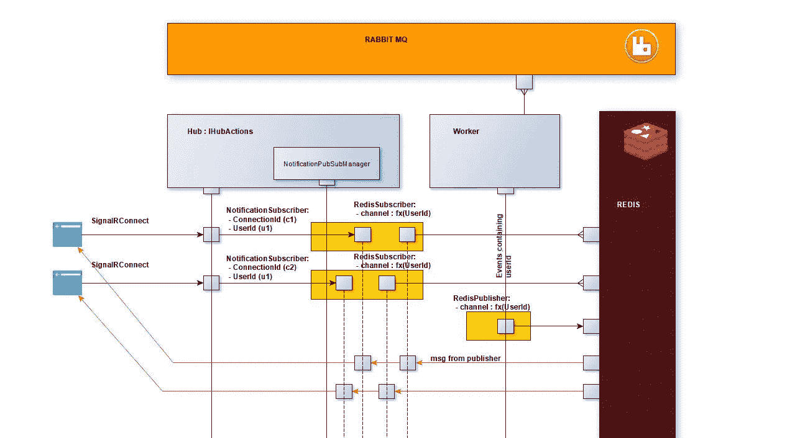
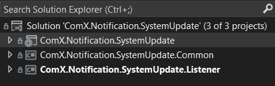

# 设计用户通知系统

> 原文：<https://medium.com/codex/user-notification-system-744dfd0a237c?source=collection_archive---------1----------------------->

## 通知您的用户

[Firmbee](https://unsplash.com/@firmbee) 在 [Unsplash](https://unsplash.com/?utm_source=medium&utm_medium=referral) 上的照片

到目前为止，我在职业生涯中遇到的主要系统工程任务之一是实现一个异步通信机制，该机制将遵守以下要求:

*   系统必须是可伸缩的(多个 SignalR 实例、多个代理监听器、多个 Redis 底板服务器)
*   通信必须是异步的
*   系统必须是无状态的(我们可以在不同的服务器上有多个 signalR 客户端，在其他服务器上有 publisher，我们必须确保它们之间没有耦合)

## 要求:

*   发送用户通知将到达订阅该通知的所有用户设备上的特定用户
*   从向代理发布通知的那一刻起，直到用户的端点(所有设备)，通知必须是可跟踪的

我的技术堆栈如下:

**SignalR，RabbitMQ，Redis**

要了解有关此[的更多信息，请访问 https://docs . Microsoft . com/en-us/aspnet/core/signalr/redis-back plane？view=aspnetcore-5.0](https://docs.microsoft.com/en-us/aspnet/core/signalr/redis-backplane?view=aspnetcore-5.0)

## 设计

一个简单的原理图(原谅我的设计，我没有上过绘图系统架构的课)

该框架将提供创建用户通知系统所需的机制，并将基于 Redis 的消息构造为控制器和动作，使其更容易使用。

这种机制(将是一种既有信号集线器又有监听器来接收用户通知的服务)。

## 图书馆

您可以在以下位置找到该库:

 [## hub notification system/digit Teck。hub notification system/digit Teck。中枢通知系统在主…

### 一个使用带有 redis 背板的 signalR 创建用户通知系统的库。…

github.com](https://github.com/ramihamati/hubnotificationsystem/tree/main/Digitteck.HubNotificationSystem/Digitteck.HubNotificationSystem) 

## 流动

1.  当用户通过身份验证后，他将使用 sinalR 连接到`the service`。然后，该服务将在内存中存储这对`userId-connectionId`。每个用户可以有多个连接，但每对都是唯一的。
2.  对于每个独特的用户，该服务将订阅其 Redis 频道。在用户的 redis 通道中流动的消息具有相同的结构，它是一个交换模型，包含消息体以及关于控制器名称和消息的信息。通过控制器处理 redis 消息，然后通过 signalR 推送的示例

保持用户连接活动的集线器，如果需要，将发送用户通知。每个 signalR 实例将搜索用户可能拥有的所有连接

将侦听 Redis 的通知更新的侦听器。Redis 就像一个发布订阅机制。它被用作所有 sinalR 集线器的背板。Redis 发布-订阅包含每个用户作为一个通道。

**为什么是 redis？**在速度优势的背后……我使用了 pub sub 机制，虽然它也可以与其他 pub/sub 机制一起工作，但 Redis pub sub 非常简单快速，它可以启动并忘记。我们不会在内存中保存任何东西。消息被立即推送给任何活动订户(如果有的话)。在 Redis 中发布和订阅一个频道，计算成本很小，这才是我们真正需要的。

3.工人:

工人指的是一个项目，这个项目让消费者听一个代理(例如 RabbitMQ)。它不是框架的一部分，但是框架提供了一个`notification publisher`,用于通过某些 redis 路由向某个用户发布消息。

**为什么出版要先交给经纪人？**

因为我们不想堵塞系统。我们可以在 Rabbit 中实现一个 time to live，一个接一个地处理所有消息。

# 例子

我们的解决方案有两个项目:

*   NotificationManager(通知。系统更新):signalR 和 redis 监听器
*   NotificationPublisher(通知。将消息发布到 redis

## 通知经理

注册服务:

*   RegisterController:这个系统使用类似控制器的方法来处理发布到 redis 的各种消息。这里我们注册一个控制器类型。
*   RegisterTopology:用于密钥创建

IHubUserPushback 和 HubUserPushback 正在使用操作定义 signalR hub

对于 signal R hub，我们只需要声明接口方法(客户端回调)，订阅和取消订阅在后台处理。我们只需要创建一个从`NotificationHub`派生的 hub

库类 NotificationHub 将实现 subscribe 和 unsubscribe 方法，您只需要从 from 端连接到 Hub。要了解有关从 typescript 客户端发送不记名令牌的更多信息，请阅读下面的[https://docs . Microsoft . com/en-us/aspnet/core/signalr/authn-and-authz？view=aspnetcore-5.0](https://docs.microsoft.com/en-us/aspnet/core/signalr/authn-and-authz?view=aspnetcore-5.0)

Redis 控制器的作用是

当收到包含正确路由信息的 redis 消息时，将自动调用该控制器。(参见发布者部分)

## 通知发布者

这个工作者监听一个代理(在我的例子中，我选择了 RabbitMQ 和 MassTransit ),当收到一条消息时，我们使用发布者将消息推送到 Redis(由管理器获取并推送到用户的设备)

注册服务:

这里我们明确地注册了所有的路由(因为我们需要将这些信息添加到 Redis 交换模型中

经纪人的消费者