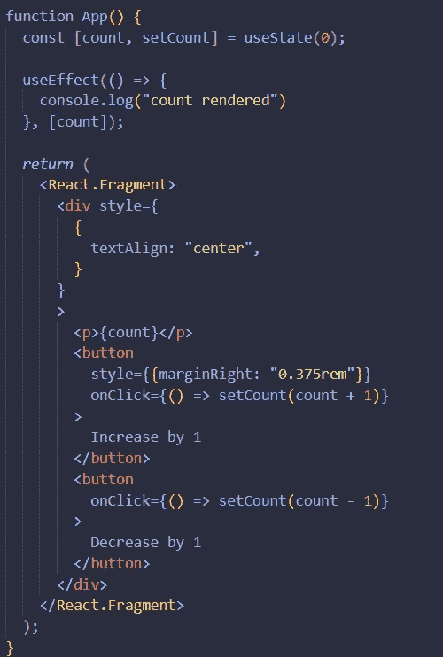
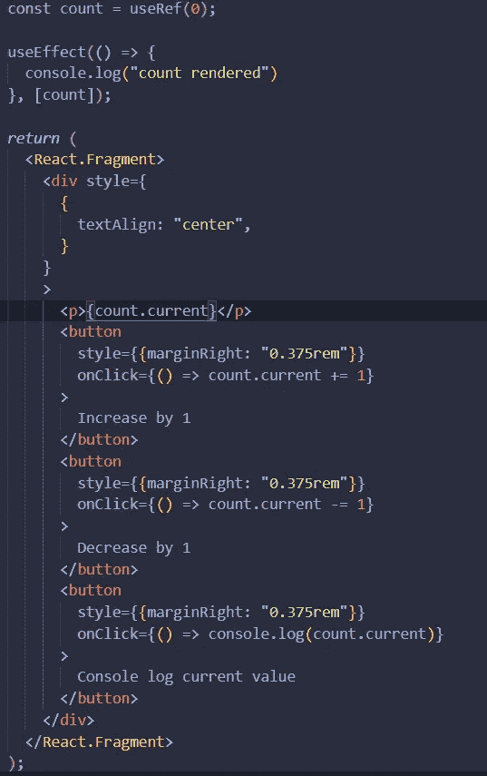
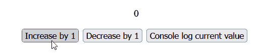
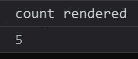

# useRef 和 useState，应该用哪个，为什么？

> 原文：<https://medium.com/codex/useref-and-usestate-which-one-should-you-use-and-why-b9853dff9e38?source=collection_archive---------6----------------------->

你对 useRef 和 useState 了解多少？好吧，如果你有任何疑问，你和我需要谈一谈。首先，我觉得有必要重申理解 useRef 和 useState 钩子的重要性。除了所有的优化之外，useRef 和 useState 是 React 中两个重要的核心钩子。先说 useState。

# 使用状态

根据[官方文档](https://reactjs.org/docs/hooks-reference.html#usestate)，它们返回一个有状态值和一个更新它的函数，但这并不意味着什么，不是吗？useState 允许你声明一个状态和一个函数来操作你声明的状态。本文假设您至少对 React 有一个基本的了解，所以我不会深入探究什么是状态以及为什么您需要操纵它。然而，有一个重要的信息你需要知道。每次使用 useState 操作状态时，组件都会被重新呈现，但也不会就此结束。不管他们是否将该组件作为道具使用，该组件的子组件也会被重新呈现。我们来看一个非常基础的反 app 例子。

我们有一个状态叫做“计数”，它的初始值是 0。我们有一个名为“setCount”的 setter 函数我们使用 useEffect 钩子在每次计数状态改变时控制台记录“呈现的计数”。我们在 p 标签中显示计数状态的当前值，我们有两个并排的按钮来增加和减少计数状态的值。现在，如果你检查你的控制台，你会看到你已经有一个日志，即使你没有点击任何按钮。这是因为在绘制虚拟 DOM 之前，状态已经发生了变化。更简单地说，在我们看到网站之前，状态就已经改变了。现在，如果您单击任何按钮，无论是增加还是减少，您都会看到连续的控制台日志，告诉您计数已渲染。这是因为 useState 重新呈现了我们的组件。不仅如此，如果你使用 React DevTools(你应该使用),你会注意到我们的按钮也被重新渲染。嗯，有一些方法可以防止整个组件被重新呈现，但是你可以看到为什么使用 useState 需要更加小心。

# useRef

useRef 允许你存储一个可变的引用对象。与 useState 类似，您可以存储所有类型的不同值。我为 useRef 稍微修改了我们的代码。

我声明了一个引用对象，并将其命名为“count”其当前值为 0。它的大部分仍然是相同的代码，所以我不会进入太多的细节。但是，值得注意的是“count”现在是一个**对象**。它有一个名为“current”的属性，您可以使用 current 属性来操作数据。现在，你可以像个疯子一样不停地按递增或递减按钮，但页面本身不会发生任何变化。然而，如果你按下“控制台日志当前值”并检查控制台，你会注意到值正在改变，但由于我们的组件没有得到重新渲染，你不会注意到发生的变化。

组件不会被重新渲染。

您可以在控制台中看到当前值。

# 结论

好吧，这很酷，但我为什么要向你解释这一切？好吧，有时候你的终端用户不需要看到更新后的状态。假设您正在创建一个登录页面，出于某种原因，您希望在前端存储当前的登录尝试。如果您使用 useState 来完成它，那么每次最终用户尝试登录时，您的登录表单都会被重新呈现，这并不理想。如果您使用 useRef，您仍然可以存储登录尝试的次数，并且组件不会被重新呈现。如果你使用类和实例变量，你需要使用 useRef。引用对于用户输入处理也很有用。请随意使用 useRef 和 useState，并在评论部分让我知道您对这两者的使用情况。话虽如此，这就是我今天为你们准备的全部。

感谢您的阅读，如果您有任何问题，请告诉我。下次见！