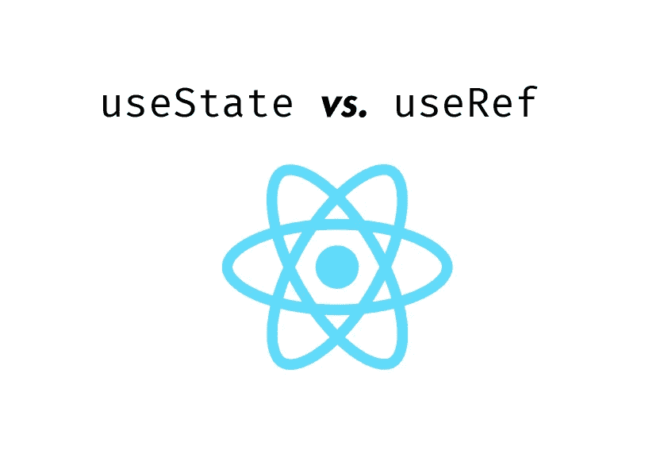

# 使用 useRef 作为使用状态替换—下面是时间和原因

> 原文：<https://medium.com/codex/usestate-useref-react-9f2398606d51?source=collection_archive---------1----------------------->

来源:作者

对于任何与在 React.js 中保存数据相关的事情来说,`useState`钩子可能都是首选，然而，它并不总是最好的选择。另一方面，是`useRef`钩。可悲的是，后者往往只与 DOM 元素相关联。现实是不同的:useState，以及 useRef，可以很好地用于与状态相关的事情，甚至可以互为补充。原因如下。