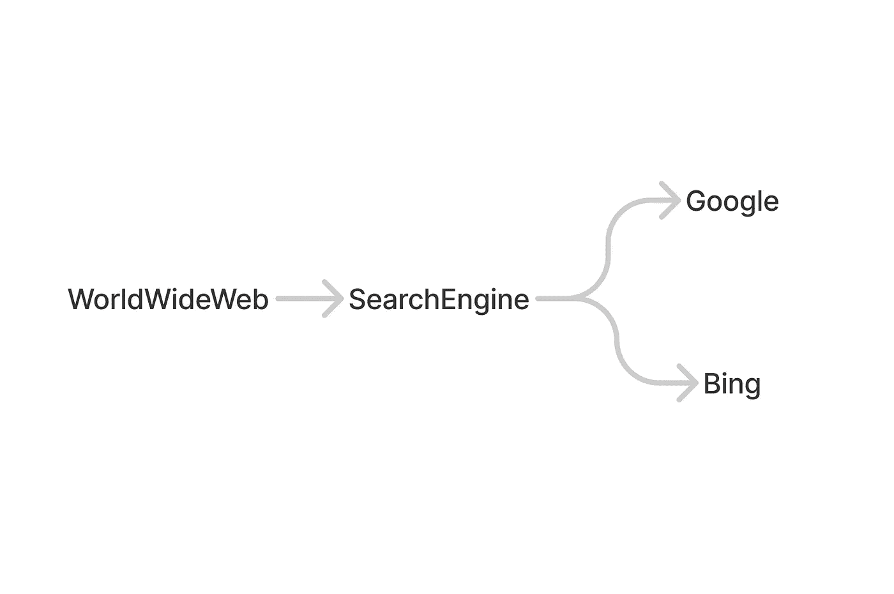
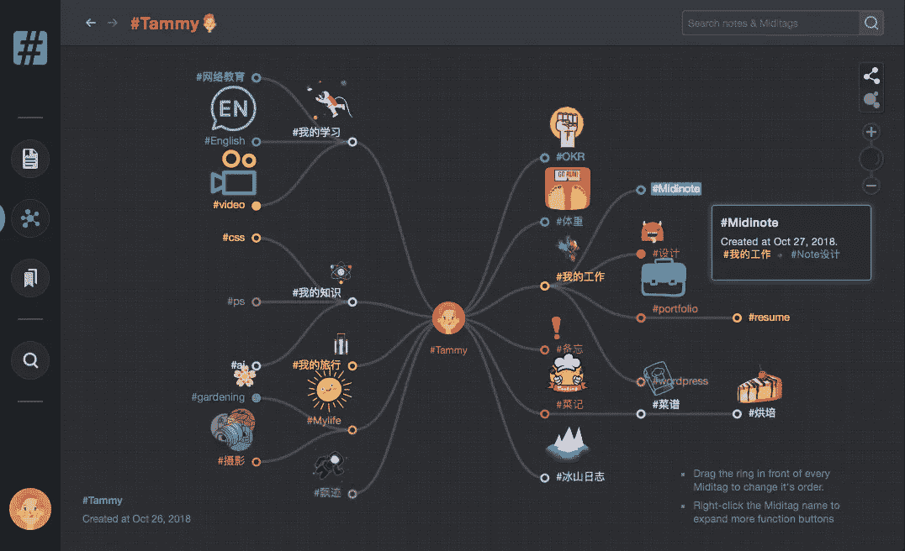

# 使用完全基于标签的系统来管理计算机上的内容

> 原文：<https://medium.com/codex/using-a-fully-tag-based-system-to-manage-your-content-a7408b325307?source=collection_archive---------11----------------------->

## 一种新的计算机分类方法

# 问题是

对计算机和我们自己来说，管理和分类计算机上的内容(文件、文档、笔记)是一项困难的任务。也就是说，对我们自己来说，维护和管理我们的内容是一种负担，而对计算机来说，在我看来，还没有一种完美的方法可以让我们做到这一点。

在计算机上，主要有两种组织内容的方法:树结构和标签系统。两者都在计算机世界中广泛使用。现在，几乎所有的计算机操作系统都使用树形结构作为它们的文件系统。我们在电脑上有一个根文件夹，可以在这个根文件夹下放置任意数量的文件夹或文件，文件夹的层次是无限的。但规则是你的文件夹或文件只能有一个祖先。你不能将一个文件同时放入两个文件夹中。

相比之下，标签系统提供了一种将内容分成多个类别的方法。您可以无限制地将多个标签附加到一个文件中。我第一次见到 tag 是在博客网站上，然后它开始流行，现在，甚至一些操作系统也采用了 tag 的概念，比如 macOS。

它们两者(树结构和标签)都有优点和缺点，对于树结构，你有一个有组织的层次结构来组织你的内容，但你不能将一个东西分类两次，对于标签系统，你可以将一个东西分成多个类别，但标签是简单的，没有结构，你需要在标签海洋中找到一个标签。

所以一些应用程序和操作系统开发了一种混合的方法来试图解决这个问题，正如我提到的，macOS 使用树结构来组织文件，并且还提供了一个标签系统作为补充。一些像 Evernote 这样的应用程序，同时提供这两者，你可以用层次化的“笔记本”来组织你的笔记，同时给你的笔记加标签。

这种方法很好，它给了你一种额外的方式来组织你的东西。但从另一个角度来看，这也带来了更多的困惑。或者它给你管理你的内容增加了负担。现在你需要维护两个不同的分类系统，很可能你把它们都搞混了。您可以将类别创建为文件夹或标签。你可以将一个文件夹命名为“plan ”,也可以将一个标签命名为“plan ”,对吗？有时你不知道选择哪一个，有时，当你创建一个“计划”文件夹时，你忘记了你已经有了一个“计划”标签。所以这种混合方法也不是完美的。

这是在电脑上对内容进行分类的情况。现在我将介绍一种新的方法来解决这个问题。

# 解决方案

## 关于名字

我想介绍一种新的方法来对我们的内容进行分类，在此之前，我必须提到我创建的应用程序 [Midinote](http://midinote.me) 。在创建应用程序的过程中，我产生了对内容进行分类的想法。我在中途找到了完整的原则和良好的实践。在应用程序中，我将 notes 中的标签称为“Miditag”，因此我很自然地将这个标签系统称为“Miditag 系统”。

## Miditag 的规则

Miditag 系统的规则很简单:

1.  Miditag 是一个有名字的标签，Miditag 通过名字来相互区分。
2.  您可以遵循规则 1 将内容中的任何单词标记为 Miditag。
3.  您可以通过 2 号定义一个 Miditag

让我在这里解释一下，就像传统的标签一样，Miditag 基本上只是一些单词，你可以使用任何单词。当您键入内容时，您可以选择内容中的任何单词，并将它们标记为 Miditag。非常类似于我们在 Twitter 上做的事情。

下面是一条推文:

这条推文中的内容是:

> 突发事件:Twitter 正在测试#比特币闪电小费服务

如果我们将这段内容放入 Miditag 系统，并且也将'比特币'标记为 Miditag，为了方便，我们也使用' # '作为标签名称的前缀，但这不是规则，你可以使用任何东西来标记标签，这无关紧要。

现在你得到了一段内容，和一个 Miditag #比特币，那么你就可以定义 Miditag 了，怎么定义？通过规则 2，这意味着，你可以使用一些单词来定义一个 Miditag，也可以将一些单词标记为 Miditag。

你可以这样定义#比特币:

> #比特币是一种去中心化的#数字货币

注意#DigitalCurrency 是另一个 Miditag。您可以使用 Miditag 来定义 Miditag。

## 分类规则

如何将一些内容归入某个类别？规则是:

1.  如果一段内容由某个 Miditag 附加(通过将内容的某个部分标记为 Miditag ),则这段内容属于该 Miditag。
2.  如果一个 Miditag 由另一个 Miditag 定义，那么属于前者的所有内容也属于后者。
3.  规则 2 是可传递的。

解释:

让我们重复使用上面的例子:

> 突发事件:Twitter 正在测试#比特币闪电小费服务

这个内容中有一个 Miditag #比特币，那么根据№1 这段内容将属于 midi tag:#比特币。

然后我们定义#比特币

> #比特币是一种去中心化的#数字货币

根据№2，上面的内容应该也属于#DigitalCurrency。

想象一下，我们现在试图定义#数字货币

> #数字货币是指主要在#数字计算机系统上管理、存储或交换的任何#货币、金钱或类似金钱的资产，尤其是通过互联网。

在这个定义中，我们在 Miditag 的定义中使用了#currency，那么根据№2、№3，上面的内容(爆料:Twitter 现在正在 beta 测试一个#比特币闪电小费服务)应该也属于#currency。

这里我们借用了集合论中“[传递集](https://en.wikipedia.org/wiki/Transitive_set)的概念，每当 *x* ∈ *A* ，而 *y* ∈ *x* ，则 *y* ∈ *A* 。

这就是 Miditag 的所有规则，现在让我们看看如何使用它。

# 练习

## 创建内容后对其进行分类

这是 Miditag 中一个有趣的行为。通常，我们先定义结构，然后再把东西放进去。与文件系统一样，您必须先创建一个文件夹，然后才能在该文件夹下创建文件。在 Evernote 中，你必须首先创建一些“笔记本”，然后在它下面创建笔记，尽管你可能有一个默认的笔记本，如果你不选择笔记本，笔记将被默认放入该笔记本，但如果你最终想整理笔记，你必须浏览它们并将其移动到正确的位置。

在我看来，这是通过传统方式组织东西的困难来源。因为通常情况下，当你正在创建笔记时，你不知道该把它们放在哪里。实际上，这是我使用 Evernote 时的一个主要痛点，我一直在纠结这个问题:把这个笔记放在哪里？我此刻只想写点什么，但我得先选择笔记本。我甚至不知道现在是为了什么…

现在，Miditag 给了你一种方法，让你只写下你脑海中的东西，而不用担心它应该属于哪里。

以下是如何使用它的示例:

想象一下，当你第一次读到关于“谷歌”的东西时，你可能还不知道它是什么。你写下了这个:

> 人们在谈论#Google，看起来它是一个很好的在线工具。我过会儿会尝试它。

此时，你不知道 Google 是什么，这个音符属于哪里，但你知道 Google 是一个东西，这是肯定的，所以你把它标记为 Miditag。

然后，随着时间的推移，你尝试谷歌:

> #谷歌太棒了，我可以用它找到我想要的东西

现在你对它有了更多的了解，在这一点上，你能够定义谷歌:

> #谷歌是一个互联网#搜索引擎

通过这样做，您将 Google 归入了搜索引擎类别。以后你对#SearchEngine 了解多了也可以定义一下。

一旦你定义了谷歌，你就把所有提到谷歌的笔记放在“搜索引擎”类别下，就像我说的，你现在是在创造了它们之后对它们进行分类，对吗？我们将所有属于谷歌的内容归入搜索引擎这一类别是有道理的，因为谷歌是搜索引擎之一。与传统方式相比，这是一个主要的区别，当你知道的时候，你定义/分类事物，一旦你定义了事物，Miditag 下的所有那些内容将被立即放入祖先(或者我们可以说超集)Miditag。

不要忘记规则 3 仍然有效，这种行为是可传递的，一旦你用其他 Miditag 定义了#SearchEngine，比如#WorldWideWeb，那么属于#Google 的笔记也将属于#WorldWideWeb。

> #SearchEngine 是一个#软件系统，设计用于在#WorldWideWeb 中执行 web 搜索。

## 多分类

树形结构的主要缺点是你不能把一个文件放在两个文件夹中。使用 Miditag，可以很容易地将一个单独的内容分成多个类别。

我们继续之前的故事:

几年后，你尝试了微软公司提供的 Bing 搜索引擎。您键入:

> 我试过#Bing，我觉得 Bing 不如#Google

然后，您定义 Bing:

> #Bing 是另一个#SearchEngine，它是由#Microsoft 创建的

现在，Bing Miditag 分属于两类:搜索引擎和微软。任何属于#Bing 的笔记都将属于#SearchEngine 和#Microsoft。当然，你对 Bing 了解多了还可以再补充。

## 绘制你的知识的思维导图

本质上，Miditag 赋予了传统标签层次结构的能力。就像树形结构一样，树形结构很容易通过思维导图可视化。

上面的例子实际上创建了一个简单的思维导图:

在 Miditag 系统中，您可以显示每个 Miditag 的思维导图。并在向上和向下 Miditags 之间导航。

下面是 Midinote 中思维导图的一个例子。

Midinote 中的思维导图

## 关于如何定义或选择 Miditag 的建议

我应该如何定义 Miditag？以及我应该如何选择内容中的 Miditag？

定义一个 Miditag 没有限制，内容的哪一部分应该是或者不是 Miditag，由你决定，但我的建议是:

*   使用合理的句子而不是简单的一系列原始标签来定义 Miditag。
*   要选择标签，标签越具体越好。

其实上面这两个建议都是在说:不要试图用抽象的概念来给内容分类。

当你试图使用原始的 Miditag 来定义其他 midi tag 时，你是在试图抽象它。当您试图将一些 Miditag 直接附加到内容上时，您也试图对内容进行抽象。不做，就让标签从内容中浮现出来。我认为一个具体的标签比一个抽象的标签更好，“谷歌”比“搜索工具”，“互联网网站”更好，显然后两者更抽象，尽管在内容上它们可能表明同样的事情，我更喜欢选择谷歌。我认为人们更容易回忆起一个具体的东西，而不是一个抽象的东西。还有，一个抽象的名字是不稳定的，是一个混乱的来源，你可以说谷歌是一个“搜索工具”，你也可以把它描述为一个“软件系统”，“互联网工具”，“搜索引擎”，和“生产力工具”。

# 在将来

我希望人们能想到 Miditag 推出的这种方法，你也可以试试我的应用 [Midinote](http://midinote.me) ，Miditag 系统的一个实践。我相信人们可以在此基础上开发更好的想法或实践。我觉得在计算机分类领域解决问题是一个很好的尝试。