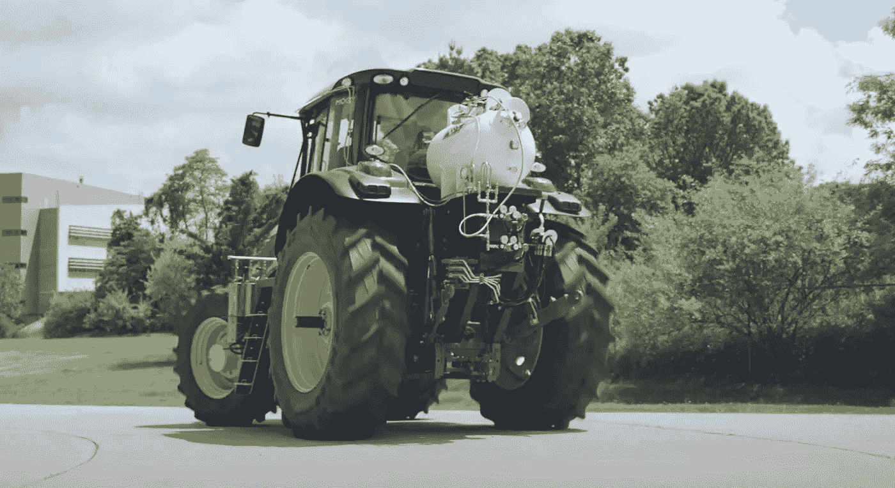

# 在商业运输中使用氨作为燃料

> 原文：<https://medium.com/codex/using-ammonia-as-fuel-in-commercial-transportation-42cdcc158c87?source=collection_archive---------12----------------------->

## 告诉我更多关于这种替代燃料的信息

[装有氨的拖拉机 130 马力(媒体由淘大)](https://amogy.co/technology/)

今年 5 月是 Amogy 公司的一个重要里程碑。正是在这个时候，他们能够证明一种使用氨作为可再生燃料的便携式无碳能源系统。更重要的是，他们能够以拖拉机的形式对商业运输进行脱碳…