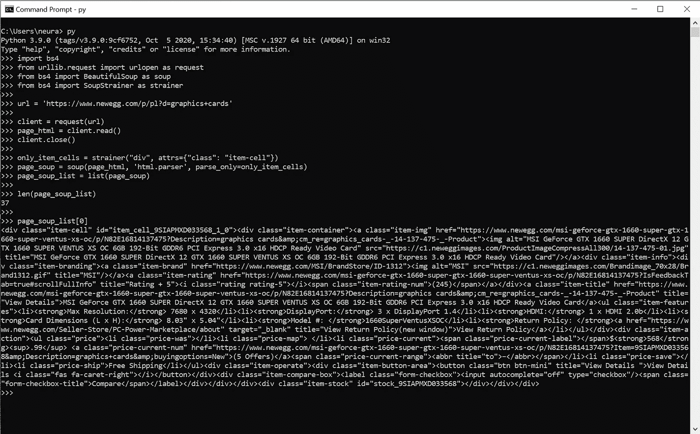
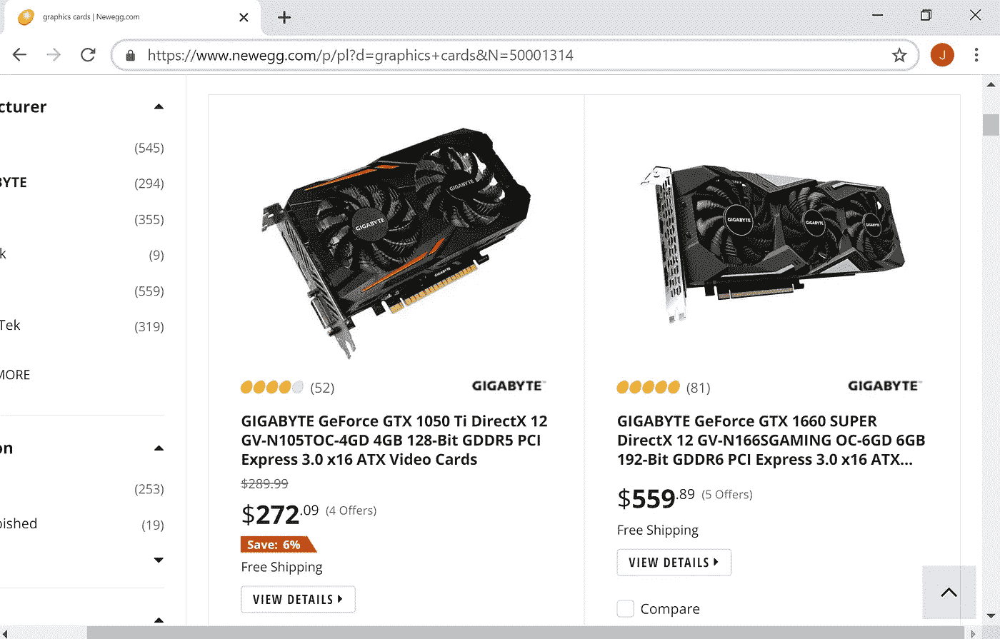

# 使用 Beautiful Soup 的 SoupStrainer 在网页抓取时节省时间和内存

> 原文：<https://medium.com/codex/using-beautiful-soups-soupstrainer-to-save-time-and-memory-when-web-scraping-ea1dbd2e886f?source=collection_archive---------1----------------------->

## [法典](http://medium.com/codex)

## 分析一个难以置信的特征

照片由[乔丹·马修](https://unsplash.com/@mat_graphik?utm_source=medium&utm_medium=referral)在 [Unsplash](https://unsplash.com?utm_source=medium&utm_medium=referral) 上拍摄

## 通常的做事方式

上面的代码显示了 BeautifulSoup 构造函数(在第 12 行，作为 Soup 导入)接受一个站点的 HMTL 参数和一个表示我们需要的解析器类型的字符串。这创建了一个漂亮的 Soup 对象，我们可以用它来抓取数据。用这种设置从网站上抓取一两页应该没问题。但是，如果您需要抓取多页数据，那么这可能不是一个好方法。默认情况下，BeautifulSoup 对象将解析我们提供给它的整个 HTML 页面。然后我们必须使用 find_all()方法(在第 13 行)来提取我们感兴趣的特定 HTML 标签。当我们只需要页面的一部分时，继续为整个页面创建解析器是浪费时间和内存。一定有更好的方法。

## 滤汤器是如何工作的？

SoupStrainer 允许我们指定我们站点的 HTML 中的哪些项目将被解析。我们可以指出，我们只想解析所有的 p 标签或任何具有特定 class/id 值的东西(这些只是众多选项中的几个)。如果我们正在抓取多页数据，那么我们可以确保只解析需要的信息。使用这个特性的好处是巨大的。

## 包含过滤器

上面的代码显示了我们如何使用 soup screen 对象和 BeautifulSoup 对象。调用 SoupStrainer 构造函数(在第 13 行，作为过滤器导入)来创建一个对象，该对象带有提供解析规范的参数。此调用的结果存储在 only_item_cells 变量中。BeautifulSoup 对象像往常一样使用页面的 HTML 参数和所需的解析器创建。但是，only_item_cells 变量是作为 parse_only 参数的第三个参数提供的。parse_only 参数将创建一个 BeautifulSoup 对象，该对象将只解析特定的项目(在本例中，只解析 class 值为“item-cell”的 div 标签)。现在，我们只剩下一个解析后的 HTML 文档，它只包含每次调用 BeautifulSoup 构造函数时需要的 div 标记。

注意:从 BeautifulSoup 对象调用 find_all()方法时，会返回一个列表。因为使用了 SoupStrainer，所以不需要使用 find_all()方法。我们想要的 div 元素已经合并到我们解析的 HTML 中。因此，我们需要将 page_soup 转换成一个列表(在第 15 行),以便能够有效地访问数据。

## 看到结果

作者图片

如上图所示，page_soup 被转换成了一个列表。该列表包含 37 个项目(显卡)。列表中的每一项都是一个符合我们规范的 div 元素。BeautifulSoup 对象已成功修改。我们不再局限于从网页上抓取所有内容。

## 将 SoupStrainer 应用于实际的 web 刮刀

作者图片

上图显示了用于抓取数据的 URL。每个项目单元代表新蛋网站上的一个独立显卡。每页的显卡数量各不相同。像这样的网站是网络抓取和使用 SoupStrainer 的完美应用。

注意:上图中的 URL 将在下面的代码中稍加修改，添加“page”查询参数。这个查询参数将只允许我们抓取多页千兆字节的图形卡。

当你访问新蛋的显卡网站时，你会发现一个制造商复选框。此复选框可用于指示要显示的图形卡。在第 9 行，我创建了一个字典来表示这个复选框的缩小版本。每个密钥是制造商的名称，其对应的值是该制造商的标识号。这个字典用于为“N”查询参数创建一个带有固定标识号的 URL。然后，我使用来自 checking Newegg 网站的预定义数字为“page”查询参数提供值。在将每个页面的 HTML 转换成一个汤之后，最终的 URL 可以用来为千兆字节的显卡抓取多页数据。

我希望大家后退一步，想想这个功能有多强大。在上面的例子中，我们抓取了六页数据。如果使用普通的约定(只包含 BeautifulSoup)，那么页面中的每个元素都将是相应的解析文档的一部分。但是，每次为页面生成解析的文档时，它只包含与图形卡相关的元素。随着页面数量的不断增加，解析项的减少会节省时间和内存。

注意:我已经写了一系列文章，讨论如何构建这个 web scraper 的一个更简单的版本(分别构建一个 Newegg Web Scraper(第 1 部分)和(第 2 部分))。在那些文章中，我提供了构建所需工具的信息和深入的代码解释。这就是为什么我没有在本文中详细介绍代码如何工作的原因。

## 参考

理查森，L. (2020)。漂亮的汤文档。*邋遢*。从 https://www.crummy.com/software/BeautifulSoup/bs4/doc/[取回](https://www.crummy.com/software/BeautifulSoup/bs4/doc/)

数据科学道场。(2017 年 1 月 6 日)。介绍用 Python 和漂亮的汤进行网络抓取。【YouTube 视频】。数据科学道场。从[https://www.youtube.com/watch?v=XQgXKtPSzUI&取回 t=205s](https://www.youtube.com/watch?v=XQgXKtPSzUI&t=205s)

我的 [GitHub 回购](https://github.com/wormhole85/newegg-web-scraper-soupstrainer)的网页抓取器代码。