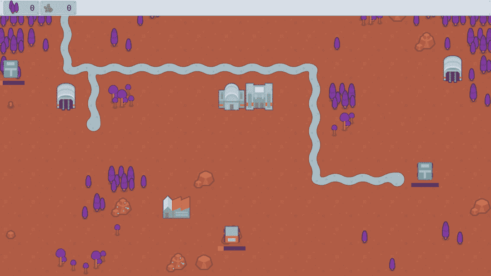

# 在 Unity/C#中为 RTS 收集器 AI 使用行为树？

> 原文：<https://medium.com/codex/using-behaviour-trees-for-a-rts-collector-ai-in-unity-c-dca24243ebce?source=collection_archive---------8----------------------->

## 让我们来探索如何通过这种人工智能设计模式赋予小卡车生命！

*本教程有视频和文本两种格式，文本版本见下文:*