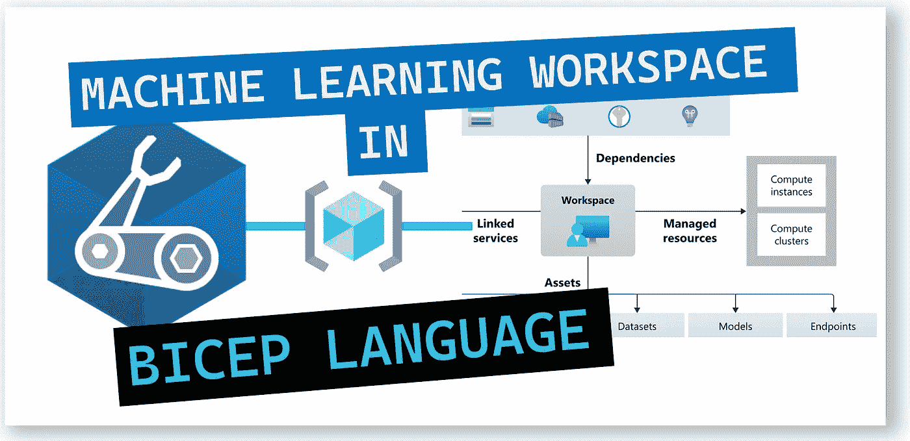
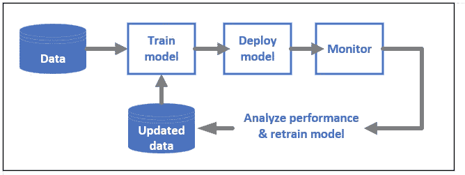
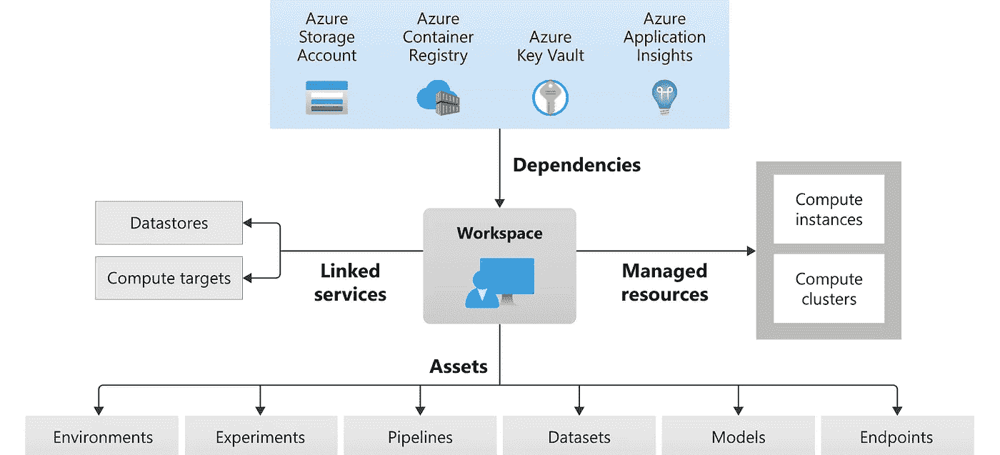
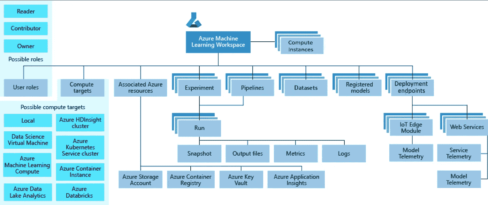
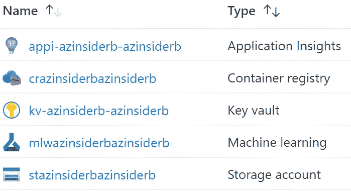
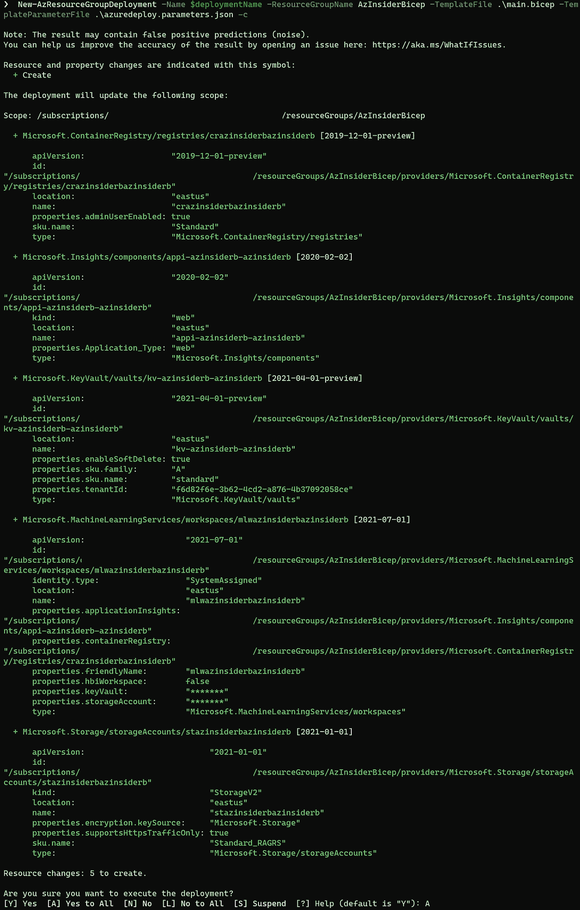
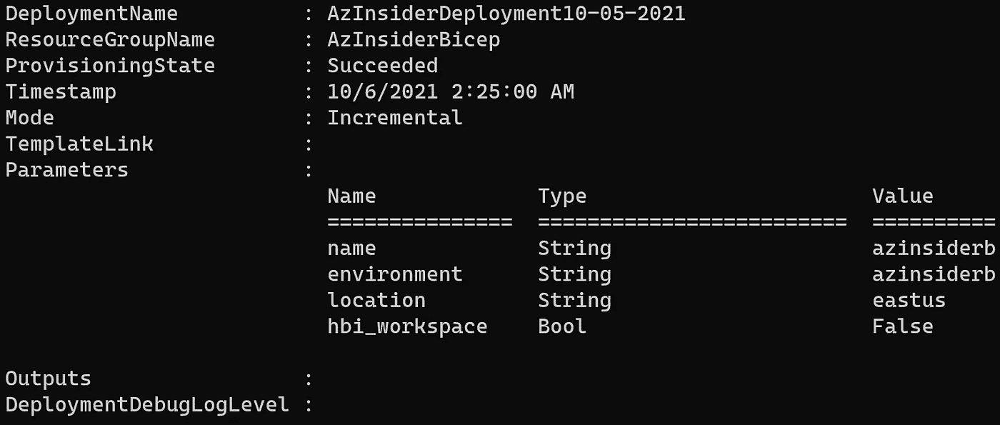
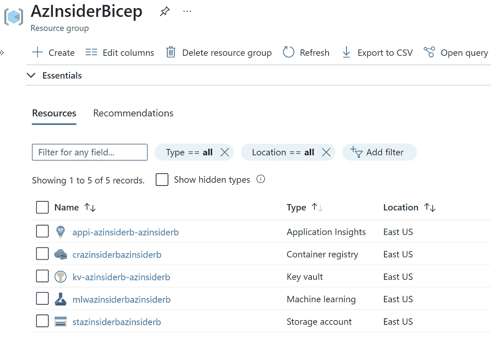

# 💪使用 Bicep 创建 Azure 机器学习工作区资源并开始使用 Azure 机器学习

> 原文：<https://medium.com/codex/using-bicep-to-create-workspace-resources-and-get-started-with-azure-machine-learning-bcc57fd4fd09?source=collection_archive---------1----------------------->

在本文中，我们将利用 Bicep，Azure 领域特定语言(DSL)来部署 Azure 机器学习的工作区。



Bicep 语言的机器学习工作空间

**Azure Machine Learning** 是一款用于加速和管理机器学习项目生命周期的云服务。在 Azure 中，您可以使用机器学习服务创建模型，或者使用来自 TensorFlow 或 Pytorch 等开源平台的模型。

如果您正在您的组织内实施机器学习(ML)操作以将 ML 模型引入生产，那么您可以从 Azure 机器学习中受益，因为您将能够:

*   利用 Azure 计算资源
*   共享数据、笔记本电脑和环境
*   跟踪模型的版本

Azure 机器学习可以与其他服务集成以支持您的项目，如 Azure Synapse Analytics 使用 Spark 处理和传输数据。您还可以集成 Azure SQL 数据库、存储 Blobs 和应用服务来部署和管理 ML 支持的应用。

你的整个 ML 项目都可以用 Azure 机器学习服务来管理。它提供了一个允许许多用户协作的工作空间。您可以共享实验的运行结果，并将版本化资产用于环境和存储引用等工作。

通过 Azure 机器学习，您将能够管理您的完整项目生命周期，包括任务定义、数据准备、培训、模型验证、模型部署、监控和发布模型。



Azure 机器学习

在使用 Azure 机器学习之前，我们必须创建一个工作区，然后向工作区添加计算资源。

工作区是所有机器学习活动的顶级资源，也是查看和管理工件的集中位置。

下图显示了 Azure 机器学习的高级架构以及工作区中包含的组件:



Azure 机器学习

也就是说，我们将使用 Bicep 来部署 Azure 机器学习工作区。



工作区的分类

Bicep 文件将包括以下组件:

*   应用洞察
*   集装箱登记处
*   钥匙库
*   机器学习工作空间
*   存储帐户



使用二头肌的 Azure 机器学习

# Bicep 文件-参数

我们将为部署的名称、环境和位置定义一些参数。我们还将定义一个参数 bool，它指定是否减少遥测数据收集并启用额外的加密。

下面的代码显示了参数定义:

```
[@description](http://twitter.com/description)('Specifies the name of the deployment.')
param name string[@description](http://twitter.com/description)('Specifies the name of the environment.')
param environment string[@description](http://twitter.com/description)('Specifies the location of the Azure Machine Learning workspace and dependent resources.')
param location string = resourceGroup().location[@description](http://twitter.com/description)('Specifies whether to reduce telemetry collection and enable additional encryption.')
param hbi_workspace bool = false
```

现在我们将定义变量部分。

# Bicep 文件-变量

下面的代码显示了要使用的变量的定义。我们将使用变量来指定要创建的资源的名称:

```
var tenantId = subscription().tenantId
var storageAccountName_var = 'st${name}${environment}'
var keyVaultName_var = 'kv-${name}-${environment}'
var applicationInsightsName_var = 'appi-${name}-${environment}'
var containerRegistryName_var = 'cr${name}${environment}'
var workspaceName_var = 'mlw${name}${environment}'
var storageAccount = storageAccountName.id
var keyVault = keyVaultName.id
var applicationInsights = applicationInsightsName.id
var containerRegistry = containerRegistryName.id
```

现在让我们定义资源。

# Bicep 文件—资源

我们将定义以下资源:

*   存储帐户
*   钥匙库
*   应用洞察
*   集装箱登记处
*   机器学习服务工作空间

下面的代码显示了资源的定义。

```
resource storageAccountName 'Microsoft.Storage/storageAccounts@2021-01-01' = {
  name: storageAccountName_var
  location: location
  sku: {
    name: 'Standard_RAGRS'
  }
  kind: 'StorageV2'
  properties: {
    encryption: {
      services: {
        blob: {
          enabled: true
        }
        file: {
          enabled: true
        }
      }
      keySource: 'Microsoft.Storage'
    }
    supportsHttpsTrafficOnly: true
  }
}resource keyVaultName 'Microsoft.KeyVault/vaults@2021-04-01-preview' = {
  name: keyVaultName_var
  location: location
  properties: {
    tenantId: tenantId
    sku: {
      name: 'standard'
      family: 'A'
    }
    accessPolicies: []
    enableSoftDelete: true
  }
}resource applicationInsightsName 'Microsoft.Insights/components@2020-02-02' = {
  name: applicationInsightsName_var
  location: (((location == 'eastus2') || (location == 'westcentralus')) ? 'southcentralus' : location)
  kind: 'web'
  properties: {
    Application_Type: 'web'
  }
}resource containerRegistryName 'Microsoft.ContainerRegistry/registries@2019-12-01-preview' = {
  sku: {
    name: 'Standard'
  }
  name: containerRegistryName_var
  location: location
  properties: {
    adminUserEnabled: true
  }
}resource workspaceName 'Microsoft.MachineLearningServices/workspaces@2021-07-01' = {
  identity: {
    type: 'SystemAssigned'
  }
  name: workspaceName_var
  location: location
  properties: {
    friendlyName: workspaceName_var
    storageAccount: storageAccount
    keyVault: keyVault
    applicationInsights: applicationInsights
    containerRegistry: containerRegistry
    hbiWorkspace: hbi_workspace
  }
  dependsOn: [
    storageAccountName
    keyVaultName
    applicationInsightsName
    containerRegistryName
  ]
}
```

请注意，我们在工作区中定义了一些依赖关系，以确保在部署工作区资源类型之前，部署工作区所需的所有其余资源都存在。

现在我们将定义参数文件。这个文件将只包含几个参数:部署的名称、环境的名称和位置。

下面的代码显示了参数文件的定义。

```
{
    "$schema": "[https://schema.management.azure.com/schemas/2019-04-01/deploymentParameters.json#](https://schema.management.azure.com/schemas/2019-04-01/deploymentParameters.json#)",
    "contentVersion": "1.0.0.0",
    "parameters": {
        "name": {
            "value": "azinsiderb" 
        },
        "environment": {
            "value": "azinsiderb" 
        },
        "location": {
            "value": "eastus" 
        }
    }
}
```

现在，我们将着手部署该资源。我们之前创建了一个名为“AzInsiderBicep”的资源组。我们将使用以下代码来部署这个 Bicep 文件:

```
$date = Get-Date -Format "MM-dd-yyyy"
$deploymentName = "AzInsiderDeployment"+"$date"New-AzResourceGroupDeployment -Name $deploymentName -ResourceGroupName AzInsiderBicep -TemplateFile .\main.bicep -TemplateParameterFile .\azuredeploy.parameters.json -c
```

请注意，我们在执行部署之前使用标志-c 来预览部署。

下图显示了部署的预览。



Azure 机器学习— Bicep 部署预览

一旦 Bicep 文件有效，我们将继续执行部署。下图显示了此部署的输出。



Azure 机器学习— Bicep 部署输出

您可以访问 Azure 门户网站，查看部署的资源，如下所示:



Azure 机器学习工作区部署— Azure 门户

此时，您可以开始在自己的工作空间上工作，并根据模型的需要添加计算实例和计算集群。

下面是部署 Azure 机器学习工作区的完整 Bicep 代码:

```
[@description](http://twitter.com/description)('Specifies the name of the deployment.')
param name string[@description](http://twitter.com/description)('Specifies the name of the environment.')
param environment string[@description](http://twitter.com/description)('Specifies the location of the Azure Machine Learning workspace and dependent resources.')
param location string = resourceGroup().location[@description](http://twitter.com/description)('Specifies whether to reduce telemetry collection and enable additional encryption.')
param hbi_workspace bool = falsevar tenantId = subscription().tenantId
var storageAccountName_var = 'st${name}${environment}'
var keyVaultName_var = 'kv-${name}-${environment}'
var applicationInsightsName_var = 'appi-${name}-${environment}'
var containerRegistryName_var = 'cr${name}${environment}'
var workspaceName_var = 'mlw${name}${environment}'
var storageAccount = storageAccountName.id
var keyVault = keyVaultName.id
var applicationInsights = applicationInsightsName.id
var containerRegistry = containerRegistryName.idresource storageAccountName 'Microsoft.Storage/storageAccounts@2021-01-01' = {
  name: storageAccountName_var
  location: location
  sku: {
    name: 'Standard_RAGRS'
  }
  kind: 'StorageV2'
  properties: {
    encryption: {
      services: {
        blob: {
          enabled: true
        }
        file: {
          enabled: true
        }
      }
      keySource: 'Microsoft.Storage'
    }
    supportsHttpsTrafficOnly: true
  }
}resource keyVaultName 'Microsoft.KeyVault/vaults@2021-04-01-preview' = {
  name: keyVaultName_var
  location: location
  properties: {
    tenantId: tenantId
    sku: {
      name: 'standard'
      family: 'A'
    }
    accessPolicies: []
    enableSoftDelete: true
  }
}resource applicationInsightsName 'Microsoft.Insights/components@2020-02-02' = {
  name: applicationInsightsName_var
  location: (((location == 'eastus2') || (location == 'westcentralus')) ? 'southcentralus' : location)
  kind: 'web'
  properties: {
    Application_Type: 'web'
  }
}resource containerRegistryName 'Microsoft.ContainerRegistry/registries@2019-12-01-preview' = {
  sku: {
    name: 'Standard'
  }
  name: containerRegistryName_var
  location: location
  properties: {
    adminUserEnabled: true
  }
}resource workspaceName 'Microsoft.MachineLearningServices/workspaces@2021-07-01' = {
  identity: {
    type: 'SystemAssigned'
  }
  name: workspaceName_var
  location: location
  properties: {
    friendlyName: workspaceName_var
    storageAccount: storageAccount
    keyVault: keyVault
    applicationInsights: applicationInsights
    containerRegistry: containerRegistry
    hbiWorkspace: hbi_workspace
  }
  dependsOn: [
    storageAccountName
    keyVaultName
    applicationInsightsName
    containerRegistryName
  ]
}
```

# 后续步骤:

我向您推荐以下资源作为后续步骤:

[](https://docs.microsoft.com/en-us/azure/machine-learning/quickstart-create-resources?WT.mc_id=AZ-MVP-5000671) [## 快速入门:创建工作区资源- Azure 机器学习

### 在此快速入门中，您将创建一个工作区，然后向该工作区添加计算资源。然后你会有…

docs.microsoft.com](https://docs.microsoft.com/en-us/azure/machine-learning/quickstart-create-resources?WT.mc_id=AZ-MVP-5000671) [](https://docs.microsoft.com/en-us/azure/machine-learning/concept-workspace?WT.mc_id=AZ-MVP-5000671) [## 什么是工作空间？- Azure 机器学习

### 工作区是 Azure 机器学习的顶级资源，提供了一个集中的地方来处理所有…

docs.microsoft.com](https://docs.microsoft.com/en-us/azure/machine-learning/concept-workspace?WT.mc_id=AZ-MVP-5000671) 

[*在此加入****azin sider****邮箱列表。*](http://eepurl.com/gKmLdf)

*-戴夫·r·*