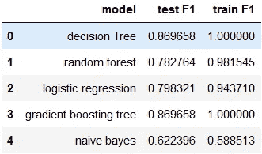

# 使用大数据了解音乐流媒体行业的流失情况

> 原文：<https://medium.com/codex/using-big-data-for-understanding-churn-in-the-music-streaming-industry-119c669e138?source=collection_archive---------14----------------------->

## 基于 pyspark 的客户流失理解方法


由 [Unsplash](https://unsplash.com?utm_source=medium&utm_medium=referral) 上的 [Alphacolor](https://unsplash.com/@duck58cth?utm_source=medium&utm_medium=referral) 拍摄的照片

# 介绍

T4:你最近在听哪首歌？你喜欢在音乐应用上的体验吗？或者你很难找到你最喜欢的歌曲？

不管你喜欢什么类型的音乐，也不管你使用什么样的应用程序，总的来说，我们在播放音乐的时候会创建很多事件，不管是在应用程序上还是在浏览器中。事件，如访问一个页面，点击播放按钮，通过设置找到你的艺术家，添加你最好的朋友来分享这首怀旧歌曲。像这样的事件会产生大量的数据。

虽然音乐服务公司尽最大努力让顾客满意，但有时不幸还是会发生，顾客确实会流失。在这种情况下，我们创建的数据是我们留下的线索，可以在理解问题甚至发现其他用户的类似行为时派上用场。

> 正如 100 年前电力几乎改变了一切一样，今天我实际上很难想到一个我认为人工智能在未来几年内不会改变的行业。
> 
> 吴恩达

也就是说，让我们尝试从音乐流数据集中预测流失。由于数据集是一个 12 GB 的用户日志文件，我们将对相对较小的数据(~128 MB)执行分析，并使用 insights 对较大的数据进行训练。这些分析和建模的数据由 Udacity 提供。

在这篇博文中，我将使用 pyspark 来解决这个问题。由于我们本质上是**预测流失**，取二进制值，所以可以把它当成一个分类问题。我将训练各种模型，如 RandomForestClassifier，LogisticRegression，GBTClassifier，NaiveBayes 和 DecisionTreeClassifier。以上是 pyspark [提供的几个分类模型](https://spark.apache.org/docs/latest/ml-classification-regression.html)。在这个过程中，我将经历模型开发的 6 个常见阶段。这些阶段是:

1.  数据理解
2.  商业理解
3.  探索性数据分析
4.  特征工程
5.  建模
6.  估价

# **数据理解**

查看数据，数据集是包含 18 列的单个用户日志文件。我们可以使用 pyspark `printSchema()`方法轻松显示这些列。

```
root
 |-- artist: string (nullable = true)
 |-- auth: string (nullable = true)
 |-- firstName: string (nullable = true)
 |-- gender: string (nullable = true)
 |-- itemInSession: long (nullable = true)
 |-- lastName: string (nullable = true)
 |-- length: double (nullable = true)
 |-- level: string (nullable = true)
 |-- location: string (nullable = true)
 |-- method: string (nullable = true)
 |-- page: string (nullable = true)
 |-- registration: long (nullable = true)
 |-- sessionId: long (nullable = true)
 |-- song: string (nullable = true)
 |-- status: long (nullable = true)
 |-- ts: long (nullable = true)
 |-- userAgent: string (nullable = true)
 |-- userId: string (nullable = true)
```

快速浏览模式和数据集，我们可以看到有一些分类列和数字列。Auth、gender、level、method、status、page 和 userAgent 是一些分类列，而 length(播放歌曲的长度)、itemInSession、SessionId 是一些数字列。

在显示这些分类列中的不同值时，我们可以看到有很多页面，如登录、注销、下一首歌、主页、关于、错误、竖起大拇指等。用户可以通过访问这些页面来触发事件。除此之外，事件中还捕获用户的其他详细信息，如用户详细信息、级别(订阅状态)、状态(HTTP 代码)、方法(HTTP 方法)；以及用于访问页面的 auth 和设备以及时间。


一些分类变量的不同值

## **定义流失**

当用户离开一个平台或者干脆停止使用服务时，他们会感到不安。虽然失去一个用户可能没什么大不了的，但是任何企业都非常担心持续的用户流失。在这个例子中，我们可以将取消订阅视为流失。为了取消订阅，用户必须访问“取消确认”页面，这是我们的提示。如果在未来或过去(对于我们的数据集)，任何用户都被标记为客户流失，取消订阅，比如客户流失事件，即触发的事件取消确认。

# 商业理解

看完数据后，我们可以在继续之前问一些基本的问题。

1.  不同的用户页面交互对他们的流失状态有什么影响？
2.  性别、使用的设备和状态 404(错误)代码会影响用户流失状态吗？
3.  活跃天数、总会话数、播放分钟数、播放歌曲数如何影响流失状态？

# **探索性数据分析**

## 用户页面交互

因为我们已经标记了流失，所以根据用户的流失状态来查看用户访问了哪些页面会很有趣。


根据用户流失状态绘制的页面访问量方框图

通过这些箱线图，我们可以通过观察平均值、四分位数间距和分布来了解两组之间的显著差异。

*   烦躁的人群不太可能访问页面:关于、添加朋友、添加到播放列表、降级、错误、帮助、主页、下一首歌、设置和竖起大拇指。
*   更有可能访问:滚动广告，升级

## 性别、使用的设备和面临的状态 404 对流失的影响


根据用户流失状态绘制的用户属性和使用的设备方框图

从这些图中我们可以看出:

*   put 方法被非搅动用户更多地使用。
*   两组的 GET 方法几乎相同。
*   状态 404 更多地被非搅动用户点击。
*   男性用户比女性用户更容易流失。
*   付费用户不太可能流失。
*   windows 设备用户有所不同

## 活跃天数、总会话数、播放分钟数、播放歌曲数如何影响流失状态？


按流失状态绘制的用户活动框

从这些图中我们可以看出:

*   混乱的用户创建的会话越来越少。
*   不安的用户播放的歌曲越来越少。
*   因此减少了用户的总游戏时间。
*   此外，流失用户在会话中拥有的项目较少。
*   流失用户的歌曲长度差异很大。
*   对于流失用户来说，活跃天数非常少。
*   总的来说，与关键功能的活动/交互对受搅动的用户来说较少。

# 特征工程

根据分析，我们可以添加 3 组功能:

1.  **页面交互特征—** 不同页面访问量
2.  **重点活动互动功能—** 歌曲播放时长、场次等重点活动
3.  **用户属性—** 用于交互的设备，状态码

以下是所用功能的总结:

```
**1\. Page-interaction features**
    - about page visit count
    - add friend visit count
    - Add to playlist visit count
    - Downgrade page visit count
    - Error page visit count
    - home page visit count
    - roll advert count
    - help page visit count
    - settings page visit count
    - thumps up count
    - Upgrade count2\. **Key activities interaction features**
    - total_sessions
    - number of songs played
    - total time spent playing songs
    - maximum number of activity in a session
    - average length of song played
    - active days on the platform
    - average number of song played per session
    - songs played in free tier
    - songs played in paid tier**3\. User attributes**
    - faced 404 status code
    - weather PUT method used
    - device used
```

## **1。页面交互功能**

用户页面交互对于理解用户流失至关重要。从页面事件中，我们可以统计每个用户的页面访问量。这一点至关重要，因为较高的“竖起大拇指”页面访问量可能是一个长期客户的信号。在代码下面，代码片段只是计算而已。

**页面互动功能**

## **2。关键活动交互特征**

由于我们正在对音乐流数据进行分析，播放歌曲，创建多个会话，因此较长的会话活动对于识别客户流失非常重要。我们可以通过对用户分组和汇总这些指标来计算特性。它的代码如下所示:

## 3.**用户属性**

最后，用户的属性，如他们正在使用的设备，他们在流媒体播放时面临的错误，都会对他们的体验产生重大影响。我们可以通过过滤此类数据和统计此类事件来捕捉这些信息。同样，代码如下所示:

# 建模

特征创建完成后，我们可以移动到模型零件。在这里，我已经尝试了 pyspark ml 模块的 5 个模型。为了方便起见，我使用了 pyspark ml 管道。

现在我们已经准备好了管道，我们可以安装我们的模型了。

# 结果

建模部分确实需要相当长的时间来完成。完成后，我们可以进入模型评估阶段。

## 模型评估和验证

在客户流失预测中，我们需要注意两件重要的事情:*误报和漏报。*换句话说，我们的准确率和召回率要高。由于 F1 分数是两者的调和平均值，我们可以选择它作为评估指标。以下功能可用于评估我们的*装配型号*。

在测试和训练集上评估我们的模型时，我们可以看到

*   决策树和梯度推进方法具有相同的精度。
*   逻辑回归有一个平均 f1 值。
*   而朴素贝叶斯在 F1 评分方面就吃亏不少。
*   梯度推进法给出了 0.87 f1 分的较好结果，



训练集和测试集上模型结果

## 限制

梯度推进算法最适合于各种回归和分类问题，但是它们有两个局限性。

*   评估后，我们可以看到，GBT 的 F1 训练得分为 1，即 GBT 模型将继续改进，以尽量减少所有误差。这可能会过分强调异常值，导致过度拟合。在这里，我们需要调整模型，并检查任何过度拟合。
*   即使对于少量的树，GBT 模型的训练时间也相当长。

## 网格搜索

既然我们已经有了明确的赢家，我们可以尝试使用网格搜索来提高准确性。在 pyspark 中，我们可以很容易地使用以下方法进行[模型调整](https://spark.apache.org/docs/latest/ml-tuning.html):

1.  **ParamGridBuilder —** 为搜索空间创建一个参数网格。
2.  **CrossValidator** —在搜索空间的各种值上训练和评估模型(估计器)。

我决定用三重交叉验证方法来调整 gbt 模型的最大深度(每个决策树中的最大层数)。

```
**F1 Score from cross validation: 0.8696581196581197
maxDepth -  3**
```

网格搜索后，发现 F1 得分为 **0.8696581196581197** ，最大深度为 **3。**

## 特征重要性

从我们的评测中可以看出，gbt 车型的 F1 成绩最好。Pyspark 的 GBTClassifier 有一个获取特征重要性的属性。根据它的[文档](https://spark.apache.org/docs/latest/api/python/_modules/pyspark/ml/classification.html#GBTClassificationModel):‘每个特征的重要性是它在集合中所有树的重要性的平均值。重要性向量被归一化为总和为 1。这种方法是由哈斯蒂等人提出的。"统计学习的要素，第二版."2001.)并遵循 scikit-learn 中的实现。'

利用这一点，我们可以计算比例为 1 的特征重要性。


特征重要性

从图中，我们可以看到**活跃天数、总会话数、平均歌曲长度、页面访问计数**等被认为是最重要的特性，而播放的歌曲数量、付费层播放的歌曲、遇到的错误页面计数、设备=窗口等被认为是最不重要的特性。

## 改进

*   可以向模型中添加更多功能，如**用户艺术家交互**，或用户播放了多少次**流行/流行歌曲**，或**基于位置的**功能，如区域，以改善指标。
*   既然我们现在知道了最重要的特征，我们就可以尝试对按重要性降序排列的全部特征的子集进行训练。这将减少时间，并且应该得到相同的度量。它也将使**型号更轻**。
*   我们也可以尝试不同的模型，比如 [Xgboost](https://xgboost.readthedocs.io/en/latest/) 。Spark with scala 已经发布了 [xgboost API](https://github.com/dmlc/xgboost) ，但是还没有对 [pyspark API](https://github.com/dmlc/xgboost/pull/4656) 的支持。还是有类似[这个](https://github.com/sllynn/spark-xgboost)，这个[帖子](https://databricks.com/notebooks/xgboost/xgboost4j-spark-example.html)解释如何尝试。

# 结论

在本文中，我们开发了 pyspark 模型，用于音乐流媒体行业的客户流失预测；以下是一些要点:

*   **流失预测**是行业内的一个重要问题。老客户给一个品牌带来的收益比新客户多，这并不奇怪。除此之外，获得新客户的成本更高。在这个项目中，我为一家提供音乐流媒体服务的音乐公司“Sparkify”制作了一个客户流失预测模型。
*   在尝试 5 种不同的模型时，我发现**梯度推进法似乎效果最好**，因为它的 f1 分数比其他选项都好。
*   从特征重要性中，我们可以看到**活跃天数、总会话数、平均歌曲长度、页面访问量**等是识别客户流失的一些重要特征。
*   Pyspark ML 是一个非常强大的机器学习工具。它提供了我们可以用于各种类型的问题陈述的所有模型、特征转换。和 sklearn 一样，我们可以在这里建立管道，做交叉验证。因此，它**以分布式的方式提供了端到端的模型开发生命周期**。如果我们有 100 千兆字节的数据，这可能特别有用。

请在这里找到 github 回购[的链接。](https://github.com/kumarsantosh04/data-science-capstone-project)