# 使用数据分析绘制成功的 PUBG 方案

> 原文：<https://medium.com/codex/using-data-analysis-to-draw-the-winning-pubg-scenario-1ed8df30e4ab?source=collection_archive---------2----------------------->


Clint Bustrillos 在 [Unsplash](https://unsplash.com?utm_source=medium&utm_medium=referral) 上的照片

## [抄本](http://medium.com/codex)

因此，本文将是一个关于如何让您的数据讲述一个应用于 PUBG 移动数据集的故事的教程，我喜欢 PUBG，每天都和我的侄女们一起玩它，她们实际上教会了我如何玩！当我在 [**Kaggle**](https://www.kaggle.com/c/pubg-finish-placement-prediction) 上发现这个数据集时，我非常高兴，因为我拥有该领域的知识，可以让我猜测并检查这些猜测是否得到所提供数据的支持。

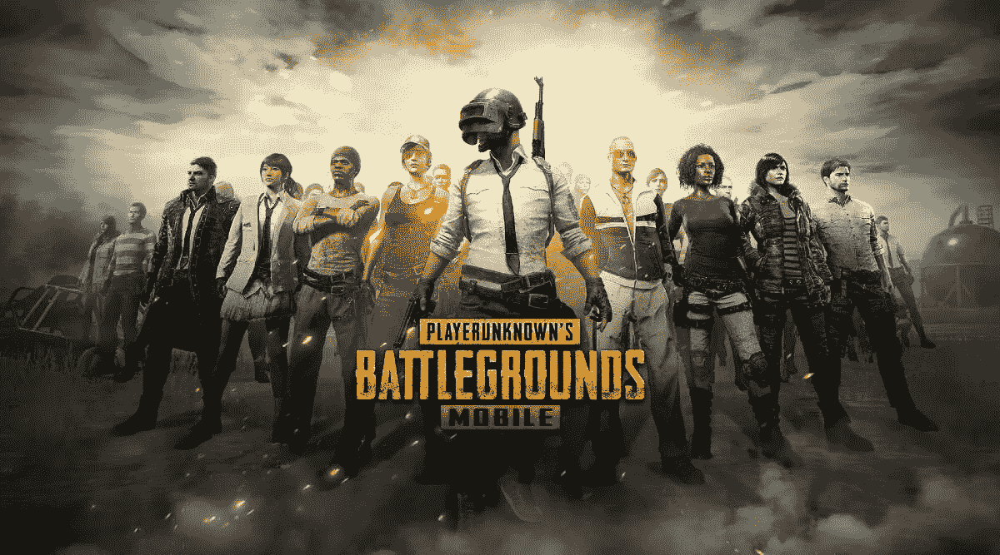

让我们马上开始，建立一些假设，并检查它们是否有数据支持！如果你不熟悉 PUBG，我建议你在 [Kaggle](https://www.kaggle.com/c/pubg-finish-placement-prediction/data) 查看数据信息页面

像往常一样，第一步是导入将要使用的库，

```
import numpy as np 
import pandas as pd
import os
import matplotlib.pyplot as plt
import seaborn as sns
%matplotlib inline
```

然后我们将使用 pandas read_csv 函数读取数据，数据在一个 csv 文件中并显示数据形状

```
train = pd.read_csv('/kaggle/input/pubg-finish-placement-prediction/train_V2.csv')
train.shape
```

数据集是 4446966 行，29 列，然后我将显示数据集头，这是前 5 行，所有 29 列不适合，所以我把它们分开；)

```
train.iloc[:,:15].head()
train.iloc[:,14:].head()
```

然后，我继续检查数据类型

```
train.info()
```

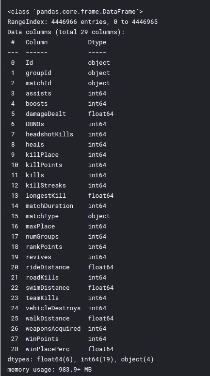

我们可以看到数据类型的格式没有错误(没有字符串表示为整数或整数表示为字符)。我们还可以看到数据帧占用的内存略少于 1GB，这是因为数据包含超过 400 万个观察值。

下一件事是检查丢失的值，幸运的是只有 1，所以我放弃了。

```
train.isnull().sum()
```

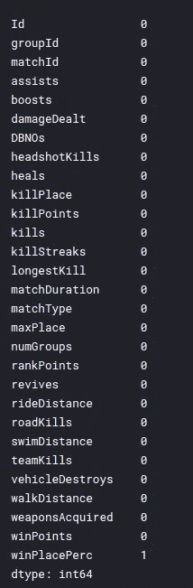

```
#drop null values
train.dropna(inplace=True)
```

然后，我继续检查关于每个数字列的汇总统计数据，以预览一些见解。

```
train.describe().T
```

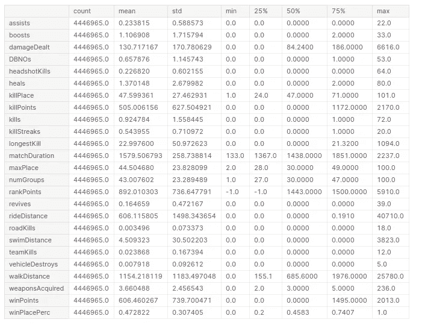

我们观察到一些列有异常值，因此稍后我们需要决定如何处理它们(删除、规范化或保留它们，因为它们可能包含重要的信息)

在本教程中，我将专注于 EDA 而不是 ML 建模。

# **EDA**

我将根据玩家的活动和获胜情况把我的分析分成一个等级。

1.  **黑仔选手**

杀死的第 99 个分位数> > 99%的值落在该值之后。

```
train['kills'].quantile(0.99)
#it's equal to 7temp= train.copy()
temp.loc[temp['kills'] > temp['kills'].quantile(0.99)] = '8+'
plt.figure(figsize=(15,10))
sns.countplot(temp['kills'].astype('str').sort_values())
plt.title('No. of Kills');temp= train.copy()
temp.loc[temp['kills'] > temp['kills'].quantile(0.99)] = '8+'
plt.figure(figsize=(15,10))
sns.countplot(temp['kills'].astype('str').sort_values())
plt.title('No. of Kills');
```

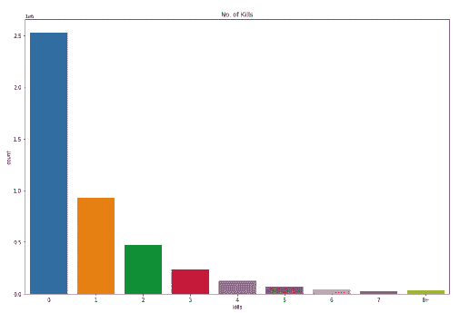

这是一个计数图，我用+8 代替了所有高于第 99 百分位的杀戮，从图中我们看到大多数玩家没有杀死任何对手，

它们至少会损坏它们吗？

```
temp= train.copy()
temp =temp[temp['kills']==0]
plt.figure(figsize=(15,10))
sns.distplot(temp['damageDealt'])
plt.title('Damage dealt by non killers');
```

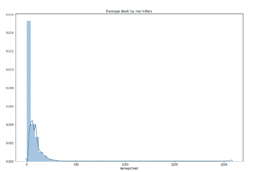

大多数非杀手玩家也不会对他们的敌人造成伤害，继续下一个问题，大多数小队、双人组或单人组的团队规模是多少？

```
plt.figure(figsize=(15,10))
plt.xticks(rotation=45)
sns.countplot(train['matchType'].astype('str'));
```

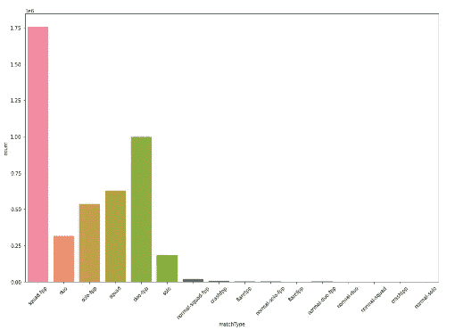

FPP 和 TPP 是游戏模式，表示玩家在游戏中对自己的看法，通常 TPP 更容易。我们从图中观察到，在 FPP 比赛的队伍(4 人)比其他比赛类型多。

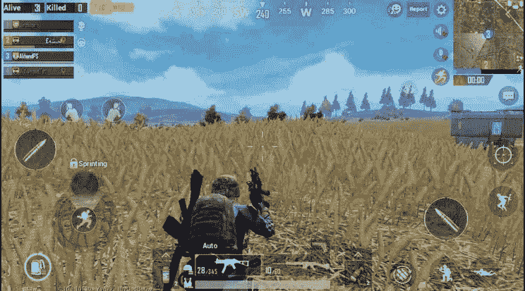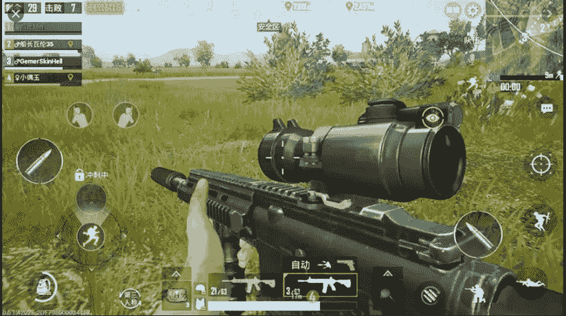

TPP vs FPP 模式

然后我把所有的小队，单人，双人类型放在一个专栏里，以便于分析。

```
train.matchType.replace(['squad-fpp','squad','normal-squad-fpp','normal-squad'],'Squad',inplace=True)
train.matchType.replace(['duo-fpp','duo','normal-duo-fpp','normal-duo'],'Duo',inplace=True)
train.matchType.replace(['solo-fpp','solo','normal-solo-fpp','normal-solo'],'Solo',inplace=True)
train.matchType.replace(['crashfpp','flaretpp','flarefpp','crashtpp'],'Othertypes',inplace=True)
#display countplot of new columns values
sns.countplot(train.matchType);
```

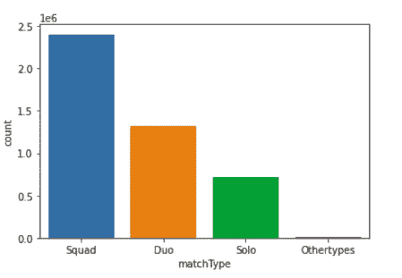

由此我们知道，大部分玩家都是小队！恰好**“53.978%”**

**2。运动类型。**

一名 PUBG 玩家行进了大约 1154.218648076 米，让我们检查一下步行距离以及获胜和步行之间的关系，作为一名 PUBG 玩家，我认为步行比乘车或游泳更能给我隐藏的能力，是真的吗？

```
plt.figure(figsize=(15,10))
sns.scatterplot(x='winPlacePerc',y='walkDistance',data=train)
plt.title('The relationship between winning and running')
```

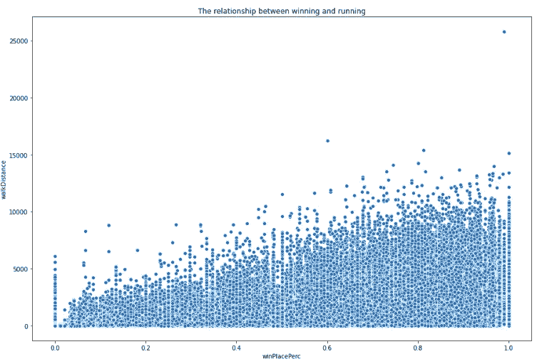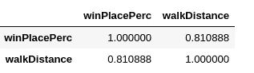

看起来保送和获胜有+ve 的相关性，这说明我的假设是正确的！

让我们检查车辆..

```
plt.figure(figsize=(15,10))
sns.scatterplot(x='winPlacePerc',y='rideDistance',data=train)
plt.title('The relationship between winning and driving')
```

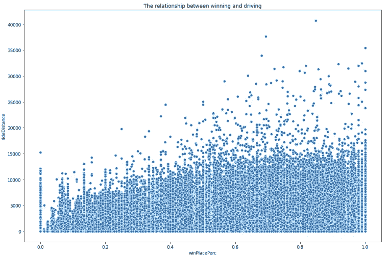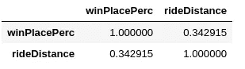

所以车辆和胜利没有太大的关联，但是有一个 pubg 技巧，如果你向另一个玩家的车开枪或者扔炸弹爆炸，你可以杀死他。让我们检查一下。

```
f,ax1 = plt.subplots(figsize =(20,10))
sns.pointplot(x='vehicleDestroys',y='winPlacePerc',data=train,color='#606060',alpha=0.8)
plt.xlabel('Number of Vehicle Destroys',fontsize = 15,color='blue')
plt.ylabel('Win Percentage',fontsize = 15,color='blue')
plt.title('Vehicle Destroys/ Win Ratio',fontsize = 20,color='blue')
plt.grid();
```

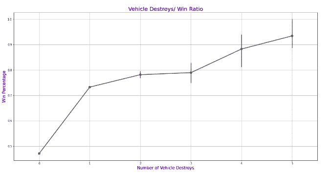

点数图显示至少摧毁一辆车胜算提高~35%，厉害！！

PUBG 是一个基于团队的游戏，当你的团队成员被击倒时，只要他没死，你就可以让他复活并回到游戏中..让我们看看这是否会影响获胜。

```
f,ax1 = plt.subplots(figsize =(20,10))
sns.pointplot(x='revives',y='winPlacePerc',data=train,alpha=0.8)
plt.xlabel('Number of Revives',fontsize = 15,color='blue')
plt.ylabel('Win Percentage',fontsize = 15,color='blue')
plt.title('Revives/ Win Ratio',fontsize = 20,color='blue')
plt.grid();
```

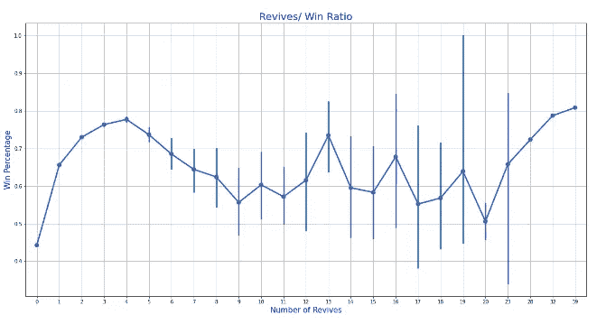

我不确定剧情，我觉得还没确定，

**3。增强和治疗元素**

在 PUBG 中，如果你被击中或受伤，你可以使用健康提升或治疗元素来帮助你，让我们看看它们是否能让你赢！

```
plt.figure(figsize=(15,10))
sns.scatterplot(x='winPlacePerc',y='heals',data=train)
plt.title('The relationship between winning and healing elements')
```

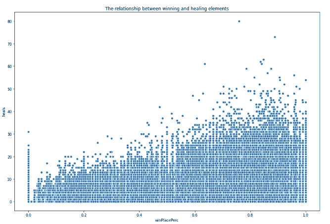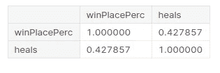

所以治疗元素和胜利的相关系数是 0.43

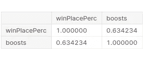

不足为奇的是，健康促进者与获胜的相关系数为 0.634！这是意料之中的。

# **特色工程**

现在我将删除一些功能，并在现有功能的基础上创建新的功能。

绘制热图来显示所有特征及其与目标的相关性并不太成功，因为该图非常拥挤，所以我绘制了前 5 个属性。

```
f,ax = plt.subplots(figsize=(11, 11))
cols = train.corr().nlargest(5, 'winPlacePerc')['winPlacePerc'].index
cm = np.corrcoef(train[cols].values.T)
sns.set(font_scale=1.25)
hm = sns.heatmap(cm, cbar=True, annot=True, square=True, fmt='.2f', annot_kws={'size': 10}, yticklabels=cols.values, xticklabels=cols.values)
plt.show()
```


我们注意到玩家的武器影响胜利，这是真的，在 PUBG 中有些武器比其他武器更强大(我喜欢 M416 和格罗查)！

让我们创建一个指示 PUBG 比赛中玩家数量的特性，

```
train['playersJoined']=train.groupby('matchId'['matchId'].transform('count')
```

在 EDA 中，我们知道 bosts 和治疗元素可以增加赢得游戏的机会，所以让我们把它们放在一个功能中，还有步行，游泳和骑行距离。

```
train['healsAndBoosts'] = train['heals']+train['boosts']
train['totalDistance'] = train['walkDistance']+train['rideDistance']+train['swimDistance']
```

我们也可以用团队中的一些球员来代替独奏、二重奏、小队。

```
train['team'] = [1 if i>50 else 2 if (i>25 & i<=50) else 4 for i **in** train['numGroups']]
```

然后我们可以删除未使用的列，

某些列的值有偏态>>分布不正常

```
sns.distplot(X['damageDealt']);
```

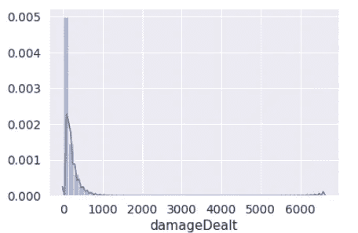

```
sns.distplot(X['totalDistance']);
```

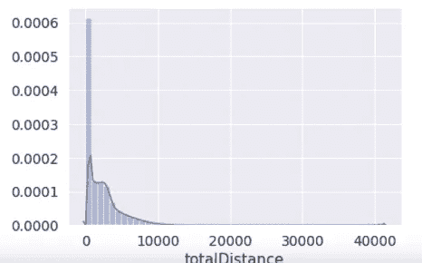

我用立方根变换来保持 0 值，它们都是+ve 偏斜的

```
X['damageDealt']=X['damageDealt']**(1/3)
sns.distplot(X['damageDealt']);X['damageDealt']=X['damageDealt']**(1/3)
sns.distplot(X['damageDealt']);
```

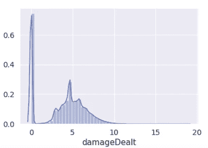

```
X['totalDistance']=X['totalDistance']**(1/3)
sns.distplot(X['totalDistance']);
```

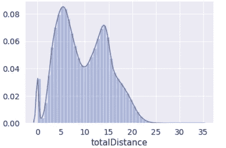

所以从我的观点和分析来看，为了增加你赢得 PUBG 游戏的机会，你应该考虑。

1.  在一个队(班)中比赛。
2.  使用治疗和健康促进元素。
3.  摧毁你的敌人的车辆。
4.  尽可能多地杀死敌人。
5.  经常走动，收集强大的武器。
6.  你也应该隐藏很多。

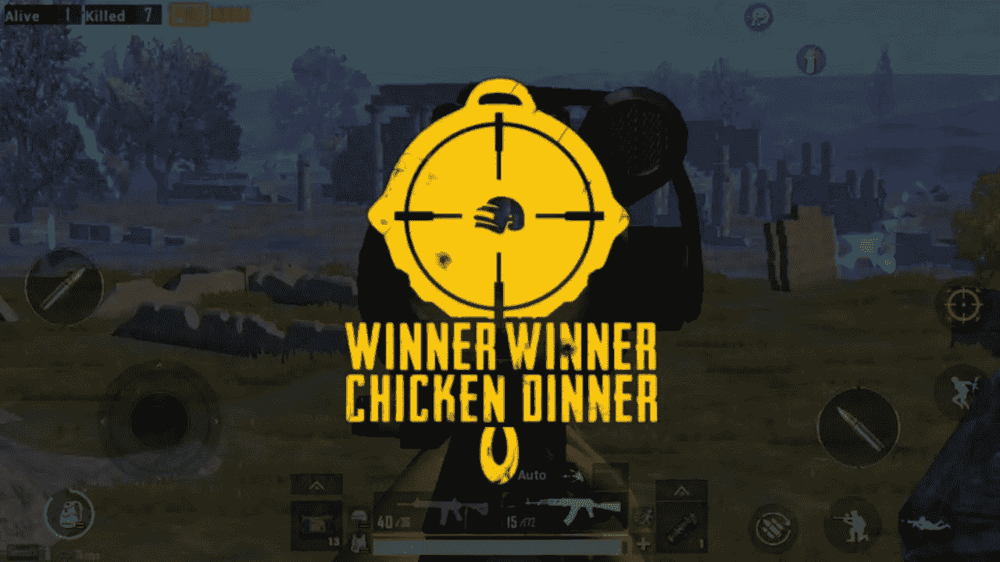

你可以在这里找到完整的笔记本[了解更多细节。](https://www.kaggle.com/nouranali/pubg-winning-scenario)

如果现在，请在下面评论你的最佳 PUBG 策略👇