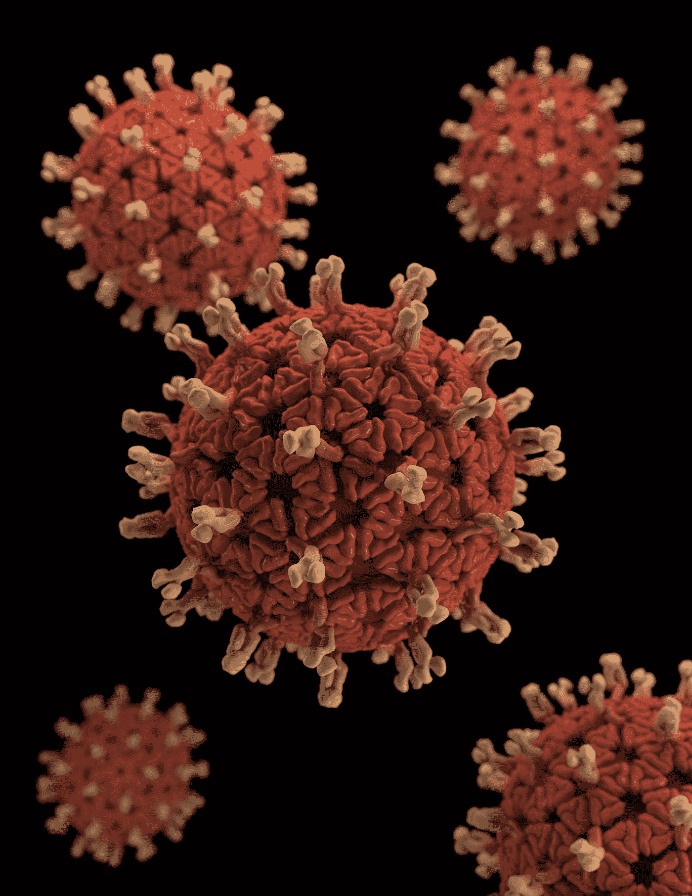

# 利用数据科学了解并阻止传染病的传播

> 原文：<https://medium.com/codex/using-data-science-to-understand-and-stop-the-spread-of-infectious-diseases-dd498c465b4d?source=collection_archive---------12----------------------->

快速浏览一篇关于医疗保健数据科学的有趣论文

[疾控中心](https://unsplash.com/@cdc?utm_source=medium&utm_medium=referral)在 [Unsplash](https://unsplash.com?utm_source=medium&utm_medium=referral) 拍摄的照片

# 简化分解

有许多疾病可以在人与人之间传播并使他们生病。为了阻止这些疾病的传播，我们现在可以使用数据科学。数据科学是一种使用计算机和数学来帮助…