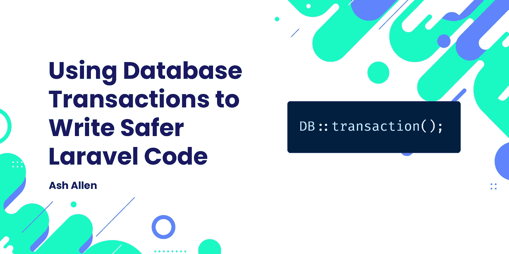

# 使用数据库事务编写更安全的代码

> 原文：<https://medium.com/codex/using-database-transactions-to-write-safer-laravel-code-79de9ceb21d0?source=collection_archive---------7----------------------->

Laravel Web 开发



# 介绍

在 web 开发中，数据的完整性和准确性非常重要。因此，确保我们编写的代码以安全的方式存储、更新和删除数据库中的数据是必不可少的。

在本文中，我们将了解什么是数据库事务，为什么它们很重要，以及如何开始在 Laravel 中使用它们。我们还将看到一个涉及排队作业和数据库事务的常见“陷阱”。

# 什么是数据库事务？

在我们开始研究 Laravel 中的数据库事务之前，让我们先看看它们是什么，以及它们如何带来好处。

对于什么是数据库事务，有许多技术性的、听起来复杂的解释。但是，对于我们大多数人来说，作为 web 开发人员，我们只需要知道事务是在数据库中作为一个整体完成一个工作单元的方式。

为了理解这实际上意味着什么，让我们看一个基本的例子，它将给出一点上下文。

假设我们有一个允许用户注册的应用程序。每当用户注册时，我们都希望为他们创建一个新帐户，然后为他们分配一个默认角色“general”。

我们的代码可能如下所示:

```
$user = User::create([
    'email' => $request->email,
]);

$user->roles()->attach(Role::where('name', 'general')->first());
```

乍一看，这段代码似乎完全没问题。但是，当我们仔细观察时，我们会发现实际上有些地方可能会出错。我们可以创建用户，但不为他们分配角色，这是可能的。这可能是由许多不同的原因造成的，例如分配角色的代码中的错误，甚至是阻止我们访问数据库的硬件问题。

作为这种情况发生的结果，这将意味着我们将在系统中有一个没有角色的用户。可以想象，这可能会在应用程序的其他地方导致异常和错误，因为您总是假设用户有一个角色(这是正确的)。

所以，要解决这个问题，我们可以使用数据库事务。通过使用 transaction，它将确保如果在执行代码时出现任何问题，从该事务内部对数据库的任何更改都将被回滚。例如，如果用户被插入到数据库中，但是分配角色的查询由于某种原因失败，则事务将被回滚，用户的行将被删除。这样做意味着我们将无法创建没有分配角色的用户。

换句话说，就是“要么全有，要么全无”。

# 在 Laravel 中使用数据库事务

现在我们对什么是事务以及它们实现了什么有了一个简单的概念，让我们看看如何在 Laravel 中使用它们。

在 Laravel 中，由于我们可以在`DB` facade 上访问`transaction()`方法，开始使用事务实际上非常容易。继续使用前面的示例代码，让我们看看在创建用户并为他们分配角色时如何使用事务。

```
use Illuminate\Support\Facades\DB;

DB::transaction(function () use ($user, $request): void {
    $user = User::create([
        'email' => $request->email,
    ]);

    $user->roles()->attach(Role::where('name', 'general')->first());
});
```

现在，我们的代码被包装在一个数据库事务中，如果在其中的任何一点抛出异常，对数据库的任何更改都将返回到事务开始之前的状态。

# 在 Laravel 中手动使用数据库事务

有时，您可能希望对您的事务进行更精细的控制。例如，让我们假设您正在与第三方服务集成；如 Mailchimp 或 Xero。我们会说，每当您创建一个新用户时，您也希望向他们的 API 发出一个 HTTP 请求，以便将他们创建为该系统中的一个用户。

我们可能想要更新我们的代码，这样如果我们不能在我们自己的系统**和第三方系统**中创建用户，它们都不应该被创建。如果你与第三方系统交互，你可能有一个类可以用来发出请求。或者，有可能有你可以使用的软件包。有时，当某些请求无法完成时，发出请求的类可能会抛出异常。然而，它们中的一些可能会隐藏错误，而是从你调用的方法中返回`false`,并将错误放在类的一个字段中。

因此，让我们假设我们有以下调用 API 的基本示例类:

```
class ThirdPartyService
{
    private $errors;

    public function createUser($userData)
    {
        $request = $this->makeRequest($userData);

        if ($request->successful()) {
            return $request->body();
        }

        $errors = $request->errors();

        return false;
    }

    public function getErrors()
    {
        return $this->errors;
    }
}
```

当然，上面 request 类的代码是不完整的，我下面的代码示例也不是很清晰，但是它应该能让您大致了解我想要表达的观点。因此，让我们使用这个请求类，并将其添加到前面的代码示例中:

```
use Illuminate\Support\Facades\DB;
use App\Services\ThirdPartyService;

DB::beginTransaction();

$thirdPartyService = new ThirdPartyService();

$userData = [
    'email' => $request->email,
];

$user = User::create($userData);

$user->roles()->attach(Role::where('name', 'general')->first());

if ($thirdPartyService->createUser($userData)) {
    DB::commit();

    return;
}

DB::rollBack();

report($thirdPartyService->getErrors());
```

查看上面的代码，我们可以看到，我们启动了一个事务，创建了用户并为他们分配了一个角色，然后我们调用了第三方服务。如果在外部服务中成功创建了用户，我们就可以安全地提交我们的数据库更改，因为我们知道已经正确创建了所有内容。但是，如果用户不是在外部服务中创建的，我们回滚数据库中的更改(删除用户及其角色分配)，然后报告错误。

# 与第三方服务交互的提示

作为一个额外的提示，我通常会建议将任何影响任何第三方系统、文件存储或缓存的代码放在数据库调用之后**。**

为了更好地理解这一点，让我们看看上面的代码示例。请注意，在向第三方服务发出请求之前，我们是如何首先对数据库进行所有更改的。这意味着，如果第三方请求返回任何错误，我们自己的数据库中的用户和角色分配将被回滚。

然而，如果我们反过来这样做，在修改数据库之前发出请求，情况就不会是这样。如果由于某种原因，我们在数据库中创建用户时出现了任何错误，我们会在第三方系统中创建一个新用户，而不是我们自己的用户。可以想象，这可能会导致更多的问题。通过编写一个从第三方系统中删除用户的清除方法，可以降低这个问题的严重性。但是，正如您可以想象的，这可能会导致更多的问题，并且会导致编写、维护和测试更多的代码。

因此，我总是建议尝试将数据库调用放在 API 调用之前。然而，这并不总是可能的。有时，您可能需要将第三方请求返回的值保存在数据库中。如果是这种情况，这完全没问题，只要您确保您有一些代码来处理任何故障。

# 使用自动或手动交易

同样值得注意的是，因为我们最初的例子使用了`DB::transaction()`方法，如果抛出异常，它会回滚事务，所以我们也可以使用这种方法向我们的第三方服务发出请求。相反，我们可以这样更新我们的类:

```
use Illuminate\Support\Facades\DB;
use App\Services\ThirdPartyService;

DB::transaction(function () use ($user, $request): void {
    $user = User::create([
        'email' => $request->email,
    ]);

    $user->roles()->attach(Role::where('name', 'general')->first());

    if (! $thirdPartyService->createUser($userData)) {
        throw new \Exception('User could not be created');
    }
});
```

这绝对是一个可行的解决方案，并且会像预期的那样成功地回滚事务。事实上，就我个人偏好而言，我更喜欢这种方式，而不是手动使用交易。我觉得看起来简单多了，读起来容易理解。

然而，与使用‘if’语句相比，异常处理在时间和性能方面可能是昂贵的，例如当我们手动提交或回滚事务时。

因此，举例来说，如果这段代码用于导入包含 10，000 个用户数据的 CSV 文件，您可能会发现抛出异常会大大降低导入速度。

但是，如果只是在一个用户可以注册的简单 web 请求中使用它，那么您可能不会介意抛出这个异常。当然，这归结于你的应用程序的大小，多少性能是一个关键因素；所以这是你需要根据具体情况来决定的事情。

# 在数据库事务内部调度排队作业

每当您在事务内部处理作业时，都需要注意一个“问题”。

为了给出一点上下文，让我们继续使用前面的代码示例。我们可以想象，在我们创建了用户之后，我们希望运行一个作业，提醒管理员新注册，并向新用户发送欢迎电子邮件。我们将通过调度一个名为`AlertNewUser`的排队作业来实现这一点，如下所示:

```
use Illuminate\Support\Facades\DB;
use App\Jobs\AlertNewUser;
use App\Services\ThirdPartyService;

DB::transaction(function () use ($user, $request): void {
    $user = User::create([
        'email' => $request->email,
    ]);

    $user->roles()->attach(Role::where('name', 'general')->first());

    AlertNewUser::dispatch($user);
});
```

当您开始一个事务并对其中的任何数据进行更改时，这些更改仅对运行该事务的请求/流程可用。对于任何其他访问您更改的数据的请求或进程，必须首先提交事务。因此，这意味着如果我们从事务内部调度任何排队的作业、事件侦听器、邮件、通知或广播事件，由于竞争条件，我们的数据更改可能在它们内部不可用。

如果队列工作线程在提交事务之前开始处理排队的代码，就会发生这种情况。因此，这可能导致您的排队代码试图访问尚不存在的数据，并可能导致错误。在我们的例子中，如果队列`AlertNewUser`作业在事务提交之前运行，我们的作业将尝试访问一个实际上还没有存储在数据库中的用户。如您所料，这将导致作业失败。

为了防止这种竞争情况发生，我们可以对我们的代码和/或配置进行一些更改，以确保只有在事务成功提交后才分派作业。

我们可以更新我们的`config/queue.php`并添加`after_commit`字段。假设我们正在使用`redis`队列驱动程序，我们可以像这样更新我们的配置:

```
<?php

return [

    // ...

    'connections' => [

        // ...

        'redis' => [
            'driver' => 'redis',
            // ...
            'after_commit' => true,
        ],

        // ...

    ],

    // ...
];
```

通过进行这种更改，如果我们尝试在事务内部调度作业，该作业将在实际调度作业之前等待事务提交。方便的是，如果事务被回滚，它也将阻止作业被分派。

但是，您可能不想在配置中全局设置该选项。如果是这种情况，Laravel 仍然提供了一些很好的助手方法，我们可以根据具体情况使用。

如果我们想更新事务中的代码，以便只在任务提交后分派任务，我们可以像这样使用`afterCommit()`方法:

```
use Illuminate\Support\Facades\DB;
use App\Jobs\AlertNewUser;
use App\Services\ThirdPartyService;

DB::transaction(function () use ($user, $request): void {
    $user = User::create([
        'email' => $request->email,
    ]);

    $user->roles()->attach(Role::where('name', 'general')->first());

    AlertNewUser::dispatch($user)->afterCommit();
});
```

Laravel 还提供了另一个我们可以使用的方便的`beforeCommit()`方法。如果我们已经在队列配置中设置了全局`after_commit => true`，但是不在乎等待事务提交，我们可以使用这个。为此，我们可以像这样简单地更新我们的代码:

```
use Illuminate\Support\Facades\DB;
use App\Jobs\AlertNewUser;
use App\Services\ThirdPartyService;

DB::transaction(function () use ($user, $request): void {
    $user = User::create([
        'email' => $request->email,
    ]);

    $user->roles()->attach(Role::where('name', 'general')->first());

    AlertNewUser::dispatch($user)->beforeCommit();
});
```

# 结论

希望这篇文章能够让您对什么是数据库事务以及如何开始在 Laravel 中使用它们有一个大致的了解。它还应该向您展示如何在从内部事务分派排队作业时避免“陷阱”。

如果这篇文章能帮到你，我很乐意听听。同样，如果你对这篇文章有任何改进的反馈，我也很乐意听到。

如果你有兴趣在我每次发布新帖子时得到更新，请随意注册我的简讯。

继续建造令人敬畏的东西！🚀

*最初发表于*[T5【https://ashallendesign.co.uk】](https://ashallendesign.co.uk/blog/using-database-transactions-to-write-safer-laravel-code)*。*