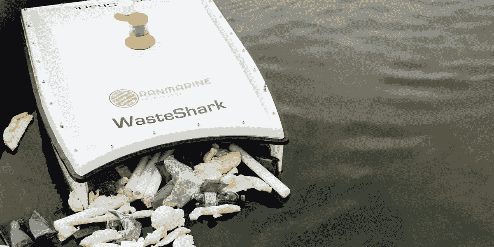

# 用无人机解决污染问题！

> 原文：<https://medium.com/codex/using-drones-to-solve-pollution-issues-f891c1a7c155?source=collection_archive---------10----------------------->

## 无人机技术的另一个绝佳用途！

[WasteShark(无人机媒体解决方案)](https://img1.wsimg.com/isteam/ip/a4e97476-de2b-458f-acd8-d9e737c3fa0f/IMG_4576.jpg/:/cr=t:0%25,l:0%25,w:98.06%25,h:73.53%25/rs=w:1200,h:600,cg:true,m)

如果你读过我的作品，你会很快得出结论，我是无人机技术的大力支持者。在看到 RanMarine Technology 的工程师们已经开始以 Wasteshark 的形式引入的东西后，这一点从未像现在这样得到巩固。“垃圾鲨”被设计用来在水中“咬”一口…