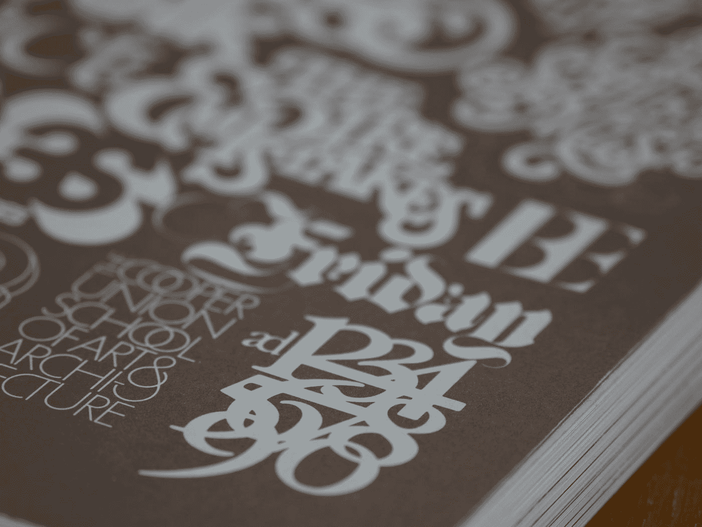

# 如何在 Web 组件中使用字体

> 原文：<https://medium.com/codex/using-fonts-in-web-components-6aba251ed4e5?source=collection_archive---------1----------------------->

## 包括那些字体很棒的图标

布雷特·乔丹在 [Unsplash](https://unsplash.com?utm_source=medium&utm_medium=referral) 上的照片

自定义字体不仅可以用于设计文本样式。让我们以一种最流行的包含自定义图标的字体为例。

字体牛逼是…嗯…牛逼。它为开发人员打开了一个全新的世界，他们可以在没有审美天赋的情况下构建一个看起来不错的 web 应用程序…