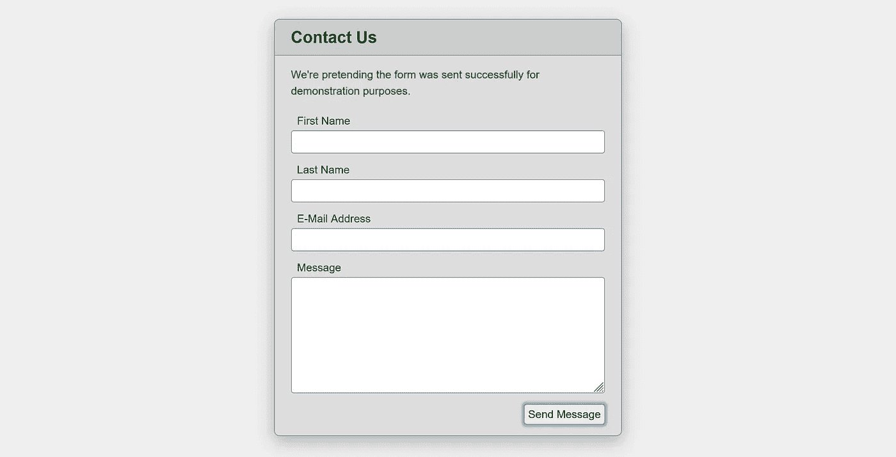

# 使用表单数据和用 JavaScript 增强表单

> 原文：<https://medium.com/codex/using-formdata-and-enhancing-forms-with-javascript-eddc377e83d5?source=collection_archive---------0----------------------->

在过去几年的可访问性和效率咨询工作中，我见过太多破损的不完整表格。更糟糕的是，他们中的大多数人似乎毫无理由地 100%依赖 JavaScript。即使用 JavaScript 进行了“适当的”增强，所做的事情对 HTML 和 JS 技术都是如此的无知，我无法理解人们是如何或为什么认为事情应该这样做的。