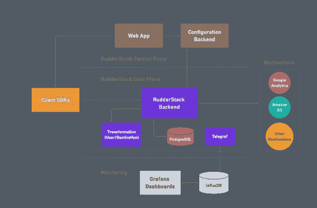
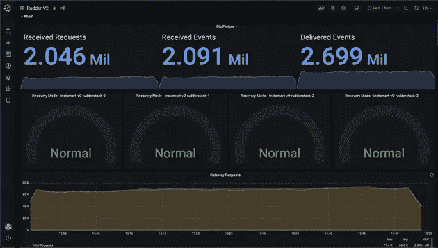
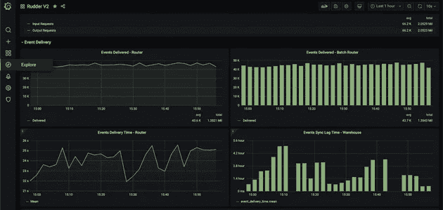
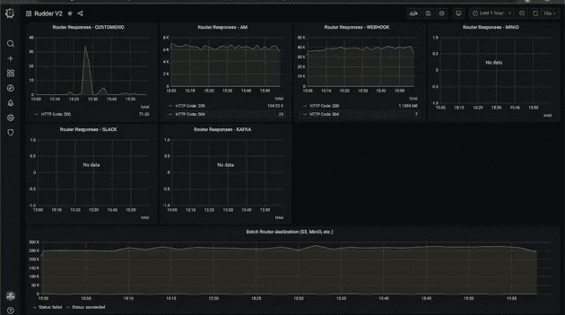

# 使用 Grafana 监控您的客户数据管道的健康和状态

> 原文：<https://medium.com/codex/using-grafana-to-monitor-the-health-and-status-of-your-customer-data-pipelines-bd84a0bae4ed?source=collection_archive---------17----------------------->

RudderStack 每天为各类公司处理数十亿个数据点。从营销和产品数据到仓库和数据科学基础架构，这些数据填充了我们客户堆栈中的目的地。

不过，系统本身也会产生一些有趣的数据。因为客户数据管道是当今业务运作的核心，所以我们构建了具有核心观察和配置能力的 RudderStack。

我们自己使用度量和日志来了解系统内部发生了什么，但是我们也为我们的客户提供了同样丰富的可观察性。使用 RudderStack 的工程师可以使用相同的工具快速找到问题的根本原因，识别瓶颈，并发现错误配置。

最重要的是，我们专注于通过集成客户已经使用的工具来实现系统健康状况的可观察性，例如用于仪表板的 Grafana 和用于警报的 PagerDuty。

这是 RudderStack 架构的高级可视化。下面，我们深入研究系统生成的具体指标和日志，以及我们(和我们的客户)如何使用它们。

# 韵律学

方向舵堆栈数据平面生成 275 个以上不同的指标。大多数人都可以归入这些类别之一。这些矩阵按照与流经平台的数据相同的顺序排列):

*   **接收指标:**请求量、请求延迟、请求大小
*   [**用户转换指标**](https://docs.rudderstack.com/adding-a-new-user-transformation-in-rudderstack) **:** 创建隔离虚拟机所用的时间、执行功能所用的时间、转换的输入请求大小
*   **队列(JobsDB)度量:** [RudderStack 在将队列发送到目的地之前使用 PostgreSQL](https://rudderstack.com/blog/kafka-vs-postgresql-implementing-our-queueing-system-using-postgresql) 作为队列，并生成以下度量:队列大小、查询队列所用的时间、队列处理吞吐量
*   **目的地度量:**传递到目的地的事件、目的地返回的响应代码、传递到目的地的延迟、失败事件的数量
*   **仓库度量:**同步的表的数量、表的模式更新、同步到仓库所用的时间、加载到仓库中的文件数量及其大小、由于模式不兼容而被拒绝的事件
*   **运行时指标:** Golang 的垃圾收集指标，堆和栈内存指标，goroutines 的数量等。

# 度量工具

RudderStack 使用 [Telegraf](https://www.influxdata.com/time-series-platform/telegraf/) 来收集指标， [InfluxDB](https://www.influxdata.com/) 用于存储，而 [Kapacitor](https://www.influxdata.com/time-series-platform/kapacitor/) 用于报警。我们使用 Grafana 绘制所有指标，并根据来源和目的地对它们进行分组，以提供更简单的见解。

**指标概述**

**事件交付**

**路由器响应**

# 方向舵堆栈系统指标在运行

我们的客户使用方向舵堆栈管道来触发时间关键的行动。例如，他们可能会向重置密码的用户发送验证电子邮件，或者向移动应用程序用户发送时间线交易的推送通知。这些流程中的任何延迟或故障都会造成糟糕的用户体验。

我们的客户不仅使用系统报告来跟踪交付这些关键事件所需的时间，而且还根据目的地类型设置了自定义警报。例如，如果延迟超过 1 分钟，我们客户的一个管道数据就会触发推送通知并发出警报。

我们的许多客户也监控仓库负载。尽管对时间不太敏感，但它们对分析、丰富和数据科学用例同样重要。当由于模式不兼容而导致加载失败时，系统会发出警报，这使他们能够快速修复问题，从而不会中断下游流程。

以下是我们客户中一些最常见的警报使用案例:

*   至关键目的地的交付时间
*   运行用户转换的时间
*   事件中止
*   事件量峰值(超过定义的阈值)
*   与仓库同步的行(以及任何相关错误)

为了使事情变得更加简单，我们已经构建了 30 多个预配置的警报，它们可以链接到像 PagerDuty、OpsGenie 或任何 HTTP 端点这样的系统。

我们的企业产品有 30 多个预配置的警报，这些警报可以链接到您的警报系统，如 PagerDuty、OpsGenie 或任何 HTTP 端点。

要更深入地了解 RudderStack Grafana 仪表盘，请查看[文档](https://docs.rudderstack.com/administrators-guide/rudderstack-dashboard)。

# 日志

度量帮助您理解随时间变化的模式，但是日志使您能够调试和缩小特定问题的范围。具体来说，您可以跟踪日志来了解数据在系统中流动的不同阶段发生了什么。

为了有助于分类，每个日志消息都有一个相应的日志级别，表明消息的重要性和紧迫性。

# 大规模维护日志的价值

尽管日志很有帮助，但在大规模应用时，它可能会变得难以获得价值。当您每秒发送数千个事件时，理解每个数据点的每个状态转换是不切实际的。

为了帮助我们的客户充分利用日志的价值，RudderStack 默认记录所有信息、错误和致命级别。系统还为每个模块提供了一个日志记录器，其日志记录级别可以在运行时更新，而无需重新启动服务。这使我们的客户能够为特定模块设置调试日志，为他们提供适量的问题解决信息。

此外，RudderStack 的 rudder-server Docker 映像有一个预安装的 CLI 工具，可以调用 RPC 并更新任何模块的日志配置。

# 测井工具

RudderStack 在我们的开源 Kubernetes 部署中使用了 [fluentd](https://www.fluentd.org/) ，通过它，您可以将所有日志路由到您的内部日志聚合器，如 ElasticSearch、MongoDB 等。

# 我们的目标是一流的可配置系统健康报告

正如我上面提到的，我们希望让我们的客户能够轻松实现一流的系统健康报告。我们没有在定制仪表板上花费工程周期，而是通过 Grafana 等工具提供报告，与数据工程师和开发人员会面。

我们每天都从顾客那里了解到更多关于他们各种需求的信息。我们将继续提高配置的有用性和易用性，以便 RudderStack 用户可以发现并解决任何与关键任务客户数据相关的可能问题。

# 免费注册并开始发送数据

测试我们的事件流、ELT 和反向 ETL 管道。使用我们的 HTTP 源在不到 5 分钟的时间内发送数据，或者在您的网站或应用程序中安装我们 12 个 SDK 中的一个。[上手](https://app.rudderlabs.com/signup?type=freetrial)。

本博客最初发表于:
[https://rudder stack . com/blog/using-grafana-to-monitor-the-health-and-status-of-your-customer-data-pipelines](https://rudderstack.com/blog/using-grafana-to-monitor-the-health-and-status-of-your-customer-data-pipelines)